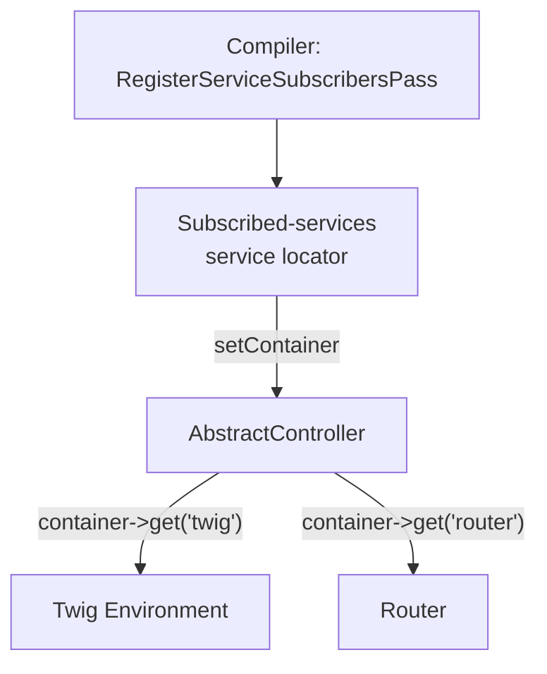

# AbstractController

!!! tip "In a nutshell"
    `AbstractController` est une commodité optionnelle : une classe de base qui
    vous offre `render()`, `redirectToRoute()`, `getUser()` et consorts. Elle
    reçoit ces services d'un **service locator lazy** piloté par
    `getSubscribedServices()` — pas par le constructeur. Ce simple fait est le
    sujet préféré de l'examen.

!!! example "Real-world analogy"
    Imaginez votre controller comme un **réceptionniste** qui prend la demande
    d'un visiteur et rend une réponse. `AbstractController` est le bureau bien
    équipé derrière ce réceptionniste : un téléphone (`redirectToRoute`), un
    tampon (`json`), un contrôle de badge visiteur (`getUser`), une imprimante
    (`render`). Le réceptionniste n'attrape un outil que lorsqu'un visiteur en a
    réellement besoin — ce « je le prends à la demande » est le service locator
    lazy, pas un tiroir pré-rempli au début de chaque service.

!!! abstract "Learning objectives"
    À la fin de ce chapitre, vous saurez :

    - [ ] Énumérer les méthodes utilitaires fournies par `AbstractController` et leurs types de retour.
    - [ ] Expliquer comment il obtient ses services via `getSubscribedServices()` et un
          service locator — et non par injection de constructeur.
    - [ ] Justifier pourquoi c'est une classe de base **service subscriber**, et non un
          `ControllerBase` à la Laravel, et savoir quand s'en passer.

    **Syllabus:** `Controllers → AbstractController` ·
    **Level:** Expert ·
    **Est. time:** 18 min ·
    **Prerequisites:** [DI → Service Subscribers](../dependency-injection/index.md), [Naming](naming-conventions.md)

---

## Theory

`Symfony\Bundle\FrameworkBundle\Controller\AbstractController` est une classe de
base **optionnelle** qui ajoute des raccourcis pratiques par-dessus un
controller. Elle ne donne *pas* de pouvoirs spéciaux à votre controller —
chaque helper n'est que du sucre au-dessus d'un service que vous pourriez
injecter vous-même. En hériter est un choix de productivité, pas une exigence
architecturale.

Les helpers qu'elle expose (tous `protected`) :

| Méthode | Retourne | Rôle |
|---|---|---|
| `render()` / `renderView()` | `Response` / `string` | Rendre un template Twig |
| `renderBlock()` / `renderBlockView()` | `Response` / `string` | Rendre un seul bloc Twig |
| `json()` | `JsonResponse` | Sérialiser des données en JSON |
| `file()` | `BinaryFileResponse` | Streamer un fichier téléchargeable |
| `stream()` | `StreamedResponse` | Streamer un template |
| `redirect()` / `redirectToRoute()` | `RedirectResponse` | Redirection HTTP |
| `forward()` | `Response` | Sub-request interne |
| `generateUrl()` | `string` | Construire une URL à partir d'une route |
| `createNotFoundException()` | `NotFoundHttpException` | Construire une 404 à lancer |
| `createAccessDeniedException()` | `AccessDeniedException` | Construire une 403 à lancer |
| `denyAccessUnlessGranted()` | `void` | Lancer une 403 sauf si autorisé |
| `isGranted()` / `getAccessDecision()` | `bool` / `AccessDecision` | Vérification d'autorisation |
| `getUser()` | `?UserInterface` | L'utilisateur actuellement authentifié |
| `addFlash()` | `void` | Mettre un flash message en file |
| `isCsrfTokenValid()` | `bool` | Valider un token CSRF |
| `createForm()` / `createFormBuilder()` | `FormInterface` / `FormBuilderInterface` | Construire un form |
| `getParameter()` | scalar/array/enum | Lire un paramètre du container |
| `addLink()` / `sendEarlyHints()` | `void` / `Response` | HTTP `Link` / 103 Early Hints |

```php
// A sample of the protected helpers, always called on $this
$this->addFlash('success', 'Saved.');                   // queue a flash message
$url = $this->generateUrl('order_show', ['id' => 42]);  // string URL

return $this->json(['url' => $url]);                              // JsonResponse
// or: return $this->render('order/show.html.twig', ['id' => 42]); // Response
// or: return $this->redirectToRoute('order_show', ['id' => 42]);  // RedirectResponse
// or: throw $this->createNotFoundException('No such order.');     // build, then throw
```

!!! question "Predict first"
    Votre controller étend `AbstractController` et appelle `$this->render(...)`.
    D'où vient le service Twig — d'un argument de constructeur, du container
    global, ou d'ailleurs ?

??? note "Reveal"
    D'un **service locator lazy** injecté via `setContainer()`, pas du
    constructeur. `getSubscribedServices()` déclare les clés ; le compilateur
    construit un locator restreint ne contenant que ces services, chacun
    instancié au premier usage.

## Deep Dive — how it works internally

`AbstractController` implémente
`Symfony\Contracts\Service\ServiceSubscriberInterface`. Au lieu de lister une
douzaine d'arguments de constructeur, il déclare les services dont il
*pourrait* avoir besoin via la méthode statique `getSubscribedServices()` et
reçoit un **service locator** (un petit `Psr\Container\ContainerInterface`
lazy) via `setContainer()`.

La liste exacte des souscriptions en Symfony 8 :

```php
public static function getSubscribedServices(): array
{
    return [
        'router' => '?'.RouterInterface::class,
        'request_stack' => '?'.RequestStack::class,
        'http_kernel' => '?'.HttpKernelInterface::class,
        'serializer' => '?'.SerializerInterface::class,
        'security.authorization_checker' => '?'.AuthorizationCheckerInterface::class,
        'twig' => '?'.Environment::class,
        'form.factory' => '?'.FormFactoryInterface::class,
        'security.token_storage' => '?'.TokenStorageInterface::class,
        'security.csrf.token_manager' => '?'.CsrfTokenManagerInterface::class,
        'parameter_bag' => '?'.ContainerBagInterface::class,
        'web_link.http_header_serializer' => '?'.HttpHeaderSerializer::class,
    ];
}
```

Le préfixe `?` marque chaque service comme **optionnel** : si Twig n'est pas
installé, `render()` lance une `\LogicException` explicite (« You cannot use
the render method if Twig is not available ») plutôt qu'une erreur du
container. C'est pourquoi un projet tout neuf peut étendre
`AbstractController` avant d'ajouter les composants form ou security.

```php
// Inside the render() machinery — the '?' optional subscription guard, simplified
if (!$this->container->has('twig')) {
    throw new \LogicException('You cannot use the "render" method if the Twig Bundle is not available. Try running "composer require symfony/twig-bundle".');
}
```



À la compilation, `Symfony\Component\DependencyInjection\Compiler\RegisterServiceSubscribersPass`
(la mécanique des service subscribers) construit un locator contenant
exactement les services souscrits et le câble dans le controller via
`setContainer()`. Comme le locator est **lazy**, aucun de ces services n'est
instancié tant que vous n'appelez pas réellement le helper — étendre
`AbstractController` ne coûte presque rien à l'exécution.

!!! note "Source reference"
    `Symfony\Bundle\FrameworkBundle\Controller\AbstractController` —
    [symfony/symfony `8.0`](https://github.com/symfony/symfony/blob/8.0/src/Symfony/Bundle/FrameworkBundle/Controller/AbstractController.php).

### Why not a `ControllerBase`?

Symfony évite délibérément une grosse classe de base qui injecterait tout de
manière eager :

- **Lazy et explicite** — le service locator résout les services à la demande,
  donc un controller inutilisé ne démarre jamais Twig ni le serializer.
- **Testable** — vous pouvez souscrire/surcharger des services isolément, et
  vous êtes libre de ne *pas* en hériter du tout.
- **Découplé** — la classe de base dépend d'interfaces, et les marqueurs `?`
  gardent les composants optionnels réellement optionnels.

### Extending the subscription list

Surchargez `getSubscribedServices()` pour ajouter votre propre service et
fusionnez la liste du parent — un pattern propre pour un service partagé entre
de nombreux controllers.

### Null behavior

`getUser(): ?UserInterface` est le helper le plus susceptible de vous rendre
`null`. Il lit le token depuis `security.token_storage` ; quand personne n'est
authentifié (un visiteur anonyme, ou une route sans firewall), il n'y a pas de
token — ou l'utilisateur du token n'est pas une `UserInterface` — donc il
retourne `null`. C'est une absence réelle, pas une erreur.

Le bug classique consiste à considérer l'utilisateur d'une page publique comme
toujours présent : `$this->getUser()->getEmail()` provoque une erreur fatale
*« Call to a member function on null »* dès qu'un visiteur anonyme arrive.
Gérez-le délibérément :

- Protégez d'abord avec `denyAccessUnlessGranted('ROLE_USER')` (ou
  `#[IsGranted]`) pour que l'action ne s'exécute que pour des utilisateurs
  authentifiés, après quoi `getUser()` est sûr.
- Ou lisez défensivement : `$this->getUser()?->getUserIdentifier() ?? 'guest'`.

Notez le piège voisin : `createNotFoundException()` ne *retourne* pas `null`
et n'interrompt rien — elle retourne une `NotFoundHttpException` que vous
devez `throw`. Voir [404 & error pages](error-pages.md).

!!! note "Null in real life"
    Ici, `null` est le visiteur inconnu à l'accueil qui n'a jamais montré de
    badge — le réceptionniste ne peut pas le saluer par son nom, alors vous
    vérifiez la présence d'un badge avant d'en supposer un.

## Configuration & code

=== "Using helpers"

    ```php
    <?php
    declare(strict_types=1);

    namespace App\Controller;

    use Symfony\Bundle\FrameworkBundle\Controller\AbstractController;
    use Symfony\Component\HttpFoundation\Response;
    use Symfony\Component\Routing\Attribute\Route;

    final class DashboardController extends AbstractController
    {
        #[Route('/dashboard', name: 'dashboard')]
        public function index(): Response
        {
            $this->denyAccessUnlessGranted('ROLE_USER');

            return $this->render('dashboard/index.html.twig', [
                'user' => $this->getUser(),
            ]);
        }
    }
    ```

=== "Extending subscriptions"

    ```php
    <?php
    declare(strict_types=1);

    namespace App\Controller;

    use App\Service\ReportGenerator;
    use Symfony\Bundle\FrameworkBundle\Controller\AbstractController;

    abstract class ReportingController extends AbstractController
    {
        public static function getSubscribedServices(): array
        {
            return [
                ...parent::getSubscribedServices(),
                ReportGenerator::class, // no '?' → required
            ];
        }

        protected function reports(): ReportGenerator
        {
            return $this->container->get(ReportGenerator::class);
        }
    }
    ```

=== "No base class"

    ```php
    <?php
    declare(strict_types=1);

    namespace App\Controller;

    use Symfony\Component\HttpFoundation\Response;
    use Twig\Environment;

    final class LeanController
    {
        public function __construct(private Environment $twig) {}

        public function __invoke(): Response
        {
            return new Response($this->twig->render('page.html.twig'));
        }
    }
    ```

## Best practices & anti-patterns

| ✅ À faire | ❌ À éviter |
|---|---|
| Étendre `AbstractController` par commodité | Le considérer comme obligatoire pour tous les controllers |
| Injecter *vos* dépendances via le constructeur | Surcharger `getSubscribedServices()` pour des services applicatifs que vous injectez de toute façon |
| Fusionner `parent::getSubscribedServices()` | Ne retourner que vos services (vous perdez les helpers) |
| Accéder aux services applicatifs par injection de constructeur | Récupérer des services applicatifs via `$this->container` |

## When (not) to use it / alternatives

- **Utilisez-le** quand vous voulez les raccourcis `render`, `redirectToRoute`,
  flash et auth.
- **Passez-vous-en** pour de petits controllers invokables ou si vous préférez
  l'injection de constructeur explicite partout (style hexagonal/DDD, par
  exemple).
- Le locator `container` est destiné aux services helpers du *framework*, pas à
  un anti-pattern service locator pour vos propres services métier — injectez
  ceux-là.

!!! danger "Certification traps"
    - `AbstractController` est un **`ServiceSubscriberInterface`** ; les services
      arrivent via un **service locator lazy**, pas par le constructeur.
    - Les helpers sont **`protected`** — vous les appelez depuis `$this`, pas
      statiquement.
    - Les services optionnels utilisent le préfixe `?` ; appeler `render()` sans
      Twig lance une `LogicException`, pas un « service not found » du container.
    - `$this->container` dans un controller est un **locator restreint**, pas le
      container DI complet ; il ne contient que les services souscrits.
    - Hériter est optionnel — un simple callable est un controller parfaitement
      valide.

!!! warning "Common mistakes"
    - Surcharger `getSubscribedServices()` sans étaler `parent::` — vous perdez
      `render`, `getUser`, etc.
    - Utiliser `$this->container->get(SomeDomainService::class)` au lieu de
      l'injecter, ce qui masque les dépendances et casse le locator (service non
      souscrit).

## Exercises

1. **(Basic)** Depuis un `AbstractController`, rendez un template *et* réglez le
   statut de la response à `201`.
2. **(Expert)** Créez une classe de base abstraite `ApiController` qui souscrit
   une `RateLimiterFactory`, en l'exposant via un accesseur `protected` tout en
   conservant tous les helpers hérités.

??? success "Solutions"

    **1.**
    ```php
    $response = $this->render('created.html.twig');
    $response->setStatusCode(201);
    return $response;
    // or: return $this->render('created.html.twig', [], new Response(status: 201));
    ```
    `render()` accepte une `Response` pré-construite comme troisième argument.

    **2.** Surchargez `getSubscribedServices()` pour retourner
    `[...parent::getSubscribedServices(), RateLimiterFactory::class]` (sans `?` =
    requis) et ajoutez `protected function limiter(): RateLimiterFactory { return
    $this->container->get(RateLimiterFactory::class); }`.

## Certification questions

??? question "Q1. How does AbstractController receive its services?"
    - [ ] A. Constructor injection of each service.
    - [x] B. A lazy service locator via `setContainer()`, driven by `getSubscribedServices()`. ✅
    - [ ] C. The global service container is injected in full.
    - [ ] D. Via static properties set by the kernel.

    **Why:** il implémente `ServiceSubscriberInterface` ; le compilateur
    construit un locator par controller. **Ref:** [service subscribers](https://symfony.com/doc/current/service_container/service_subscribers_locators.html).

??? question "Q2. What does `$this->container` hold inside an AbstractController?"
    - [ ] A. The full application container.
    - [x] B. Only the subscribed services (a restricted locator). ✅
    - [ ] C. Nothing — it is always null.
    - [ ] D. Only parameters, not services.

    **Why:** le locator contient exactement les services retournés par
    `getSubscribedServices()`. **Ref:** [service subscribers](https://symfony.com/doc/current/service_container/service_subscribers_locators.html).

??? question "Q3. What happens if you call `render()` without Twig installed?"
    - [ ] A. A container "service not found" fatal error.
    - [x] B. A clear `LogicException` telling you to install Twig. ✅
    - [ ] C. It silently returns an empty `Response`.
    - [ ] D. It falls back to PHP templates.

    **Why:** `twig` est souscrit avec un `?` (optionnel) ; le helper se protège
    contre son absence. **Ref:** [AbstractController source](https://github.com/symfony/symfony/blob/8.0/src/Symfony/Bundle/FrameworkBundle/Controller/AbstractController.php).

??? question "Q4. Why is `AbstractController` preferred over a fat base class?"
    - [x] A. Lazy, explicit, testable service access via a subscriber locator. ✅
    - [ ] B. It is faster because it caches all services eagerly.
    - [ ] C. It forbids constructor injection.
    - [ ] D. It auto-registers every app service.

    **Why:** la souscription garde les services lazy et le couplage explicite.
    **Ref:** [best practices](https://symfony.com/doc/current/best_practices.html).

## Key takeaways

- `AbstractController` est du sucre optionnel bâti sur un **service subscriber**.
- Les services arrivent via un **locator lazy**, indexé par
  `getSubscribedServices()`.
- Les helpers sont `protected` ; les services optionnels portent le préfixe `?`.
- Injectez vos *propres* dépendances via le constructeur — ne les récupérez pas
  depuis `$this->container`.

## Last-minute revision

!!! tip "Cheat sheet"
    - Implémente `ServiceSubscriberInterface` ; `setContainer()` injecte un locator.
    - Souscrits : router, request_stack, http_kernel, serializer, twig,
      form.factory, security.*, parameter_bag, web_link serializer.
    - `?ServiceClass` = optionnel. Fusionnez `parent::getSubscribedServices()`.
    - Retours des helpers : `render`→Response, `json`→JsonResponse, `redirectToRoute`→
      RedirectResponse, `createNotFoundException`→exception (à `throw`).

## Connections

- **Dépend de :** [Service Locators](../dependency-injection/service-locators.md) — le locator lazy qui alimente chaque helper à la demande.
- **Réutilisé dans :** [Flash Messages](flash-messages.md) — `addFlash()` est l'un des helpers que cette classe de base expose.
- **À ne pas confondre avec :** [Naming Conventions](naming-conventions.md) — en hériter est optionnel ; tout callable est un controller valide.

## Official References
- [Official Symfony docs — Controllers](https://symfony.com/doc/current/controller.html#the-base-controller-class-services)
- [Official Symfony docs — Service Subscribers & Locators](https://symfony.com/doc/current/service_container/service_subscribers_locators.html)
- [Symfony source — AbstractController](https://github.com/symfony/symfony/blob/8.0/src/Symfony/Bundle/FrameworkBundle/Controller/AbstractController.php)

## Video references

!!! tip "Watch & learn"
    Ce sont des chaînes vidéo officielles, mises à jour en continu — cherchez-y
    "Symfony controllers" pour consolider ce chapitre. Nous lions des chaînes stables
    plutôt que des vidéos individuelles pour que les références ne périment jamais.

    - [SymfonyCasts screencasts](https://symfonycasts.com/tracks/symfony) — tutoriels scénarisés à suivre en codant.
    - [Symfony official YouTube](https://www.youtube.com/@SymfonyOfficial) — conférences et keynotes SymfonyCon.
    - [Official docs for this topic](https://symfony.com/doc/current/service_container/service_subscribers_locators.html) — certaines pages de la doc Symfony intègrent un screencast.

## Confidence check

Je suis prêt quand je peux :

- [ ] expliquer **pourquoi** il utilise un service subscriber plutôt qu'un gros constructeur
- [ ] étendre `getSubscribedServices()` en Symfony 8 sans perdre les services intégrés
- [ ] déboguer une erreur « service not subscribed » venant de `$this->container->get(...)`
- [ ] repérer que `$this->container` est un locator restreint, pas le container DI complet
- [ ] expliquer comment le compilateur câble le locator via `setContainer()`

---

<small>Related: [Naming](naming-conventions.md) · [Flash Messages](flash-messages.md) · [HTTP Redirects](http-redirects.md) · [DI](../dependency-injection/index.md)</small>
