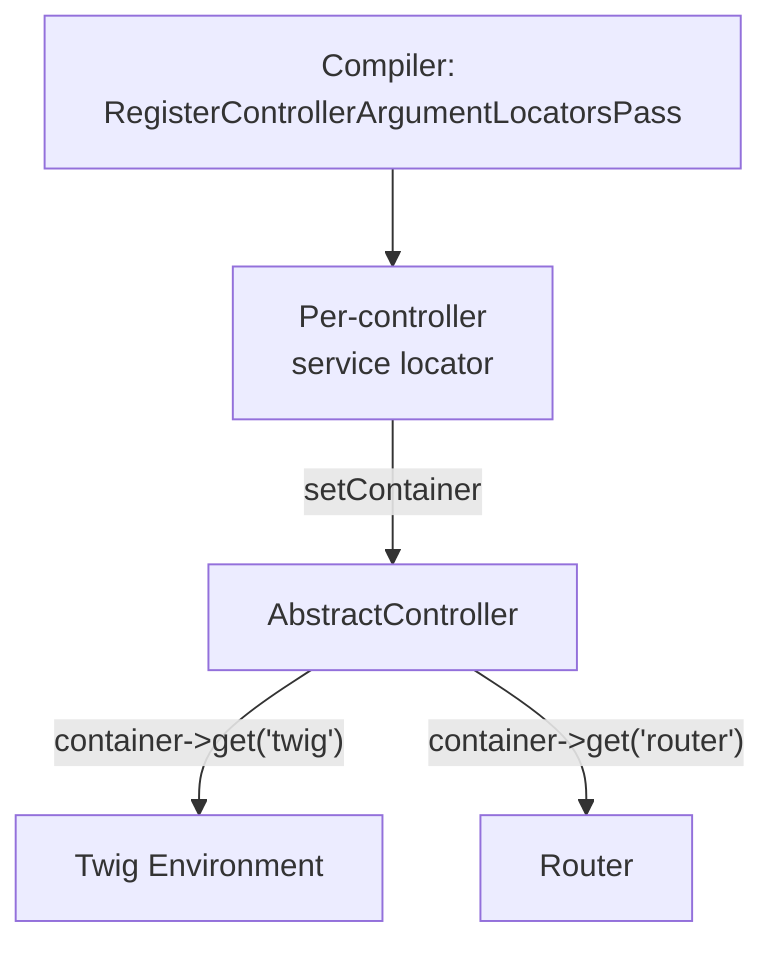

# AbstractController

!!! abstract "Learning objectives"
    By the end of this chapter you can:

    - [ ] Enumerate the helper methods `AbstractController` provides and their return types.
    - [ ] Explain how it obtains services through `getSubscribedServices()` and a
          service locator — not constructor injection.
    - [ ] Justify why it is a **service subscriber** base class, not a Laravel-style
          `ControllerBase`, and when to skip it.

    **Syllabus:** `Controllers → AbstractController` ·
    **Level:** Expert ·
    **Est. time:** 18 min ·
    **Prerequisites:** [DI → Service Subscribers](../dependency-injection/index.md), [Naming](naming-conventions.md)

---

## Theory

`Symfony\Bundle\FrameworkBundle\Controller\AbstractController` is an **optional**
base class that adds convenience shortcuts on top of a controller. It does *not*
give your controller special powers — every helper is sugar over a service you
could inject yourself. Extending it is a productivity choice, not an architectural
requirement.

The helpers it exposes (all `protected`):

| Method | Returns | Purpose |
|---|---|---|
| `render()` / `renderView()` | `Response` / `string` | Render a Twig template |
| `renderBlock()` / `renderBlockView()` | `Response` / `string` | Render one Twig block |
| `json()` | `JsonResponse` | Serialize data to JSON |
| `file()` | `BinaryFileResponse` | Stream a downloadable file |
| `stream()` | `StreamedResponse` | Stream a template |
| `redirect()` / `redirectToRoute()` | `RedirectResponse` | HTTP redirect |
| `forward()` | `Response` | Internal sub-request |
| `generateUrl()` | `string` | Build a URL from a route |
| `createNotFoundException()` | `NotFoundHttpException` | Build a 404 to throw |
| `createAccessDeniedException()` | `AccessDeniedException` | Build a 403 to throw |
| `denyAccessUnlessGranted()` | `void` | Throw 403 unless authorized |
| `isGranted()` / `getAccessDecision()` | `bool` / `AccessDecision` | Authorization check |
| `getUser()` | `?UserInterface` | Current authenticated user |
| `addFlash()` | `void` | Queue a flash message |
| `isCsrfTokenValid()` | `bool` | Validate a CSRF token |
| `createForm()` / `createFormBuilder()` | `FormInterface` / `FormBuilderInterface` | Build a form |
| `getParameter()` | scalar/array/enum | Read a container parameter |
| `addLink()` / `sendEarlyHints()` | `void` / `Response` | HTTP `Link` / 103 Early Hints |

## Deep Dive — how it works internally

`AbstractController` implements
`Symfony\Contracts\Service\ServiceSubscriberInterface`. Instead of listing a
dozen constructor arguments, it declares the services it *might* need via the
static `getSubscribedServices()` method and receives a **service locator** (a
small, lazy `Psr\Container\ContainerInterface`) through `setContainer()`.

The exact subscription list in Symfony 8:

```php
public static function getSubscribedServices(): array
{
    return [
        'router' => '?'.RouterInterface::class,
        'request_stack' => '?'.RequestStack::class,
        'http_kernel' => '?'.HttpKernelInterface::class,
        'serializer' => '?'.SerializerInterface::class,
        'security.authorization_checker' => '?'.AuthorizationCheckerInterface::class,
        'twig' => '?'.Environment::class,
        'form.factory' => '?'.FormFactoryInterface::class,
        'security.token_storage' => '?'.TokenStorageInterface::class,
        'security.csrf.token_manager' => '?'.CsrfTokenManagerInterface::class,
        'parameter_bag' => '?'.ContainerBagInterface::class,
        'web_link.http_header_serializer' => '?'.HttpHeaderSerializer::class,
    ];
}
```

The `?` prefix marks each service **optional**: if Twig is not installed,
`render()` throws a clear `\LogicException` ("You cannot use the render method if
Twig is not available") rather than a container error. This is why a fresh
project can extend `AbstractController` before adding the form or security
components.



At compile time, `Symfony\Bundle\FrameworkBundle\DependencyInjection\Compiler\ControllerArgumentValueResolverPass`
and the controller-service machinery build a locator containing exactly the
subscribed services and wire it into the controller. Because the locator is
**lazy**, none of those services is instantiated until you actually call the
helper — extending `AbstractController` costs almost nothing at runtime.

!!! note "Source reference"
    `Symfony\Bundle\FrameworkBundle\Controller\AbstractController` —
    [symfony/symfony `8.0`](https://github.com/symfony/symfony/blob/8.0/src/Symfony/Bundle/FrameworkBundle/Controller/AbstractController.php).

### Why not a `ControllerBase`?

Symfony deliberately avoids a fat base class that injects everything eagerly:

- **Lazy & explicit** — the service locator resolves services on demand, so an
  unused controller never boots Twig or the serializer.
- **Testable** — you can subscribe/override services in isolation, and you are
  free *not* to extend it at all.
- **Decoupled** — the base class depends on interfaces, and the `?` markers keep
  optional components truly optional.

### Extending the subscription list

Override `getSubscribedServices()` to add your own service and merge the parent
list — a clean pattern for a shared service across many controllers.

## Configuration & code

=== "Using helpers"

    ```php
    <?php
    declare(strict_types=1);

    namespace App\Controller;

    use Symfony\Bundle\FrameworkBundle\Controller\AbstractController;
    use Symfony\Component\HttpFoundation\Response;
    use Symfony\Component\Routing\Attribute\Route;

    final class DashboardController extends AbstractController
    {
        #[Route('/dashboard', name: 'dashboard')]
        public function index(): Response
        {
            $this->denyAccessUnlessGranted('ROLE_USER');

            return $this->render('dashboard/index.html.twig', [
                'user' => $this->getUser(),
            ]);
        }
    }
    ```

=== "Extending subscriptions"

    ```php
    <?php
    declare(strict_types=1);

    namespace App\Controller;

    use App\Service\ReportGenerator;
    use Symfony\Bundle\FrameworkBundle\Controller\AbstractController;

    abstract class ReportingController extends AbstractController
    {
        public static function getSubscribedServices(): array
        {
            return [
                ...parent::getSubscribedServices(),
                ReportGenerator::class, // no '?' → required
            ];
        }

        protected function reports(): ReportGenerator
        {
            return $this->container->get(ReportGenerator::class);
        }
    }
    ```

=== "No base class"

    ```php
    <?php
    declare(strict_types=1);

    namespace App\Controller;

    use Symfony\Component\HttpFoundation\Response;
    use Twig\Environment;

    final class LeanController
    {
        public function __construct(private Environment $twig) {}

        public function __invoke(): Response
        {
            return new Response($this->twig->render('page.html.twig'));
        }
    }
    ```

## Best practices & anti-patterns

| ✅ Do | ❌ Avoid |
|---|---|
| Extend `AbstractController` for convenience | Treating it as required for all controllers |
| Inject *your* dependencies via the constructor | Overriding `getSubscribedServices()` for app services you inject anyway |
| Merge `parent::getSubscribedServices()` | Returning only your services (loses helpers) |
| Access app services by constructor injection | Fetching app services through `$this->container` |

## When (not) to use it / alternatives

- **Use it** when you want `render`, `redirectToRoute`, flash, and auth shortcuts.
- **Skip it** for tiny invokable controllers or when you prefer explicit
  constructor injection everywhere (e.g. hexagonal/DDD style).
- The `container` locator is meant for the *framework's* helper services, not a
  service-locator anti-pattern for your own domain services — inject those.

!!! danger "Certification traps"
    - `AbstractController` is a **`ServiceSubscriberInterface`**; services arrive
      through a **lazy service locator**, not the constructor.
    - Helpers are **`protected`** — you call them from `$this`, not statically.
    - Optional services use the `?` prefix; calling `render()` without Twig throws
      a `LogicException`, not a container "service not found".
    - `$this->container` in a controller is a **restricted locator**, not the full
      DI container; it only holds the subscribed services.
    - Extending is optional — a plain callable is a perfectly valid controller.

!!! warning "Common mistakes"
    - Overriding `getSubscribedServices()` without spreading `parent::` — you lose
      `render`, `getUser`, etc.
    - Using `$this->container->get(SomeDomainService::class)` instead of injecting
      it, which hides dependencies and breaks the locator (service not subscribed).

## Exercises

1. **(Basic)** From an `AbstractController`, render a template *and* set the
   response status to `201`.
2. **(Expert)** Create an abstract `ApiController` base that subscribes a
   `RateLimiterFactory`, exposing it via a `protected` accessor while keeping all
   inherited helpers.

??? success "Solutions"

    **1.**
    ```php
    $response = $this->render('created.html.twig');
    $response->setStatusCode(201);
    return $response;
    // or: return $this->render('created.html.twig', [], new Response(status: 201));
    ```
    `render()` accepts a pre-built `Response` as its third argument.

    **2.** Override `getSubscribedServices()` returning
    `[...parent::getSubscribedServices(), RateLimiterFactory::class]` (no `?` =
    required) and add `protected function limiter(): RateLimiterFactory { return
    $this->container->get(RateLimiterFactory::class); }`.

## Certification questions

??? question "Q1. How does AbstractController receive its services?"
    - [ ] A. Constructor injection of each service.
    - [x] B. A lazy service locator via `setContainer()`, driven by `getSubscribedServices()`. ✅
    - [ ] C. The global service container is injected in full.
    - [ ] D. Via static properties set by the kernel.

    **Why:** it implements `ServiceSubscriberInterface`; the compiler builds a
    per-controller locator. **Ref:** [service subscribers](https://symfony.com/doc/current/service_container/service_subscribers_locators.html).

??? question "Q2. What does `$this->container` hold inside an AbstractController?"
    - [ ] A. The full application container.
    - [x] B. Only the subscribed services (a restricted locator). ✅
    - [ ] C. Nothing — it is always null.
    - [ ] D. Only parameters, not services.

    **Why:** the locator contains exactly the services returned by
    `getSubscribedServices()`. **Ref:** [service subscribers](https://symfony.com/doc/current/service_container/service_subscribers_locators.html).

??? question "Q3. What happens if you call `render()` without Twig installed?"
    - [ ] A. A container "service not found" fatal error.
    - [x] B. A clear `LogicException` telling you to install Twig. ✅
    - [ ] C. It silently returns an empty `Response`.
    - [ ] D. It falls back to PHP templates.

    **Why:** `twig` is subscribed with a `?` (optional); the helper guards for its
    absence. **Ref:** [AbstractController source](https://github.com/symfony/symfony/blob/8.0/src/Symfony/Bundle/FrameworkBundle/Controller/AbstractController.php).

??? question "Q4. Why is `AbstractController` preferred over a fat base class?"
    - [x] A. Lazy, explicit, testable service access via a subscriber locator. ✅
    - [ ] B. It is faster because it caches all services eagerly.
    - [ ] C. It forbids constructor injection.
    - [ ] D. It auto-registers every app service.

    **Why:** subscription keeps services lazy and the coupling explicit.
    **Ref:** [best practices](https://symfony.com/doc/current/best_practices.html).

## Key takeaways

- `AbstractController` is optional sugar built on a **service subscriber**.
- Services arrive through a **lazy locator**, keyed by `getSubscribedServices()`.
- Helpers are `protected`; optional services carry the `?` prefix.
- Inject your *own* dependencies via the constructor — don't fetch them from
  `$this->container`.

## Last-minute revision

!!! tip "Cheat sheet"
    - Implements `ServiceSubscriberInterface`; `setContainer()` injects a locator.
    - Subscribed: router, request_stack, http_kernel, serializer, twig,
      form.factory, security.*, parameter_bag, web_link serializer.
    - `?ServiceClass` = optional. Merge `parent::getSubscribedServices()`.
    - Helpers return: `render`→Response, `json`→JsonResponse, `redirectToRoute`→
      RedirectResponse, `createNotFoundException`→exception (you `throw` it).

## Official References
- [Official Symfony docs — Controllers](https://symfony.com/doc/current/controller.html#the-base-controller-class-services)
- [Official Symfony docs — Service Subscribers & Locators](https://symfony.com/doc/current/service_container/service_subscribers_locators.html)
- [Symfony source — AbstractController](https://github.com/symfony/symfony/blob/8.0/src/Symfony/Bundle/FrameworkBundle/Controller/AbstractController.php)

---

<small>Related: [Naming](naming-conventions.md) · [Flash Messages](flash-messages.md) · [HTTP Redirects](http-redirects.md) · [DI](../dependency-injection/index.md)</small>
