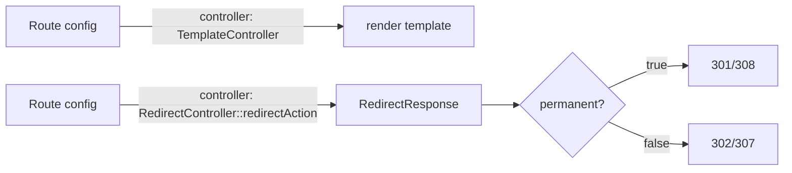

# Built-in Internal Controllers

!!! tip "In a nutshell"
    `TemplateController` et `RedirectController` permettent à une route de rendre un
    template ou de rediriger **sans classe PHP** — uniquement de la configuration de
    route. `permanent: true` transforme la redirection en 301/308 ; une cible vide
    renvoie 410 Gone.

!!! example "Real-world analogy"
    Imaginez une réceptionniste qui traite les deux demandes les plus triviales sans
    jamais appeler un responsable. Pour « montrez-moi les conditions générales », elle
    tend une brochure pré-imprimée (`TemplateController`) ; pour « où est passé
    l'ancien bureau ? », elle lit une fiche plastifiée collée sur son comptoir et vous
    indique le couloir (`RedirectController`). La fiche distingue même « déménagé
    définitivement » (301/308) de « cette salle n'existe plus » (410 Gone) — tout cela
    depuis la feuille d'instructions (la configuration de route), sans aucun jugement
    de sa part.

!!! abstract "Learning objectives"
    À la fin de ce chapitre, vous saurez :

    - [ ] Rendre un template directement depuis une route avec `TemplateController`.
    - [ ] Rediriger depuis la configuration de route avec `RedirectController`.
    - [ ] Décider quand un controller purement déclaratif vaut mieux qu'une classe PHP dédiée.

    **Syllabus:** `Controllers → Built-in internal controllers` ·
    **Level:** Advanced ·
    **Est. time:** 11 min ·
    **Prerequisites:** [Naming](naming-conventions.md), [HTTP Redirects](http-redirects.md)

---

## Theory

Symfony fournit deux controllers prêts à l'emploi pour que les routes triviales ne
nécessitent **aucune classe PHP** :

| Controller | Rôle |
|---|---|
| `Symfony\Bundle\FrameworkBundle\Controller\TemplateController` | Rendre un template Twig depuis les defaults de la route |
| `Symfony\Bundle\FrameworkBundle\Controller\RedirectController` | Rediriger vers une route ou une URL depuis la configuration de route |

Vous les référencez dans la clé `controller` (ou `_controller`) de la route et
passez leurs paramètres via les **defaults** de la route.

```yaml
# config/routes.yaml — 'controller' is sugar for the '_controller' default
terms:
    path: /terms
    controller: Symfony\Bundle\FrameworkBundle\Controller\TemplateController
    defaults:                                # parameters travel as route defaults
        template: 'static/terms.html.twig'
```

!!! question "Predict first"
    Une route pointe vers `RedirectController::urlRedirectAction` avec un default
    `path` **vide**. Quel statut reçoit le visiteur — 404, 500, ou autre chose ?

??? note "Reveal"
    **410 Gone.** Une cible vide indique au `RedirectController` que la ressource a
    définitivement disparu, il renvoie donc 410 — pas un 404. (Et `permanent: true`
    transforme la redirection en 301, ou 308 avec `keepRequestMethod`.)

## Deep Dive — how it works internally

Les deux sont des controllers invokables/services ordinaires, enregistrés par le
framework et taggés pour que leurs arguments soient résolubles.

### TemplateController

`TemplateController::__invoke()` accepte `template`, un `context` optionnel,
`maxAge`, `sharedAge`, `private` et `statusCode`. Il rend le template et, si
`maxAge`/`sharedAge`/`private` sont fournis, positionne les en-têtes de cache
HTTP — pratique pour des pages quasi statiques servies avec du cache mais sans
logique.

```yaml
status:
    path: /status
    controller: Symfony\Bundle\FrameworkBundle\Controller\TemplateController
    defaults:
        template: 'static/status.html.twig'  # template (required)
        context: { region: 'eu-west' }       # extra variables for the template
        maxAge: 300                          # Cache-Control: max-age=300
        sharedAge: 600                       # s-maxage for shared caches
        private: false                       # allow shared caching
        statusCode: 200                      # response status code
```

### RedirectController

Deux points d'entrée :

- `redirectAction` — redirige vers une **route** (`route`, `permanent`,
  `ignoreAttributes`, `keepRequestMethod`, `keepQueryParams`).
- `urlRedirectAction` — redirige vers un **chemin/une URL** (`path`, `permanent`,
  `scheme`, `httpPort`, `httpsPort`, `keepRequestMethod`).

```yaml
old_route:
    path: /old
    controller: Symfony\Bundle\FrameworkBundle\Controller\RedirectController::redirectAction
    defaults:
        route: new_route          # target route name
        permanent: true           # 301 (308 with keepRequestMethod)
        keepRequestMethod: true   # preserve POST/PUT... across the redirect
        keepQueryParams: true     # forward the query string
        ignoreAttributes: true    # drop extra route attributes from the target URL

old_url:
    path: /old-url
    controller: Symfony\Bundle\FrameworkBundle\Controller\RedirectController::urlRedirectAction
    defaults:
        path: '/new-url'          # target path or absolute URL
        scheme: https             # force the scheme
        httpPort: 80              # used when scheme is http
        httpsPort: 443            # used when scheme is https
        permanent: true
```

`permanent: true` fait passer de 302 à **301** (ou de 307 à **308** quand
`keepRequestMethod: true`). Une `route`/un `path` vide produit un **410 Gone**.



!!! note "Source reference"
    `Symfony\Bundle\FrameworkBundle\Controller\RedirectController` et
    `TemplateController` —
    [symfony/symfony `8.0`](https://github.com/symfony/symfony/blob/8.0/src/Symfony/Bundle/FrameworkBundle/Controller/RedirectController.php).

## Configuration & code

=== "TemplateController (YAML)"

    ```yaml
    # config/routes.yaml
    terms:
        path: /terms
        controller: Symfony\Bundle\FrameworkBundle\Controller\TemplateController
        defaults:
            template: 'static/terms.html.twig'
            # optional HTTP caching:
            maxAge: 86400
            sharedAge: 86400
            context: { updated: '2026-01-01' }
    ```

=== "RedirectController (YAML)"

    ```yaml
    # config/routes.yaml
    # 1) Redirect the bare domain to a named route (permanent 301)
    root_to_home:
        path: /
        controller: Symfony\Bundle\FrameworkBundle\Controller\RedirectController::redirectAction
        defaults:
            route: homepage
            permanent: true

    # 2) Redirect an old path to an external/absolute URL
    old_docs:
        path: /old-docs
        controller: Symfony\Bundle\FrameworkBundle\Controller\RedirectController::urlRedirectAction
        defaults:
            path: 'https://example.com/docs'
            permanent: true

    # 3) Gone
    removed:
        path: /removed
        controller: Symfony\Bundle\FrameworkBundle\Controller\RedirectController::urlRedirectAction
        defaults: { path: '' }   # empty path → 410 Gone
    ```

=== "PHP routing"

    ```php
    <?php
    // config/routes.php
    use Symfony\Bundle\FrameworkBundle\Controller\TemplateController;
    use Symfony\Component\Routing\Loader\Configurator\RoutingConfigurator;

    return static function (RoutingConfigurator $routes): void {
        $routes->add('terms', '/terms')
            ->controller(TemplateController::class)
            ->defaults(['template' => 'static/terms.html.twig']);
    };
    ```

## Best practices & anti-patterns

| ✅ Do | ❌ Avoid |
|---|---|
| Utiliser `TemplateController` pour les pages sans logique | Écrire une classe juste pour `return $this->render()` |
| Utiliser `RedirectController` pour les déplacements d'URL en config | Coder en dur des redirections dans une action jetable |
| Mettre `permanent: true` pour les déplacements réellement permanents | Un 301 sur des redirections temporaires ou POST |
| `keepRequestMethod` pour préserver le POST | Perdre silencieusement la méthode sur les redirections d'API |

## When (not) to use it / alternatives

- **Utilisez**-les quand une route n'a besoin *que* d'un rendu ou d'une redirection —
  zéro logique métier. Moins de fichiers, configuration déclarative.
- **Ne les utilisez pas** dès qu'une logique conditionnelle apparaît — écrivez un
  vrai controller.
- Pour les redirections générées *à l'intérieur* de la logique, utilisez plutôt
  [`redirectToRoute()`](http-redirects.md).

!!! danger "Certification traps"
    - `permanent: true` rend la redirection **301** (ou **308** avec
      `keepRequestMethod: true`), que les navigateurs **mettent en cache**.
    - Une `route`/un `path` **vide** dans `RedirectController` renvoie **410 Gone**,
      pas un 404.
    - `TemplateController` peut positionner les en-têtes de cache HTTP via les
      defaults `maxAge`/`sharedAge`/`private` — sans aucun PHP.
    - `keepQueryParams`/`keepRequestMethod` sont opt-in ; par défaut la query string
      et la méthode peuvent ne pas être préservées.

!!! warning "Common mistakes"
    - Référencer `RedirectController` sans `::redirectAction` /
      `::urlRedirectAction` — il n'est pas invokable.
    - Passer à la fois `route` et `path` — choisissez l'action correspondant à chacun.

## Exercises

1. **(Basic)** Servez `/about` en rendant `static/about.html.twig` sans classe de
   controller, avec un cache d'un jour pour les caches partagés.
2. **(Intermediate)** Redirigez de façon permanente `/home` vers la route
   `dashboard` en préservant la méthode de la request.

??? success "Solutions"

    **1.**
    ```yaml
    about:
        path: /about
        controller: Symfony\Bundle\FrameworkBundle\Controller\TemplateController
        defaults: { template: 'static/about.html.twig', sharedAge: 86400 }
    ```

    **2.**
    ```yaml
    home_redirect:
        path: /home
        controller: Symfony\Bundle\FrameworkBundle\Controller\RedirectController::redirectAction
        defaults: { route: dashboard, permanent: true, keepRequestMethod: true }
    ```
    `permanent + keepRequestMethod` produit un **308**.

## Certification questions

??? question "Q1. Which controller renders a template purely from route config?"
    - [x] A. `TemplateController` ✅
    - [ ] B. `RenderController`
    - [ ] C. `ViewController`
    - [ ] D. `TwigController`

    **Why:** `TemplateController` rend le template indiqué dans le default `template`. **Ref:** [render a template directly](https://symfony.com/doc/current/templates.html#rendering-a-template-directly-from-a-route).

??? question "Q2. `RedirectController` with `permanent: true` returns…"
    - [ ] A. 302
    - [x] B. 301 (or 308 with keepRequestMethod) ✅
    - [ ] C. 307
    - [ ] D. 410

    **Why:** `permanent` sélectionne le code de statut permanent. **Ref:** [redirect from route](https://symfony.com/doc/current/routing.html#redirecting-to-urls-and-routes-directly-from-a-route).

??? question "Q3. An empty `path` in `urlRedirectAction` produces…"
    - [ ] A. 404 Not Found
    - [ ] B. 500 error
    - [x] C. 410 Gone ✅
    - [ ] D. 302 to `/`

    **Why:** une cible vide signale que la ressource a définitivement disparu.
    **Ref:** [RedirectController source](https://github.com/symfony/symfony/blob/8.0/src/Symfony/Bundle/FrameworkBundle/Controller/RedirectController.php).

## Key takeaways

- `TemplateController` rend un template (avec en-têtes de cache optionnels) depuis la config.
- `RedirectController::redirectAction` (route) / `urlRedirectAction` (URL) redirigent
  depuis la config.
- `permanent: true` → 301/308 (mis en cache) ; cible vide → 410 Gone.
- Réservez-les aux routes sans logique ; sinon, écrivez un controller.

## Last-minute revision

!!! tip "Cheat sheet"
    - Template : `controller: TemplateController`, `defaults.template`.
    - Redirection vers une route : `RedirectController::redirectAction`, `defaults.route`.
    - Redirection vers une URL : `RedirectController::urlRedirectAction`, `defaults.path`.
    - `permanent`→301/308 · cible vide→410 · `keepRequestMethod`/`keepQueryParams`.

## Connections

- **Depends on:** [HTTP Redirects](http-redirects.md) — fournit la sémantique 301/302/308 que `permanent` sélectionne.
- **Reused in:** [Naming Conventions](naming-conventions.md) — ces controllers sont référencés comme `controller` d'une route, comme n'importe quel callable.
- **Confused with:** [Internal Redirects](internal-redirects.md) — `RedirectController` envoie un vrai 3xx, pas un forward interne.

## Official References
- [Official Symfony docs — Render a template from a route](https://symfony.com/doc/current/templates.html#rendering-a-template-directly-from-a-route)
- [Official Symfony docs — Redirect directly from a route](https://symfony.com/doc/current/routing.html#redirecting-to-urls-and-routes-directly-from-a-route)
- [Symfony source — RedirectController](https://github.com/symfony/symfony/blob/8.0/src/Symfony/Bundle/FrameworkBundle/Controller/RedirectController.php)

## Video references

!!! tip "Watch & learn"
    Ce sont des chaînes vidéo officielles et continuellement mises à jour — cherchez-y
    « Symfony controllers » pour consolider ce chapitre. Nous lions des chaînes stables
    plutôt que des vidéos individuelles afin que les références ne périment jamais.

    - [SymfonyCasts screencasts](https://symfonycasts.com/tracks/symfony) — tutoriels scénarisés à suivre en codant.
    - [Symfony official YouTube](https://www.youtube.com/@SymfonyOfficial) — conférences et keynotes de SymfonyCon.
    - [Official docs for this topic](https://symfony.com/doc/current/templates.html#rendering-a-template-directly-from-a-route) — certaines pages de la doc Symfony intègrent un screencast.

## Confidence check

Je suis prêt quand je peux :

- [ ] expliquer **pourquoi** un controller purement déclaratif existe (routes sans logique, pas de classe PHP)
- [ ] câbler `TemplateController` et `RedirectController` via les defaults de route dans Symfony 8
- [ ] déboguer une redirection qui renvoie 404 parce que `::redirectAction`/`::urlRedirectAction` a été omis
- [ ] repérer qu'une cible vide produit 410 tandis que `permanent: true` produit 301/308
- [ ] expliquer qu'il s'agit en interne de controllers invokables/services ordinaires

---

<small>Related: [HTTP Redirects](http-redirects.md) · [Naming](naming-conventions.md) · [Routing → Redirects](../routing/redirects.md)</small>
