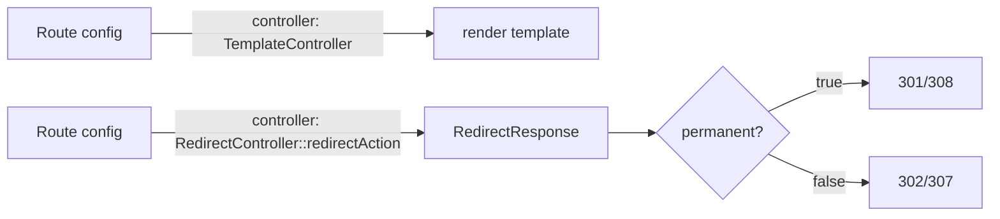

# Built-in Internal Controllers

!!! tip "In a nutshell"
    `TemplateController` and `RedirectController` let a route render a template or
    redirect with **no PHP class** — pure route config. `permanent: true` makes a
    redirect 301/308; an empty target returns 410 Gone.

!!! example "Real-world analogy"
    Think of a receptionist handling the two most trivial requests without ever
    phoning a manager. For "show me the terms," she hands over a pre-printed brochure
    (`TemplateController`); for "where did the old office go?" she reads a laminated
    card taped to her desk and points you down the hall (`RedirectController`). The
    card even distinguishes "moved permanently" (301/308) from "this room no longer
    exists" (410 Gone) — all from the instruction sheet (route config), with no
    judgement call of her own.

!!! abstract "Learning objectives"
    By the end of this chapter you can:

    - [ ] Render a template straight from a route with `TemplateController`.
    - [ ] Redirect from route configuration with `RedirectController`.
    - [ ] Decide when a config-only controller beats a custom PHP class.

    **Syllabus:** `Controllers → Built-in internal controllers` ·
    **Level:** Advanced ·
    **Est. time:** 11 min ·
    **Prerequisites:** [Naming](naming-conventions.md), [HTTP Redirects](http-redirects.md)

    **Examen Symfony 8 :** OUI

---

## Pour les nuls

### L'idée en une phrase
`TemplateController` et `RedirectController` te permettent de créer une route sans écrire la moindre classe PHP — juste de la configuration.

### Imagine dans la vraie vie
Un réceptionniste gère les deux demandes les plus triviales sans jamais appeler un responsable. Pour "montrez-moi les conditions", elle remet une brochure préimprimée (`TemplateController`) ; pour "où est passé l'ancien bureau ?", elle lit une carte plastifiée collée sur son bureau et t'indique le couloir (`RedirectController`).

### Dans Symfony
Une page statique de type "À propos" n'a besoin d'aucun contrôleur PHP : `TemplateController` suffit, directement configuré dans les routes.

### Exemple simple
```yaml
a_propos:
    path: /a-propos
    controller: Symfony\Bundle\FrameworkBundle\Controller\TemplateController
    defaults: { template: 'pages/a_propos.html.twig' }
```

### Comment le mémoriser 🧠
`permanent: true` transforme un redirect en 301/308 (permanent) ; une cible vide renvoie un 410 Gone ("cette ressource n'existe plus", différent d'un 404 "introuvable").

## Theory

Symfony ships two ready-made controllers so trivial routes need **no PHP class**:

| Controller | Purpose |
|---|---|
| `Symfony\Bundle\FrameworkBundle\Controller\TemplateController` | Render a Twig template from route defaults |
| `Symfony\Bundle\FrameworkBundle\Controller\RedirectController` | Redirect to a route or URL from route config |

You reference them in the route's `controller` (or `_controller`) and pass their
parameters as route **defaults**.

```yaml
# config/routes.yaml — 'controller' is sugar for the '_controller' default
terms:
    path: /terms
    controller: Symfony\Bundle\FrameworkBundle\Controller\TemplateController
    defaults:                                # parameters travel as route defaults
        template: 'static/terms.html.twig'
```

!!! question "Predict first"
    A route points at `RedirectController::urlRedirectAction` with an **empty**
    `path` default. What status does the visitor get — 404, 500, or something else?

??? note "Reveal"
    **410 Gone.** An empty target tells `RedirectController` the resource is
    permanently gone, so it returns 410 — not a 404. (And `permanent: true` turns
    the redirect into 301, or 308 with `keepRequestMethod`.)

## Deep Dive — how it works internally

Both are ordinary invokable/service controllers registered by the framework and
tagged so their arguments are resolvable.

### TemplateController

`TemplateController::__invoke()` accepts `template`, optional `context`,
`maxAge`, `sharedAge`, `private`, and `statusCode`. It renders the template and,
if `maxAge`/`sharedAge`/`private` are given, sets HTTP cache headers — handy for
static-ish pages served with caching but no logic.

```yaml
status:
    path: /status
    controller: Symfony\Bundle\FrameworkBundle\Controller\TemplateController
    defaults:
        template: 'static/status.html.twig'  # template (required)
        context: { region: 'eu-west' }       # extra variables for the template
        maxAge: 300                          # Cache-Control: max-age=300
        sharedAge: 600                       # s-maxage for shared caches
        private: false                       # allow shared caching
        statusCode: 200                      # response status code
```

### RedirectController

Two entry points:

- `redirectAction` — redirect to a **route** (`route`, `permanent`,
  `ignoreAttributes`, `keepRequestMethod`, `keepQueryParams`).
- `urlRedirectAction` — redirect to a **path/URL** (`path`, `permanent`,
  `scheme`, `httpPort`, `httpsPort`, `keepRequestMethod`).

```yaml
old_route:
    path: /old
    controller: Symfony\Bundle\FrameworkBundle\Controller\RedirectController::redirectAction
    defaults:
        route: new_route          # target route name
        permanent: true           # 301 (308 with keepRequestMethod)
        keepRequestMethod: true   # preserve POST/PUT... across the redirect
        keepQueryParams: true     # forward the query string
        ignoreAttributes: true    # drop extra route attributes from the target URL

old_url:
    path: /old-url
    controller: Symfony\Bundle\FrameworkBundle\Controller\RedirectController::urlRedirectAction
    defaults:
        path: '/new-url'          # target path or absolute URL
        scheme: https             # force the scheme
        httpPort: 80              # used when scheme is http
        httpsPort: 443            # used when scheme is https
        permanent: true
```

`permanent: true` switches 302 → **301** (or 307 → **308** when
`keepRequestMethod: true`). An empty `route`/`path` yields a **410 Gone**.



!!! note "Source reference"
    `Symfony\Bundle\FrameworkBundle\Controller\RedirectController` and
    `TemplateController` —
    [symfony/symfony `8.0`](https://github.com/symfony/symfony/blob/8.0/src/Symfony/Bundle/FrameworkBundle/Controller/RedirectController.php).

## Configuration & code

=== "TemplateController (YAML)"

    ```yaml
    # config/routes.yaml
    terms:
        path: /terms
        controller: Symfony\Bundle\FrameworkBundle\Controller\TemplateController
        defaults:
            template: 'static/terms.html.twig'
            # optional HTTP caching:
            maxAge: 86400
            sharedAge: 86400
            context: { updated: '2026-01-01' }
    ```

=== "RedirectController (YAML)"

    ```yaml
    # config/routes.yaml
    # 1) Redirect the bare domain to a named route (permanent 301)
    root_to_home:
        path: /
        controller: Symfony\Bundle\FrameworkBundle\Controller\RedirectController::redirectAction
        defaults:
            route: homepage
            permanent: true

    # 2) Redirect an old path to an external/absolute URL
    old_docs:
        path: /old-docs
        controller: Symfony\Bundle\FrameworkBundle\Controller\RedirectController::urlRedirectAction
        defaults:
            path: 'https://example.com/docs'
            permanent: true

    # 3) Gone
    removed:
        path: /removed
        controller: Symfony\Bundle\FrameworkBundle\Controller\RedirectController::urlRedirectAction
        defaults: { path: '' }   # empty path → 410 Gone
    ```

=== "PHP routing"

    ```php
    <?php
    // config/routes.php
    use Symfony\Bundle\FrameworkBundle\Controller\TemplateController;
    use Symfony\Component\Routing\Loader\Configurator\RoutingConfigurator;

    return static function (RoutingConfigurator $routes): void {
        $routes->add('terms', '/terms')
            ->controller(TemplateController::class)
            ->defaults(['template' => 'static/terms.html.twig']);
    };
    ```

## Best practices & anti-patterns

| ✅ Do | ❌ Avoid |
|---|---|
| Use `TemplateController` for logic-free pages | Writing a class just to `return $this->render()` |
| Use `RedirectController` for URL moves in config | Hardcoding redirects in a throwaway action |
| Set `permanent: true` for real permanent moves | 301 on temporary/POST redirects |
| `keepRequestMethod` to preserve POST | Losing the method on API redirects silently |

## When (not) to use it / alternatives

- **Use** these when a route needs *only* a render or a redirect — zero business
  logic. Fewer files, declarative config.
- **Don't** use them once any conditional logic appears — write a real controller.
- For redirects generated *inside* logic, use
  [`redirectToRoute()`](http-redirects.md) instead.

!!! danger "Certification traps"
    - `permanent: true` makes the redirect **301** (or **308** with
      `keepRequestMethod: true`), which browsers **cache**.
    - An **empty** `route`/`path` in `RedirectController` returns **410 Gone**, not
      a 404.
    - `TemplateController` can set HTTP cache headers via `maxAge`/`sharedAge`/
      `private` defaults — no PHP needed.
    - `keepQueryParams`/`keepRequestMethod` are opt-in; by default a query string
      and method may not be preserved.

!!! warning "Common mistakes"
    - Referencing `RedirectController` without `::redirectAction` /
      `::urlRedirectAction` — it is not invokable.
    - Passing both `route` and `path` — pick the matching action for each.

## Exercises

1. **(Basic)** Serve `/about` by rendering `static/about.html.twig` with no
   controller class, cached for one day by shared caches.
2. **(Intermediate)** Permanently redirect `/home` to the `dashboard` route while
   preserving the request method.

??? success "Solutions"

    **1.**
    ```yaml
    about:
        path: /about
        controller: Symfony\Bundle\FrameworkBundle\Controller\TemplateController
        defaults: { template: 'static/about.html.twig', sharedAge: 86400 }
    ```

    **2.**
    ```yaml
    home_redirect:
        path: /home
        controller: Symfony\Bundle\FrameworkBundle\Controller\RedirectController::redirectAction
        defaults: { route: dashboard, permanent: true, keepRequestMethod: true }
    ```
    `permanent + keepRequestMethod` yields a **308**.

## Certification questions

*Question d'entraînement inspirée du syllabus — jamais une question officielle de l'examen.*

??? question "Q1. Which controller renders a template purely from route config?"
    - [x] A. `TemplateController` ✅
    - [ ] B. `RenderController`
    - [ ] C. `ViewController`
    - [ ] D. `TwigController`

    **Why:** `TemplateController` renders the `template` default. **Ref:** [render a template directly](https://symfony.com/doc/8.0/templates.html#rendering-a-template-directly-from-a-route).

??? question "Q2. `RedirectController` with `permanent: true` returns…"
    - [ ] A. 302
    - [x] B. 301 (or 308 with keepRequestMethod) ✅
    - [ ] C. 307
    - [ ] D. 410

    **Why:** `permanent` selects the permanent status code. **Ref:** [redirect from route](https://symfony.com/doc/8.0/routing.html#redirecting-to-urls-and-routes-directly-from-a-route).

??? question "Q3. An empty `path` in `urlRedirectAction` produces…"
    - [ ] A. 404 Not Found
    - [ ] B. 500 error
    - [x] C. 410 Gone ✅
    - [ ] D. 302 to `/`

    **Why:** an empty target signals the resource is permanently gone.
    **Ref:** [RedirectController source](https://github.com/symfony/symfony/blob/8.0/src/Symfony/Bundle/FrameworkBundle/Controller/RedirectController.php).

## Key takeaways

- `TemplateController` renders a template (with optional cache headers) from config.
- `RedirectController::redirectAction` (route) / `urlRedirectAction` (URL) redirect
  from config.
- `permanent: true` → 301/308 (cached); empty target → 410 Gone.
- Use them only for logic-free routes; otherwise write a controller.

## Last-minute revision

!!! tip "Cheat sheet"
    - Template: `controller: TemplateController`, `defaults.template`.
    - Redirect route: `RedirectController::redirectAction`, `defaults.route`.
    - Redirect URL: `RedirectController::urlRedirectAction`, `defaults.path`.
    - `permanent`→301/308 · empty target→410 · `keepRequestMethod`/`keepQueryParams`.

## Connections

- **Depends on:** [HTTP Redirects](http-redirects.md) — supplies the 301/302/308 semantics `permanent` selects.
- **Reused in:** [Naming Conventions](naming-conventions.md) — these are referenced as a route's `controller`, like any callable.
- **Confused with:** [Internal Redirects](internal-redirects.md) — `RedirectController` sends a real 3xx, not an internal forward.

## Official References
- [Official Symfony docs — Render a template from a route](https://symfony.com/doc/8.0/templates.html#rendering-a-template-directly-from-a-route)
- [Official Symfony docs — Redirect directly from a route](https://symfony.com/doc/8.0/routing.html#redirecting-to-urls-and-routes-directly-from-a-route)
- [Symfony source — RedirectController](https://github.com/symfony/symfony/blob/8.0/src/Symfony/Bundle/FrameworkBundle/Controller/RedirectController.php)

## Video references

!!! tip "Watch & learn"
    These are official, continuously-updated video channels — search them for
    "Symfony controllers" to reinforce this chapter. We link stable channels rather than
    individual videos so the references never rot.

    - [SymfonyCasts screencasts](https://symfonycasts.com/tracks/symfony) — scripted, code-along tutorials.
    - [Symfony official YouTube](https://www.youtube.com/@SymfonyOfficial) — SymfonyCon conference talks & keynotes.
    - [Official docs for this topic](https://symfony.com/doc/8.0/templates.html#rendering-a-template-directly-from-a-route) — some Symfony doc pages embed a screencast.

## Confidence check

I'm ready when I can:

- [ ] explain **why** a config-only controller exists (logic-free routes, no PHP class)
- [ ] wire `TemplateController` and `RedirectController` from route defaults in Symfony 8
- [ ] debug a redirect that 404s because `::redirectAction`/`::urlRedirectAction` was omitted
- [ ] spot that an empty target yields 410 while `permanent: true` yields 301/308
- [ ] explain how these are ordinary invokable/service controllers internally

---

<small>Related: [HTTP Redirects](http-redirects.md) · [Naming](naming-conventions.md) · [Routing → Redirects](../routing/redirects.md)</small>
