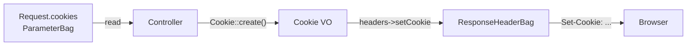

# Cookies

!!! tip "In a nutshell"
    Les cookies sont asymétriques : on les lit depuis `$request->cookies` et on les
    écrit avec `$response->headers->setCookie()` en utilisant l'objet immuable
    `Cookie`. Connaissez les défauts de sécurité — `HttpOnly` est activé, et
    `SameSite=None` est rejeté sauf si `Secure` est à true.

!!! example "Real-world analogy"
    Un cookie fonctionne comme un ticket de vestiaire. Quand vous déposez votre
    manteau, le préposé rédige un talon et vous le remet (le `Set-Cookie` du serveur
    sur la response) ; à votre prochaine visite, vous présentez ce même talon et il le
    lit (le navigateur le renvoie dans la request). Voilà l'asymétrie : vous n'écrivez
    jamais sur un talon que vous rendez, et un talon qu'on vous remet maintenant ne
    sert qu'à une visite ultérieure — jamais au même passage. Et de même qu'un bon
    vestiaire n'accepte pas un ticket sans marquage de sécurité, les navigateurs
    rejettent un ticket `SameSite=None` qui n'est pas aussi estampillé `Secure`.

!!! abstract "Learning objectives"
    À la fin de ce chapitre, vous saurez :

    - [ ] Lire les cookies entrants depuis la `Request`.
    - [ ] Définir et supprimer des cookies sur une `Response` avec le value object `Cookie`.
    - [ ] Configurer `SameSite`, `Secure`, `HttpOnly`, le path, le domaine et l'expiration de façon sûre.

    **Syllabus:** `Controllers → Cookies` ·
    **Level:** Advanced ·
    **Est. time:** 12 min ·
    **Prerequisites:** [The Response](response.md), [Web Security](../php-web-security/web-security.md)

---

## Theory

Les cookies sont asymétriques : vous les **lisez** depuis la request et vous les
**écrivez** sur la response.

- **Lecture :** `$request->cookies` est un `ParameterBag` (`get()`, `has()`, `all()`).
- **Écriture :** construisez un `Symfony\Component\HttpFoundation\Cookie` et
  ajoutez-le au header bag de la response : `$response->headers->setCookie($cookie)`.
- **Suppression :** `$response->headers->clearCookie('name')` envoie un cookie expiré.

```php
// Read — Request side, a ParameterBag
$theme = $request->cookies->get('theme', 'light');
$hasConsent = $request->cookies->has('consent');
$all = $request->cookies->all();

// Write — Response side
$response->headers->setCookie(Cookie::create('theme', 'dark'));

// Delete — sends an expired cookie to the browser
$response->headers->clearCookie('theme');
```

!!! question "Predict first"
    Vous définissez un cookie avec `SameSite=None` mais laissez `Secure` à sa valeur
    par défaut. Un navigateur moderne le stocke-t-il ?

??? note "Reveal"
    Non — les navigateurs **rejettent** un cookie `SameSite=None` qui n'est pas
    aussi `Secure`. Retenez aussi l'asymétrie : on lit depuis `$request->cookies`
    mais on écrit via `$response->headers->setCookie()`.

## Deep Dive — how it works internally

Les cookies d'une `Response` vivent dans
`Symfony\Component\HttpFoundation\ResponseHeaderBag`, qui les garde séparés des
en-têtes ordinaires et émet une ligne `Set-Cookie` par cookie quand la response
est envoyée. `Cookie::create()` est la factory fluide ; son constructeur valide le
nom et capture chaque attribut.

```php
// Cookie::create() — fluent factory; each with*() returns a NEW immutable Cookie
$cookie = Cookie::create('consent')
    ->withValue('yes')
    ->withExpires(new \DateTimeImmutable('+1 year'))
    ->withPath('/')
    ->withSecure(true)
    ->withHttpOnly(true)
    ->withSameSite(Cookie::SAMESITE_STRICT);

$response->headers->setCookie($cookie); // ResponseHeaderBag emits one Set-Cookie line
```

Les attributs clés de `Cookie` et leurs défauts sécurisés dans Symfony 8 :

| Attribut | Défaut | Signification |
|---|---|---|
| `expire` | `0` (session) | Timestamp Unix / `DateTimeInterface` / secondes |
| `path` | `/` | Portée d'URL |
| `domain` | `null` | Portée d'hôte |
| `secure` | `null` (auto) | HTTPS uniquement quand le framework l'auto-détecte |
| `httpOnly` | `true` | Invisible pour JavaScript |
| `sameSite` | `'lax'` | Atténuation CSRF (`lax`/`strict`/`none`) |



`sameSite='none'` **exige** `secure=true`, sinon les navigateurs modernes rejettent
le cookie. `httpOnly=true` bloque l'accès via `document.cookie`, ce qui atténue le
vol de token par XSS. Ce sont des défauts critiques pour la sécurité que l'examen
attend de vous.

```php
// SameSite=None is only accepted together with Secure=true
$crossSite = Cookie::create('tracker', '1')
    ->withSameSite(Cookie::SAMESITE_NONE)
    ->withSecure(true); // mandatory here — otherwise the browser drops the cookie

// httpOnly defaults to true (hidden from document.cookie); opt out explicitly
$jsReadable = Cookie::create('ui_state', 'open')->withHttpOnly(false);
```

!!! note "Source reference"
    `Symfony\Component\HttpFoundation\Cookie` —
    [symfony/symfony `8.0`](https://github.com/symfony/symfony/blob/8.0/src/Symfony/Component/HttpFoundation/Cookie.php).

Les cookies ne sont **pas** chiffrés et sont visibles/modifiables par le client —
ne stockez jamais de données sensibles à la confiance dans un cookie en clair ;
utilisez la [session](session.md) pour l'état côté serveur.

## Configuration & code

=== "Set & read"

    ```php
    <?php
    declare(strict_types=1);

    namespace App\Controller;

    use Symfony\Bundle\FrameworkBundle\Controller\AbstractController;
    use Symfony\Component\HttpFoundation\Cookie;
    use Symfony\Component\HttpFoundation\Request;
    use Symfony\Component\HttpFoundation\Response;
    use Symfony\Component\Routing\Attribute\Route;

    final class PreferencesController extends AbstractController
    {
        #[Route('/prefs', name: 'prefs')]
        public function __invoke(Request $request): Response
        {
            $theme = $request->cookies->get('theme', 'light'); // read

            $response = $this->render('prefs.html.twig', ['theme' => $theme]);

            $cookie = Cookie::create('theme')
                ->withValue('dark')
                ->withExpires(new \DateTimeImmutable('+30 days'))
                ->withSecure(true)
                ->withHttpOnly(true)
                ->withSameSite(Cookie::SAMESITE_LAX);

            $response->headers->setCookie($cookie);      // write
            return $response;
        }
    }
    ```

=== "Delete"

    ```php
    <?php
    declare(strict_types=1);

    // Inside an action returning $response:
    $response->headers->clearCookie('theme', path: '/', domain: null);
    ```

## Best practices & anti-patterns

| ✅ Do | ❌ Avoid |
|---|---|
| `HttpOnly` + `Secure` + `SameSite` sur les cookies sensibles | Des cookies ouverts par défaut contenant des secrets |
| Ne stocker côté client que des préférences non sensibles | Stocker des données d'authentification/de confiance dans un cookie en clair |
| Faire correspondre `path`/`domain` à la suppression | `clearCookie('x')` avec un path différent (ne supprimera pas) |
| Utiliser le VO `Cookie` / les immuables `with*` | Écrire à la main des chaînes d'en-tête `Set-Cookie` |

## When (not) to use it / alternatives

- **Utilisez les cookies** pour de petites préférences client non secrètes (thème,
  indice de locale).
- **Utilisez la session** pour tout ce qui fait autorité côté serveur (identité de
  l'utilisateur, panier).
- Un état signé/chiffré est mieux géré par le stockage de session ou un JWT, pas
  par des cookies bruts.

!!! danger "Certification traps"
    - `SameSite=None` est **rejeté sauf si `Secure=true`** — un piège très fréquent.
    - `clearCookie()` doit utiliser les **mêmes `path` et `domain`** qu'à la
      création, sinon le navigateur conserve le cookie.
    - Les cookies de la response vivent dans le `ResponseHeaderBag`, définis via
      `headers->setCookie()`, **pas** via `headers->set('Set-Cookie', ...)`.
    - `httpOnly` vaut **`true`** par défaut dans le `Cookie` de Symfony — bon pour
      la sécurité, mais les cookies lisibles en JS doivent s'en exclure explicitement.

!!! warning "Common mistakes"
    - Lire un cookie depuis `$request->headers` au lieu de `$request->cookies`.
    - S'attendre à ce qu'un cookie fraîchement défini soit lisible dans la *même*
      request — il n'est disponible que dans les requests suivantes.

## Exercises

1. **(Basic)** Lisez un cookie `locale` (défaut `en`) et définissez-le à `fr` pour
   1 an avec secure, httpOnly et SameSite=Lax.
2. **(Intermediate)** Supprimez un cookie `session_hint` qui avait été défini sur le
   path `/app`.

??? success "Solutions"

    **1.**
    ```php
    $locale = $request->cookies->get('locale', 'en');
    $response->headers->setCookie(
        Cookie::create('locale', 'fr', new \DateTimeImmutable('+1 year'))
            ->withSecure(true)->withHttpOnly(true)->withSameSite(Cookie::SAMESITE_LAX)
    );
    ```

    **2.**
    ```php
    $response->headers->clearCookie('session_hint', '/app');
    ```
    Le path doit correspondre à la portée d'origine `/app`.

## Certification questions

??? question "Q1. Where are incoming cookies read from?"
    - [x] A. `$request->cookies` ✅
    - [ ] B. `$request->headers`
    - [ ] C. `$request->query`
    - [ ] D. `$_SESSION`

    **Why:** le `ParameterBag` `cookies` encapsule `$_COOKIE`. **Ref:** [http_foundation](https://symfony.com/doc/8.0/components/http_foundation.html).

??? question "Q2. A cookie with `SameSite=None` also requires…"
    - [ ] A. `HttpOnly=false`
    - [x] B. `Secure=true` ✅
    - [ ] C. a domain attribute
    - [ ] D. a max-age of 0

    **Why:** les navigateurs rejettent les cookies `SameSite=None` qui ne sont pas `Secure`.
    **Ref:** [cookies](https://symfony.com/doc/8.0/components/http_foundation.html#setting-cookies).

??? question "Q3. Why might `clearCookie('token')` fail to remove the cookie?"
    - [x] A. The path/domain don't match the original cookie. ✅
    - [ ] B. `clearCookie` only works on HTTPS.
    - [ ] C. Cookies cannot be deleted server-side.
    - [ ] D. It requires the value to match too.

    **Why:** la suppression envoie un cookie expiré délimité par path/domain ; une
    non-correspondance vise un autre cookie. **Ref:** [http_foundation](https://symfony.com/doc/8.0/components/http_foundation.html).

## Key takeaways

- Lisez depuis `$request->cookies` ; écrivez avec `$response->headers->setCookie()`.
- Utilisez le value object immuable `Cookie` et ses méthodes `with*()`.
- Défauts sécurisés : `HttpOnly=true`, `SameSite=lax` ; `None` exige `Secure`.
- La suppression exige des path/domain identiques ; les cookies sont visibles côté client — pas de secrets.

## Last-minute revision

!!! tip "Cheat sheet"
    - Lecture : `$request->cookies->get('x')`.
    - Écriture : `Cookie::create('x','v')->withSecure(true)->withHttpOnly(true)` ;
      `$response->headers->setCookie($c)`.
    - Suppression : `$response->headers->clearCookie('x', path, domain)`.
    - `SameSite=None` ⇒ doit être `Secure`.

## Connections

- **Depends on:** [The Response](response.md) — les cookies sont écrits sur le header bag de la response.
- **Reused in:** [The Session](session.md) — l'id de session lui-même est transporté dans un cookie.
- **Confused with:** [HTTP → Cookies](../http/cookies.md) — ici la lecture/écriture côté controller ; le chapitre HTTP couvre le protocole.

## Official References
- [Official Symfony docs — Setting cookies](https://symfony.com/doc/8.0/components/http_foundation.html#setting-cookies)
- [Symfony source — Cookie](https://github.com/symfony/symfony/blob/8.0/src/Symfony/Component/HttpFoundation/Cookie.php)

## Video references

!!! tip "Watch & learn"
    Ce sont des chaînes vidéo officielles et continuellement mises à jour — cherchez-y
    « Symfony controllers » pour consolider ce chapitre. Nous lions des chaînes stables
    plutôt que des vidéos individuelles afin que les références ne périment jamais.

    - [SymfonyCasts screencasts](https://symfonycasts.com/tracks/symfony) — tutoriels scénarisés à suivre en codant.
    - [Symfony official YouTube](https://www.youtube.com/@SymfonyOfficial) — conférences et keynotes de SymfonyCon.
    - [Official docs for this topic](https://symfony.com/doc/8.0/components/http_foundation.html) — certaines pages de la doc Symfony intègrent un screencast.

## Confidence check

Je suis prêt quand je peux :

- [ ] expliquer **pourquoi** l'accès aux cookies est asymétrique en lecture/écriture et ne contient jamais de secrets
- [ ] définir, lire et supprimer un cookie avec le value object immuable `Cookie` dans Symfony 8
- [ ] déboguer un `clearCookie()` qui échoue parce que path/domain ne correspondent pas
- [ ] repérer que `SameSite=None` exige `Secure=true`
- [ ] expliquer comment le `ResponseHeaderBag` émet un `Set-Cookie` par cookie

---

<small>Related: [The Response](response.md) · [The Session](session.md) · [Web Security](../php-web-security/web-security.md)</small>
