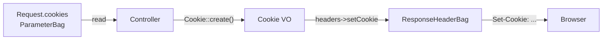

# Cookies

!!! tip "In a nutshell"
    Cookies are asymmetric: read from `$request->cookies`, write with
    `$response->headers->setCookie()` using the immutable `Cookie` object. Know the
    security defaults — `HttpOnly` is on, and `SameSite=None` is rejected unless
    `Secure` is true.

!!! example "Real-world analogy"
    A cookie works like a coat-check ticket. When you drop off your coat, the
    attendant writes a stub and hands it to you (the server's `Set-Cookie` on the
    response); on your next visit you present that same stub and they read it (the
    browser sending it back in the request). That is the asymmetry: you never write
    on a stub you're handing back, and a stub you're given now only helps on a later
    visit — never the same trip. And just as a good cloakroom won't accept a ticket
    with no security markings, browsers reject a `SameSite=None` ticket that isn't
    also stamped `Secure`.

!!! abstract "Learning objectives"
    By the end of this chapter you can:

    - [ ] Read incoming cookies from the `Request`.
    - [ ] Set and clear cookies on a `Response` using the `Cookie` value object.
    - [ ] Configure `SameSite`, `Secure`, `HttpOnly`, path, domain, and expiry safely.

    **Syllabus:** `Controllers → Cookies` ·
    **Level:** Advanced ·
    **Est. time:** 12 min ·
    **Prerequisites:** [The Response](response.md), [Web Security](../php-web-security/web-security.md)

---

## Theory

Cookies are asymmetric: you **read** them from the request and **write** them on
the response.

- **Read:** `$request->cookies` is a `ParameterBag` (`get()`, `has()`, `all()`).
- **Write:** build a `Symfony\Component\HttpFoundation\Cookie` and add it to the
  response header bag: `$response->headers->setCookie($cookie)`.
- **Delete:** `$response->headers->clearCookie('name')` sends an expired cookie.

```php
// Read — Request side, a ParameterBag
$theme = $request->cookies->get('theme', 'light');
$hasConsent = $request->cookies->has('consent');
$all = $request->cookies->all();

// Write — Response side
$response->headers->setCookie(Cookie::create('theme', 'dark'));

// Delete — sends an expired cookie to the browser
$response->headers->clearCookie('theme');
```

!!! question "Predict first"
    You set a cookie with `SameSite=None` but leave `Secure` at its default. Does a
    modern browser store it?

??? note "Reveal"
    No — browsers **reject** a `SameSite=None` cookie that is not also `Secure`.
    Remember the asymmetry too: you read from `$request->cookies` but write via
    `$response->headers->setCookie()`.

## Deep Dive — how it works internally

A `Response`'s cookies live in `Symfony\Component\HttpFoundation\ResponseHeaderBag`,
which keeps them separate from ordinary headers and emits one `Set-Cookie` line
per cookie when the response is sent. `Cookie::create()` is the fluent factory;
its constructor validates the name and captures every attribute.

```php
// Cookie::create() — fluent factory; each with*() returns a NEW immutable Cookie
$cookie = Cookie::create('consent')
    ->withValue('yes')
    ->withExpires(new \DateTimeImmutable('+1 year'))
    ->withPath('/')
    ->withSecure(true)
    ->withHttpOnly(true)
    ->withSameSite(Cookie::SAMESITE_STRICT);

$response->headers->setCookie($cookie); // ResponseHeaderBag emits one Set-Cookie line
```

Key `Cookie` attributes and their secure defaults in Symfony 8:

| Attribute | Default | Meaning |
|---|---|---|
| `expire` | `0` (session) | Unix ts / `DateTimeInterface` / seconds |
| `path` | `/` | URL scope |
| `domain` | `null` | Host scope |
| `secure` | `null` (auto) | HTTPS-only when framework auto-detects |
| `httpOnly` | `true` | Hidden from JavaScript |
| `sameSite` | `'lax'` | CSRF mitigation (`lax`/`strict`/`none`) |



`sameSite='none'` **requires** `secure=true` or modern browsers reject the
cookie. `httpOnly=true` blocks `document.cookie` access, mitigating XSS token
theft. These are security-critical defaults the exam expects you to know.

```php
// SameSite=None is only accepted together with Secure=true
$crossSite = Cookie::create('tracker', '1')
    ->withSameSite(Cookie::SAMESITE_NONE)
    ->withSecure(true); // mandatory here — otherwise the browser drops the cookie

// httpOnly defaults to true (hidden from document.cookie); opt out explicitly
$jsReadable = Cookie::create('ui_state', 'open')->withHttpOnly(false);
```

!!! note "Source reference"
    `Symfony\Component\HttpFoundation\Cookie` —
    [symfony/symfony `8.0`](https://github.com/symfony/symfony/blob/8.0/src/Symfony/Component/HttpFoundation/Cookie.php).

Cookies are **not** encrypted and are visible/editable by the client — never
store trust-sensitive data in a plain cookie; use the [session](session.md) for
server-side state.

## Configuration & code

=== "Set & read"

    ```php
    <?php
    declare(strict_types=1);

    namespace App\Controller;

    use Symfony\Bundle\FrameworkBundle\Controller\AbstractController;
    use Symfony\Component\HttpFoundation\Cookie;
    use Symfony\Component\HttpFoundation\Request;
    use Symfony\Component\HttpFoundation\Response;
    use Symfony\Component\Routing\Attribute\Route;

    final class PreferencesController extends AbstractController
    {
        #[Route('/prefs', name: 'prefs')]
        public function __invoke(Request $request): Response
        {
            $theme = $request->cookies->get('theme', 'light'); // read

            $response = $this->render('prefs.html.twig', ['theme' => $theme]);

            $cookie = Cookie::create('theme')
                ->withValue('dark')
                ->withExpires(new \DateTimeImmutable('+30 days'))
                ->withSecure(true)
                ->withHttpOnly(true)
                ->withSameSite(Cookie::SAMESITE_LAX);

            $response->headers->setCookie($cookie);      // write
            return $response;
        }
    }
    ```

=== "Delete"

    ```php
    <?php
    declare(strict_types=1);

    // Inside an action returning $response:
    $response->headers->clearCookie('theme', path: '/', domain: null);
    ```

## Best practices & anti-patterns

| ✅ Do | ❌ Avoid |
|---|---|
| `HttpOnly` + `Secure` + `SameSite` on sensitive cookies | Default-open cookies with secrets |
| Store only non-sensitive prefs client-side | Storing auth/trust data in a plain cookie |
| Match `path`/`domain` when clearing | `clearCookie('x')` with mismatched path (won't delete) |
| Use the `Cookie` VO / `with*` immutables | Hand-writing `Set-Cookie` header strings |

## When (not) to use it / alternatives

- **Use cookies** for small, non-secret client preferences (theme, locale hint).
- **Use the session** for anything server-authoritative (user identity, cart).
- Signed/encrypted state is better handled by the session store or a JWT, not raw
  cookies.

!!! danger "Certification traps"
    - `SameSite=None` is **rejected unless `Secure=true`** — a very common trap.
    - `clearCookie()` must use the **same `path` and `domain`** as when set, or the
      browser keeps the cookie.
    - Response cookies live in `ResponseHeaderBag`, set via `headers->setCookie()`,
      **not** `headers->set('Set-Cookie', ...)`.
    - `httpOnly` defaults to **`true`** in Symfony's `Cookie` — good for security,
      but JS-readable cookies must opt out explicitly.

!!! warning "Common mistakes"
    - Reading a cookie from `$request->headers` instead of `$request->cookies`.
    - Expecting a newly set cookie to be readable on the *same* request — it is
      only available on subsequent requests.

## Exercises

1. **(Basic)** Read a `locale` cookie (default `en`) and set it to `fr` for 1 year
   with secure, httpOnly, SameSite=Lax.
2. **(Intermediate)** Delete a `session_hint` cookie that was set on path `/app`.

??? success "Solutions"

    **1.**
    ```php
    $locale = $request->cookies->get('locale', 'en');
    $response->headers->setCookie(
        Cookie::create('locale', 'fr', new \DateTimeImmutable('+1 year'))
            ->withSecure(true)->withHttpOnly(true)->withSameSite(Cookie::SAMESITE_LAX)
    );
    ```

    **2.**
    ```php
    $response->headers->clearCookie('session_hint', '/app');
    ```
    The path must match the original `/app` scope.

## Certification questions

??? question "Q1. Where are incoming cookies read from?"
    - [x] A. `$request->cookies` ✅
    - [ ] B. `$request->headers`
    - [ ] C. `$request->query`
    - [ ] D. `$_SESSION`

    **Why:** the `cookies` `ParameterBag` wraps `$_COOKIE`. **Ref:** [http_foundation](https://symfony.com/doc/8.0/components/http_foundation.html).

??? question "Q2. A cookie with `SameSite=None` also requires…"
    - [ ] A. `HttpOnly=false`
    - [x] B. `Secure=true` ✅
    - [ ] C. a domain attribute
    - [ ] D. a max-age of 0

    **Why:** browsers reject `SameSite=None` cookies that are not `Secure`.
    **Ref:** [cookies](https://symfony.com/doc/8.0/components/http_foundation.html#setting-cookies).

??? question "Q3. Why might `clearCookie('token')` fail to remove the cookie?"
    - [x] A. The path/domain don't match the original cookie. ✅
    - [ ] B. `clearCookie` only works on HTTPS.
    - [ ] C. Cookies cannot be deleted server-side.
    - [ ] D. It requires the value to match too.

    **Why:** deletion sends an expired cookie scoped by path/domain; a mismatch
    targets a different cookie. **Ref:** [http_foundation](https://symfony.com/doc/8.0/components/http_foundation.html).

## Key takeaways

- Read from `$request->cookies`; write with `$response->headers->setCookie()`.
- Use the immutable `Cookie` value object and its `with*()` methods.
- Secure defaults: `HttpOnly=true`, `SameSite=lax`; `None` needs `Secure`.
- Deleting requires matching path/domain; cookies are client-visible — no secrets.

## Last-minute revision

!!! tip "Cheat sheet"
    - Read: `$request->cookies->get('x')`.
    - Set: `Cookie::create('x','v')->withSecure(true)->withHttpOnly(true)`;
      `$response->headers->setCookie($c)`.
    - Delete: `$response->headers->clearCookie('x', path, domain)`.
    - `SameSite=None` ⇒ must be `Secure`.

## Connections

- **Depends on:** [The Response](response.md) — cookies are written onto the response's header bag.
- **Reused in:** [The Session](session.md) — the session id itself is carried in a cookie.
- **Confused with:** [HTTP → Cookies](../http/cookies.md) — this is the controller-side read/write; the HTTP chapter covers the protocol.

## Official References
- [Official Symfony docs — Setting cookies](https://symfony.com/doc/8.0/components/http_foundation.html#setting-cookies)
- [Symfony source — Cookie](https://github.com/symfony/symfony/blob/8.0/src/Symfony/Component/HttpFoundation/Cookie.php)

## Video references

!!! tip "Watch & learn"
    These are official, continuously-updated video channels — search them for
    "Symfony controllers" to reinforce this chapter. We link stable channels rather than
    individual videos so the references never rot.

    - [SymfonyCasts screencasts](https://symfonycasts.com/tracks/symfony) — scripted, code-along tutorials.
    - [Symfony official YouTube](https://www.youtube.com/@SymfonyOfficial) — SymfonyCon conference talks & keynotes.
    - [Official docs for this topic](https://symfony.com/doc/8.0/components/http_foundation.html) — some Symfony doc pages embed a screencast.

## Confidence check

I'm ready when I can:

- [ ] explain **why** cookie access is read/write asymmetric and never holds secrets
- [ ] set, read, and clear a cookie with the immutable `Cookie` value object in Symfony 8
- [ ] debug a `clearCookie()` that fails because path/domain don't match
- [ ] spot that `SameSite=None` requires `Secure=true`
- [ ] explain how `ResponseHeaderBag` emits one `Set-Cookie` per cookie

---

<small>Related: [The Response](response.md) · [The Session](session.md) · [Web Security](../php-web-security/web-security.md)</small>
