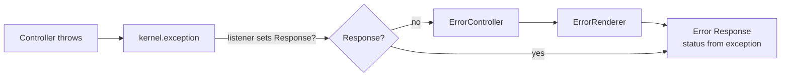

# 404 & Error Pages

!!! tip "In a nutshell"
    Pour renvoyer une erreur HTTP, on **lance** (`throw`) une exception, on ne
    construit pas une `Response`. `HttpExceptionInterface` détermine le statut (tout
    le reste devient 500). Piège d'examen : `createNotFoundException()` ne fait que
    *retourner* le 404 — vous devez le `throw`.

!!! example "Real-world analogy"
    Quand un visiteur demande quelqu'un qui n'est pas dans l'immeuble, la
    **réceptionniste** n'invente pas de réponse — elle lève un drapeau (`throw`) et
    le bureau des incidents de l'immeuble (le kernel) émet l'avis officiel
    « introuvable » sur papier à en-tête (la page d'erreur avec le bon statut). Votre
    rôle est de lever le drapeau avec la bonne étiquette ; produire l'avis officiel
    est le travail de quelqu'un d'autre.

!!! abstract "Learning objectives"
    À la fin de ce chapitre, vous saurez :

    - [ ] Déclencher un 404 avec `createNotFoundException()` et lancer d'autres `HttpException`.
    - [ ] Expliquer comment le kernel transforme une exception en `Response` d'erreur.
    - [ ] Personnaliser les templates d'erreur et surcharger l'error controller.

    **Syllabus:** `Controllers → Generating 404 / error pages` ·
    **Level:** Advanced → Expert ·
    **Est. time:** 15 min ·
    **Prerequisites:** [The Response](response.md), [Architecture → Events](../architecture/index.md)

---

## Theory

Pour produire une erreur HTTP, vous **lancez une exception** ; vous ne construisez
pas une `Response` 404 à la main. Symfony mappe les exceptions implémentant
`Symfony\Component\HttpKernel\Exception\HttpExceptionInterface` vers leur code de
statut.

| Helper / exception | Statut |
|---|---|
| `createNotFoundException()` → `NotFoundHttpException` | 404 |
| `createAccessDeniedException()` → `AccessDeniedException` | 403 |
| `new BadRequestHttpException()` | 400 |
| `new ConflictHttpException()` | 409 |
| `new HttpException(503, '...')` | n'importe lequel |

Une simple `\Exception` devient **500**.

```php
// Throw — don't return — to produce the status code
throw $this->createNotFoundException('Product not found.');   // 404
throw $this->createAccessDeniedException('Owners only.');     // 403
throw new BadRequestHttpException('Malformed payload.');      // 400
throw new ConflictHttpException('Already processed.');        // 409
throw new HttpException(503, 'Maintenance in progress.');     // any status
throw new \RuntimeException('Boom');                          // no HttpExceptionInterface → 500
```

!!! question "Predict first"
    Vous écrivez `$this->createNotFoundException('Nope');` sur sa propre ligne et
    continuez. Le visiteur reçoit-il un 404 ?

??? note "Reveal"
    Non. `createNotFoundException()` ne fait que **construire et retourner**
    l'exception — vous devez la `throw`. Sans `throw`, l'action continue avec une
    entité `null` et plante plus loin. Le kernel ne transforme en statut qu'une
    `HttpExceptionInterface` *lancée*.

## Deep Dive — how it works internally

Quand un controller lance une exception, le kernel l'attrape et dispatche un
`Symfony\Component\HttpKernel\Event\ExceptionEvent` (`kernel.exception`). Les
listeners peuvent définir une `Response` ; si aucun ne le fait, l'`ErrorListener`
du framework forwarde vers l'**error controller** (`error_controller`, par défaut
`Symfony\Component\HttpKernel\Controller\ErrorController`), qui rend une page
d'erreur via `Symfony\Bundle\TwigBundle\ErrorRenderer\...` / l'`ErrorRendererInterface`.

```php
// A kernel.exception listener may short-circuit the ErrorController
#[AsEventListener]
final class ApiExceptionListener
{
    public function __invoke(ExceptionEvent $event): void
    {
        $e = $event->getThrowable();
        // setting a Response stops the fallback to error_controller
        $event->setResponse(new JsonResponse(['error' => $e->getMessage()], 500));
    }
}
```



- Le code de statut provient de `HttpExceptionInterface::getStatusCode()` ; les
  en-têtes de `getHeaders()` (par exemple `Retry-After` sur un 503, `Allow` sur un 405).
- En `dev`, vous obtenez la page d'exception détaillée (stack trace) ; en `prod`,
  le template d'erreur propre pour ce statut.
- `FlattenException` normalise l'exception lancée pour le rendu et les logs.

```php
// What the kernel reads from a thrown HttpExceptionInterface
$e = new MethodNotAllowedHttpException(['POST'], 'Use POST.');
$e->getStatusCode(); // 405 → becomes the response status
$e->getHeaders();    // ['Allow' => 'POST'] → merged into the response headers

// Normalised copy used by the error renderer and logs
$flat = FlattenException::createFromThrowable($e);
$flat->getStatusCode(); // 405
```

!!! note "Source reference"
    `Symfony\Component\HttpKernel\Exception\NotFoundHttpException` et
    `ErrorListener` —
    [symfony/symfony `8.0`](https://github.com/symfony/symfony/blob/8.0/src/Symfony/Component/HttpKernel/EventListener/ErrorListener.php).

### Customizing error pages

**Templates (simple) :** créez `templates/bundles/TwigBundle/Exception/error404.html.twig`
(ou `error.html.twig` comme fallback). Ils sont utilisés en `prod`. Pour les
prévisualiser, ouvrez `/_error/404` en `dev` (via la route de test du framework) ou
ajustez l'environnement.

**Error controller (contrôle total) :** pointez `framework.error_controller` vers
votre propre controller pour maîtriser entièrement le rendu des erreurs (logging,
négociation de contenu, JSON vs HTML).

### Null behavior

Un 404 commence presque toujours par un `null` : une recherche comme
`$repo->findOneBySlug($slug)` retourne `null` quand rien ne correspond, et c'est
*cette* absence qui est votre signal pour lever un 404. La subtilité, c'est ce que
`createNotFoundException()` fait lui-même du `null` — rien. Il ne fait que
**construire et retourner** une `NotFoundHttpException` ; il n'inspecte pas votre
valeur, ne voit pas le `null` et n'interrompt pas l'action. Seul `throw` termine la
request.

Le garde piloté par le null se lit donc proprement avec l'expression throw :

```php
$article = $repo->findOneBySlug($slug)
    ?? throw $this->createNotFoundException(\sprintf('No article "%s".', $slug));
```

Le bug récurrent consiste à écrire `$this->createNotFoundException(...)` sur sa
propre ligne sans `throw` : l'exception est créée, jetée, et l'action continue avec
une entité `null` — menant à un fatal « member function on null » quelques lignes
plus loin, au lieu d'un 404 propre.

!!! note "Null in real life"
    `null`, c'est le livreur qui arrive à une adresse et ne trouve aucun colis : il
    ne devine pas de remplacement, il remplit le bordereau officiel « introuvable » —
    qui ne compte que lorsqu'il le dépose réellement (`throw`), pas quand il se
    contente de le remplir.

## Configuration & code

=== "Throwing errors"

    ```php
    <?php
    declare(strict_types=1);

    namespace App\Controller;

    use Symfony\Bundle\FrameworkBundle\Controller\AbstractController;
    use Symfony\Component\HttpFoundation\Response;
    use Symfony\Component\HttpKernel\Exception\ConflictHttpException;
    use Symfony\Component\Routing\Attribute\Route;

    final class ArticleController extends AbstractController
    {
        #[Route('/articles/{slug}', name: 'article_show')]
        public function show(string $slug, ArticleRepository $repo): Response
        {
            $article = $repo->findOneBySlug($slug);
            if (null === $article) {
                throw $this->createNotFoundException(\sprintf('No article "%s".', $slug));
            }
            if ($article->isLocked()) {
                throw new ConflictHttpException('Article is locked.');
            }

            return $this->render('article/show.html.twig', ['article' => $article]);
        }
    }
    ```

=== "Custom error controller"

    ```yaml
    # config/packages/framework.yaml
    framework:
        error_controller: App\Controller\ErrorController::show
    ```

    ```php
    <?php
    declare(strict_types=1);

    namespace App\Controller;

    use Symfony\Component\ErrorHandler\Exception\FlattenException;
    use Symfony\Component\HttpFoundation\JsonResponse;
    use Symfony\Component\HttpFoundation\Request;
    use Symfony\Component\HttpFoundation\Response;

    final class ErrorController
    {
        public function show(Request $request, FlattenException $exception): Response
        {
            return new JsonResponse(
                ['error' => $exception->getStatusText()],
                $exception->getStatusCode(),
            );
        }
    }
    ```

=== "Override template"

    ```twig
    {# templates/bundles/TwigBundle/Exception/error404.html.twig #}
    
    <h1>Page not found</h1>
    ```

## Best practices & anti-patterns

| ✅ Do | ❌ Avoid |
|---|---|
| `throw $this->createNotFoundException()` | Retourner `new Response('', 404)` |
| Utiliser les sous-classes spécifiques de `HttpException` | Lancer une `\Exception` nue pour un 400 |
| Surcharger `error404.html.twig` pour la charte graphique | Modifier les templates vendor |
| Un error controller custom pour les erreurs JSON d'API | Tester les codes de statut dans chaque action |

## When (not) to use it / alternatives

- **`createNotFoundException()`** — ressource manquante.
- **`createAccessDeniedException()`** — échec d'autorisation (préférez
  `denyAccessUnlessGranted()`, qui la lance pour vous).
- **Error controller custom** — quand vous avez besoin de négociation de contenu ou
  de payloads d'erreur structurés à l'échelle de l'application.
- Pour les erreurs de validation dans les API, un listener `kernel.exception`
  mappant les exceptions métier vers du problem+json est plus propre qu'une gestion
  par action.

!!! danger "Certification traps"
    - `createNotFoundException()` **retourne** l'exception — vous devez la `throw`.
      Elle n'interrompt pas l'action par elle-même.
    - Le code de statut dérive de `HttpExceptionInterface::getStatusCode()` ; une
      exception non-Http donne un **500**.
    - Les templates d'erreur vivent sous
      `templates/bundles/TwigBundle/Exception/errorXXX.html.twig` et s'appliquent en
      **prod** ; le `dev` affiche la page de debug.
    - `AccessDeniedException` devient **403** seulement si l'utilisateur est
      authentifié ; sinon, l'entry point peut la transformer en redirection vers le
      login (security).

!!! warning "Common mistakes"
    - Écrire `$this->createNotFoundException(...)` sans `throw`.
    - S'attendre à voir le `error404.html.twig` custom en `dev` — il s'affiche en prod.

## Exercises

1. **(Basic)** Dans une action show, lancez un 404 quand l'entité est introuvable,
   avec un message utile.
2. **(Expert)** Ajoutez un listener `kernel.exception` qui retourne du problem+json
   pour toute `HttpExceptionInterface` quand le client accepte le JSON.

??? success "Solutions"

    **1.**
    ```php
    $product ?? throw $this->createNotFoundException('Product not found.');
    ```

    **2.** Créez un listener `#[AsEventListener(event: ExceptionEvent::class)]` ;
    vérifiez `$request->getPreferredFormat() === 'json'`, lisez
    `$e = $event->getThrowable()`, et si `$e instanceof HttpExceptionInterface`,
    appelez `$event->setResponse(new JsonResponse([...], $e->getStatusCode()))`.

## Certification questions

??? question "Q1. How do you produce a 404 from a controller?"
    - [ ] A. `return new Response('', 404);`
    - [x] B. `throw $this->createNotFoundException();` ✅
    - [ ] C. `return $this->notFound();`
    - [ ] D. `abort(404);`

    **Why:** lancer une `NotFoundHttpException` laisse le kernel rendre la page d'erreur.
    **Ref:** [errors](https://symfony.com/doc/current/controller.html#managing-errors-and-404-pages).

??? question "Q2. A controller throws a plain `\RuntimeException`. Status code?"
    - [ ] A. 400
    - [ ] B. 404
    - [x] C. 500 ✅
    - [ ] D. 200

    **Why:** seule `HttpExceptionInterface` définit un statut ; les autres donnent un 500.
    **Ref:** [error pages](https://symfony.com/doc/current/controller/error_pages.html).

??? question "Q3. Where do you put a custom prod 404 page?"
    - [x] A. `templates/bundles/TwigBundle/Exception/error404.html.twig` ✅
    - [ ] B. `templates/errors/404.php`
    - [ ] C. `public/404.html`
    - [ ] D. `config/errors.yaml`

    **Why:** l'error renderer Twig recherche les templates par statut à cet endroit.
    **Ref:** [customize error pages](https://symfony.com/doc/current/controller/error_pages.html).

??? question "Q4. Which event lets you convert an exception into a Response?"
    - [x] A. `kernel.exception` (`ExceptionEvent`) ✅
    - [ ] B. `kernel.view`
    - [ ] C. `kernel.terminate`
    - [ ] D. `kernel.controller`

    **Why:** les listeners de `ExceptionEvent` peuvent appeler `setResponse()`. **Ref:** [kernel events](https://symfony.com/doc/current/reference/events.html#kernel-exception).

## Key takeaways

- Lancez des exceptions ; le kernel mappe `HttpExceptionInterface` vers les codes de statut.
- `createNotFoundException()` retourne une exception — pensez au `throw`.
- `kernel.exception` → error controller → error renderer produit la page.
- Surchargez `errorXXX.html.twig` (prod) ou l'error controller pour un contrôle total.

## Last-minute revision

!!! tip "Cheat sheet"
    - `throw $this->createNotFoundException()` → 404.
    - `denyAccessUnlessGranted()` → 403 via `AccessDeniedException`.
    - Exception non-Http → 500. Statut issu de `getStatusCode()`.
    - Templates prod : `templates/bundles/TwigBundle/Exception/errorXXX.html.twig`.

## Connections

- **Depends on:** [Architecture → Exception handling](../architecture/exception-handling.md) — `kernel.exception` → error controller, là où un throw devient une page.
- **Reused in:** [The Response](response.md) — l'error renderer produit au final une `Response`.
- **Confused with:** [AbstractController](abstract-controller.md) — `createNotFoundException()` retourne une exception ; elle n'interrompt rien par elle-même.

## Official References
- [Official Symfony docs — Errors & 404 pages](https://symfony.com/doc/current/controller/error_pages.html)
- [Symfony source — ErrorListener](https://github.com/symfony/symfony/blob/8.0/src/Symfony/Component/HttpKernel/EventListener/ErrorListener.php)

## Video references

!!! tip "Watch & learn"
    Ce sont des chaînes vidéo officielles et continuellement mises à jour — cherchez-y
    « Symfony controllers » pour consolider ce chapitre. Nous lions des chaînes stables
    plutôt que des vidéos individuelles afin que les références ne périment jamais.

    - [SymfonyCasts screencasts](https://symfonycasts.com/tracks/symfony) — tutoriels scénarisés à suivre en codant.
    - [Symfony official YouTube](https://www.youtube.com/@SymfonyOfficial) — conférences et keynotes de SymfonyCon.
    - [Official docs for this topic](https://symfony.com/doc/current/controller.html#managing-errors-and-404-pages) — certaines pages de la doc Symfony intègrent un screencast.

## Confidence check

Je suis prêt quand je peux :

- [ ] expliquer **pourquoi** on lance une exception au lieu de construire une `Response` 404
- [ ] lancer la bonne sous-classe de `HttpException` pour 400/403/404/409 dans Symfony 8
- [ ] déboguer un 404 manquant causé par un `throw` oublié
- [ ] repérer qu'une exception non-`HttpExceptionInterface` devient un 500
- [ ] expliquer le flux `kernel.exception` → `ErrorController` → `ErrorRenderer`

---

<small>Related: [The Response](response.md) · [Internal Redirects](internal-redirects.md) · [Architecture](../architecture/index.md) · [Security](../security/index.md)</small>
