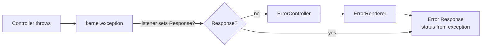

# 404 & Error Pages

!!! tip "In a nutshell"
    To return an HTTP error you **throw** an exception, not build a `Response`.
    `HttpExceptionInterface` sets the status (anything else is 500). Exam hook:
    `createNotFoundException()` only *returns* the 404 — you must `throw` it.

!!! example "Real-world analogy"
    When a visitor asks for someone who isn't in the building, the **receptionist**
    doesn't invent an answer — they raise a flag (`throw`) and the building's error
    desk (the kernel) issues the official "not found" notice on headed paper (the
    error page with the right status). Your job is to raise the flag with the right
    label; rendering the formal notice is someone else's.

!!! abstract "Learning objectives"
    By the end of this chapter you can:

    - [ ] Trigger a 404 with `createNotFoundException()` and throw other `HttpException`s.
    - [ ] Explain how the kernel turns an exception into an error `Response`.
    - [ ] Customize error templates and override the error controller.

    **Syllabus:** `Controllers → Generating 404 / error pages` ·
    **Level:** Advanced → Expert ·
    **Est. time:** 15 min ·
    **Prerequisites:** [The Response](response.md), [Architecture → Events](../architecture/index.md)

---

## Theory

To produce an HTTP error you **throw an exception**; you do not build a 404
`Response` by hand. Symfony maps exceptions implementing
`Symfony\Component\HttpKernel\Exception\HttpExceptionInterface` to their status
code.

| Helper / exception | Status |
|---|---|
| `createNotFoundException()` → `NotFoundHttpException` | 404 |
| `createAccessDeniedException()` → `AccessDeniedException` | 403 |
| `new BadRequestHttpException()` | 400 |
| `new ConflictHttpException()` | 409 |
| `new HttpException(503, '...')` | any |

A plain `\Exception` becomes **500**.

```php
// Throw — don't return — to produce the status code
throw $this->createNotFoundException('Product not found.');   // 404
throw $this->createAccessDeniedException('Owners only.');     // 403
throw new BadRequestHttpException('Malformed payload.');      // 400
throw new ConflictHttpException('Already processed.');        // 409
throw new HttpException(503, 'Maintenance in progress.');     // any status
throw new \RuntimeException('Boom');                          // no HttpExceptionInterface → 500
```

!!! question "Predict first"
    You write `$this->createNotFoundException('Nope');` on its own line and keep
    going. Does the visitor get a 404?

??? note "Reveal"
    No. `createNotFoundException()` only **builds and returns** the exception — you
    must `throw` it. Without `throw`, the action runs on with a `null` entity and
    fatals later. The kernel turns a *thrown* `HttpExceptionInterface` into the status.

## Deep Dive — how it works internally

When a controller throws, the kernel catches it and dispatches a
`Symfony\Component\HttpKernel\Event\ExceptionEvent` (`kernel.exception`). Listeners
may set a `Response`; if none does, the framework's `ErrorListener` forwards to
the **error controller** (`error_controller`, default
`Symfony\Component\HttpKernel\Controller\ErrorController`), which renders an error
page via `Symfony\Bundle\TwigBundle\ErrorRenderer\...` / the
`ErrorRendererInterface`.

```php
// A kernel.exception listener may short-circuit the ErrorController
#[AsEventListener]
final class ApiExceptionListener
{
    public function __invoke(ExceptionEvent $event): void
    {
        $e = $event->getThrowable();
        // setting a Response stops the fallback to error_controller
        $event->setResponse(new JsonResponse(['error' => $e->getMessage()], 500));
    }
}
```



- The status code comes from `HttpExceptionInterface::getStatusCode()`; headers
  from `getHeaders()` (e.g. `Retry-After` on 503, `Allow` on 405).
- In `dev`, you get the rich exception page (stack trace); in `prod`, the clean
  error template for that status.
- `FlattenException` normalises the thrown exception for rendering/logging.

```php
// What the kernel reads from a thrown HttpExceptionInterface
$e = new MethodNotAllowedHttpException(['POST'], 'Use POST.');
$e->getStatusCode(); // 405 → becomes the response status
$e->getHeaders();    // ['Allow' => 'POST'] → merged into the response headers

// Normalised copy used by the error renderer and logs
$flat = FlattenException::createFromThrowable($e);
$flat->getStatusCode(); // 405
```

!!! note "Source reference"
    `Symfony\Component\HttpKernel\Exception\NotFoundHttpException` and
    `ErrorListener` —
    [symfony/symfony `8.0`](https://github.com/symfony/symfony/blob/8.0/src/Symfony/Component/HttpKernel/EventListener/ErrorListener.php).

### Customizing error pages

**Templates (simple):** create `templates/bundles/TwigBundle/Exception/error404.html.twig`
(or `error.html.twig` as fallback). These are used in `prod`. To preview them,
browse `/_error/404` in `dev` (via the framework's test route) or set the env.

**Error controller (full control):** point `framework.error_controller` at your
own controller to fully own error rendering (logging, content negotiation, JSON
vs HTML).

### Null behavior

A 404 almost always begins with a `null`: a lookup like
`$repo->findOneBySlug($slug)` returns `null` when nothing matches, and *that*
absence is your cue to raise a 404. The subtle part is what
`createNotFoundException()` itself does with `null` — nothing. It merely
**builds and returns** a `NotFoundHttpException`; it does not inspect your value,
does not see the `null`, and does not abort the action. Only `throw` ends the
request.

So the null-driven guard reads cleanly with the throw expression:

```php
$article = $repo->findOneBySlug($slug)
    ?? throw $this->createNotFoundException(\sprintf('No article "%s".', $slug));
```

The recurring bug is writing `$this->createNotFoundException(...)` on its own
line without `throw`: the exception is created, discarded, and the action keeps
running with a `null` entity — leading to a "member function on null" fatal a few
lines later, not a clean 404.

!!! note "Null in real life"
    `null` is the courier arriving at an address and finding no package: they don't
    guess a replacement, they file the official "not found" slip — which only
    counts once they actually file it (`throw`), not merely fill it in.

## Configuration & code

=== "Throwing errors"

    ```php
    <?php
    declare(strict_types=1);

    namespace App\Controller;

    use Symfony\Bundle\FrameworkBundle\Controller\AbstractController;
    use Symfony\Component\HttpFoundation\Response;
    use Symfony\Component\HttpKernel\Exception\ConflictHttpException;
    use Symfony\Component\Routing\Attribute\Route;

    final class ArticleController extends AbstractController
    {
        #[Route('/articles/{slug}', name: 'article_show')]
        public function show(string $slug, ArticleRepository $repo): Response
        {
            $article = $repo->findOneBySlug($slug);
            if (null === $article) {
                throw $this->createNotFoundException(\sprintf('No article "%s".', $slug));
            }
            if ($article->isLocked()) {
                throw new ConflictHttpException('Article is locked.');
            }

            return $this->render('article/show.html.twig', ['article' => $article]);
        }
    }
    ```

=== "Custom error controller"

    ```yaml
    # config/packages/framework.yaml
    framework:
        error_controller: App\Controller\ErrorController::show
    ```

    ```php
    <?php
    declare(strict_types=1);

    namespace App\Controller;

    use Symfony\Component\ErrorHandler\Exception\FlattenException;
    use Symfony\Component\HttpFoundation\JsonResponse;
    use Symfony\Component\HttpFoundation\Request;
    use Symfony\Component\HttpFoundation\Response;

    final class ErrorController
    {
        public function show(Request $request, FlattenException $exception): Response
        {
            return new JsonResponse(
                ['error' => $exception->getStatusText()],
                $exception->getStatusCode(),
            );
        }
    }
    ```

=== "Override template"

    ```twig
    {# templates/bundles/TwigBundle/Exception/error404.html.twig #}
    
    <h1>Page not found</h1>
    ```

## Best practices & anti-patterns

| ✅ Do | ❌ Avoid |
|---|---|
| `throw $this->createNotFoundException()` | Returning `new Response('', 404)` |
| Use specific `HttpException` subclasses | Throwing bare `\Exception` for a 400 |
| Override `error404.html.twig` for branding | Editing vendor templates |
| Custom error controller for API JSON errors | Sniffing status codes in every action |

## When (not) to use it / alternatives

- **`createNotFoundException()`** — resource missing.
- **`createAccessDeniedException()`** — authorization failure (prefer
  `denyAccessUnlessGranted()` which throws it for you).
- **Custom error controller** — when you need content negotiation or structured
  error payloads across the whole app.
- For validation errors in APIs, a `kernel.exception` listener mapping domain
  exceptions to problem+json is cleaner than per-action handling.

!!! danger "Certification traps"
    - `createNotFoundException()` **returns** the exception — you must `throw` it.
      It does not itself abort the action.
    - The status code is derived from `HttpExceptionInterface::getStatusCode()`; a
      non-Http exception is a **500**.
    - Error templates live under
      `templates/bundles/TwigBundle/Exception/errorXXX.html.twig` and apply in
      **prod**; `dev` shows the debug page.
    - `AccessDeniedException` becomes **403** only if the user is authenticated;
      the entry point may turn it into a redirect to login otherwise (security).

!!! warning "Common mistakes"
    - Writing `$this->createNotFoundException(...)` without `throw`.
    - Expecting the custom `error404.html.twig` to show in `dev` — it shows in prod.

## Exercises

1. **(Basic)** In a show action, throw a 404 when the entity is not found, with a
   helpful message.
2. **(Expert)** Add a `kernel.exception` listener that returns problem+json for
   any `HttpExceptionInterface` when the client accepts JSON.

??? success "Solutions"

    **1.**
    ```php
    $product ?? throw $this->createNotFoundException('Product not found.');
    ```

    **2.** Create an `#[AsEventListener(event: ExceptionEvent::class)]` listener;
    check `$request->getPreferredFormat() === 'json'`, read
    `$e = $event->getThrowable()`, and if `$e instanceof HttpExceptionInterface`
    call `$event->setResponse(new JsonResponse([...], $e->getStatusCode()))`.

## Certification questions

??? question "Q1. How do you produce a 404 from a controller?"
    - [ ] A. `return new Response('', 404);`
    - [x] B. `throw $this->createNotFoundException();` ✅
    - [ ] C. `return $this->notFound();`
    - [ ] D. `abort(404);`

    **Why:** throwing `NotFoundHttpException` lets the kernel render the error page.
    **Ref:** [errors](https://symfony.com/doc/current/controller.html#managing-errors-and-404-pages).

??? question "Q2. A controller throws a plain `\RuntimeException`. Status code?"
    - [ ] A. 400
    - [ ] B. 404
    - [x] C. 500 ✅
    - [ ] D. 200

    **Why:** only `HttpExceptionInterface` sets a status; others are 500.
    **Ref:** [error pages](https://symfony.com/doc/current/controller/error_pages.html).

??? question "Q3. Where do you put a custom prod 404 page?"
    - [x] A. `templates/bundles/TwigBundle/Exception/error404.html.twig` ✅
    - [ ] B. `templates/errors/404.php`
    - [ ] C. `public/404.html`
    - [ ] D. `config/errors.yaml`

    **Why:** the Twig error renderer looks up per-status templates there.
    **Ref:** [customize error pages](https://symfony.com/doc/current/controller/error_pages.html).

??? question "Q4. Which event lets you convert an exception into a Response?"
    - [x] A. `kernel.exception` (`ExceptionEvent`) ✅
    - [ ] B. `kernel.view`
    - [ ] C. `kernel.terminate`
    - [ ] D. `kernel.controller`

    **Why:** `ExceptionEvent` listeners can `setResponse()`. **Ref:** [kernel events](https://symfony.com/doc/current/reference/events.html#kernel-exception).

## Key takeaways

- Throw exceptions; the kernel maps `HttpExceptionInterface` to status codes.
- `createNotFoundException()` returns an exception — remember to `throw`.
- `kernel.exception` → error controller → error renderer produces the page.
- Override `errorXXX.html.twig` (prod) or the error controller for full control.

## Last-minute revision

!!! tip "Cheat sheet"
    - `throw $this->createNotFoundException()` → 404.
    - `denyAccessUnlessGranted()` → 403 via `AccessDeniedException`.
    - Non-Http exception → 500. Status from `getStatusCode()`.
    - Prod templates: `templates/bundles/TwigBundle/Exception/errorXXX.html.twig`.

## Connections

- **Depends on:** [Architecture → Exception handling](../architecture/exception-handling.md) — `kernel.exception` → error controller is where a throw becomes a page.
- **Reused in:** [The Response](response.md) — the error renderer ultimately produces a `Response`.
- **Confused with:** [AbstractController](abstract-controller.md) — `createNotFoundException()` returns an exception; it does not abort by itself.

## Official References
- [Official Symfony docs — Errors & 404 pages](https://symfony.com/doc/current/controller/error_pages.html)
- [Symfony source — ErrorListener](https://github.com/symfony/symfony/blob/8.0/src/Symfony/Component/HttpKernel/EventListener/ErrorListener.php)

## Video references

!!! tip "Watch & learn"
    These are official, continuously-updated video channels — search them for
    "Symfony controllers" to reinforce this chapter. We link stable channels rather than
    individual videos so the references never rot.

    - [SymfonyCasts screencasts](https://symfonycasts.com/tracks/symfony) — scripted, code-along tutorials.
    - [Symfony official YouTube](https://www.youtube.com/@SymfonyOfficial) — SymfonyCon conference talks & keynotes.
    - [Official docs for this topic](https://symfony.com/doc/current/controller.html#managing-errors-and-404-pages) — some Symfony doc pages embed a screencast.

## Confidence check

I'm ready when I can:

- [ ] explain **why** you throw an exception instead of building a 404 `Response`
- [ ] throw the right `HttpException` subclass for 400/403/404/409 in Symfony 8
- [ ] debug a missing 404 caused by forgetting `throw`
- [ ] spot that a non-`HttpExceptionInterface` exception becomes a 500
- [ ] explain the `kernel.exception` → `ErrorController` → `ErrorRenderer` flow

---

<small>Related: [The Response](response.md) · [Internal Redirects](internal-redirects.md) · [Architecture](../architecture/index.md) · [Security](../security/index.md)</small>
