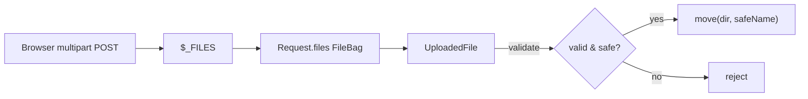

# Handling File Uploads

!!! tip "In a nutshell"
    Les uploads arrivent sous forme d'`UploadedFile` dans `$request->files` ;
    validez le `getMimeType()` détecté depuis le contenu (jamais le nom fourni par
    le client, falsifiable) et déplacez-les avec `move()` vers un stockage hors du
    web root. `#[MapUploadedFile]` lie et valide un upload directement dans un
    argument de controller.

!!! example "Real-world analogy"
    Gérer un upload, c'est comme la douane d'un aéroport qui inspecte un colis.
    L'étiquette d'expédition peut annoncer « livres » (le nom et le MIME envoyés
    par le client), mais l'agent se fie à la radiographie du contenu réel
    (`getMimeType()`), pas à l'autocollant. Ce n'est qu'après l'inspection que le
    colis est ré-étiqueté avec un nouveau numéro de référence et déplacé vers un
    entrepôt sécurisé en arrière-boutique — jamais laissé dans le hall d'arrivée
    public où n'importe qui pourrait l'ouvrir (le stockage hors du web root).

!!! abstract "Learning objectives"
    À la fin de ce chapitre, vous saurez :

    - [ ] Lire un `UploadedFile` depuis la request et le déplacer en toute sécurité.
    - [ ] Valider les uploads (taille, MIME, état d'erreur) avant de les persister.
    - [ ] Utiliser le value resolver `#[MapUploadedFile]` pour les uploads en argument de controller.

    **Syllabus:** `Controllers → File upload` ·
    **Level:** Advanced → Expert ·
    **Est. time:** 15 min ·
    **Prerequisites:** [The Request](request.md), [Web Security](../php-web-security/web-security.md)

---

## Theory

Un fichier uploadé arrive dans le bag `files` sous forme de
`Symfony\Component\HttpFoundation\File\UploadedFile`. Les étapes essentielles :

1. Le lire : `$request->files->get('avatar')`.
2. Le valider : extension/MIME, taille, et `->isValid()` / code d'erreur.
3. Le déplacer : `$file->move($targetDir, $newName)` vers le stockage permanent.

Ne faites jamais confiance au nom de fichier fourni par le client — générez un
nom sûr.

```php
// 1. Read: the upload comes from the "files" bag
$file = $request->files->get('avatar');            // ?UploadedFile

// 2. Validate: error state (and size/MIME) before anything else
if (null === $file || !$file->isValid()) {
    throw new BadRequestHttpException('Invalid upload.');
}

// 3. Move: never keep the client filename — generate a safe one
$newName = bin2hex(random_bytes(8)).'.'.$file->guessExtension();
$file->move($targetDir, $newName);
```

!!! question "Predict first"
    Pour décider si un upload est réellement un PDF, faites-vous confiance à
    `getClientMimeType()`, à l'extension du fichier, ou à `getMimeType()` ?

??? note "Reveal"
    `getMimeType()` — il est détecté à partir du **contenu** du fichier. Le nom,
    l'extension et le MIME fournis par le client sont tous falsifiables. Ensuite,
    déplacez le fichier avec `move()` vers un stockage hors du web root (la méthode
    lève une `FileException` en cas d'échec, elle ne retourne jamais un booléen).

## Deep Dive — how it works internally

`UploadedFile` étend `Symfony\Component\HttpFoundation\File\File` (lui-même un
`\SplFileInfo`). Il encapsule l'entrée `$_FILES` de PHP et ajoute :

- `getClientOriginalName()` / `getClientMimeType()` — **fournis par le client, falsifiables**.
- `getMimeType()` — détecté depuis le contenu via le guesser `MimeTypes` (fiez-vous à celui-ci).
- `getSize()`, `getError()` (un code `UPLOAD_ERR_*`), `isValid()`.
- `move($dir, $name)` — vérifie que le fichier temporaire a réellement été uploadé,
  puis le déplace ; lève une `FileException` en cas d'échec.
- `getClientOriginalExtension()` vs `guessExtension()` (depuis le vrai MIME).

```php
$file->getClientOriginalName();      // "report.pdf"  — client-supplied, spoofable
$file->getClientMimeType();          // claimed by the browser, spoofable
$file->getClientOriginalExtension(); // "pdf" — from the client name, spoofable

$file->getMimeType();                // "application/pdf" — MimeTypes guesser, content-based
$file->guessExtension();             // "pdf" — derived from the real MIME type
$file->getSize();                    // size in bytes
$file->getError();                   // UPLOAD_ERR_OK (0) or another UPLOAD_ERR_* code
$file->isValid();                    // true only for a successful upload

$file->move('/var/data/uploads', 'a1b2c3.pdf'); // throws FileException on failure
```



### Security & limits

- Les uploads sont bornés par les directives PHP `upload_max_filesize` et
  `post_max_size` ; les dépasser produit un code d'erreur (ou un bag `files`
  vide), pas une exception.
- Stockez les uploads **hors** du web root, ou avec l'exécution désactivée — un
  `.php` uploadé dans un répertoire servi équivaut à de l'exécution de code à distance.
- Assainissez le nom cible (par ex. slug + identifiant unique) ; utilisez
  `guessExtension()` issu du MIME détecté, pas l'extension du client.

```ini
; php.ini — PHP-level bounds, enforced before Symfony ever runs
upload_max_filesize = 2M   ; max size of a single uploaded file
post_max_size = 8M         ; max size of the whole POST body (fields + files)
```

!!! note "Source reference"
    `Symfony\Component\HttpFoundation\File\UploadedFile` —
    [symfony/symfony `8.0`](https://github.com/symfony/symfony/blob/8.0/src/Symfony/Component/HttpFoundation/File/UploadedFile.php).

### `#[MapUploadedFile]` (Symfony 8)

Le `RequestPayloadValueResolver` (le même value resolver ciblé qui se cache
derrière `#[MapRequestPayload]`/`#[MapQueryString]`) remplit directement un
argument de controller de type `UploadedFile` (ou un tableau d'`UploadedFile`),
et peut appliquer des constraints `File`/`Image` en ligne — en levant une
`HttpException` en cas d'échec de validation. Voir
[Value Resolvers](value-resolvers.md).

Pour les uploads pilotés par un form, utilisez le champ `FileType` — voir
[Forms → File Upload](../forms/file-upload.md).

## Configuration & code

=== "Manual (Request)"

    ```php
    <?php
    declare(strict_types=1);

    namespace App\Controller;

    use Symfony\Bundle\FrameworkBundle\Controller\AbstractController;
    use Symfony\Component\HttpFoundation\File\Exception\FileException;
    use Symfony\Component\HttpFoundation\File\UploadedFile;
    use Symfony\Component\HttpFoundation\Request;
    use Symfony\Component\HttpFoundation\Response;
    use Symfony\Component\Routing\Attribute\Route;
    use Symfony\Component\String\Slugger\SluggerInterface;

    final class AvatarController extends AbstractController
    {
        #[Route('/avatar', name: 'avatar_upload', methods: ['POST'])]
        public function upload(Request $request, SluggerInterface $slugger): Response
        {
            $file = $request->files->get('avatar');
            if (!$file instanceof UploadedFile || !$file->isValid()) {
                throw $this->createNotFoundException('No valid upload.');
            }

            $safe = $slugger->slug(pathinfo($file->getClientOriginalName(), PATHINFO_FILENAME));
            $name = \sprintf('%s-%s.%s', $safe, uniqid(), $file->guessExtension());

            try {
                $file->move($this->getParameter('kernel.project_dir').'/var/uploads', $name);
            } catch (FileException) {
                throw $this->createNotFoundException('Upload failed.');
            }

            return $this->redirectToRoute('avatar_upload');
        }
    }
    ```

=== "#[MapUploadedFile]"

    ```php
    <?php
    declare(strict_types=1);

    namespace App\Controller;

    use Symfony\Component\HttpFoundation\File\UploadedFile;
    use Symfony\Component\HttpFoundation\Response;
    use Symfony\Component\HttpKernel\Attribute\MapUploadedFile;
    use Symfony\Component\Routing\Attribute\Route;
    use Symfony\Component\Validator\Constraints\File as FileConstraint;

    final class DocController
    {
        #[Route('/doc', name: 'doc_upload', methods: ['POST'])]
        public function __invoke(
            #[MapUploadedFile([
                new FileConstraint(maxSize: '2M', mimeTypes: ['application/pdf']),
            ])]
            UploadedFile $document,
        ): Response {
            // $document is already validated; failures threw before this ran
            return new Response('Received '.$document->getClientOriginalName());
        }
    }
    ```

## Best practices & anti-patterns

| ✅ Do | ❌ Avoid |
|---|---|
| Valider le MIME via `getMimeType()`/les constraints | Faire confiance à `getClientMimeType()` |
| Générer un nom cible sûr et unique | Utiliser le nom de fichier brut du client |
| Stocker hors du web root ou désactiver l'exécution | Enregistrer dans `public/` sans protection |
| Vérifier `isValid()`/`getError()` | Supposer que le fichier est toujours présent |

## When (not) to use it / alternatives

- **`UploadedFile` brut** — endpoints simples à fichier unique, ou APIs.
- **`#[MapUploadedFile]`** — uploads en argument de controller avec validation en ligne.
- **`FileType` des Forms** — quand l'upload fait partie d'un form plus large avec
  CSRF, binding et rendu des erreurs. Voir [Forms → File Upload](../forms/file-upload.md).

!!! danger "Certification traps"
    - `getClientOriginalName()`/`getClientMimeType()` sont **contrôlés par le
      client et falsifiables** ; utilisez `getMimeType()`/`guessExtension()` pour
      les décisions de confiance.
    - Dépasser `post_max_size` peut produire un **bag `files` vide** (aucune
      exception) — vérifiez toujours la nullité.
    - `move()` lève une `FileException` en cas d'échec ; elle ne retourne pas un booléen.
    - `UploadedFile` est un `\SplFileInfo` ; après `move()`, le fichier temporaire
      n'existe plus à son chemin d'origine.
    - Un échec de validation de `#[MapUploadedFile]` lève une exception HTTP
      **avant** l'exécution du corps de votre action.

!!! warning "Common mistakes"
    - Enregistrer dans un répertoire servi par le web avec l'exécution de scripts
      activée (RCE).
    - Oublier qu'aucun fichier sélectionné soumet quand même un champ vide —
      protégez-vous contre null.

## Exercises

1. **(Basic)** Rejetez tout upload qui n'est pas un JPEG/PNG de moins de 1 Mo,
   puis déplacez-le.
2. **(Expert)** Réécrivez l'exemple manuel avec `#[MapUploadedFile]` et des
   constraints `Image`, sans aucune validation manuelle.

??? success "Solutions"

    **1.** Vérifiez `in_array($file->getMimeType(), ['image/jpeg','image/png'], true)`
    et `$file->getSize() <= 1_048_576`, sinon levez une `BadRequestHttpException`.

    **2.**
    ```php
    public function __invoke(
        #[MapUploadedFile([new Image(maxSize: '1M')])]
        UploadedFile $photo,
    ): Response { /* already validated */ }
    ```

## Certification questions

??? question "Q1. Which value should you trust to decide a file's real type?"
    - [ ] A. `getClientMimeType()`
    - [x] B. `getMimeType()` (content-detected) ✅
    - [ ] C. `getClientOriginalExtension()`
    - [ ] D. the form field name

    **Why:** les valeurs fournies par le client sont falsifiables ; le guesser inspecte le contenu.
    **Ref:** [file uploads](https://symfony.com/doc/current/controller/upload_file.html).

??? question "Q2. What does `UploadedFile::move()` do on failure?"
    - [ ] A. Returns false.
    - [x] B. Throws a `FileException`. ✅
    - [ ] C. Returns null and logs.
    - [ ] D. Retries automatically.

    **Why:** `move()` lève une exception en cas d'erreur plutôt que de retourner un statut. **Ref:** [UploadedFile](https://github.com/symfony/symfony/blob/8.0/src/Symfony/Component/HttpFoundation/File/UploadedFile.php).

??? question "Q3. `#[MapUploadedFile]` with a failing constraint…"
    - [x] A. throws an HTTP exception before the action body executes ✅
    - [ ] B. sets the argument to null
    - [ ] C. adds a flash message
    - [ ] D. is ignored in prod

    **Why:** le value resolver valide et interrompt avec une erreur HTTP en cas d'échec.
    **Ref:** [value resolvers](https://symfony.com/doc/current/controller/value_resolver.html).

## Key takeaways

- Les uploads arrivent sous forme d'`UploadedFile` dans `$request->files` ; vérifiez toujours la nullité.
- Fiez-vous à `getMimeType()`/`guessExtension()`, jamais au nom/MIME fourni par le client.
- `move()` lève une `FileException` ; stockez les fichiers hors du web root.
- `#[MapUploadedFile]` mappe et valide les uploads en tant qu'arguments de controller.

## Last-minute revision

!!! tip "Cheat sheet"
    - `$request->files->get('field')` → `?UploadedFile`.
    - Valider : `isValid()`, `getMimeType()`, `getSize()`.
    - `move($dir, $safeName)` (lève une `FileException`).
    - `#[MapUploadedFile([new File(...)])] UploadedFile $x`.

## Connections

- **Depends on:** [The Request](request.md) — les uploads arrivent dans le bag `files` de la request courante.
- **Reused in:** [Value Resolvers](value-resolvers.md) — `#[MapUploadedFile]` lie et valide un upload en tant qu'argument de controller.
- **Confused with:** [Forms → File Upload](../forms/file-upload.md) — le champ `FileType` enveloppe ce mécanisme avec CSRF, binding et rendu des erreurs.

## Official References
- [Official Symfony docs — Uploading Files](https://symfony.com/doc/current/controller/upload_file.html)
- [Official Symfony docs — Value Resolvers](https://symfony.com/doc/current/controller/value_resolver.html)
- [Symfony source — UploadedFile](https://github.com/symfony/symfony/blob/8.0/src/Symfony/Component/HttpFoundation/File/UploadedFile.php)

## Video references

!!! tip "Watch & learn"
    Ce sont des chaînes vidéo officielles, mises à jour en continu — cherchez-y
    "Symfony controllers" pour consolider ce chapitre. Nous référençons des chaînes
    stables plutôt que des vidéos individuelles afin que les références ne périment jamais.

    - [SymfonyCasts screencasts](https://symfonycasts.com/tracks/symfony) — tutoriels scénarisés à suivre en codant.
    - [Symfony official YouTube](https://www.youtube.com/@SymfonyOfficial) — conférences et keynotes SymfonyCon.
    - [Official docs for this topic](https://symfony.com/doc/current/controller/upload_file.html) — certaines pages de la doc Symfony intègrent un screencast.

## Confidence check

Je suis prêt quand je peux :

- [ ] expliquer **pourquoi** il ne faut pas faire confiance au nom de fichier/MIME fourni par le client
- [ ] lire, valider et déplacer avec `move()` un `UploadedFile` en toute sécurité dans Symfony 8
- [ ] déboguer un bag `files` vide après un dépassement de `post_max_size`
- [ ] repérer que `move()` lève une `FileException` plutôt que de retourner un booléen
- [ ] expliquer comment `#[MapUploadedFile]` valide avant l'exécution du corps de l'action

---

<small>Related: [The Request](request.md) · [Value Resolvers](value-resolvers.md) · [Forms → File Upload](../forms/file-upload.md)</small>
