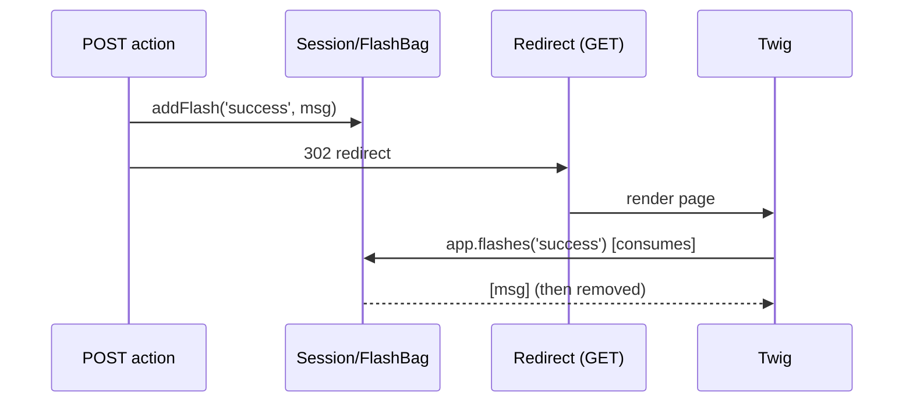

# Flash Messages

!!! tip "In a nutshell"
    Un flash message est un message à usage unique stocké dans la session et
    affiché à la request suivante — conçu pour le Post/Redirect/Get. `addFlash()`
    le met en file ; sa lecture (`app.flashes`) le **consomme**, alors associez-le
    à un redirect et utilisez `peek()` quand vous ne devez pas le consommer.

!!! example "Real-world analogy"
    Un flash message est le **post-it** que la réceptionniste laisse sur le
    comptoir pour votre *prochaine* visite : « Profil enregistré ». Vous revenez
    (la request toute fraîche issue du redirect), vous le lisez une fois, et il
    est décollé et jeté — la lecture le consomme. `peek()`, c'est jeter un œil au
    post-it tout en le laissant collé pour quelqu'un d'autre.

!!! abstract "Learning objectives"
    À la fin de ce chapitre, vous saurez :

    - [ ] Mettre en file des flash messages avec `addFlash()` et la `FlashBagInterface`.
    - [ ] Afficher les flash messages dans Twig et expliquer leur cycle de vie à usage unique.
    - [ ] Distinguer lecture avec `peek` et lecture consommatrice, et comprendre le pattern redirect-puis-affichage.

    **Syllabus:** `Controllers → Flash messages` ·
    **Level:** Advanced ·
    **Est. time:** 12 min ·
    **Prerequisites:** [The Session](session.md), [HTTP Redirects](http-redirects.md)

---

## Theory

Un **flash message** est une notification à usage unique stockée dans la session
et affichée à la request **suivante**, puis automatiquement supprimée. Il existe
pour supporter le pattern *Post/Redirect/Get* : après le POST d'un form, vous
redirigez, et la page cible affiche « Enregistré avec succès ».

Depuis un controller étendant `AbstractController` :

```php
$this->addFlash('success', 'Profile updated.');
```

`'success'` est le **type** (une clé arbitraire de votre choix — `success`,
`error`, `warning`…), et le second argument est le message (une chaîne ou
n'importe quelle valeur).

!!! question "Predict first"
    Un controller lit `app.session.flashbag.get('success')` pour de la
    journalisation, puis rend un template qui boucle sur `app.flashes`. Que voit
    l'utilisateur ?

??? note "Reveal"
    Rien pour `success` — la lecture d'un flash message le **consomme**, donc le
    `get()` précédent a vidé le bag. Utilisez `peek()` pour lire sans consommer,
    et associez `addFlash()` à un **redirect** (PRG) pour que le message
    s'affiche à la request suivante.

## Deep Dive — how it works internally

Les flash messages vivent dans une
`Symfony\Component\HttpFoundation\Session\Flash\FlashBagInterface`
(par défaut `FlashBag`), l'un des bags de la session. `addFlash()` est un simple
raccourci :

```php
$this->requestStack->getSession()->getFlashBag()->add($type, $message);
```

Le bag stocke les messages **par type** sous forme de tableaux. Les lire les
**consomme** — `get($type)` retourne et *supprime* les messages de ce type ;
`all()` vide tout le bag. Le helper Twig `app.flashes` appelle `get()`/`all()`,
raison pour laquelle un message s'affiche exactement une fois. Pour lire **sans**
consommer, utilisez `peek()`/`peekAll()`.

```php
$bag = $request->getSession()->getFlashBag();

$bag->peek('success');   // read ONE type without consuming
$bag->peekAll();         // read EVERY type, nothing removed
$bag->get('success');    // returns AND removes this type's messages
$bag->all();             // drains the whole bag
// Twig's app.flashes helper calls get()/all() — rendering consumes
```



Comme les flash messages requièrent la session, en ajouter un **démarre la
session** (lazy → désormais active) et émet un cookie de session. C'est attendu
pour les flux authentifiés/interactifs, mais cela signifie que les pages portant
un flash message ne sont pas cachables par un cache partagé.

!!! note "Source reference"
    `Symfony\Component\HttpFoundation\Session\Flash\FlashBag` —
    [symfony/symfony `8.0`](https://github.com/symfony/symfony/blob/8.0/src/Symfony/Component/HttpFoundation/Session/Flash/FlashBag.php).

## Configuration & code

=== "Controller"

    ```php
    <?php
    declare(strict_types=1);

    namespace App\Controller;

    use Symfony\Bundle\FrameworkBundle\Controller\AbstractController;
    use Symfony\Component\HttpFoundation\Response;
    use Symfony\Component\Routing\Attribute\Route;

    final class ProfileController extends AbstractController
    {
        #[Route('/profile/save', name: 'profile_save', methods: ['POST'])]
        public function save(): Response
        {
            // ... persist ...
            $this->addFlash('success', 'Profile updated.');

            return $this->redirectToRoute('profile_show'); // PRG pattern
        }
    }
    ```

=== "Twig"

    ```twig
    {# templates/profile/show.html.twig #}
    
        
            <div class="flash flash-{{ label }}">{{ message }}</div>
        
    

    {# Or a single type: #}
    
        <div class="flash-success">{{ message }}</div>
    
    ```

=== "FlashBag directly"

    ```php
    <?php
    declare(strict_types=1);

    use Symfony\Component\HttpFoundation\RequestStack;

    final class Notifier
    {
        public function __construct(private RequestStack $requestStack) {}

        public function warn(string $msg): void
        {
            $this->requestStack->getSession()->getFlashBag()->add('warning', $msg);
        }
    }
    ```

## Best practices & anti-patterns

| ✅ Do | ❌ Avoid |
|---|---|
| Ajouter un flash message puis **rediriger** (PRG) | Ajouter un flash message puis rendre directement (s'affiche à la request suivante) |
| Utiliser des clés de type cohérentes (`success`/`error`) | Des types ad hoc qu'aucun template n'affiche |
| Afficher tous les types dans un layout partagé | Dupliquer les boucles de flash messages dans chaque template |
| `peek()` quand vous ne devez pas consommer | Lire dans un controller puis à nouveau dans Twig (double consommation) |

## When (not) to use it / alternatives

- **Utilisez les flash messages** pour un retour d'interface transitoire, à usage
  unique, au travers d'un redirect.
- **N'utilisez pas** de flash message pour des données qui doivent survivre à
  plusieurs requests — c'est de l'état de session classique.
- Pour les réponses d'API, retournez plutôt le message dans le corps JSON ; les
  flash messages sont un concept d'interface rendue côté serveur.

!!! danger "Certification traps"
    - Lire les flash messages (`get`/`all`, ou `app.flashes` dans Twig) les
      **consomme** ; `peek`/`peekAll` lit sans supprimer.
    - Les flash messages ont besoin d'un **redirect** pour apparaître à la request
      suivante ; si vous faites `render()` dans la même action, ils persistent
      jusqu'à la request *d'après*.
    - `addFlash()` nécessite une session active et ne fonctionne que là où une
      session existe (lève une exception hors d'une request avec session).
    - `addFlash()` est du sucre syntaxique d'`AbstractController` autour de
      `getSession()->getFlashBag()->add()`.

!!! warning "Common mistakes"
    - Consommer les flash messages dans le controller pour de la journalisation,
      puis se demander pourquoi Twig n'affiche rien — le bag a été vidé.
    - S'attendre à voir des flash messages sur une page entièrement cachée
      (reverse proxy partagé).

## Exercises

1. **(Basic)** Après une suppression réussie, ajoutez un flash message
   `error`/`success` et redirigez vers la route de la liste.
2. **(Intermediate)** Affichez uniquement les flash messages `error` en haut et
   tous les autres en bas, sans consommer les erreurs deux fois.

??? success "Solutions"

    **1.**
    ```php
    $this->addFlash('success', 'Item deleted.');
    return $this->redirectToRoute('item_list');
    ```

    **2.** Utilisez `app.flashes('error')` en haut (consomme les erreurs une
    fois), puis `app.flashes` pour le reste en bas. Ne relisez pas `error` une
    seconde fois, ou utilisez `app.session.flashbag.peek('error')` si vous en
    avez réellement besoin deux fois.

## Certification questions

??? question "Q1. What happens when you read a flash message?"
    - [x] A. It is returned and removed (consumed). ✅
    - [ ] B. It stays until the session expires.
    - [ ] C. It is copied to the next request automatically.
    - [ ] D. It is written to the log.

    **Why:** `get`/`all` consomment ; utilisez `peek` pour lire sans supprimer.
    **Ref:** [flash messages](https://symfony.com/doc/8.0/controller.html#flash-messages).

??? question "Q2. `$this->addFlash('notice', 'Hi')` is shorthand for…"
    - [x] A. `getSession()->getFlashBag()->add('notice', 'Hi')` ✅
    - [ ] B. setting a response header
    - [ ] C. writing a cookie
    - [ ] D. dispatching an event

    **Why:** la méthode délègue au flash bag de la session. **Ref:** [AbstractController](https://symfony.com/doc/8.0/controller.html#flash-messages).

??? question "Q3. Why pair a flash with a redirect?"
    - [x] A. The message displays on the next (GET) request, matching the PRG pattern. ✅
    - [ ] B. Redirects are required to write to the session.
    - [ ] C. Flashes cannot be added on a GET request.
    - [ ] D. It prevents CSRF.

    **Why:** les flash messages sont conçus pour survivre à exactement un redirect et être affichés ensuite.
    **Ref:** [flash messages](https://symfony.com/doc/8.0/controller.html#flash-messages).

## Key takeaways

- `addFlash($type, $msg)` met en file un message à usage unique dans le flash bag de la session.
- La lecture consomme ; `peek`/`peekAll` lit sans consommer.
- Conçu pour le Post/Redirect/Get — ajouter, rediriger, afficher, supprimer.
- Twig : itérer sur `app.flashes` (tous) ou `app.flashes('type')`.

## Last-minute revision

!!! tip "Cheat sheet"
    - `$this->addFlash('success','...')` → FlashBag.
    - Twig : ``.
    - `get/all` consomment ; `peek/peekAll` non.
    - Nécessite une session ⇒ pas pour les pages en cache partagé.

## Connections

- **Depends on:** [The Session](session.md) — les flash messages sont un bag stocké à l'intérieur de la session.
- **Reused in:** [HTTP Redirects](http-redirects.md) — le pattern PRG transporte un flash message au travers du redirect.
- **Confused with:** [AbstractController](abstract-controller.md) — `addFlash()` est du sucre syntaxique autour de `getSession()->getFlashBag()->add()`.

## Official References
- [Official Symfony docs — Flash Messages](https://symfony.com/doc/8.0/controller.html#flash-messages)
- [Symfony source — FlashBag](https://github.com/symfony/symfony/blob/8.0/src/Symfony/Component/HttpFoundation/Session/Flash/FlashBag.php)

## Video references

!!! tip "Watch & learn"
    Ce sont des chaînes vidéo officielles, mises à jour en continu — cherchez-y
    "Symfony controllers" pour consolider ce chapitre. Nous référençons des chaînes
    stables plutôt que des vidéos individuelles afin que les références ne périment jamais.

    - [SymfonyCasts screencasts](https://symfonycasts.com/tracks/symfony) — tutoriels scénarisés à suivre en codant.
    - [Symfony official YouTube](https://www.youtube.com/@SymfonyOfficial) — conférences et keynotes SymfonyCon.
    - [Official docs for this topic](https://symfony.com/doc/8.0/controller.html#flash-messages) — certaines pages de la doc Symfony intègrent un screencast.

## Confidence check

Je suis prêt quand je peux :

- [ ] expliquer **pourquoi** les flash messages sont à usage unique et liés au Post/Redirect/Get
- [ ] ajouter et afficher des flash messages dans Symfony 8 et Twig
- [ ] déboguer un flash message qui n'apparaît jamais (rendu au lieu de redirigé, ou doublement consommé)
- [ ] repérer la différence entre `get`/`all` (consomment) et `peek`/`peekAll`
- [ ] expliquer comment `addFlash()` s'appuie sur le flash bag de la session

---

<small>Related: [The Session](session.md) · [HTTP Redirects](http-redirects.md) · [AbstractController](abstract-controller.md) · [Twig](../twig/index.md)</small>
