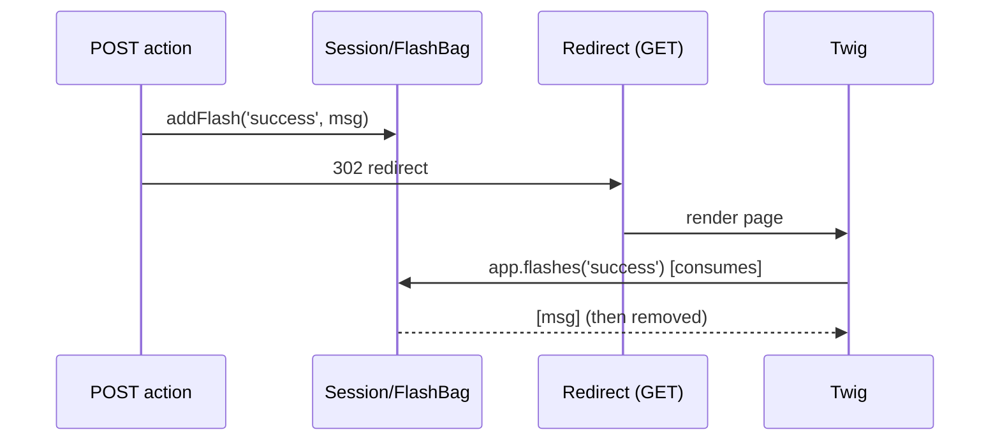

# Flash Messages

!!! tip "In a nutshell"
    A flash is a one-shot message stored in the session and shown on the next
    request — built for Post/Redirect/Get. `addFlash()` queues it; reading it
    (`app.flashes`) **consumes** it, so pair it with a redirect and use `peek()`
    when you must not consume.

!!! example "Real-world analogy"
    A flash is the **sticky note** the receptionist leaves on the counter for your
    *next* visit: "Profile saved". You come back (the redirect's fresh request),
    read it once, and it is peeled off and binned — reading consumes it. `peek()`
    is glancing at the note while leaving it stuck for someone else.

!!! abstract "Learning objectives"
    By the end of this chapter you can:

    - [ ] Queue flash messages with `addFlash()` and the `FlashBagInterface`.
    - [ ] Render flashes in Twig and explain their one-shot lifecycle.
    - [ ] Use peeking vs consuming reads and understand the redirect-then-show pattern.

    **Syllabus:** `Controllers → Flash messages` ·
    **Level:** Advanced ·
    **Est. time:** 12 min ·
    **Prerequisites:** [The Session](session.md), [HTTP Redirects](http-redirects.md)

---

## Theory

A **flash message** is a one-time notification stored in the session and
displayed on the **next** request, then automatically discarded. It exists to
support the *Post/Redirect/Get* pattern: after a form POST you redirect, and the
target page shows "Saved successfully".

From a controller extending `AbstractController`:

```php
$this->addFlash('success', 'Profile updated.');
```

`'success'` is the **type** (an arbitrary key you choose — `success`, `error`,
`warning`…), and the second argument is the message (string or any value).

!!! question "Predict first"
    A controller reads `app.session.flashbag.get('success')` for logging, then
    renders a template that loops `app.flashes`. What does the user see?

??? note "Reveal"
    Nothing for `success` — reading a flash **consumes** it, so the earlier `get()`
    drained the bag. Use `peek()` to read without consuming, and pair `addFlash()`
    with a **redirect** (PRG) so the message shows on the next request.

## Deep Dive — how it works internally

Flashes live in a `Symfony\Component\HttpFoundation\Session\Flash\FlashBagInterface`
(default `FlashBag`), one of the session's bags. `addFlash()` is a thin shortcut:

```php
$this->requestStack->getSession()->getFlashBag()->add($type, $message);
```

The bag stores messages **per type** as arrays. Reading them **consumes** them —
`get($type)` returns and *removes* that type's messages; `all()` drains the whole
bag. The Twig helper `app.flashes` calls `get()`/`all()`, which is why a message
shows exactly once. To read **without** consuming, use `peek()`/`peekAll()`.

```php
$bag = $request->getSession()->getFlashBag();

$bag->peek('success');   // read ONE type without consuming
$bag->peekAll();         // read EVERY type, nothing removed
$bag->get('success');    // returns AND removes this type's messages
$bag->all();             // drains the whole bag
// Twig's app.flashes helper calls get()/all() — rendering consumes
```



Because flashes require the session, adding one **starts the session** (lazy → now
active) and emits a session cookie. That is expected for authenticated/interactive
flows but means flash-bearing pages are not shared-cacheable.

!!! note "Source reference"
    `Symfony\Component\HttpFoundation\Session\Flash\FlashBag` —
    [symfony/symfony `8.0`](https://github.com/symfony/symfony/blob/8.0/src/Symfony/Component/HttpFoundation/Session/Flash/FlashBag.php).

## Configuration & code

=== "Controller"

    ```php
    <?php
    declare(strict_types=1);

    namespace App\Controller;

    use Symfony\Bundle\FrameworkBundle\Controller\AbstractController;
    use Symfony\Component\HttpFoundation\Response;
    use Symfony\Component\Routing\Attribute\Route;

    final class ProfileController extends AbstractController
    {
        #[Route('/profile/save', name: 'profile_save', methods: ['POST'])]
        public function save(): Response
        {
            // ... persist ...
            $this->addFlash('success', 'Profile updated.');

            return $this->redirectToRoute('profile_show'); // PRG pattern
        }
    }
    ```

=== "Twig"

    ```twig
    {# templates/profile/show.html.twig #}
    
        
            <div class="flash flash-{{ label }}">{{ message }}</div>
        
    

    {# Or a single type: #}
    
        <div class="flash-success">{{ message }}</div>
    
    ```

=== "FlashBag directly"

    ```php
    <?php
    declare(strict_types=1);

    use Symfony\Component\HttpFoundation\RequestStack;

    final class Notifier
    {
        public function __construct(private RequestStack $requestStack) {}

        public function warn(string $msg): void
        {
            $this->requestStack->getSession()->getFlashBag()->add('warning', $msg);
        }
    }
    ```

## Best practices & anti-patterns

| ✅ Do | ❌ Avoid |
|---|---|
| Add flash then **redirect** (PRG) | Adding a flash then rendering directly (shows next request) |
| Use consistent type keys (`success`/`error`) | Ad-hoc types that no template renders |
| Render all types in a shared layout | Duplicating flash loops per template |
| `peek()` when you must not consume | Reading in a controller then again in Twig (double consume) |

## When (not) to use it / alternatives

- **Use flashes** for transient, one-shot UI feedback across a redirect.
- **Don't** use them for data that must survive multiple requests — that is
  regular session state.
- For API responses, return the message in the JSON body instead; flashes are a
  server-rendered UI concept.

!!! danger "Certification traps"
    - Reading flashes (`get`/`all`, or `app.flashes` in Twig) **consumes** them;
      `peek`/`peekAll` reads without removing.
    - Flashes need a **redirect** to appear on the next request; if you `render()`
      in the same action they persist to the *following* request instead.
    - `addFlash()` requires an active session and works only where a session
      exists (throws outside a request with a session).
    - `addFlash()` is `AbstractController` sugar over
      `getSession()->getFlashBag()->add()`.

!!! warning "Common mistakes"
    - Consuming flashes in the controller for logging, then wondering why Twig
      shows nothing — the bag was drained.
    - Expecting flashes on a fully cached (shared-proxy) page.

## Exercises

1. **(Basic)** After a successful delete, add an `error`/`success` flash and
   redirect to the list route.
2. **(Intermediate)** Render only `error` flashes at the top and all others at the
   bottom, without consuming errors twice.

??? success "Solutions"

    **1.**
    ```php
    $this->addFlash('success', 'Item deleted.');
    return $this->redirectToRoute('item_list');
    ```

    **2.** Use `app.flashes('error')` at the top (consumes errors once), then
    `app.flashes` for the rest at the bottom. Do not also read `error` a second
    time, or use `app.session.flashbag.peek('error')` if you truly need it twice.

## Certification questions

??? question "Q1. What happens when you read a flash message?"
    - [x] A. It is returned and removed (consumed). ✅
    - [ ] B. It stays until the session expires.
    - [ ] C. It is copied to the next request automatically.
    - [ ] D. It is written to the log.

    **Why:** `get`/`all` consume; use `peek` to read without removing.
    **Ref:** [flash messages](https://symfony.com/doc/8.0/controller.html#flash-messages).

??? question "Q2. `$this->addFlash('notice', 'Hi')` is shorthand for…"
    - [x] A. `getSession()->getFlashBag()->add('notice', 'Hi')` ✅
    - [ ] B. setting a response header
    - [ ] C. writing a cookie
    - [ ] D. dispatching an event

    **Why:** it delegates to the session flash bag. **Ref:** [AbstractController](https://symfony.com/doc/8.0/controller.html#flash-messages).

??? question "Q3. Why pair a flash with a redirect?"
    - [x] A. The message displays on the next (GET) request, matching the PRG pattern. ✅
    - [ ] B. Redirects are required to write to the session.
    - [ ] C. Flashes cannot be added on a GET request.
    - [ ] D. It prevents CSRF.

    **Why:** flashes are designed to survive exactly one redirect and be shown next.
    **Ref:** [flash messages](https://symfony.com/doc/8.0/controller.html#flash-messages).

## Key takeaways

- `addFlash($type, $msg)` queues a one-shot message in the session flash bag.
- Reading consumes; `peek`/`peekAll` reads without consuming.
- Designed for Post/Redirect/Get — add, redirect, show, discard.
- Twig: iterate `app.flashes` (all) or `app.flashes('type')`.

## Last-minute revision

!!! tip "Cheat sheet"
    - `$this->addFlash('success','...')` → FlashBag.
    - Twig: ``.
    - `get/all` consume; `peek/peekAll` don't.
    - Needs a session ⇒ not for shared-cached pages.

## Connections

- **Depends on:** [The Session](session.md) — flashes are a bag stored inside the session.
- **Reused in:** [HTTP Redirects](http-redirects.md) — the PRG pattern carries a flash across the redirect.
- **Confused with:** [AbstractController](abstract-controller.md) — `addFlash()` is sugar over `getSession()->getFlashBag()->add()`.

## Official References
- [Official Symfony docs — Flash Messages](https://symfony.com/doc/8.0/controller.html#flash-messages)
- [Symfony source — FlashBag](https://github.com/symfony/symfony/blob/8.0/src/Symfony/Component/HttpFoundation/Session/Flash/FlashBag.php)

## Video references

!!! tip "Watch & learn"
    These are official, continuously-updated video channels — search them for
    "Symfony controllers" to reinforce this chapter. We link stable channels rather than
    individual videos so the references never rot.

    - [SymfonyCasts screencasts](https://symfonycasts.com/tracks/symfony) — scripted, code-along tutorials.
    - [Symfony official YouTube](https://www.youtube.com/@SymfonyOfficial) — SymfonyCon conference talks & keynotes.
    - [Official docs for this topic](https://symfony.com/doc/8.0/controller.html#flash-messages) — some Symfony doc pages embed a screencast.

## Confidence check

I'm ready when I can:

- [ ] explain **why** flashes are one-shot and tied to Post/Redirect/Get
- [ ] add and render flash messages in Symfony 8 and Twig
- [ ] debug a flash that never appears (rendered instead of redirected, or double-consumed)
- [ ] spot the difference between `get`/`all` (consume) and `peek`/`peekAll`
- [ ] explain how `addFlash()` maps onto the session flash bag

---

<small>Related: [The Session](session.md) · [HTTP Redirects](http-redirects.md) · [AbstractController](abstract-controller.md) · [Twig](../twig/index.md)</small>
