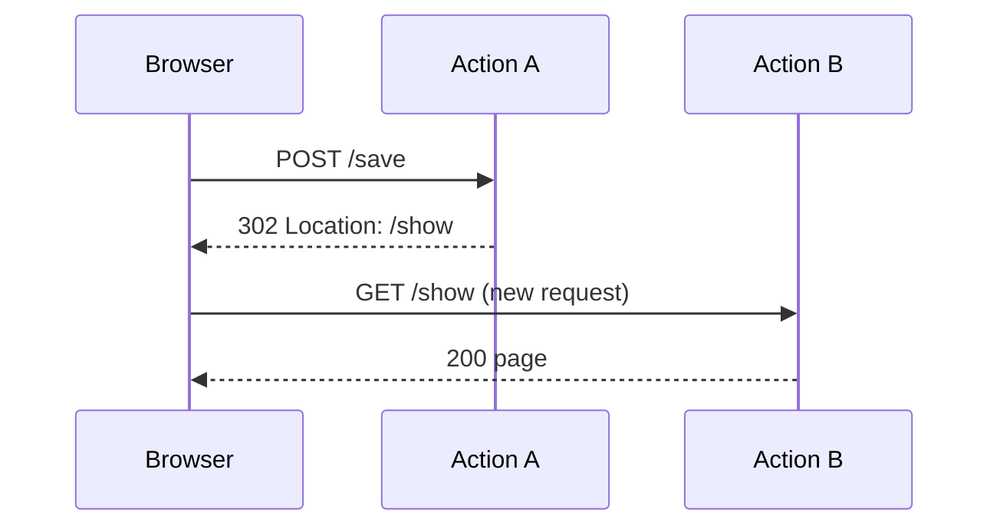

# HTTP Redirects

!!! tip "In a nutshell"
    Un redirect envoie un statut `3xx` + un header `Location` pour que le
    navigateur effectue une nouvelle request. Utilisez `redirectToRoute()` (nom de
    route) ou `redirect()` (URL) ; le statut par défaut est **302**, 307/308
    préservent la méthode, et 301/308 sont mis en cache.

!!! example "Real-world analogy"
    Un redirect, c'est la **réceptionniste** qui dit « c'est traité au guichet 4 —
    veuillez vous y rendre ». Le visiteur traverse physiquement le hall et rejoint
    une nouvelle file : une nouvelle request, une nouvelle URL dans la barre
    d'adresse. À l'opposé du [forward](internal-redirects.md), où la réceptionniste
    passe dans l'arrière-bureau et va chercher la réponse pour vous — même visite,
    même URL, aucun trajet supplémentaire.

!!! abstract "Learning objectives"
    À la fin de ce chapitre, vous saurez :

    - [ ] Rediriger avec `redirectToRoute()`, `redirect()` et `RedirectResponse`.
    - [ ] Choisir le bon code de statut (301, 302, 303, 307, 308).
    - [ ] Expliquer pourquoi un redirect est un aller-retour complet, contrairement à un `forward()`.

    **Syllabus:** `Controllers → HTTP redirects` ·
    **Level:** Advanced ·
    **Est. time:** 12 min ·
    **Prerequisites:** [The Response](response.md), [Routing → URL generation](../routing/url-generation.md)

---

## Pour les nuls

### L'idée en une phrase
Un redirect fait faire au navigateur un vrai aller-retour vers une nouvelle URL — contrairement à un simple traitement interne, l'adresse dans la barre change vraiment.

### Imagine dans la vraie vie
Le réceptionniste dit "c'est traité au guichet 4 — allez-y." Le visiteur traverse physiquement le hall et rejoint une nouvelle file : une requête toute neuve, une nouvelle URL dans la barre d'adresse. Contraste avec un `forward()` : le réceptionniste va lui-même chercher la réponse en coulisses — même visite, même URL, pas de trajet supplémentaire.

### Dans Symfony
`redirectToRoute('accueil')` génère l'URL depuis le nom de route (résiste aux changements de config de routing) — `redirect('/accueil')` prend une URL brute, plus fragile si l'URL change un jour.

### Exemple simple
```php
return $this->redirectToRoute('produit_liste', [], Response::HTTP_MOVED_PERMANENTLY); // 301
```

### Comment le mémoriser 🧠
**302** (par défaut) et **303** peuvent changer la méthode HTTP en GET ; **307** et **308** la préservent toujours — retiens "3 et 8 tiennent parole" (307/308 préservent la méthode).


## Theory

Un **HTTP redirect** indique au navigateur d'effectuer une *nouvelle* request
vers une autre URL. C'est un véritable aller-retour réseau : la response porte un
statut `3xx` et un header `Location` ; le client émet alors une request toute
fraîche.

Les raccourcis d'`AbstractController` :

| Method | Target | Returns |
|---|---|---|
| `redirectToRoute($route, $params, $status)` | un nom de route | `RedirectResponse` |
| `redirect($url, $status)` | n'importe quelle URL | `RedirectResponse` |

Les deux construisent une `Symfony\Component\HttpFoundation\RedirectResponse`.
Le statut par défaut est **302 Found**.

```php
// Route name (+ params) — the router generates the URL
return $this->redirectToRoute('order_show', ['id' => 42]);  // 302 Found by default

// Any URL, with an explicit status
return $this->redirect('https://symfony.com/', 302);

// Both shortcuts return this object:
return new RedirectResponse('/orders/42');                  // status defaults to 302
```

!!! question "Predict first"
    Après un POST réussi, vous appelez `redirectToRoute('show')` sans argument de
    statut. Quel statut HTTP le navigateur reçoit-il, et conserve-t-il le POST ?

??? note "Reveal"
    **302 Found** (le défaut), et la méthode peut être rétrogradée en GET. Pour un
    PRG strict, utilisez 303 ; 307/308 *préservent* la méthode et le corps ;
    301/308 sont **mis en cache**. Un redirect est une nouvelle request — la
    `Request` courante et ses attributes ne sont pas transmis.

## Deep Dive — how it works internally

`redirectToRoute()` appelle `generateUrl()` (le router) pour transformer la route
et ses paramètres en URL, puis retourne `new RedirectResponse($url, $status)`.
`RedirectResponse` définit le header `Location` et un petit corps HTML (pour les
clients anciens).

```php
// What redirectToRoute() does internally:
$url = $this->generateUrl('order_show', ['id' => 42]); // router builds "/orders/42"
$response = new RedirectResponse($url, 302);

$response->headers->get('Location');  // "/orders/42"
$response->getContent();              // small HTML page with a meta refresh + link
```



### Status-code semantics (exam-critical)

| Code | Name | Method preserved? | Cached? | Use |
|---|---|---|---|---|
| 301 | Moved Permanently | peut passer en GET | oui | déplacement permanent d'URL (SEO) |
| 302 | Found | peut passer en GET | non | redirect temporaire par défaut |
| 303 | See Other | force GET | non | Post/Redirect/Get |
| 307 | Temporary Redirect | **préserve** méthode + corps | non | conserver le POST temporairement |
| 308 | Permanent Redirect | **préserve** méthode + corps | oui | permanent, méthode conservée |

301/308 sont mis en cache par les navigateurs — difficile à annuler, donc
réservez-les aux déplacements réellement permanents. Pour un PRG après un POST,
302 (ou le plus strict 303) est correct.

!!! note "Source reference"
    `Symfony\Component\HttpFoundation\RedirectResponse` —
    [symfony/symfony `8.0`](https://github.com/symfony/symfony/blob/8.0/src/Symfony/Component/HttpFoundation/RedirectResponse.php).

Rediriger vers une **URL fournie par l'utilisateur** est un risque d'open
redirect — validez ou mettez les cibles en liste d'autorisation. Préférez
`redirectToRoute()` afin que la cible soit toujours interne.

## Configuration & code

=== "redirectToRoute"

    ```php
    <?php
    declare(strict_types=1);

    namespace App\Controller;

    use Symfony\Bundle\FrameworkBundle\Controller\AbstractController;
    use Symfony\Component\HttpFoundation\RedirectResponse;
    use Symfony\Component\HttpFoundation\Response;
    use Symfony\Component\Routing\Attribute\Route;

    final class OrderController extends AbstractController
    {
        #[Route('/order', name: 'order_create', methods: ['POST'])]
        public function create(): RedirectResponse
        {
            // ... persist order id 42 ...
            return $this->redirectToRoute('order_show', ['id' => 42]);
            // default 302; pass status: 303 to force GET on the target
        }

        #[Route('/legacy', name: 'legacy')]
        public function legacy(): Response
        {
            return $this->redirectToRoute('order_create', status: 301);
        }
    }
    ```

=== "redirect / external"

    ```php
    <?php
    declare(strict_types=1);

    use Symfony\Component\HttpFoundation\RedirectResponse;

    // Redirect to an absolute external URL (validate untrusted input first!)
    return new RedirectResponse('https://symfony.com/', 302);
    ```

## Best practices & anti-patterns

| ✅ Do | ❌ Avoid |
|---|---|
| `redirectToRoute()` pour les cibles internes | Coder les URLs en dur |
| 302/303 après un POST (PRG) | 301 après un POST (mis en cache, mauvaise sémantique) |
| Valider/mettre en liste d'autorisation les URLs de redirect externes | `redirect($request->query->get('next'))` sans contrôle |
| 308 uniquement pour de vrais déplacements permanents préservant la méthode | 307/308 par défaut |

## When (not) to use it / alternatives

- **HTTP redirect** — changer l'URL dans la barre d'adresse, implémenter le PRG,
  déplacer une ressource. Coûte un aller-retour supplémentaire.
- **[Forward](internal-redirects.md)** — réutiliser la logique d'un autre
  controller au sein de la *même* request, URL inchangée. Ce n'est pas un redirect.

!!! danger "Certification traps"
    - Le statut par défaut de `redirect*()` est **302**, pas 301.
    - **307/308 préservent** la méthode et le corps ; 301/302/303 peuvent
      rétrograder en GET (303 le fait toujours). Sachez lequel préserve le POST.
    - 301 et 308 sont **mis en cache** par les navigateurs — dangereux en cas
      d'erreur.
    - Un redirect est une **nouvelle request** ; les `attributes` de la request,
      la `Request` courante et l'état non lié à la session (hors flash message) ne
      sont pas transmis. Utilisez un flash message pour passer un message à usage
      unique.
    - Rediriger vers une entrée non fiable est une vulnérabilité d'**open redirect**.

!!! warning "Common mistakes"
    - Utiliser `redirect()` avec un nom de route — `redirect()` prend une **URL** ;
      `redirectToRoute()` prend un nom de route.
    - S'attendre à ce que les attributes de la request survivent au redirect.

## Exercises

1. **(Basic)** Après la création d'une ressource, redirigez vers sa page
   d'affichage en forçant un GET avec le statut 303.
2. **(Intermediate)** Implémentez un redirect « retour vers » sûr, qui n'autorise
   que des noms de routes internes, jamais des URLs arbitraires.

??? success "Solutions"

    **1.**
    ```php
    return $this->redirectToRoute('resource_show', ['id' => $id], 303);
    ```

    **2.** Acceptez un paramètre contenant un *nom* de route, validez-le contre
    une liste d'autorisation connue, et appelez `redirectToRoute($allowed[$name])`.
    Ne passez jamais une URL brute issue de la query string à `redirect()`.

## Certification questions

??? question "Q1. Default status code of `redirectToRoute()`?"
    - [ ] A. 301
    - [x] B. 302 ✅
    - [ ] C. 303
    - [ ] D. 307

    **Why:** `RedirectResponse` utilise 302 Found par défaut. **Ref:** [redirecting](https://symfony.com/doc/8.0/controller.html#redirecting).

??? question "Q2. Which status codes preserve the HTTP method and body?"
    - [ ] A. 301 and 302
    - [ ] B. 302 and 303
    - [x] C. 307 and 308 ✅
    - [ ] D. 303 and 308

    **Why:** 307/308 ne doivent pas changer la méthode ; 303 force GET. **Ref:** [RFC 7231 semantics].

??? question "Q3. `redirect()` vs `redirectToRoute()` — the difference?"
    - [x] A. `redirect()` takes a URL; `redirectToRoute()` takes a route name (+params). ✅
    - [ ] B. `redirect()` is 301, `redirectToRoute()` is 302.
    - [ ] C. `redirectToRoute()` performs an internal forward.
    - [ ] D. They are aliases.

    **Why:** la première est basée sur une URL, la seconde construit l'URL via le router.
    **Ref:** [redirecting](https://symfony.com/doc/8.0/controller.html#redirecting).

## Key takeaways

- `redirectToRoute()` (nom de route) et `redirect()` (URL) retournent une `RedirectResponse`.
- Le défaut est **302** ; 307/308 préservent méthode + corps ; 301/308 sont mis en cache.
- Un redirect est une nouvelle request du navigateur — utilisez les flash messages pour transporter un message.
- Ne redirigez jamais vers une entrée utilisateur non validée (open redirect).

## Last-minute revision

!!! tip "Cheat sheet"
    - `redirectToRoute('name', ['id'=>1], 302)` · `redirect('/url', 302)`.
    - 302 par défaut · 303 force GET (PRG) · 307/308 conservent la méthode · 301/308 mis en cache.
    - Cible interne ⇒ `redirectToRoute`. Entrée externe ⇒ valider.

## Connections

- **Depends on:** [Routing → URL generation](../routing/url-generation.md) — `redirectToRoute()` construit l'URL cible via le router.
- **Reused in:** [Flash Messages](flash-messages.md) — le redirect est le moyen par lequel un flash message à usage unique atteint la request suivante.
- **Confused with:** [Internal Redirects](internal-redirects.md) — un forward reste dans la même request sans 3xx ; un redirect est une nouvelle request du client.

## Official References
- [Official Symfony docs — Redirecting](https://symfony.com/doc/8.0/controller.html#redirecting)
- [Symfony source — RedirectResponse](https://github.com/symfony/symfony/blob/8.0/src/Symfony/Component/HttpFoundation/RedirectResponse.php)

## Video references

!!! tip "Watch & learn"
    Ce sont des chaînes vidéo officielles, mises à jour en continu — cherchez-y
    "Symfony controllers" pour consolider ce chapitre. Nous référençons des chaînes
    stables plutôt que des vidéos individuelles afin que les références ne périment jamais.

    - [SymfonyCasts screencasts](https://symfonycasts.com/tracks/symfony) — tutoriels scénarisés à suivre en codant.
    - [Symfony official YouTube](https://www.youtube.com/@SymfonyOfficial) — conférences et keynotes SymfonyCon.
    - [Official docs for this topic](https://symfony.com/doc/8.0/controller.html#redirecting) — certaines pages de la doc Symfony intègrent un screencast.

## Confidence check

Je suis prêt quand je peux :

- [ ] expliquer **pourquoi** un redirect est un aller-retour complet, contrairement à un forward
- [ ] choisir correctement 301/302/303/307/308 dans Symfony 8
- [ ] déboguer un open redirect causé par une entrée utilisateur non validée passée à `redirect()`
- [ ] repérer que `redirect()` prend une URL alors que `redirectToRoute()` prend un nom de route
- [ ] expliquer comment `RedirectResponse` définit le header `Location`

---

<small>Related: [Internal Redirects](internal-redirects.md) · [The Response](response.md) · [Flash Messages](flash-messages.md) · [Routing → URL generation](../routing/url-generation.md)</small>
