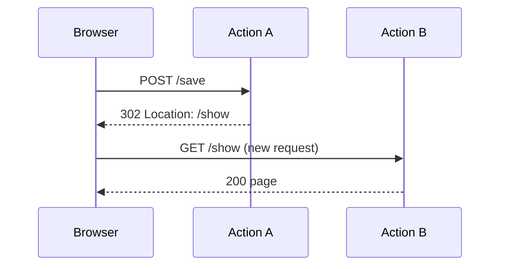

# HTTP Redirects

!!! tip "In a nutshell"
    A redirect sends a `3xx` + `Location` header so the browser makes a fresh
    request. Use `redirectToRoute()` (route name) or `redirect()` (URL); the default
    status is **302**, 307/308 preserve the method, and 301/308 are cached.

!!! example "Real-world analogy"
    A redirect is the **receptionist** saying "that's handled at counter 4 — please
    walk over there." The visitor physically crosses the lobby and joins a new
    queue: a fresh request, a new URL in the address bar. Contrast a
    [forward](internal-redirects.md), where the receptionist steps into the back
    office and fetches the answer for you — same visit, same URL, no extra trip.

!!! abstract "Learning objectives"
    By the end of this chapter you can:

    - [ ] Redirect with `redirectToRoute()`, `redirect()`, and `RedirectResponse`.
    - [ ] Choose the correct status code (301, 302, 303, 307, 308).
    - [ ] Explain why a redirect is a full round-trip, unlike a `forward()`.

    **Syllabus:** `Controllers → HTTP redirects` ·
    **Level:** Advanced ·
    **Est. time:** 12 min ·
    **Prerequisites:** [The Response](response.md), [Routing → URL generation](../routing/url-generation.md)

---

## Theory

An **HTTP redirect** tells the browser to make a *new* request to another URL. It
is a real network round-trip: the response carries a `3xx` status and a
`Location` header; the client then issues a fresh request.

`AbstractController` shortcuts:

| Method | Target | Returns |
|---|---|---|
| `redirectToRoute($route, $params, $status)` | a route name | `RedirectResponse` |
| `redirect($url, $status)` | any URL | `RedirectResponse` |

Both build a `Symfony\Component\HttpFoundation\RedirectResponse`. Default status
is **302 Found**.

!!! question "Predict first"
    After a successful POST you call `redirectToRoute('show')` with no status
    argument. Which HTTP status does the browser receive, and does it keep the POST?

??? note "Reveal"
    **302 Found** (the default), and the method may downgrade to GET. For strict
    PRG use 303; 307/308 *preserve* the method+body; 301/308 are **cached**. A
    redirect is a fresh request — the current `Request` and attributes don't carry over.

## Deep Dive — how it works internally

`redirectToRoute()` calls `generateUrl()` (the router) to turn the route + params
into a URL, then returns `new RedirectResponse($url, $status)`.
`RedirectResponse` sets the `Location` header and a small HTML body (for legacy
clients).



### Status-code semantics (exam-critical)

| Code | Name | Method preserved? | Cached? | Use |
|---|---|---|---|---|
| 301 | Moved Permanently | may change to GET | yes | permanent URL move (SEO) |
| 302 | Found | may change to GET | no | default temporary redirect |
| 303 | See Other | forces GET | no | Post/Redirect/Get |
| 307 | Temporary Redirect | **preserves** method+body | no | keep POST temporarily |
| 308 | Permanent Redirect | **preserves** method+body | yes | permanent, keep method |

301/308 are cached by browsers — hard to undo, so use them only for genuine
permanent moves. For PRG after a POST, 302 (or the stricter 303) is correct.

!!! note "Source reference"
    `Symfony\Component\HttpFoundation\RedirectResponse` —
    [symfony/symfony `8.0`](https://github.com/symfony/symfony/blob/8.0/src/Symfony/Component/HttpFoundation/RedirectResponse.php).

Redirecting to a **user-supplied URL** is an open-redirect risk — validate or
allow-list targets. Prefer `redirectToRoute()` so the target is always internal.

## Configuration & code

=== "redirectToRoute"

    ```php
    <?php
    declare(strict_types=1);

    namespace App\Controller;

    use Symfony\Bundle\FrameworkBundle\Controller\AbstractController;
    use Symfony\Component\HttpFoundation\RedirectResponse;
    use Symfony\Component\HttpFoundation\Response;
    use Symfony\Component\Routing\Attribute\Route;

    final class OrderController extends AbstractController
    {
        #[Route('/order', name: 'order_create', methods: ['POST'])]
        public function create(): RedirectResponse
        {
            // ... persist order id 42 ...
            return $this->redirectToRoute('order_show', ['id' => 42]);
            // default 302; pass status: 303 to force GET on the target
        }

        #[Route('/legacy', name: 'legacy')]
        public function legacy(): Response
        {
            return $this->redirectToRoute('order_create', status: 301);
        }
    }
    ```

=== "redirect / external"

    ```php
    <?php
    declare(strict_types=1);

    use Symfony\Component\HttpFoundation\RedirectResponse;

    // Redirect to an absolute external URL (validate untrusted input first!)
    return new RedirectResponse('https://symfony.com/', 302);
    ```

## Best practices & anti-patterns

| ✅ Do | ❌ Avoid |
|---|---|
| `redirectToRoute()` for internal targets | Hardcoding URL strings |
| 302/303 after a POST (PRG) | 301 after a POST (cached, wrong semantics) |
| Validate/allow-list external redirect URLs | `redirect($request->query->get('next'))` unchecked |
| 308 only for true permanent method-preserving moves | 307/308 as a default |

## When (not) to use it / alternatives

- **HTTP redirect** — change the URL in the address bar, implement PRG, move a
  resource. Costs an extra round-trip.
- **[Forward](internal-redirects.md)** — reuse another controller's logic within
  the *same* request, URL unchanged. Not a redirect.

!!! danger "Certification traps"
    - Default status of `redirect*()` is **302**, not 301.
    - **307/308 preserve** the method and body; 301/302/303 may downgrade to GET
      (303 always does). Know which preserves POST.
    - 301 and 308 are **cached** by browsers — dangerous if used by mistake.
    - A redirect is a **new request**; the request `attributes`, current
      `Request`, and non-flash session-independent state do not carry over. Use a
      flash to pass a one-shot message.
    - Redirecting to untrusted input is an **open redirect** vulnerability.

!!! warning "Common mistakes"
    - Using `redirect()` with a route name — `redirect()` takes a **URL**;
      `redirectToRoute()` takes a route name.
    - Expecting request attributes to survive the redirect.

## Exercises

1. **(Basic)** After creating a resource, redirect to its show page forcing a GET
   with status 303.
2. **(Intermediate)** Implement a safe "return to" redirect that only allows
   internal route names, never arbitrary URLs.

??? success "Solutions"

    **1.**
    ```php
    return $this->redirectToRoute('resource_show', ['id' => $id], 303);
    ```

    **2.** Accept a route *name* param, validate it against a known allow-list, and
    call `redirectToRoute($allowed[$name])`. Never pass a raw URL from the query
    string to `redirect()`.

## Certification questions

??? question "Q1. Default status code of `redirectToRoute()`?"
    - [ ] A. 301
    - [x] B. 302 ✅
    - [ ] C. 303
    - [ ] D. 307

    **Why:** `RedirectResponse` defaults to 302 Found. **Ref:** [redirecting](https://symfony.com/doc/current/controller.html#redirecting).

??? question "Q2. Which status codes preserve the HTTP method and body?"
    - [ ] A. 301 and 302
    - [ ] B. 302 and 303
    - [x] C. 307 and 308 ✅
    - [ ] D. 303 and 308

    **Why:** 307/308 must not change the method; 303 forces GET. **Ref:** [RFC 7231 semantics].

??? question "Q3. `redirect()` vs `redirectToRoute()` — the difference?"
    - [x] A. `redirect()` takes a URL; `redirectToRoute()` takes a route name (+params). ✅
    - [ ] B. `redirect()` is 301, `redirectToRoute()` is 302.
    - [ ] C. `redirectToRoute()` performs an internal forward.
    - [ ] D. They are aliases.

    **Why:** the former is URL-based, the latter builds the URL from the router.
    **Ref:** [redirecting](https://symfony.com/doc/current/controller.html#redirecting).

## Key takeaways

- `redirectToRoute()` (route name) and `redirect()` (URL) return a `RedirectResponse`.
- Default is **302**; 307/308 preserve method+body; 301/308 are cached.
- A redirect is a new browser request — use flashes to carry a message.
- Never redirect to unvalidated user input (open redirect).

## Last-minute revision

!!! tip "Cheat sheet"
    - `redirectToRoute('name', ['id'=>1], 302)` · `redirect('/url', 302)`.
    - 302 default · 303 force GET (PRG) · 307/308 keep method · 301/308 cached.
    - Internal target ⇒ `redirectToRoute`. External input ⇒ validate.

## Connections

- **Depends on:** [Routing → URL generation](../routing/url-generation.md) — `redirectToRoute()` builds the target URL from the router.
- **Reused in:** [Flash Messages](flash-messages.md) — a redirect is how a one-shot flash reaches the next request.
- **Confused with:** [Internal Redirects](internal-redirects.md) — a forward is same-request with no 3xx; a redirect is a new client request.

## Official References
- [Official Symfony docs — Redirecting](https://symfony.com/doc/current/controller.html#redirecting)
- [Symfony source — RedirectResponse](https://github.com/symfony/symfony/blob/8.0/src/Symfony/Component/HttpFoundation/RedirectResponse.php)

## Confidence check

I'm ready when I can:

- [ ] explain **why** a redirect is a full round-trip, unlike a forward
- [ ] choose 301/302/303/307/308 correctly in Symfony 8
- [ ] debug an open-redirect from passing unvalidated user input to `redirect()`
- [ ] spot that `redirect()` takes a URL while `redirectToRoute()` takes a route name
- [ ] explain how `RedirectResponse` sets the `Location` header

---

<small>Related: [Internal Redirects](internal-redirects.md) · [The Response](response.md) · [Flash Messages](flash-messages.md) · [Routing → URL generation](../routing/url-generation.md)</small>
