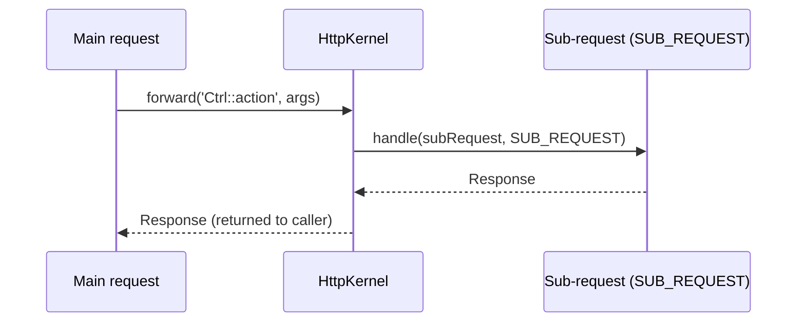

# Internal Redirects (Forwarding)

!!! tip "In a nutshell"
    `forward()` exécute un autre controller dans une **sub-request** au sein de la
    même requête HTTP — pas de `3xx`, pas de changement d'URL (un redirect fait
    l'inverse). Les sub-requests s'exécutent en `SUB_REQUEST`, donc
    `isMainRequest()` vaut false ; un service partagé est généralement plus propre
    qu'un forward.

!!! example "Real-world analogy"
    Imaginez un guichetier de banque. Un redirect, c'est quand on vous dit « ce
    n'est pas mon guichet — allez au guichet 4 » : vous vous déplacez physiquement
    et tout le monde vous voit faire la queue ailleurs (une nouvelle URL, un
    aller-retour 3xx). Un forward, c'est le guichetier qui passe discrètement dans
    l'arrière-boutique pour faire préparer le dossier par un collègue, puis vous le
    remet au même guichet : vous n'avez jamais bougé et l'enseigne au-dessus du
    comptoir n'a jamais changé. C'est toutefois plus de travail en coulisses —
    souvent, il serait plus simple de garder un classeur de référence partagé au
    guichet (un service).

!!! abstract "Learning objectives"
    À la fin de ce chapitre, vous saurez :

    - [ ] Faire un forward vers un autre controller avec `forward()` et passer des arguments.
    - [ ] Expliquer les sub-requests, la `RequestStack` et `HttpKernelInterface::SUB_REQUEST`.
    - [ ] Distinguer un forward d'un redirect HTTP et savoir quand utiliser chacun.

    **Syllabus:** `Controllers → Internal redirects (forwarding)` ·
    **Level:** Expert ·
    **Est. time:** 14 min ·
    **Prerequisites:** [HTTP Redirects](http-redirects.md), [Architecture → Request lifecycle](../architecture/index.md)

---

## Pour les nuls

### L'idée en une phrase
`forward()` fait exécuter un autre contrôleur en coulisses, sans jamais que le visiteur ne bouge ni que l'URL ne change.

### Imagine dans la vraie vie
Un guichetier de banque. Un redirect, c'est "ce n'est pas mon bureau — allez au guichet 4", tu bouges physiquement et tout le monde voit que tu fais la queue ailleurs (une nouvelle URL, un aller-retour 3xx). Un forward, c'est le guichetier qui va discrètement en coulisses demander à un collègue de préparer les papiers, puis te les rend au même guichet : tu n'as jamais bougé et l'enseigne au-dessus du guichet n'a jamais changé.

### Dans Symfony
`$this->forward('AutreController::action', ['id' => $id])` exécute un second contrôleur dans une sous-requête, sans jamais informer le navigateur — celui-ci ne voit qu'une seule requête, une seule URL.

### Exemple simple
```php
return $this->forward(ApercuController::class.'::rapide', ['id' => $produit->getId()]);
```

### Comment le mémoriser 🧠
Une sous-requête déclenchée par `forward()` a `isMainRequest() === false` — c'est le signal technique qu'on est "en coulisses", pas dans la requête principale du visiteur.


## Theory

Un **forward** exécute un autre controller **au sein de la requête courante** et
retourne sa `Response`. Le navigateur ne voit rien — pas de nouvelle URL, pas
d'aller-retour. À l'opposé, un [redirect HTTP](http-redirects.md) envoie un `3xx`
et fait récupérer une autre URL par le client.

```php
$response = $this->forward('App\Controller\ReportController::monthly', [
    'month' => 3,          // passed as controller arguments / attributes
]);
```

!!! question "Predict first"
    À l'intérieur d'un controller appelé via `forward()`, que retourne
    `$request->isMainRequest()`, et quelle URL la barre d'adresse du navigateur
    affiche-t-elle ?

??? note "Reveal"
    `false` — la sub-request est dispatchée avec `HttpKernelInterface::SUB_REQUEST`.
    La barre d'adresse est **inchangée** : un forward est interne au serveur, pas de
    3xx, pas de nouvelle requête cliente. (Un service partagé est souvent plus
    propre qu'un forward.)

## Deep Dive — how it works internally

`AbstractController::forward()` crée une **sub-request** et la dispatche à
travers le kernel :

```php
$request = $this->container->get('request_stack')->getCurrentRequest();
$path['_controller'] = $controller;
$subRequest = $request->duplicate($query, null, $path);
return $this->container->get('http_kernel')
    ->handle($subRequest, HttpKernelInterface::SUB_REQUEST);
```

Points clés :

- La sub-request est dispatchée avec `HttpKernelInterface::SUB_REQUEST` (et non
  `MAIN_REQUEST` ; l'ancienne constante `MASTER_REQUEST` a été supprimée). Les
  events sont déclenchés avec `isMainRequest() === false`, si bien que certains
  listeners (p. ex. le firewall) se comportent différemment ou s'abstiennent.
- L'attribut `_controller` est positionné sur votre cible ; le pipeline complet du
  kernel s'exécute — value resolvers, `kernel.controller`, le controller,
  `kernel.view`, `kernel.response`.
- La sub-request est **empilée sur la `RequestStack`** ; `getCurrentRequest()` la
  retourne pendant son exécution, puis elle est dépilée et la requête principale
  reprend.

```php
// Listeners (kernel.controller, kernel.view, kernel.response) also fire for
// sub-requests — they can tell them apart from the main request:
public function onKernelResponse(ResponseEvent $event): void
{
    // false during forward(): dispatched with HttpKernelInterface::SUB_REQUEST,
    // not MAIN_REQUEST (the old MASTER_REQUEST constant no longer exists)
    if (!$event->isMainRequest()) {
        return; // skip work for sub-requests
    }
}

// While the sub-request runs, it sits on top of the RequestStack:
$requestStack->getCurrentRequest()->attributes->get('_controller');
// => "App\Controller\ReportController::monthly"
```



!!! note "Source reference"
    `Symfony\Component\HttpKernel\HttpKernelInterface::SUB_REQUEST` et
    `AbstractController::forward()` —
    [symfony/symfony `8.0`](https://github.com/symfony/symfony/blob/8.0/src/Symfony/Component/HttpKernel/HttpKernelInterface.php).

Le forwarding a un coût — une traversée complète du kernel par appel. Il couple
aussi les controllers entre eux. Souvent, un **service** partagé est une façon
plus propre de réutiliser de la logique que de faire un forward vers un autre
controller.

### Relation to Twig `render()`/ESI

Le `{{ render(controller(...)) }}` de Twig et `render_esi()` produisent aussi des
sub-requests via le fragment handler — le même mécanisme, utilisé pour intégrer
la sortie d'un controller dans un template.

```twig
{# render() embeds a controller's output via a sub-request #}
{{ render(controller('App\\Controller\\ReportController::monthly', { month: 3 })) }}

{# render_esi() lets a reverse proxy cache the fragment when ESI is enabled #}
{{ render_esi(controller('App\\Controller\\ReportController::monthly', { month: 3 })) }}
```

## Configuration & code

=== "forward()"

    ```php
    <?php
    declare(strict_types=1);

    namespace App\Controller;

    use Symfony\Bundle\FrameworkBundle\Controller\AbstractController;
    use Symfony\Component\HttpFoundation\Response;
    use Symfony\Component\Routing\Attribute\Route;

    final class DashboardController extends AbstractController
    {
        #[Route('/dashboard', name: 'dashboard')]
        public function index(): Response
        {
            // Run ReportController::monthly() in a sub-request, reuse its Response
            return $this->forward(
                ReportController::class.'::monthly',
                ['month' => (int) date('n')],
            );
        }
    }
    ```

=== "Target controller"

    ```php
    <?php
    declare(strict_types=1);

    namespace App\Controller;

    use Symfony\Bundle\FrameworkBundle\Controller\AbstractController;
    use Symfony\Component\HttpFoundation\Response;

    final class ReportController extends AbstractController
    {
        // $month is resolved from the forwarded attributes
        public function monthly(int $month): Response
        {
            return $this->render('report/monthly.html.twig', ['month' => $month]);
        }
    }
    ```

## Best practices & anti-patterns

| ✅ À faire | ❌ À éviter |
|---|---|
| Faire un forward pour intégrer la sortie complète d'un controller | Faire un forward juste pour réutiliser une méthode utilitaire |
| Extraire la logique partagée dans un service | Chaîner de nombreux forwards (coût du kernel ×N) |
| Utiliser des redirects pour changer l'URL / le pattern PRG | Utiliser un forward quand le navigateur doit voir une nouvelle URL |
| Passer les données via le tableau `$path` (attributes) | Compter sur la fuite des attributes de la request appelante |

## When (not) to use it / alternatives

| Besoin | Solution |
|---|---|
| Changer l'URL de la barre d'adresse / PRG | **Un redirect HTTP** |
| Réutiliser en interne la response complète d'un autre controller | **`forward()`** |
| Réutiliser uniquement de la logique métier | **Un service partagé** (le mieux) |
| Intégrer un fragment dans un template | Twig `render(controller(...))` |

!!! danger "Certification traps"
    - Un forward est **interne** — même requête, pas de `3xx`, URL inchangée. Un
      redirect est une **nouvelle** requête cliente. Cette distinction est très
      souvent testée à l'examen.
    - Les sub-requests s'exécutent avec `HttpKernelInterface::SUB_REQUEST` ;
      `isMainRequest()` retourne **false**, et le firewall de sécurité ne
      ré-authentifie pas.
    - `forward()` passe les données via les **attributes** de la sub-request
      (le tableau `$path`), que la cible résout en arguments — pas via `query`.
    - La sub-request est empilée sur la `RequestStack` ; `getCurrentRequest()`
      retourne la sub-request pendant son exécution.

!!! warning "Common mistakes"
    - S'attendre à ce que l'URL change après un `forward()` — ce n'est pas le cas.
    - Faire un forward pour éviter d'écrire un service, en ajoutant le coût du
      kernel et du couplage.

## Exercises

1. **(Basique)** Depuis `HomeController::index`, faites un forward vers
   `NewsController::latest` en passant `limit => 5`.
2. **(Expert)** Expliquez, en commentaires de code, pourquoi remplacer un
   `forward()` par un appel à un service partagé est généralement préférable, et
   réécrivez-le.

??? success "Solutions"

    **1.**
    ```php
    return $this->forward(NewsController::class.'::latest', ['limit' => 5]);
    ```

    **2.** Un service évite une traversée complète du kernel (routing, events,
    resolvers) et garde les controllers découplés :
    ```php
    // Instead of forwarding, inject NewsProvider and call it:
    public function index(NewsProvider $news): Response
    {
        return $this->render('home.html.twig', ['items' => $news->latest(5)]);
    }
    ```

## Certification questions

??? question "Q1. What does `forward()` do?"
    - [x] A. Runs another controller in a sub-request and returns its Response. ✅
    - [ ] B. Sends a 302 redirect to another route.
    - [ ] C. Includes a template.
    - [ ] D. Dispatches a message asynchronously.

    **Why:** il dispatche une sub-request à travers le kernel. **Ref:** [forwarding](https://symfony.com/doc/8.0/controller.html#forwarding-to-another-controller).

??? question "Q2. During a forwarded sub-request, `isMainRequest()` returns…"
    - [ ] A. true
    - [x] B. false ✅
    - [ ] C. null
    - [ ] D. throws

    **Why:** la sub-request est dispatchée avec `SUB_REQUEST`. **Ref:** [http kernel](https://symfony.com/doc/8.0/components/http_kernel.html).

??? question "Q3. The user's address bar after a `forward()` shows…"
    - [x] A. the original URL (unchanged) ✅
    - [ ] B. the forwarded controller's route
    - [ ] C. a 302 chain
    - [ ] D. an internal `/_fragment` URL

    **Why:** le forwarding est interne au serveur ; aucune nouvelle requête cliente
    n'a lieu.
    **Ref:** [forwarding](https://symfony.com/doc/8.0/controller.html#forwarding-to-another-controller).

## Key takeaways

- `forward()` = sub-request, même requête HTTP, URL inchangée, retourne une Response.
- Redirect = nouvelle requête cliente avec un `3xx` + `Location`.
- Les sub-requests s'exécutent en `SUB_REQUEST` ; `isMainRequest()` vaut false ; le firewall s'abstient.
- Préférez un service partagé pour réutiliser de la *logique* ; le forward sert à réutiliser une *response* entière.

## Last-minute revision

!!! tip "Cheat sheet"
    - `$this->forward('Ctrl::action', ['arg'=>v])` → Response, interne.
    - Kernel : `SUB_REQUEST`, empilée sur la `RequestStack`.
    - forward ≠ redirect (pas de 3xx, pas de changement d'URL).

## Connections

- **Depends on:** [HTTP Redirects](http-redirects.md) — le contraste qui définit un forward (pas de 3xx, même requête).
- **Reused in:** [Architecture → Request handling](../architecture/request-handling.md) — les sub-requests traversent le même pipeline du kernel que la requête principale.
- **Confused with:** [Built-in Controllers](built-in-controllers.md) — le `RedirectController` redirige le client ; `forward()` non.

## Official References
- [Official Symfony docs — Forwarding](https://symfony.com/doc/8.0/controller.html#forwarding-to-another-controller)
- [Symfony source — HttpKernelInterface](https://github.com/symfony/symfony/blob/8.0/src/Symfony/Component/HttpKernel/HttpKernelInterface.php)

## Video references

!!! tip "Watch & learn"
    Voici des chaînes vidéo officielles, mises à jour en continu — cherchez-y
    « Symfony controllers » pour consolider ce chapitre. Nous référençons des
    chaînes stables plutôt que des vidéos individuelles afin que les références ne
    périment jamais.

    - [SymfonyCasts screencasts](https://symfonycasts.com/tracks/symfony) — tutoriels scénarisés à suivre en codant.
    - [Symfony official YouTube](https://www.youtube.com/@SymfonyOfficial) — conférences et keynotes SymfonyCon.
    - [Official docs for this topic](https://symfony.com/doc/8.0/controller.html#forwarding-to-another-controller) — certaines pages de la doc Symfony intègrent un screencast.

## Confidence check

Je suis prêt quand je peux :

- [ ] expliquer **pourquoi** un forward n'est pas un redirect (même requête, pas de changement d'URL)
- [ ] faire un forward vers un autre controller et passer des arguments en Symfony 8
- [ ] déboguer une surprise du firewall/`isMainRequest()` à l'intérieur d'une sub-request
- [ ] repérer que `forward()` passe les données via les attributes, pas via `query`
- [ ] expliquer comment la sub-request est empilée sur la `RequestStack`

---

<small>Related: [HTTP Redirects](http-redirects.md) · [Architecture](../architecture/index.md) · [The Response](response.md)</small>
