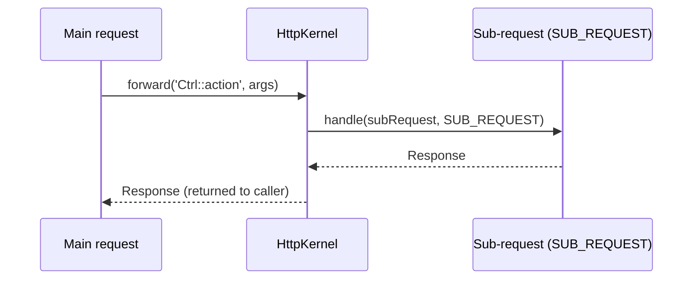

# Internal Redirects (Forwarding)

!!! abstract "Learning objectives"
    By the end of this chapter you can:

    - [ ] Forward to another controller with `forward()` and pass arguments.
    - [ ] Explain sub-requests, the `RequestStack`, and `HttpKernelInterface::SUB_REQUEST`.
    - [ ] Contrast a forward with an HTTP redirect and know when each is correct.

    **Syllabus:** `Controllers → Internal redirects (forwarding)` ·
    **Level:** Expert ·
    **Est. time:** 14 min ·
    **Prerequisites:** [HTTP Redirects](http-redirects.md), [Architecture → Request lifecycle](../architecture/index.md)

---

## Theory

A **forward** runs another controller **inside the current request** and returns
its `Response`. The browser sees nothing — no new URL, no round-trip. Contrast
with an [HTTP redirect](http-redirects.md), which sends a `3xx` and makes the
client fetch a different URL.

```php
$response = $this->forward('App\Controller\ReportController::monthly', [
    'month' => 3,          // passed as controller arguments / attributes
]);
```

## Deep Dive — how it works internally

`AbstractController::forward()` creates a **sub-request** and dispatches it
through the kernel:

```php
$request = $this->container->get('request_stack')->getCurrentRequest();
$path['_controller'] = $controller;
$subRequest = $request->duplicate($query, null, $path);
return $this->container->get('http_kernel')
    ->handle($subRequest, HttpKernelInterface::SUB_REQUEST);
```

Key points:

- The sub-request is dispatched with `HttpKernelInterface::SUB_REQUEST` (not
  `MASTER_REQUEST`/main). Events fire with `isMainRequest() === false`, so some
  listeners (e.g. firewall) behave differently or skip.
- The `_controller` attribute is set to your target; the full kernel pipeline
  runs — value resolvers, `kernel.controller`, the controller, `kernel.view`,
  `kernel.response`.
- The sub-request is **pushed onto `RequestStack`**; `getCurrentRequest()` returns
  it while it runs, then it is popped and the main request resumes.



!!! note "Source reference"
    `Symfony\Component\HttpKernel\HttpKernelInterface::SUB_REQUEST` and
    `AbstractController::forward()` —
    [symfony/symfony `8.0`](https://github.com/symfony/symfony/blob/8.0/src/Symfony/Component/HttpKernel/HttpKernelInterface.php).

Forwarding has overhead — a full kernel pass per call. It also couples
controllers. Often a shared **service** is a cleaner way to reuse logic than
forwarding to another controller.

### Relation to Twig `render()`/ESI

Twig's `{{ render(controller(...)) }}` and `render_esi()` also produce
sub-requests via the fragment handler — the same mechanism, used for embedding
controller output in a template.

## Configuration & code

=== "forward()"

    ```php
    <?php
    declare(strict_types=1);

    namespace App\Controller;

    use Symfony\Bundle\FrameworkBundle\Controller\AbstractController;
    use Symfony\Component\HttpFoundation\Response;
    use Symfony\Component\Routing\Attribute\Route;

    final class DashboardController extends AbstractController
    {
        #[Route('/dashboard', name: 'dashboard')]
        public function index(): Response
        {
            // Run ReportController::monthly() in a sub-request, reuse its Response
            return $this->forward(
                ReportController::class.'::monthly',
                ['month' => (int) date('n')],
            );
        }
    }
    ```

=== "Target controller"

    ```php
    <?php
    declare(strict_types=1);

    namespace App\Controller;

    use Symfony\Bundle\FrameworkBundle\Controller\AbstractController;
    use Symfony\Component\HttpFoundation\Response;

    final class ReportController extends AbstractController
    {
        // $month is resolved from the forwarded attributes
        public function monthly(int $month): Response
        {
            return $this->render('report/monthly.html.twig', ['month' => $month]);
        }
    }
    ```

## Best practices & anti-patterns

| ✅ Do | ❌ Avoid |
|---|---|
| Forward to embed a full controller's output | Forwarding just to reuse a helper method |
| Extract shared logic into a service | Chaining many forwards (kernel overhead ×N) |
| Use redirects to change the URL/PRG | Using forward when the browser must see a new URL |
| Pass data via the `$path` (attributes) array | Relying on the caller's request attributes leaking |

## When (not) to use it / alternatives

| Need | Use |
|---|---|
| Change the address-bar URL / PRG | **HTTP redirect** |
| Reuse another controller's full response internally | **`forward()`** |
| Reuse business logic only | **A shared service** (best) |
| Embed a fragment in a template | Twig `render(controller(...))` |

!!! danger "Certification traps"
    - A forward is **internal** — same request, no `3xx`, URL unchanged. A redirect
      is a **new** client request. This distinction is heavily tested.
    - Sub-requests run with `HttpKernelInterface::SUB_REQUEST`; `isMainRequest()`
      returns **false**, and the security firewall does not re-authenticate.
    - `forward()` passes data through the sub-request's **attributes**
      (the `$path` array), which the target resolves as arguments — not via `query`.
    - The sub-request is pushed on `RequestStack`; `getCurrentRequest()` returns
      the sub-request while it runs.

!!! warning "Common mistakes"
    - Expecting the URL to change after a `forward()` — it does not.
    - Forwarding to avoid writing a service, adding kernel overhead and coupling.

## Exercises

1. **(Basic)** From `HomeController::index`, forward to `NewsController::latest`
   passing `limit => 5`.
2. **(Expert)** Explain, in code comments, why replacing a `forward()` with a
   shared service call is usually preferable, and rewrite it.

??? success "Solutions"

    **1.**
    ```php
    return $this->forward(NewsController::class.'::latest', ['limit' => 5]);
    ```

    **2.** A service avoids a full kernel pass (routing, events, resolvers) and
    keeps controllers decoupled:
    ```php
    // Instead of forwarding, inject NewsProvider and call it:
    public function index(NewsProvider $news): Response
    {
        return $this->render('home.html.twig', ['items' => $news->latest(5)]);
    }
    ```

## Certification questions

??? question "Q1. What does `forward()` do?"
    - [x] A. Runs another controller in a sub-request and returns its Response. ✅
    - [ ] B. Sends a 302 redirect to another route.
    - [ ] C. Includes a template.
    - [ ] D. Dispatches a message asynchronously.

    **Why:** it dispatches a sub-request through the kernel. **Ref:** [forwarding](https://symfony.com/doc/current/controller.html#forwarding-to-another-controller).

??? question "Q2. During a forwarded sub-request, `isMainRequest()` returns…"
    - [ ] A. true
    - [x] B. false ✅
    - [ ] C. null
    - [ ] D. throws

    **Why:** the sub-request is dispatched with `SUB_REQUEST`. **Ref:** [http kernel](https://symfony.com/doc/current/components/http_kernel.html).

??? question "Q3. The user's address bar after a `forward()` shows…"
    - [x] A. the original URL (unchanged) ✅
    - [ ] B. the forwarded controller's route
    - [ ] C. a 302 chain
    - [ ] D. an internal `/_fragment` URL

    **Why:** forwarding is server-internal; no new client request occurs.
    **Ref:** [forwarding](https://symfony.com/doc/current/controller.html#forwarding-to-another-controller).

## Key takeaways

- `forward()` = sub-request, same HTTP request, URL unchanged, returns a Response.
- Redirect = new client request with a `3xx` + `Location`.
- Sub-requests run as `SUB_REQUEST`; `isMainRequest()` is false; firewall skips.
- Prefer a shared service to reuse *logic*; forward to reuse a whole *response*.

## Last-minute revision

!!! tip "Cheat sheet"
    - `$this->forward('Ctrl::action', ['arg'=>v])` → Response, internal.
    - Kernel: `SUB_REQUEST`, pushed on `RequestStack`.
    - forward ≠ redirect (no 3xx, no URL change).

## References

- [Official Symfony docs — Forwarding](https://symfony.com/doc/current/controller.html#forwarding-to-another-controller)
- [Symfony source — HttpKernelInterface](https://github.com/symfony/symfony/blob/8.0/src/Symfony/Component/HttpKernel/HttpKernelInterface.php)

---

<small>Related: [HTTP Redirects](http-redirects.md) · [Architecture](../architecture/index.md) · [The Response](response.md)</small>
