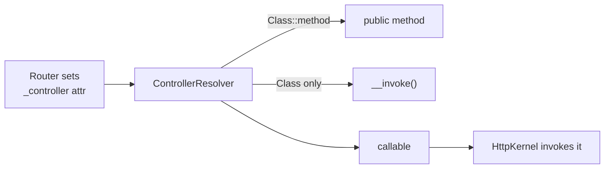

# Controller Naming Conventions

!!! tip "In a nutshell"
    Un controller est *n'importe quel callable PHP* ; Symfony n'impose aucune règle
    de nommage, donc l'ancien suffixe de méthode `Action` est mort. Utilisez des
    classes suffixées `Controller` avec des méthodes `public` en `camelCase`, ou une
    classe **invokable** à action unique référencée par son seul nom de classe.

!!! example "Real-world analogy"
    Le standard téléphonique se moque de l'intitulé de poste imprimé sur votre carte
    de visite — il lui faut seulement une extension fonctionnelle à composer. Que
    vous soyez répertorié comme « ProductController::show » ou joignable par votre
    seul nom (un invokable), l'opérateur (le `ControllerResolver`) a juste besoin
    d'un numéro qui aboutit à une personne réelle et publiquement joignable.
    Accoler « Action » à votre titre, c'est comme une vieille coutume d'entreprise
    qui n'achemine plus aucun appel ; le nommage sert aux humains qui lisent
    l'annuaire, pas au standard.

!!! abstract "Learning objectives"
    À la fin de ce chapitre, vous saurez :

    - [ ] Nommer les classes et méthodes de controller de façon idiomatique pour Symfony 8.
    - [ ] Écrire un controller **invokable** à action unique avec `__invoke()`.
    - [ ] Expliquer ce qu'est un « controller » pour le framework (n'importe quel
          callable) et pourquoi le suffixe `Action` est facultatif.

    **Syllabus:** `Controllers → Naming conventions` ·
    **Level:** Advanced ·
    **Est. time:** 12 min ·
    **Prerequisites:** [Architecture](../architecture/index.md)

---

## Pour les nuls

### L'idée en une phrase
Un contrôleur, c'est n'importe quel morceau de PHP appelable — Symfony n'impose aucune règle de nom, juste qu'il soit joignable.

### Imagine dans la vraie vie
Le standard téléphonique se moque du titre imprimé sur ta carte de visite — il a juste besoin d'un numéro qui aboutisse. Que tu sois listé comme "ProductController::show" ou joignable directement par ton nom seul (une classe invocable), le standardiste ne demande qu'un numéro qui connecte à quelqu'un de réel.

### Dans Symfony
Une classe invocable avec une seule méthode `__invoke()` peut être une route entière — pas besoin d'une classe "Controller" avec 10 méthodes si une seule action suffit.

### Exemple simple
```php
final class AfficherProduit
{
    public function __invoke(int $id): Response { /* ... */ }
}
```

### Comment le mémoriser 🧠
Le suffixe `Action` est un vestige mort — Symfony 8 ne le lit jamais. Nomme pour les humains qui liront ton code, pas pour un standard téléphonique imaginaire.


## Theory

Un **controller** est *n'importe quel callable PHP* que le kernel invoque pour
construire une `Response`. En pratique, c'est le plus souvent une méthode publique
d'une classe, mais ce peut aussi être un objet invokable, une closure ou une paire
`[service, method]`. Symfony n'impose **aucun schéma de nommage obligatoire** —
le framework se moque qu'une méthode se termine par `Action`. Les conventions
n'existent que pour la lisibilité.

Les conventions communautaires pour Symfony 8 sont :

| Élément | Convention | Exemple |
|---|---|---|
| Classe | `PascalCase` + suffixe `Controller` | `ProductController` |
| Namespace | `App\Controller\...` | `App\Controller\Admin` |
| Méthode | `camelCase`, **sans** suffixe `Action` | `show()`, `list()` |
| Action unique | Classe invokable, `__invoke()` | `HomepageController` |

L'ancien suffixe `showAction()` est une relique de Symfony 2/3 liée à
l'autodétection par annotations. Le code moderne utilise les attributes pour le
routing, donc le suffixe ne porte plus aucun sens — abandonnez-le.

!!! question "Predict first"
    Symfony 8 exige-t-il que les méthodes d'action des controllers se terminent par
    `Action`, et comment référence-t-on un controller invokable dans `_controller` ?

??? note "Reveal"
    Pas de suffixe `Action` — un controller est *n'importe quel callable* ; le
    framework n'impose aucune règle de nommage. Un controller invokable est
    référencé par son **seul nom de classe** ; le `ControllerResolver` détecte
    `__invoke()`. Les méthodes d'action doivent être `public`.

## Deep Dive — how it works internally

Le kernel ne devine jamais le nom de votre méthode à partir du nom de la classe.
Pendant le traitement de la request, `Symfony\Component\HttpKernel\HttpKernel`
demande le callable à un
`Symfony\Component\HttpKernel\Controller\ControllerResolverInterface`. Le
`Symfony\Bundle\FrameworkBundle\Controller\ControllerResolver` du framework lit
l'attribut de request `_controller` — positionné par le router à partir de votre
`#[Route]` — et le normalise en un vrai callable.

Formats acceptés pour `_controller` :

- `App\Controller\ProductController::show` — classe + méthode.
- `App\Controller\HomepageController` — une classe **invokable** (`__invoke`).
- `service_id::method` ou le `service_id` seul.
- Une closure ou un first-class callable (surtout dans les tests/la config).

```yaml
# config/routes.yaml — the accepted _controller formats side by side
product_show:
    path: /products/{id}
    controller: App\Controller\ProductController::show   # class + method

homepage:
    path: /
    controller: App\Controller\HomepageController        # invokable (__invoke)

legacy:
    path: /legacy
    controller: app.legacy_controller::process           # service_id::method
```



!!! note "Source reference"
    `Symfony\Component\HttpKernel\Controller\ControllerResolverInterface` et le
    `ControllerResolver` du framework —
    [symfony/symfony `8.0`](https://github.com/symfony/symfony/blob/8.0/src/Symfony/Bundle/FrameworkBundle/Controller/ControllerResolver.php).

Les controllers dans `src/Controller/` sont auto-enregistrés comme services (via
la définition de service `App\` dans `config/services.yaml`) et tagués
`controller.service_arguments`, ce qui permet l'autowiring des arguments d'action
et donne à `AbstractController` son service locator.

```yaml
# config/services.yaml — default skeleton
services:
    App\:                                   # the App\ service definition
        resource: '../src/'                 # auto-registers src/Controller/ too

    App\Controller\:
        resource: '../src/Controller/'
        tags: ['controller.service_arguments']  # action-argument autowiring
        # (also what lets AbstractController get its service locator)
```

## Configuration & code

=== "PHP Attributes"

    ```php
    <?php
    declare(strict_types=1);

    namespace App\Controller;

    use Symfony\Bundle\FrameworkBundle\Controller\AbstractController;
    use Symfony\Component\HttpFoundation\Response;
    use Symfony\Component\Routing\Attribute\Route;

    // Multi-action controller: several related routes on one class.
    final class ProductController extends AbstractController
    {
        #[Route('/products', name: 'product_list', methods: ['GET'])]
        public function list(): Response
        {
            return $this->render('product/list.html.twig');
        }

        #[Route('/products/{id}', name: 'product_show', methods: ['GET'])]
        public function show(int $id): Response
        {
            return $this->render('product/show.html.twig', ['id' => $id]);
        }
    }
    ```

=== "Invokable"

    ```php
    <?php
    declare(strict_types=1);

    namespace App\Controller;

    use Symfony\Bundle\FrameworkBundle\Controller\AbstractController;
    use Symfony\Component\HttpFoundation\Response;
    use Symfony\Component\Routing\Attribute\Route;

    // Single-action controller: the route points at the class itself.
    #[Route('/', name: 'homepage', methods: ['GET'])]
    final class HomepageController extends AbstractController
    {
        public function __invoke(): Response
        {
            return $this->render('homepage.html.twig');
        }
    }
    ```

=== "YAML routing"

    ```yaml
    # config/routes.yaml
    homepage:
        path: /
        controller: App\Controller\HomepageController  # invokable: no ::method
    ```

## Best practices & anti-patterns

| ✅ À faire | ❌ À éviter |
|---|---|
| Utiliser des controllers invokables pour les actions isolées | Entasser des actions sans rapport dans une même classe |
| Conserver le suffixe de classe `Controller` | Réintroduire le suffixe de méthode `Action` |
| Placer le `#[Route]` sur la classe pour les invokables | Dupliquer un préfixe de chemin sur chaque méthode |
| Marquer les controllers `final` | Des méthodes d'action `protected`/`private` (elles doivent être `public`) |

## When (not) to use it / alternatives

- **Controller invokable** — une responsabilité unique, sa propre route ; se marie
  bien avec un DTO de request/response dédié.
- **Controller multi-actions** — plusieurs endpoints étroitement liés (le CRUD
  d'une même ressource) partageant un préfixe de route et des dépendances.
- Préférez beaucoup de petits controllers à un seul obèse ; la dependency
  injection rend le coût négligeable.

!!! danger "Certification traps"
    - Un controller est **n'importe quel callable**, pas « une méthode dont le nom
      se termine par `Action` ». Le suffixe n'a aucun sens en Symfony 8.
    - Pour un controller invokable, la valeur de `_controller` est le **nom de
      classe seul** — pas de `::__invoke`.
    - Les méthodes d'action doivent être **`public`** ; une méthode
      `private`/`protected` ne peut pas être le callable d'entrée.
    - Le nom du `#[Route]` de niveau classe s'applique à l'action invokable ; vous
      n'avez pas besoin (et ne pouvez pas ajouter) d'une seconde route de niveau
      méthode sur `__invoke` pour le même chemin.

!!! warning "Common mistakes"
    - Écrire `App\Controller\HomepageController::__invoke` dans `_controller` — le
      resolver attend juste la classe pour les invokables (même si `::__invoke`
      fonctionne aussi, le nom de classe seul est idiomatique).
    - Oublier que les controllers doivent être enregistrés comme services pour
      autowirer les arguments d'action (la resource `App\` par défaut s'en charge).

## Exercises

1. **(Basique)** Convertissez un `DashboardController` à deux méthodes en deux
   controllers invokables séparés, chacun avec son propre `#[Route]` de niveau
   classe.
2. **(Intermédiaire)** Routez `/health` vers un controller invokable retournant
   une `JsonResponse` avec `{"status":"ok"}` et HTTP 200.

??? success "Solutions"

    **1.** Créez `DashboardHomeController` et `DashboardStatsController`, chacun
    `final`, chacun avec `#[Route(...)]` sur la classe et une méthode `__invoke()`.
    La responsabilité unique rend chacun testable isolément.

    **2.**
    ```php
    <?php
    declare(strict_types=1);

    namespace App\Controller;

    use Symfony\Component\HttpFoundation\JsonResponse;
    use Symfony\Component\Routing\Attribute\Route;

    #[Route('/health', name: 'health', methods: ['GET'])]
    final class HealthController
    {
        public function __invoke(): JsonResponse
        {
            return new JsonResponse(['status' => 'ok']);
        }
    }
    ```
    Remarque : étendre `AbstractController` est facultatif — un simple callable
    fonctionne.

## Certification questions

??? question "Q1. Which `_controller` value correctly targets an invokable controller?"
    - [ ] A. `App\Controller\HomeController#invoke`
    - [x] B. `App\Controller\HomeController` ✅
    - [ ] C. `App\Controller\HomeController::homeAction`
    - [ ] D. `home_controller.invoke`

    **Why:** pour un controller invokable, on référence la **classe seule** ; le
    resolver détecte `__invoke()`. **Ref:** [controllers](https://symfony.com/doc/8.0/controller.html#the-basics).

??? question "Q2. Is the `Action` method suffix required in Symfony 8?"
    - [ ] A. Yes, the router needs it.
    - [x] B. No — it is a legacy convention and carries no meaning. ✅
    - [ ] C. Only for invokable controllers.
    - [ ] D. Only in YAML routing.

    **Why:** le routing par attributes lie la méthode explicitement, donc aucun
    suffixe n'est nécessaire.
    **Ref:** [controller conventions](https://symfony.com/doc/8.0/controller.html).

??? question "Q3. What visibility must an action method have?"
    - [x] A. `public` ✅
    - [ ] B. `protected`
    - [ ] C. `private`
    - [ ] D. Any visibility works.

    **Why:** le kernel invoque le callable de l'extérieur, donc la méthode doit
    être `public`. **Ref:** [controller](https://symfony.com/doc/8.0/controller.html).

## Key takeaways

- Un controller est *n'importe quel callable* ; les conventions sont pour les humains, pas pour le framework.
- Suffixe de classe `Controller`, méthode en `camelCase`, **sans** suffixe `Action`.
- Les controllers invokables utilisent `__invoke()` et sont référencés par leur seul nom de classe.
- Les méthodes d'action doivent être `public` ; les controllers sont des services (autowiring).

## Last-minute revision

!!! tip "Cheat sheet"
    - `_controller` : `Class::method` | `Class` (invokable) | `service::method`.
    - Invokable = `#[Route]` sur la classe + `public function __invoke()`.
    - Pas de suffixe `Action`. Méthodes `public`. Classes généralement `final`.

## Connections

- **Depends on:** [Architecture → Request handling](../architecture/request-handling.md) — le `ControllerResolver` transforme `_controller` en callable.
- **Reused in:** [AbstractController](abstract-controller.md) — c'est l'enregistrement des controllers comme services qui lui permet de recevoir son locator.
- **Confused with:** [Value Resolvers](value-resolvers.md) — le resolver nomme le *callable* ; les value resolvers remplissent ses *arguments*.

## Official References
- [Official Symfony docs — Controllers](https://symfony.com/doc/8.0/controller.html)
- [Symfony source — ControllerResolver](https://github.com/symfony/symfony/blob/8.0/src/Symfony/Bundle/FrameworkBundle/Controller/ControllerResolver.php)

## Video references

!!! tip "Watch & learn"
    Voici des chaînes vidéo officielles, mises à jour en continu — cherchez-y
    « Symfony controllers » pour consolider ce chapitre. Nous référençons des
    chaînes stables plutôt que des vidéos individuelles afin que les références ne
    périment jamais.

    - [SymfonyCasts screencasts](https://symfonycasts.com/tracks/symfony) — tutoriels scénarisés à suivre en codant.
    - [Symfony official YouTube](https://www.youtube.com/@SymfonyOfficial) — conférences et keynotes SymfonyCon.
    - [Official docs for this topic](https://symfony.com/doc/8.0/controller.html#the-basics) — certaines pages de la doc Symfony intègrent un screencast.

## Confidence check

Je suis prêt quand je peux :

- [ ] expliquer **pourquoi** le suffixe de méthode `Action` n'a aucun sens en Symfony 8
- [ ] écrire des controllers invokables et multi-actions de façon idiomatique
- [ ] déboguer une route pointant vers une méthode d'action non-`public`
- [ ] repérer la bonne valeur de `_controller` pour un invokable (nom de classe seul)
- [ ] expliquer comment le `ControllerResolver` normalise `_controller` en callable

---

<small>Related: [AbstractController](abstract-controller.md) · [Value Resolvers](value-resolvers.md) · [Routing](../routing/index.md)</small>
