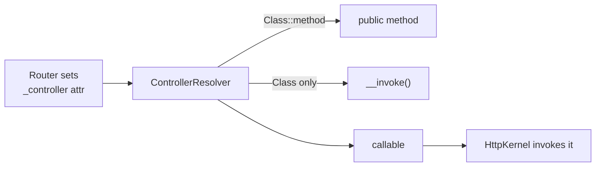

# Controller Naming Conventions

!!! tip "In a nutshell"
    A controller is *any PHP callable*; Symfony imposes no naming rules, so the old
    `Action` method suffix is dead. Use `Controller`-suffixed classes with `public`
    `camelCase` methods, or a single-action **invokable** class referenced by its
    class name alone.

!!! example "Real-world analogy"
    The switchboard doesn't care what job title is printed on your business card — it
    only needs a working extension it can dial. Whether you're listed as
    "ProductController::show" or simply reachable by your name alone (an invokable),
    the operator (the `ControllerResolver`) just needs a number that connects to a
    real, publicly reachable person. Tacking "Action" onto your title is like an old
    company custom that no longer routes any calls; naming is for the humans reading
    the directory, not for the switchboard.

!!! abstract "Learning objectives"
    By the end of this chapter you can:

    - [ ] Name controller classes and methods idiomatically for Symfony 8.
    - [ ] Write a single-action **invokable** controller with `__invoke()`.
    - [ ] Explain what a "controller" is to the framework (any callable) and why
          the `Action` suffix is optional.

    **Syllabus:** `Controllers → Naming conventions` ·
    **Level:** Advanced ·
    **Est. time:** 12 min ·
    **Prerequisites:** [Architecture](../architecture/index.md)

---

## Theory

A **controller** is *any PHP callable* the kernel invokes to build a `Response`.
In practice it is usually a public method on a class, but it can also be an
invokable object, a closure, or a `[service, method]` pair. Symfony imposes **no
mandatory naming scheme** — the framework does not care whether a method ends in
`Action`. Conventions exist purely for readability.

The community conventions for Symfony 8 are:

| Element | Convention | Example |
|---|---|---|
| Class | `PascalCase` + `Controller` suffix | `ProductController` |
| Namespace | `App\Controller\...` | `App\Controller\Admin` |
| Method | `camelCase`, **no** `Action` suffix | `show()`, `list()` |
| Single action | Invokable class, `__invoke()` | `HomepageController` |

The old `showAction()` suffix is a Symfony 2/3 relic tied to annotation
autodetection. Modern code uses attributes for routing, so the suffix carries no
meaning — drop it.

!!! question "Predict first"
    Does Symfony 8 require controller action methods to end in `Action`, and how do
    you reference an invokable controller in `_controller`?

??? note "Reveal"
    No `Action` suffix — a controller is *any callable*; the framework imposes no
    naming rule. An invokable controller is referenced by its **class name alone**;
    the `ControllerResolver` detects `__invoke()`. Action methods must be `public`.

## Deep Dive — how it works internally

The kernel never guesses your method name from the class name. During request
handling, `Symfony\Component\HttpKernel\HttpKernel` asks a
`Symfony\Component\HttpKernel\Controller\ControllerResolverInterface` for the
callable. The framework's `Symfony\Bundle\FrameworkBundle\Controller\ControllerResolver`
reads the `_controller` request attribute — set by the router from your
`#[Route]` — and normalises it into a real callable.

Accepted `_controller` formats:

- `App\Controller\ProductController::show` — class + method.
- `App\Controller\HomepageController` — an **invokable** class (`__invoke`).
- `service_id::method` or the `service_id` alone.
- A closure or first-class callable (mostly in tests/config).



!!! note "Source reference"
    `Symfony\Component\HttpKernel\Controller\ControllerResolverInterface` and the
    framework's `ControllerResolver` —
    [symfony/symfony `8.0`](https://github.com/symfony/symfony/blob/8.0/src/Symfony/Bundle/FrameworkBundle/Controller/ControllerResolver.php).

Controllers in `src/Controller/` are auto-registered as services (via the
`App\` service definition in `config/services.yaml`) and tagged
`controller.service_arguments`, which is what lets action arguments be autowired
and lets `AbstractController` receive its service locator.

## Configuration & code

=== "PHP Attributes"

    ```php
    <?php
    declare(strict_types=1);

    namespace App\Controller;

    use Symfony\Bundle\FrameworkBundle\Controller\AbstractController;
    use Symfony\Component\HttpFoundation\Response;
    use Symfony\Component\Routing\Attribute\Route;

    // Multi-action controller: several related routes on one class.
    final class ProductController extends AbstractController
    {
        #[Route('/products', name: 'product_list', methods: ['GET'])]
        public function list(): Response
        {
            return $this->render('product/list.html.twig');
        }

        #[Route('/products/{id}', name: 'product_show', methods: ['GET'])]
        public function show(int $id): Response
        {
            return $this->render('product/show.html.twig', ['id' => $id]);
        }
    }
    ```

=== "Invokable"

    ```php
    <?php
    declare(strict_types=1);

    namespace App\Controller;

    use Symfony\Bundle\FrameworkBundle\Controller\AbstractController;
    use Symfony\Component\HttpFoundation\Response;
    use Symfony\Component\Routing\Attribute\Route;

    // Single-action controller: the route points at the class itself.
    #[Route('/', name: 'homepage', methods: ['GET'])]
    final class HomepageController extends AbstractController
    {
        public function __invoke(): Response
        {
            return $this->render('homepage.html.twig');
        }
    }
    ```

=== "YAML routing"

    ```yaml
    # config/routes.yaml
    homepage:
        path: /
        controller: App\Controller\HomepageController  # invokable: no ::method
    ```

## Best practices & anti-patterns

| ✅ Do | ❌ Avoid |
|---|---|
| Use invokable controllers for one-off actions | Cramming unrelated actions into one class |
| Keep the `Controller` class suffix | Re-adding the `Action` method suffix |
| Put the `#[Route]` on the class for invokables | Duplicating a path prefix on every method |
| Mark controllers `final` | `protected`/`private` action methods (must be `public`) |

## When (not) to use it / alternatives

- **Invokable controller** — a single responsibility, its own route; pairs well
  with a dedicated request/response DTO.
- **Multi-action controller** — several closely related endpoints (CRUD on one
  resource) sharing a route prefix and dependencies.
- Prefer many small controllers over one fat one; DI makes the cost negligible.

!!! danger "Certification traps"
    - A controller is **any callable**, not "a method whose name ends in `Action`".
      The suffix is meaningless in Symfony 8.
    - For an invokable controller the `_controller` value is the **class name
      only** — no `::__invoke`.
    - Action methods must be **`public`**; a `private`/`protected` method cannot be
      the entry callable.
    - The class-level `#[Route]` name applies to the invokable action; you do not
      need (and cannot add) a second method-level route on `__invoke` for the same path.

!!! warning "Common mistakes"
    - Writing `App\Controller\HomepageController::__invoke` in `_controller` — the
      resolver expects just the class for invokables (though `::__invoke` also
      works, plain class name is idiomatic).
    - Forgetting that controllers must be registered as services to autowire
      action arguments (the default `App\` resource does this).

## Exercises

1. **(Basic)** Convert a two-method `DashboardController` into two separate
   invokable controllers, each with its own class-level `#[Route]`.
2. **(Intermediate)** Route `/health` to an invokable controller returning a
   `JsonResponse` with `{"status":"ok"}` and HTTP 200.

??? success "Solutions"

    **1.** Create `DashboardHomeController` and `DashboardStatsController`, each
    `final`, each with `#[Route(...)]` on the class and an `__invoke()` method.
    The single responsibility makes each testable in isolation.

    **2.**
    ```php
    <?php
    declare(strict_types=1);

    namespace App\Controller;

    use Symfony\Component\HttpFoundation\JsonResponse;
    use Symfony\Component\Routing\Attribute\Route;

    #[Route('/health', name: 'health', methods: ['GET'])]
    final class HealthController
    {
        public function __invoke(): JsonResponse
        {
            return new JsonResponse(['status' => 'ok']);
        }
    }
    ```
    Note: extending `AbstractController` is optional — a plain callable works.

## Certification questions

??? question "Q1. Which `_controller` value correctly targets an invokable controller?"
    - [ ] A. `App\Controller\HomeController#invoke`
    - [x] B. `App\Controller\HomeController` ✅
    - [ ] C. `App\Controller\HomeController::homeAction`
    - [ ] D. `home_controller.invoke`

    **Why:** for an invokable controller you reference the **class only**; the
    resolver detects `__invoke()`. **Ref:** [controllers](https://symfony.com/doc/current/controller.html#the-basics).

??? question "Q2. Is the `Action` method suffix required in Symfony 8?"
    - [ ] A. Yes, the router needs it.
    - [x] B. No — it is a legacy convention and carries no meaning. ✅
    - [ ] C. Only for invokable controllers.
    - [ ] D. Only in YAML routing.

    **Why:** attribute routing binds the method explicitly, so no suffix is needed.
    **Ref:** [controller conventions](https://symfony.com/doc/current/controller.html).

??? question "Q3. What visibility must an action method have?"
    - [x] A. `public` ✅
    - [ ] B. `protected`
    - [ ] C. `private`
    - [ ] D. Any visibility works.

    **Why:** the kernel invokes the callable externally, so the method must be
    `public`. **Ref:** [controller](https://symfony.com/doc/current/controller.html).

## Key takeaways

- A controller is *any callable*; conventions are for humans, not the framework.
- Class suffix `Controller`, method `camelCase`, **no** `Action` suffix.
- Invokable controllers use `__invoke()` and are referenced by class name alone.
- Action methods must be `public`; controllers are services (autowiring).

## Last-minute revision

!!! tip "Cheat sheet"
    - `_controller`: `Class::method` | `Class` (invokable) | `service::method`.
    - Invokable = `#[Route]` on class + `public function __invoke()`.
    - No `Action` suffix. Methods `public`. Classes usually `final`.

## Connections

- **Depends on:** [Architecture → Request handling](../architecture/request-handling.md) — the `ControllerResolver` turns `_controller` into the callable.
- **Reused in:** [AbstractController](abstract-controller.md) — controllers registered as services are what let it receive its locator.
- **Confused with:** [Value Resolvers](value-resolvers.md) — the resolver names the *callable*; value resolvers fill its *arguments*.

## Official References
- [Official Symfony docs — Controllers](https://symfony.com/doc/current/controller.html)
- [Symfony source — ControllerResolver](https://github.com/symfony/symfony/blob/8.0/src/Symfony/Bundle/FrameworkBundle/Controller/ControllerResolver.php)

## Confidence check

I'm ready when I can:

- [ ] explain **why** the `Action` method suffix is meaningless in Symfony 8
- [ ] write invokable and multi-action controllers idiomatically
- [ ] debug a route pointing at a non-`public` action method
- [ ] spot the correct `_controller` value for an invokable (class name only)
- [ ] explain how `ControllerResolver` normalises `_controller` into a callable

---

<small>Related: [AbstractController](abstract-controller.md) · [Value Resolvers](value-resolvers.md) · [Routing](../routing/index.md)</small>
