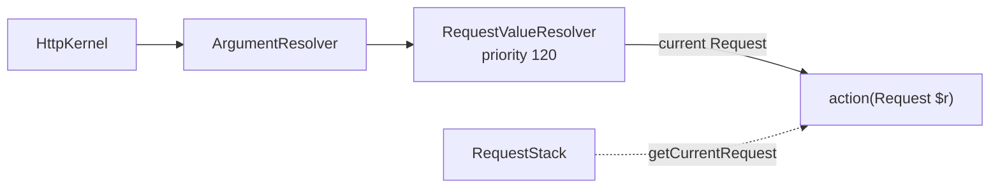

# The Request in a Controller

!!! tip "In a nutshell"
    La `Request` enveloppe les superglobales de PHP dans des parameter bags typés.
    Type-hintez `Request` dans une action (ou injectez `RequestStack` dans un
    service) — n'autowirez jamais `Request` directement. Piège d'examen :
    `$request->request` est le corps POST, tandis que les paramètres de route
    vivent dans `$request->attributes`.

!!! example "Real-world analogy"
    Imaginez la `Request` comme le dossier d'accueil d'un visiteur, et chaque
    parameter bag comme un **tiroir étiqueté** du bureau de réception. `query`
    contient ce qui a été crié depuis le pas de la porte (le `?…` de l'URL / GET) ;
    `request` contient le formulaire que le visiteur a réellement rempli et déposé
    (le corps POST) ; `attributes` contient les post-it que le bureau lui-même a
    agrafés (les paramètres de route matchés). Ouvrez le tiroir qui correspond à
    votre besoin — chercher un paramètre de route dans `query`, c'est ouvrir un
    tiroir vide.

!!! abstract "Learning objectives"
    À la fin de ce chapitre, vous saurez :

    - [ ] Obtenir la `Request` dans un controller via un type-hint ou la `RequestStack`.
    - [ ] Lire le bon parameter bag pour la query, le corps, les attributes, les
          headers, les cookies, les fichiers et les données serveur.
    - [ ] Expliquer comment la `Request` atteint votre action via le value resolver.

    **Syllabus:** `Controllers → The Request` ·
    **Level:** Advanced ·
    **Est. time:** 14 min ·
    **Prerequisites:** [HTTP → Request](../http/request.md)

---

## Theory

`Symfony\Component\HttpFoundation\Request` est le wrapper orienté objet autour
des superglobales de PHP. Dans un controller, vous ne touchez presque jamais
`$_GET`/`$_POST` directement — vous lisez les **parameter bags** :

| Bag | Propriété | Source | Usage typique |
|---|---|---|---|
| `query` | `$request->query` | `$_GET` | Paramètres de query string |
| `request` | `$request->request` | corps `$_POST` | Champs de formulaire |
| `attributes` | `$request->attributes` | interne à l'app | Paramètres de route, `_route` |
| `cookies` | `$request->cookies` | `$_COOKIE` | Lecture des cookies |
| `files` | `$request->files` | `$_FILES` | Fichiers uploadés |
| `server` | `$request->server` | `$_SERVER` | Valeurs serveur/env |
| `headers` | `$request->headers` | `$_SERVER` HTTP_* | Headers de la request |

Les bags `query` et `request` sont des `InputBag` et exposent des getters typés
(`getString`, `getInt`, `getBoolean`, `getEnum`, `getAlpha`, `getDigits`).

!!! question "Predict first"
    Une route est `/users/{id}`. Lisez-vous `$id` depuis `$request->query`,
    `$request->request` ou `$request->attributes` ?

??? note "Reveal"
    `$request->attributes` — le router y écrit les paramètres de route matchés.
    `query` correspond à `$_GET`, `request` au corps `$_POST`. Et n'autowirez
    jamais `Request` dans le constructeur d'un service ; injectez `RequestStack`
    à la place.

## Deep Dive — how it works internally

Vous obtenez la `Request` de deux façons :

1. **Type-hinter l'argument.** Quand un paramètre d'action est type-hinté
   `Request`, `Symfony\Component\HttpKernel\Controller\ArgumentResolver\RequestValueResolver`
   fournit la request *courante*. Ce resolver a une **priorité élevée (120)**, donc
   l'argument est rempli de manière fiable.
2. **Injecter `RequestStack`.** Là où vous n'êtes pas dans une action (un service),
   injectez `Symfony\Component\HttpFoundation\RequestStack` et appelez
   `getCurrentRequest()`. Pendant une [sub-request](internal-redirects.md), la
   pile contient plusieurs requests ; celle du sommet est la request active.



La `Request` n'est **pas un service** que vous pouvez autowirer dans un
constructeur — elle a la portée d'une requête et est créée à chaque appel HTTP.
Autowirez `RequestStack` à la place et lisez la request courante de façon lazy.

!!! note "Source reference"
    `RequestValueResolver` —
    [symfony/symfony `8.0`](https://github.com/symfony/symfony/blob/8.0/src/Symfony/Component/HttpKernel/Controller/ArgumentResolver/RequestValueResolver.php).

### Prefer explicit resolvers for input

Lire `$request->query->get('page')` fonctionne, mais Symfony 8 privilégie les
attributes de mapping — `#[MapQueryParameter]`, `#[MapQueryString]`,
`#[MapRequestPayload]` — qui valident et castent pour vous. Voir
[Value Resolvers](value-resolvers.md).

### Null behavior

Les deux familles de getters d'un `InputBag` divergent sur `null`, et l'examen
adore cette différence :

- `$request->query->get('x')` retourne la valeur brute **ou `null`** quand la clé
  est absente — sa valeur par défaut implicite est `null`, et le type de retour
  est `?string`. Donc `$request->query->get('page')` sur une URL sans `?page=`
  vaut `null`.
- Les getters typés ne rendent jamais `null` pour une clé absente :
  `getInt('page', 1)` retourne `1`, `getString('q')` retourne `''`,
  `getBoolean('flag')` retourne `false`. Vous fournissez la valeur par défaut ;
  ils coercent et garantissent le type.

Le bug null classique est `(int) $request->query->get('page')` — quand `page`
est absent, le cast transforme `null` en `0`, pas en une valeur par défaut
sensée. Fournissez soit une valeur par défaut (`get('page', '1')`), soit, mieux,
utilisez `getInt('page', 1)` pour que le type et le fallback soient explicites.
Sous `declare(strict_types=1)`, un `null` égaré qui arrive dans un paramètre
`int` est exactement le genre d'erreur que les getters typés préviennent.

(Notez que `InputBag::get()` lève aussi une exception si la valeur est un tableau
non scalaire — il ne retourne qu'un scalaire ou `null`, jamais un tableau.)

!!! note "Null in real life"
    Tirer un tiroir jamais rempli ne vous donne rien (`null`). Un tiroir avec un
    formulaire par défaut imprimé vous tend toujours au moins le formulaire vierge —
    c'est ce que `getInt`/`getString` avec une valeur par défaut vous donnent.

## Configuration & code

=== "Type-hint"

    ```php
    <?php
    declare(strict_types=1);

    namespace App\Controller;

    use Symfony\Bundle\FrameworkBundle\Controller\AbstractController;
    use Symfony\Component\HttpFoundation\Request;
    use Symfony\Component\HttpFoundation\Response;
    use Symfony\Component\Routing\Attribute\Route;

    final class SearchController extends AbstractController
    {
        #[Route('/search', name: 'search', methods: ['GET'])]
        public function __invoke(Request $request): Response
        {
            $term = $request->query->getString('q');
            $page = $request->query->getInt('page', 1);
            $ua   = $request->headers->get('User-Agent', 'unknown');

            return $this->render('search/results.html.twig', [
                'term' => $term,
                'page' => $page,
                'ua'   => $ua,
            ]);
        }
    }
    ```

=== "RequestStack (service)"

    ```php
    <?php
    declare(strict_types=1);

    namespace App\Service;

    use Symfony\Component\HttpFoundation\RequestStack;

    final class LocaleReader
    {
        public function __construct(private RequestStack $requestStack) {}

        public function currentLocale(): string
        {
            return $this->requestStack->getCurrentRequest()?->getLocale() ?? 'en';
        }
    }
    ```

## Best practices & anti-patterns

| ✅ À faire | ❌ À éviter |
|---|---|
| Type-hinter `Request` dans les actions | Lire les superglobales `$_GET`/`$_POST` |
| Utiliser les getters typés d'`InputBag` (`getInt`, `getEnum`) | `get()` puis un cast manuel |
| Injecter `RequestStack` dans les services | Tenter d'autowirer `Request` dans un constructeur |
| Préférer `#[MapQueryParameter]` pour une entrée validée | Parser/valider les query strings à la main |

## When (not) to use it / alternatives

- Type-hintez `Request` quand vous avez besoin de plusieurs valeurs disparates ou du corps brut.
- Utilisez les attributes de mapping quand l'entrée se mappe proprement sur des scalaires typés ou un DTO.
- Utilisez `RequestStack` uniquement hors de la chaîne d'appel du controller (listeners, services).

!!! danger "Certification traps"
    - `Request` a la **portée d'une requête**, ce n'est pas un service du container —
      vous ne pouvez pas l'injecter par constructeur ; injectez `RequestStack`.
    - `$request->request` est le bag du **corps POST**, pas « l'objet request ». Le
      nommage piège beaucoup de monde.
    - Les paramètres de route vivent dans `$request->attributes`, pas dans `query`.
    - `getInt`/`getString` existent sur `InputBag` (`query`, `request`) ; `headers`,
      `cookies`, `server`, `files` sont des `HeaderBag`/`ParameterBag`/`FileBag`.

!!! warning "Common mistakes"
    - Chercher un paramètre de route dans `$request->query` au lieu d'`attributes`.
    - Supposer que `$request->getContent()` est décodé en JSON — il retourne le
      corps brut ; utilisez `#[MapRequestPayload]` ou `json_decode()` vous-même.

## Exercises

1. **(Basique)** Dans une action, lisez un paramètre de query `page` comme un int
   valant 1 par défaut, ainsi qu'un header `Accept`.
2. **(Intermédiaire)** Dans un service, retournez l'IP cliente de la request
   courante, en gérant proprement le cas sans request.

??? success "Solutions"

    **1.**
    ```php
    $page = $request->query->getInt('page', 1);
    $accept = $request->headers->get('Accept', '*/*');
    ```

    **2.**
    ```php
    public function clientIp(): ?string
    {
        return $this->requestStack->getCurrentRequest()?->getClientIp();
    }
    ```
    L'opérateur nullsafe gère le contexte CLI/sans request.

## Certification questions

??? question "Q1. Which resolver fills a `Request` type-hinted argument?"
    - [x] A. `RequestValueResolver` ✅
    - [ ] B. `RequestAttributeValueResolver`
    - [ ] C. `RequestPayloadValueResolver`
    - [ ] D. `DefaultValueResolver`

    **Why:** `RequestValueResolver` fournit la `Request` courante ; le resolver
    d'attributes gère les paramètres de route. **Ref:** [controller](https://symfony.com/doc/current/controller.html#the-request-object-as-a-controller-argument).

??? question "Q2. Where do route parameters land?"
    - [ ] A. `$request->query`
    - [ ] B. `$request->request`
    - [x] C. `$request->attributes` ✅
    - [ ] D. `$request->server`

    **Why:** le router écrit les paramètres matchés dans le bag `attributes`.
    **Ref:** [request](https://symfony.com/doc/current/components/http_foundation.html#request).

??? question "Q3. How should a service obtain the current request?"
    - [ ] A. Autowire `Request` in the constructor.
    - [x] B. Inject `RequestStack` and call `getCurrentRequest()`. ✅
    - [ ] C. Read `$GLOBALS['request']`.
    - [ ] D. Call `Request::createFromGlobals()`.

    **Why:** la `Request` a la portée d'une requête ; `RequestStack` est le service
    stable.
    **Ref:** [request stack](https://symfony.com/doc/current/service_container/request.html).

## Key takeaways

- Type-hintez `Request` dans les actions ; injectez `RequestStack` dans les services.
- Bags : `query` (GET), `request` (corps POST), `attributes` (route/interne),
  `headers`, `cookies`, `files`, `server`.
- Les getters typés d'`InputBag` castent en sécurité ; préférez les attributes de mapping pour la validation.

## Last-minute revision

!!! tip "Cheat sheet"
    - `query`→GET, `request`→POST, `attributes`→paramètres de route.
    - `getInt/getString/getEnum/getBoolean` sur `query` & `request`.
    - Services : `RequestStack::getCurrentRequest()`. N'autowirez jamais `Request`.

## Connections

- **Depends on:** [HTTP → Request](../http/request.md) — la `Request` HttpFoundation que ce chapitre lit dans un controller.
- **Reused in:** [Value Resolvers](value-resolvers.md) — le `RequestValueResolver` (priorité 120) fournit l'argument `Request`.
- **Confused with:** [The Session](session.md) — injectez `RequestStack` (pas `Request`/`Session`) dans les services.

## Official References
- [Official Symfony docs — HttpFoundation Request](https://symfony.com/doc/current/components/http_foundation.html)
- [Official Symfony docs — Request as controller argument](https://symfony.com/doc/current/controller.html)
- [Symfony source — RequestValueResolver](https://github.com/symfony/symfony/blob/8.0/src/Symfony/Component/HttpKernel/Controller/ArgumentResolver/RequestValueResolver.php)

## Video references

!!! tip "Watch & learn"
    Voici des chaînes vidéo officielles, mises à jour en continu — cherchez-y
    « Symfony controllers » pour consolider ce chapitre. Nous référençons des
    chaînes stables plutôt que des vidéos individuelles afin que les références ne
    périment jamais.

    - [SymfonyCasts screencasts](https://symfonycasts.com/tracks/symfony) — tutoriels scénarisés à suivre en codant.
    - [Symfony official YouTube](https://www.youtube.com/@SymfonyOfficial) — conférences et keynotes SymfonyCon.
    - [Official docs for this topic](https://symfony.com/doc/current/controller.html#the-request-object-as-a-controller-argument) — certaines pages de la doc Symfony intègrent un screencast.

## Confidence check

Je suis prêt quand je peux :

- [ ] expliquer **pourquoi** la `Request` a la portée d'une requête et n'est pas autowirable
- [ ] lire le bon bag/getter typé pour la query, le corps, les attributes et les headers en Symfony 8
- [ ] déboguer un paramètre de route introuvable parce qu'il était cherché dans `query`
- [ ] repérer la différence entre `get()` (nullable) et `getInt`/`getString` (avec défaut)
- [ ] expliquer comment le `RequestValueResolver` remplit un argument `Request`

---

<small>Related: [HTTP → Request](../http/request.md) · [Value Resolvers](value-resolvers.md) · [The Response](response.md) · [Cookies](cookies.md)</small>
