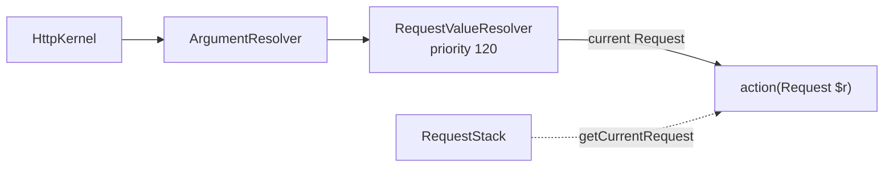

# The Request in a Controller

!!! tip "In a nutshell"
    The `Request` wraps PHP's superglobals into typed parameter bags. Type-hint
    `Request` in an action (or inject `RequestStack` in a service) — never autowire
    `Request` directly. Exam hook: `$request->request` is the POST body, while route
    params live in `$request->attributes`.

!!! example "Real-world analogy"
    Picture the `Request` as a visitor's intake folder, and each parameter bag as a
    **labelled drawer** in the reception desk. `query` holds what was called out
    from the doorway (the `?…` in the URL / GET); `request` holds the form the
    visitor actually filled in and posted (POST body); `attributes` holds the
    sticky notes the office itself clipped on (the matched route params). Open the
    drawer that matches what you need — reaching into `query` for a route param
    finds an empty drawer.

!!! abstract "Learning objectives"
    By the end of this chapter you can:

    - [ ] Obtain the `Request` in a controller via type-hint or `RequestStack`.
    - [ ] Read the correct parameter bag for query, body, attributes, headers,
          cookies, files, and server data.
    - [ ] Explain how the `Request` reaches your action through the value resolver.

    **Syllabus:** `Controllers → The Request` ·
    **Level:** Advanced ·
    **Est. time:** 14 min ·
    **Prerequisites:** [HTTP → Request](../http/request.md)

---

## Theory

`Symfony\Component\HttpFoundation\Request` is the object-oriented wrapper around
PHP's superglobals. In a controller you almost never touch `$_GET`/`$_POST`
directly — you read the **parameter bags**:

| Bag | Property | Source | Typical use |
|---|---|---|---|
| `query` | `$request->query` | `$_GET` | Query string params |
| `request` | `$request->request` | `$_POST` body | Form fields |
| `attributes` | `$request->attributes` | app-internal | Route params, `_route` |
| `cookies` | `$request->cookies` | `$_COOKIE` | Reading cookies |
| `files` | `$request->files` | `$_FILES` | Uploaded files |
| `server` | `$request->server` | `$_SERVER` | Server/env values |
| `headers` | `$request->headers` | `$_SERVER` HTTP_* | Request headers |

Query and request bags are `InputBag` and expose type-safe getters
(`getString`, `getInt`, `getBoolean`, `getEnum`, `getAlpha`, `getDigits`).

!!! question "Predict first"
    A route is `/users/{id}`. Do you read `$id` from `$request->query`,
    `$request->request`, or `$request->attributes`?

??? note "Reveal"
    `$request->attributes` — the router writes matched route params there. `query`
    is `$_GET`, `request` is the `$_POST` body. And never autowire `Request` into a
    service constructor; inject `RequestStack` instead.

## Deep Dive — how it works internally

You get the `Request` two ways:

1. **Type-hint the argument.** When an action parameter is type-hinted
   `Request`, `Symfony\Component\HttpKernel\Controller\ArgumentResolver\RequestValueResolver`
   supplies the *current* request. This resolver has a **high priority (120)**, so
   the argument is filled reliably.
2. **Inject `RequestStack`.** Where you are not inside an action (a service),
   inject `Symfony\Component\HttpFoundation\RequestStack` and call
   `getCurrentRequest()`. During a [sub-request](internal-redirects.md) the stack
   holds several requests; the top is the active one.



The `Request` is **not a service** you can autowire into a constructor — it is
request-scoped and created per HTTP call. Autowire `RequestStack` instead and
read the current request lazily.

!!! note "Source reference"
    `RequestValueResolver` —
    [symfony/symfony `8.0`](https://github.com/symfony/symfony/blob/8.0/src/Symfony/Component/HttpKernel/Controller/ArgumentResolver/RequestValueResolver.php).

### Prefer explicit resolvers for input

Reading `$request->query->get('page')` works, but Symfony 8 favours mapping
attributes — `#[MapQueryParameter]`, `#[MapQueryString]`, `#[MapRequestPayload]`
— which validate and cast for you. See [Value Resolvers](value-resolvers.md).

### Null behavior

The two families of getters on an `InputBag` disagree about `null`, and the exam
loves the difference:

- `$request->query->get('x')` returns the raw value **or `null`** when the key is
  absent — its default default is `null`, and the return type is `?string`. So
  `$request->query->get('page')` on a URL without `?page=` is `null`.
- The typed getters never hand back `null` for a missing key: `getInt('page', 1)`
  returns `1`, `getString('q')` returns `''`, `getBoolean('flag')` returns
  `false`. You give the default; they coerce and guarantee the type.

The common null bug is `(int) $request->query->get('page')` — when `page` is
absent that casts `null` to `0`, not to a sensible default. Either supply a
default (`get('page', '1')`) or, better, use `getInt('page', 1)` so the type and
fallback are explicit. Under `declare(strict_types=1)` a stray `null` flowing into
an `int` parameter is exactly the kind of error the typed getters prevent.

(Note `InputBag::get()` also throws if the value is a non-scalar array — it only
returns a scalar or `null`, never an array.)

!!! note "Null in real life"
    Pulling a drawer that was never filled hands you nothing (`null`). A drawer
    with a printed default form always hands you at least the blank form — that is
    what `getInt`/`getString` with a default give you.

## Configuration & code

=== "Type-hint"

    ```php
    <?php
    declare(strict_types=1);

    namespace App\Controller;

    use Symfony\Bundle\FrameworkBundle\Controller\AbstractController;
    use Symfony\Component\HttpFoundation\Request;
    use Symfony\Component\HttpFoundation\Response;
    use Symfony\Component\Routing\Attribute\Route;

    final class SearchController extends AbstractController
    {
        #[Route('/search', name: 'search', methods: ['GET'])]
        public function __invoke(Request $request): Response
        {
            $term = $request->query->getString('q');
            $page = $request->query->getInt('page', 1);
            $ua   = $request->headers->get('User-Agent', 'unknown');

            return $this->render('search/results.html.twig', [
                'term' => $term,
                'page' => $page,
                'ua'   => $ua,
            ]);
        }
    }
    ```

=== "RequestStack (service)"

    ```php
    <?php
    declare(strict_types=1);

    namespace App\Service;

    use Symfony\Component\HttpFoundation\RequestStack;

    final class LocaleReader
    {
        public function __construct(private RequestStack $requestStack) {}

        public function currentLocale(): string
        {
            return $this->requestStack->getCurrentRequest()?->getLocale() ?? 'en';
        }
    }
    ```

## Best practices & anti-patterns

| ✅ Do | ❌ Avoid |
|---|---|
| Type-hint `Request` in actions | Reading `$_GET`/`$_POST` superglobals |
| Use `InputBag` typed getters (`getInt`, `getEnum`) | `get()` then manual casting |
| Inject `RequestStack` in services | Trying to autowire `Request` into a constructor |
| Prefer `#[MapQueryParameter]` for validated input | Hand-parsing/validating query strings |

## When (not) to use it / alternatives

- Type-hint `Request` when you need several disparate values or the raw body.
- Use mapping attributes when the input maps cleanly to typed scalars or a DTO.
- Use `RequestStack` only outside the controller call chain (listeners, services).

!!! danger "Certification traps"
    - `Request` is **request-scoped**, not a container service — you cannot
      constructor-inject it; inject `RequestStack`.
    - `$request->request` is the **POST body** bag, not "the request object". The
      naming trips people up.
    - Route parameters live in `$request->attributes`, not `query`.
    - `getInt`/`getString` are on `InputBag` (`query`, `request`); `headers`,
      `cookies`, `server`, `files` are `HeaderBag`/`ParameterBag`/`FileBag`.

!!! warning "Common mistakes"
    - Looking for a route param in `$request->query` instead of `attributes`.
    - Assuming `$request->getContent()` is JSON-decoded — it returns the raw body;
      use `#[MapRequestPayload]` or `json_decode()` yourself.

## Exercises

1. **(Basic)** In an action, read a `page` query param as an int defaulting to 1
   and an `Accept` header.
2. **(Intermediate)** In a service, return the current request's client IP,
   handling the no-request case gracefully.

??? success "Solutions"

    **1.**
    ```php
    $page = $request->query->getInt('page', 1);
    $accept = $request->headers->get('Accept', '*/*');
    ```

    **2.**
    ```php
    public function clientIp(): ?string
    {
        return $this->requestStack->getCurrentRequest()?->getClientIp();
    }
    ```
    The nullsafe operator handles the CLI/no-request context.

## Certification questions

??? question "Q1. Which resolver fills a `Request` type-hinted argument?"
    - [x] A. `RequestValueResolver` ✅
    - [ ] B. `RequestAttributeValueResolver`
    - [ ] C. `RequestPayloadValueResolver`
    - [ ] D. `DefaultValueResolver`

    **Why:** `RequestValueResolver` supplies the current `Request`; the attribute
    resolver handles route parameters. **Ref:** [controller](https://symfony.com/doc/current/controller.html#the-request-object-as-a-controller-argument).

??? question "Q2. Where do route parameters land?"
    - [ ] A. `$request->query`
    - [ ] B. `$request->request`
    - [x] C. `$request->attributes` ✅
    - [ ] D. `$request->server`

    **Why:** the router writes matched parameters into the `attributes` bag.
    **Ref:** [request](https://symfony.com/doc/current/components/http_foundation.html#request).

??? question "Q3. How should a service obtain the current request?"
    - [ ] A. Autowire `Request` in the constructor.
    - [x] B. Inject `RequestStack` and call `getCurrentRequest()`. ✅
    - [ ] C. Read `$GLOBALS['request']`.
    - [ ] D. Call `Request::createFromGlobals()`.

    **Why:** the `Request` is request-scoped; `RequestStack` is the stable service.
    **Ref:** [request stack](https://symfony.com/doc/current/service_container/request.html).

## Key takeaways

- Type-hint `Request` in actions; inject `RequestStack` in services.
- Bags: `query` (GET), `request` (POST body), `attributes` (route/internal),
  `headers`, `cookies`, `files`, `server`.
- `InputBag` typed getters cast safely; prefer mapping attributes for validation.

## Last-minute revision

!!! tip "Cheat sheet"
    - `query`→GET, `request`→POST, `attributes`→route params.
    - `getInt/getString/getEnum/getBoolean` on `query` & `request`.
    - Services: `RequestStack::getCurrentRequest()`. Never autowire `Request`.

## Connections

- **Depends on:** [HTTP → Request](../http/request.md) — the HttpFoundation `Request` this chapter reads inside a controller.
- **Reused in:** [Value Resolvers](value-resolvers.md) — `RequestValueResolver` (priority 120) supplies the `Request` argument.
- **Confused with:** [The Session](session.md) — inject `RequestStack` (not `Request`/`Session`) into services.

## Official References
- [Official Symfony docs — HttpFoundation Request](https://symfony.com/doc/current/components/http_foundation.html)
- [Official Symfony docs — Request as controller argument](https://symfony.com/doc/current/controller.html)
- [Symfony source — RequestValueResolver](https://github.com/symfony/symfony/blob/8.0/src/Symfony/Component/HttpKernel/Controller/ArgumentResolver/RequestValueResolver.php)

## Video references

!!! tip "Watch & learn"
    These are official, continuously-updated video channels — search them for
    "Symfony controllers" to reinforce this chapter. We link stable channels rather than
    individual videos so the references never rot.

    - [SymfonyCasts screencasts](https://symfonycasts.com/tracks/symfony) — scripted, code-along tutorials.
    - [Symfony official YouTube](https://www.youtube.com/@SymfonyOfficial) — SymfonyCon conference talks & keynotes.
    - [Official docs for this topic](https://symfony.com/doc/current/controller.html#the-request-object-as-a-controller-argument) — some Symfony doc pages embed a screencast.

## Confidence check

I'm ready when I can:

- [ ] explain **why** `Request` is request-scoped and not autowireable
- [ ] read the right bag/typed getter for query, body, attributes, and headers in Symfony 8
- [ ] debug a route param not found because it was sought in `query`
- [ ] spot the `get()` (nullable) vs `getInt`/`getString` (defaulted) difference
- [ ] explain how `RequestValueResolver` fills a `Request` argument

---

<small>Related: [HTTP → Request](../http/request.md) · [Value Resolvers](value-resolvers.md) · [The Response](response.md) · [Cookies](cookies.md)</small>
