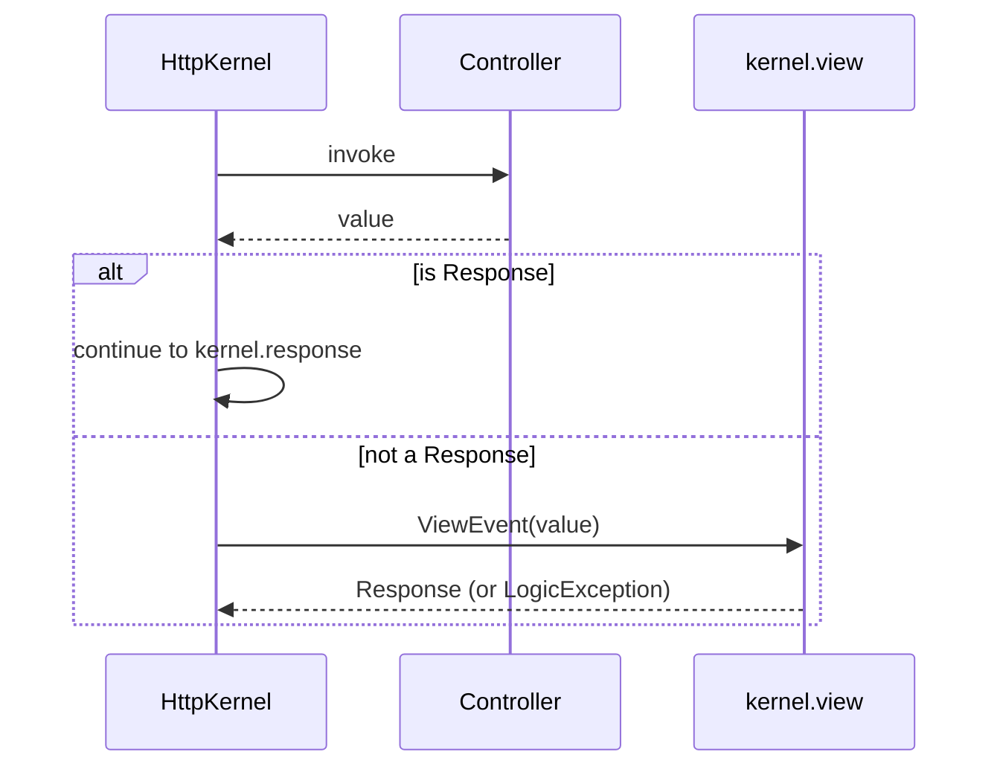

# Retourner des responses

!!! tip "In a nutshell"
    Tout controller doit retourner une `Response` — sinon `kernel.view` doit en
    construire une, ou le kernel lève une `LogicException`. Choisissez la sous-classe
    selon la charge utile : `JsonResponse`, `StreamedResponse` ou `BinaryFileResponse`.

!!! example "Real-world analogy"
    Si le controller est le **réceptionniste** qui prend une request, la `Response` est
    l'enveloppe scellée qu'il doit rendre — chaque visiteur repart avec une. La
    sous-classe est le type d'enveloppe : une simple lettre (`Response`, HTML), une
    note structurée (`JsonResponse`), un colis entier (`BinaryFileResponse`), ou une
    dictée en direct donnée page par page (`StreamedResponse`). Repartez sans enveloppe
    et le superviseur du bâtiment (le kernel) déclenche l'alarme — la
    `LogicException`.

!!! abstract "Learning objectives"
    À la fin de ce chapitre, vous saurez :

    - [ ] Retourner des responses `Response`, `JsonResponse`, streamées et binaires.
    - [ ] Expliquer pourquoi un controller **doit** retourner une `Response` et comment
          le kernel l'impose.
    - [ ] Choisir le bon type de response pour du HTML, du JSON, des téléchargements et
          les charges utiles volumineuses.

    **Syllabus:** `Controllers → The Response` ·
    **Level:** Advanced ·
    **Est. time:** 14 min ·
    **Prerequisites:** [HTTP → Response](../http/response.md)

---

## Pour les nuls

### L'idée en une phrase
Chaque contrôleur doit rendre une enveloppe scellée (`Response`) — repartir les mains vides fait planter l'application.

### Imagine dans la vraie vie
Le réceptionniste (le contrôleur) doit toujours rendre une enveloppe scellée au visiteur — jamais le laisser repartir les mains vides. Le type d'enveloppe dépend du contenu : une simple lettre (`Response`, HTML), un mémo structuré (`JsonResponse`), un colis entier (`BinaryFileResponse`), ou une dictée en direct page par page (`StreamedResponse`).

### Dans Symfony
Oublier de retourner une `Response` dans une action déclenche une `LogicException` — sauf si un listener `kernel.view` sait construire une réponse à partir de ce que tu as retourné (par exemple un tableau, avec un bundle dédié).

### Exemple simple
```php
public function api(): JsonResponse { return $this->json(['statut' => 'ok']); }
```

### Comment le mémoriser 🧠
Choisis le sous-type par la nature du contenu : JSON → `JsonResponse`, fichier téléchargeable → `BinaryFileResponse`, flux progressif → `StreamedResponse`.


## Theory

Tout controller doit retourner une `Symfony\Component\HttpFoundation\Response`. Les
principales variantes :

| Classe | Usage | Content-Type |
|---|---|---|
| `Response` | HTML / corps arbitraire | vous le définissez |
| `JsonResponse` | APIs JSON | `application/json` |
| `RedirectResponse` | Redirections | — (header Location) |
| `StreamedResponse` | Sortie volumineuse / en direct | vous le définissez |
| `BinaryFileResponse` | Téléchargements de fichiers | deviné depuis le fichier |

Les raccourcis d'`AbstractController` les enveloppent : `render()`→`Response`,
`json()`→`JsonResponse`, `file()`→`BinaryFileResponse`, `stream()`→
`StreamedResponse`, `redirectToRoute()`→`RedirectResponse`.

```php
// AbstractController shortcuts and the Response subclass each one builds
return $this->render('page.html.twig');       // Response (HTML)
return $this->json(['ok' => true]);           // JsonResponse
return $this->file('/tmp/report.pdf');        // BinaryFileResponse
return $this->stream('big_list.html.twig');   // StreamedResponse
return $this->redirectToRoute('homepage');    // RedirectResponse
```

!!! question "Predict first"
    Une action retourne un simple tableau PHP au lieu d'une `Response`. Symfony le
    sérialise-t-il automatiquement en JSON, ou se passe-t-il autre chose ?

??? note "Reveal"
    Ni l'un ni l'autre par défaut. Un retour qui n'est pas une `Response` déclenche
    `kernel.view` (`ViewEvent`) ; si aucun listener ne construit de `Response`, le
    kernel lève une `LogicException`. Il n'existe pas de listener intégré
    tableau→JSON — retournez vous-même une `JsonResponse`.

## Deep Dive — how it works internally

Le kernel appelle votre controller à l'intérieur de `HttpKernel::handle()`. Si la
valeur retournée n'est **pas** une `Response`, le kernel dispatche un
`Symfony\Component\HttpKernel\Event\ViewEvent` (`kernel.view`) pour qu'un listener
puisse transformer votre valeur en une `Response`. Si aucun listener n'en produit une,
le kernel lève une `LogicException` : *"The controller must return a Response..."*.



- `JsonResponse` encode la charge utile en JSON avec des flags sûrs et définit le
  `Content-Type`. Utilisez `JsonResponse::fromJsonString()` quand vous disposez déjà
  d'une chaîne JSON, afin d'éviter un double encodage.
- `StreamedResponse` prend un **callback** ; rien n'est mis en tampon — vous faites
  `echo` et `flush()` morceau par morceau. Le corps est produit pendant `send()`,
  vous ne pouvez donc plus modifier les headers une fois le streaming commencé.
- `BinaryFileResponse` streame un fichier efficacement, prend en charge les range
  requests HTTP (téléchargements reprenables) et le délestage
  `X-Sendfile`/`X-Accel-Redirect`.

```php
// JsonResponse encodes for you; fromJsonString() skips re-encoding
$auto = new JsonResponse(['id' => 1]);
$raw  = JsonResponse::fromJsonString('{"id":1}');

// StreamedResponse: the callback echoes and flushes chunks at send() time
$stream = new StreamedResponse(function (): void {
    echo 'chunk';
    flush();
});

// BinaryFileResponse: efficient download, supports HTTP range requests
$file = new BinaryFileResponse('/var/invoices/42.pdf');
$file->setAutoLastModified();
```

!!! note "Source reference"
    `Symfony\Component\HttpFoundation\Response` et ses sous-classes —
    [symfony/symfony `8.0`](https://github.com/symfony/symfony/blob/8.0/src/Symfony/Component/HttpFoundation/Response.php).

## Configuration & code

=== "HTML / JSON"

    ```php
    <?php
    declare(strict_types=1);

    namespace App\Controller;

    use Symfony\Bundle\FrameworkBundle\Controller\AbstractController;
    use Symfony\Component\HttpFoundation\JsonResponse;
    use Symfony\Component\HttpFoundation\Response;
    use Symfony\Component\Routing\Attribute\Route;

    final class PageController extends AbstractController
    {
        #[Route('/page', name: 'page')]
        public function html(): Response
        {
            return new Response('<h1>Hi</h1>', Response::HTTP_OK, [
                'Content-Type' => 'text/html',
            ]);
        }

        #[Route('/api/ping', name: 'api_ping')]
        public function json(): JsonResponse
        {
            return $this->json(['pong' => true], Response::HTTP_OK);
        }
    }
    ```

=== "Streamed"

    ```php
    <?php
    declare(strict_types=1);

    namespace App\Controller;

    use Symfony\Component\HttpFoundation\StreamedResponse;
    use Symfony\Component\Routing\Attribute\Route;

    final class ExportController
    {
        #[Route('/export.csv', name: 'export_csv')]
        public function __invoke(): StreamedResponse
        {
            $response = new StreamedResponse(function (): void {
                $out = fopen('php://output', 'wb');
                fputcsv($out, ['id', 'name']);
                fputcsv($out, [1, 'Ada']);
                fclose($out);
            });
            $response->headers->set('Content-Type', 'text/csv');
            return $response;
        }
    }
    ```

=== "Binary file"

    ```php
    <?php
    declare(strict_types=1);

    namespace App\Controller;

    use Symfony\Bundle\FrameworkBundle\Controller\AbstractController;
    use Symfony\Component\HttpFoundation\BinaryFileResponse;
    use Symfony\Component\Routing\Attribute\Route;

    final class InvoiceController extends AbstractController
    {
        #[Route('/invoice/{id}.pdf', name: 'invoice_pdf')]
        public function download(int $id): BinaryFileResponse
        {
            // file() sets Content-Disposition: attachment by default
            return $this->file(\sprintf('/var/invoices/%d.pdf', $id), "invoice-$id.pdf");
        }
    }
    ```

## Best practices & anti-patterns

| ✅ À faire | ❌ À éviter |
|---|---|
| Retourner une sous-classe typée de `Response` | Faire un `echo` de la sortie directement |
| Utiliser les constantes de statut `Response::HTTP_*` | Des entiers de statut magiques partout |
| Streamer les gros exports avec `StreamedResponse` | Construire d'énormes chaînes en mémoire |
| Utiliser `$this->file()` pour les téléchargements | Lire le fichier à la main + corps de `Response` |

## When (not) to use it / alternatives

- **`Response`** — HTML et sortie générale.
- **`JsonResponse`** — APIs ; à combiner avec le serializer pour les objets.
- **`StreamedResponse`** — sortie volumineuse ou en temps réel (CSV, SSE).
- **`BinaryFileResponse`** — téléchargements de fichiers, range requests, X-Sendfile.

!!! danger "Certification traps"
    - Un controller qui retourne autre chose qu'une `Response` déclenche
      `kernel.view` ; sans listener, vous obtenez une **`LogicException`**, pas un
      200 silencieux.
    - `StreamedResponse` exécute son callback au **moment de l'envoi** ; vous ne
      pouvez plus définir de headers une fois la sortie commencée, et le
      profiler/la toolbar ne peuvent pas y être injectés.
    - `JsonResponse::fromJsonString()` évite le double encodage d'une chaîne JSON
      existante.
    - `BinaryFileResponse` prend en charge les **range requests** ; activez-les avec
      `->setAutoLastModified()` / le support des ranges pour des téléchargements
      reprenables.

!!! warning "Common mistakes"
    - Retourner un tableau depuis une action en s'attendant à du JSON automatique —
      Symfony ne sérialise *pas* automatiquement les tableaux par défaut (aucun
      listener de vue pour cela).
    - Définir le `Content-Type` après le début du streaming.

## Exercises

1. **(Basic)** Retournez une `JsonResponse` avec le statut 422 et un corps
   `{"error": "..."}`.
2. **(Intermediate)** Servez un `report.csv` téléchargeable, généré à la volée avec
   `StreamedResponse`.

??? success "Solutions"

    **1.**
    ```php
    return $this->json(['error' => 'Validation failed'], Response::HTTP_UNPROCESSABLE_ENTITY);
    ```

    **2.** Voir l'onglet *Streamed* ci-dessus ; ajoutez
    `$response->headers->set('Content-Disposition', 'attachment; filename="report.csv"');`.

## Certification questions

??? question "Q1. What must every controller return?"
    - [x] A. A `Symfony\Component\HttpFoundation\Response` (or trigger a view listener). ✅
    - [ ] B. An array that Symfony auto-serializes.
    - [ ] C. A string that becomes the body.
    - [ ] D. `void`; Symfony renders the matching template.

    **Why:** le kernel exige une `Response` ; toute valeur qui n'en est pas une déclenche `kernel.view`.
    **Ref:** [controller](https://symfony.com/doc/8.0/controller.html).

??? question "Q2. When does a `StreamedResponse` produce its body?"
    - [ ] A. When constructed.
    - [ ] B. During `kernel.controller`.
    - [x] C. During `send()`, by invoking its callback. ✅
    - [ ] D. When the profiler collects data.

    **Why:** le callback s'exécute au moment de l'envoi, en streamant la sortie morceau par morceau.
    **Ref:** [streaming response](https://symfony.com/doc/8.0/components/http_foundation.html#streaming-a-response).

??? question "Q3. Which class best serves a resumable file download?"
    - [ ] A. `Response`
    - [ ] B. `StreamedResponse`
    - [x] C. `BinaryFileResponse` ✅
    - [ ] D. `JsonResponse`

    **Why:** elle prend en charge les range requests HTTP et le délestage X-Sendfile.
    **Ref:** [serving files](https://symfony.com/doc/8.0/components/http_foundation.html#serving-files).

## Key takeaways

- Les actions doivent retourner une `Response` ; les autres valeurs exigent un listener `kernel.view`.
- Choisissez `JsonResponse`, `StreamedResponse` ou `BinaryFileResponse` selon la forme de la charge utile.
- `StreamedResponse` streame au moment de l'envoi — pas de changement de headers en cours de stream.
- Utilisez les constantes `Response::HTTP_*` pour les codes de statut.

## Last-minute revision

!!! tip "Cheat sheet"
    - `render`→Response, `json`→JsonResponse, `file`→BinaryFileResponse,
      `stream`→StreamedResponse.
    - Retour non-Response ⇒ ViewEvent ⇒ sinon LogicException.
    - `JsonResponse::fromJsonString($json)` pour du JSON déjà encodé.

## Connections

- **Dépend de :** [HTTP → Response](../http/response.md) — la `Response` d'HttpFoundation et ses sous-classes.
- **Réutilisé dans :** [HTTP Redirects](http-redirects.md) — `RedirectResponse` est l'une de ces sous-classes.
- **À ne pas confondre avec :** [Error Pages](error-pages.md) — les erreurs se produisent en *levant une exception*, pas en construisant une `Response` d'erreur.

## Official References
- [Official Symfony docs — HttpFoundation Response](https://symfony.com/doc/8.0/components/http_foundation.html)
- [Symfony source — Response](https://github.com/symfony/symfony/blob/8.0/src/Symfony/Component/HttpFoundation/Response.php)

## Video references

!!! tip "Watch & learn"
    Voici des chaînes vidéo officielles, mises à jour en continu — cherchez-y
    "Symfony controllers" pour renforcer ce chapitre. Nous lions des chaînes stables
    plutôt que des vidéos individuelles pour que les références ne périment jamais.

    - [SymfonyCasts screencasts](https://symfonycasts.com/tracks/symfony) — tutoriels scénarisés à suivre en codant.
    - [Symfony official YouTube](https://www.youtube.com/@SymfonyOfficial) — conférences et keynotes SymfonyCon.
    - [Official docs for this topic](https://symfony.com/doc/8.0/controller.html) — certaines pages de la doc Symfony intègrent un screencast.

## Confidence check

Je suis prêt quand je peux :

- [ ] expliquer **pourquoi** un controller doit retourner une `Response`
- [ ] choisir `JsonResponse`/`StreamedResponse`/`BinaryFileResponse` selon la charge utile en Symfony 8
- [ ] déboguer la `LogicException` provoquée par le retour d'une valeur non-`Response`
- [ ] repérer que `StreamedResponse` exécute son callback au moment de l'envoi (pas de headers tardifs)
- [ ] expliquer comment `kernel.view` peut transformer une valeur non-`Response` en `Response`

---

<small>Related: [HTTP → Response](../http/response.md) · [The Request](request.md) · [HTTP Redirects](http-redirects.md) · [File Upload](file-upload.md)</small>
