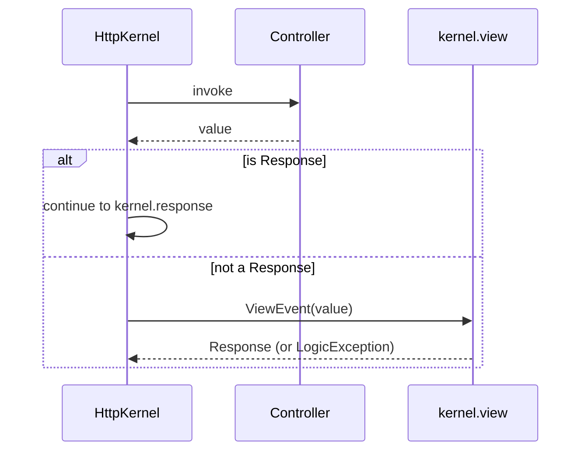

# Returning Responses

!!! tip "In a nutshell"
    Every controller must return a `Response` — otherwise `kernel.view` must build
    one, or the kernel throws a `LogicException`. Pick the subclass by payload:
    `JsonResponse`, `StreamedResponse`, or `BinaryFileResponse`.

!!! example "Real-world analogy"
    If the controller is the **receptionist** taking a request, the `Response` is
    the sealed envelope they must hand back — every visitor leaves with one. The
    subclass is the envelope type: a plain letter (`Response`, HTML), a structured
    memo (`JsonResponse`), a whole parcel (`BinaryFileResponse`), or a live
    dictation given page by page (`StreamedResponse`). Walk away with no envelope
    and the building's supervisor (the kernel) raises an alarm — the
    `LogicException`.

!!! abstract "Learning objectives"
    By the end of this chapter you can:

    - [ ] Return `Response`, `JsonResponse`, streamed, and binary responses.
    - [ ] Explain why a controller **must** return a `Response` and how the kernel
          enforces it.
    - [ ] Choose the right response type for HTML, JSON, downloads, and large payloads.

    **Syllabus:** `Controllers → The Response` ·
    **Level:** Advanced ·
    **Est. time:** 14 min ·
    **Prerequisites:** [HTTP → Response](../http/response.md)

---

## Theory

Every controller must return a `Symfony\Component\HttpFoundation\Response`. The
main variants:

| Class | Use | Content-Type |
|---|---|---|
| `Response` | HTML / arbitrary body | you set it |
| `JsonResponse` | JSON APIs | `application/json` |
| `RedirectResponse` | Redirects | — (Location header) |
| `StreamedResponse` | Large/live output | you set it |
| `BinaryFileResponse` | File downloads | guessed from file |

`AbstractController` shortcuts wrap these: `render()`→`Response`,
`json()`→`JsonResponse`, `file()`→`BinaryFileResponse`, `stream()`→
`StreamedResponse`, `redirectToRoute()`→`RedirectResponse`.

!!! question "Predict first"
    An action returns a plain PHP array instead of a `Response`. Does Symfony
    auto-serialize it to JSON, or something else?

??? note "Reveal"
    Neither by default. A non-`Response` return fires `kernel.view` (`ViewEvent`);
    if no listener builds a `Response`, the kernel throws a `LogicException`. There
    is no built-in array→JSON listener — return a `JsonResponse` yourself.

## Deep Dive — how it works internally

The kernel calls your controller inside `HttpKernel::handle()`. If the returned
value is **not** a `Response`, the kernel dispatches a
`Symfony\Component\HttpKernel\Event\ViewEvent` (`kernel.view`) so a listener can
turn your value into one. If no listener produces a `Response`, the kernel throws
a `LogicException`: *"The controller must return a Response..."*.



- `JsonResponse` JSON-encodes the payload with safe flags and sets the
  `Content-Type`. Use `JsonResponse::fromJsonString()` when you already have a
  JSON string to avoid double-encoding.
- `StreamedResponse` takes a **callback**; nothing is buffered — you `echo` and
  `flush()` chunks. The body is produced during `send()`, so you cannot modify
  headers after streaming begins.
- `BinaryFileResponse` streams a file efficiently, supports HTTP range requests
  (resumable downloads) and `X-Sendfile`/`X-Accel-Redirect` offloading.

!!! note "Source reference"
    `Symfony\Component\HttpFoundation\Response` and subclasses —
    [symfony/symfony `8.0`](https://github.com/symfony/symfony/blob/8.0/src/Symfony/Component/HttpFoundation/Response.php).

## Configuration & code

=== "HTML / JSON"

    ```php
    <?php
    declare(strict_types=1);

    namespace App\Controller;

    use Symfony\Bundle\FrameworkBundle\Controller\AbstractController;
    use Symfony\Component\HttpFoundation\JsonResponse;
    use Symfony\Component\HttpFoundation\Response;
    use Symfony\Component\Routing\Attribute\Route;

    final class PageController extends AbstractController
    {
        #[Route('/page', name: 'page')]
        public function html(): Response
        {
            return new Response('<h1>Hi</h1>', Response::HTTP_OK, [
                'Content-Type' => 'text/html',
            ]);
        }

        #[Route('/api/ping', name: 'api_ping')]
        public function json(): JsonResponse
        {
            return $this->json(['pong' => true], Response::HTTP_OK);
        }
    }
    ```

=== "Streamed"

    ```php
    <?php
    declare(strict_types=1);

    namespace App\Controller;

    use Symfony\Component\HttpFoundation\StreamedResponse;
    use Symfony\Component\Routing\Attribute\Route;

    final class ExportController
    {
        #[Route('/export.csv', name: 'export_csv')]
        public function __invoke(): StreamedResponse
        {
            $response = new StreamedResponse(function (): void {
                $out = fopen('php://output', 'wb');
                fputcsv($out, ['id', 'name']);
                fputcsv($out, [1, 'Ada']);
                fclose($out);
            });
            $response->headers->set('Content-Type', 'text/csv');
            return $response;
        }
    }
    ```

=== "Binary file"

    ```php
    <?php
    declare(strict_types=1);

    namespace App\Controller;

    use Symfony\Bundle\FrameworkBundle\Controller\AbstractController;
    use Symfony\Component\HttpFoundation\BinaryFileResponse;
    use Symfony\Component\Routing\Attribute\Route;

    final class InvoiceController extends AbstractController
    {
        #[Route('/invoice/{id}.pdf', name: 'invoice_pdf')]
        public function download(int $id): BinaryFileResponse
        {
            // file() sets Content-Disposition: attachment by default
            return $this->file(\sprintf('/var/invoices/%d.pdf', $id), "invoice-$id.pdf");
        }
    }
    ```

## Best practices & anti-patterns

| ✅ Do | ❌ Avoid |
|---|---|
| Return a typed `Response` subclass | `echo`ing output directly |
| Use `Response::HTTP_*` status constants | Magic status integers everywhere |
| Stream large exports with `StreamedResponse` | Building huge strings in memory |
| Use `$this->file()` for downloads | Manually reading + `Response` body |

## When (not) to use it / alternatives

- **`Response`** — HTML and general output.
- **`JsonResponse`** — APIs; combine with the serializer for objects.
- **`StreamedResponse`** — large or real-time output (CSV, SSE).
- **`BinaryFileResponse`** — file downloads, range requests, X-Sendfile.

!!! danger "Certification traps"
    - A controller returning a non-`Response` triggers `kernel.view`; without a
      listener you get a **`LogicException`**, not a silent 200.
    - `StreamedResponse` runs its callback at **send time**; you cannot set headers
      after output starts, and the profiler/toolbar cannot be injected into it.
    - `JsonResponse::fromJsonString()` avoids double-encoding an existing JSON
      string.
    - `BinaryFileResponse` supports **range requests**; enable with
      `->setAutoLastModified()` / range support for resumable downloads.

!!! warning "Common mistakes"
    - Returning an array from an action expecting auto-JSON — Symfony does *not*
      auto-serialize arrays by default (no view listener for that).
    - Setting `Content-Type` after streaming has begun.

## Exercises

1. **(Basic)** Return a `JsonResponse` with status 422 and a `{"error": "..."}`
   body.
2. **(Intermediate)** Serve a downloadable `report.csv` generated on the fly with
   `StreamedResponse`.

??? success "Solutions"

    **1.**
    ```php
    return $this->json(['error' => 'Validation failed'], Response::HTTP_UNPROCESSABLE_ENTITY);
    ```

    **2.** See the *Streamed* tab above; add
    `$response->headers->set('Content-Disposition', 'attachment; filename="report.csv"');`.

## Certification questions

??? question "Q1. What must every controller return?"
    - [x] A. A `Symfony\Component\HttpFoundation\Response` (or trigger a view listener). ✅
    - [ ] B. An array that Symfony auto-serializes.
    - [ ] C. A string that becomes the body.
    - [ ] D. `void`; Symfony renders the matching template.

    **Why:** the kernel requires a `Response`; a non-Response fires `kernel.view`.
    **Ref:** [controller](https://symfony.com/doc/current/controller.html).

??? question "Q2. When does a `StreamedResponse` produce its body?"
    - [ ] A. When constructed.
    - [ ] B. During `kernel.controller`.
    - [x] C. During `send()`, by invoking its callback. ✅
    - [ ] D. When the profiler collects data.

    **Why:** the callback runs at send time, streaming output chunk by chunk.
    **Ref:** [streaming response](https://symfony.com/doc/current/components/http_foundation.html#streaming-a-response).

??? question "Q3. Which class best serves a resumable file download?"
    - [ ] A. `Response`
    - [ ] B. `StreamedResponse`
    - [x] C. `BinaryFileResponse` ✅
    - [ ] D. `JsonResponse`

    **Why:** it supports HTTP range requests and X-Sendfile offloading.
    **Ref:** [serving files](https://symfony.com/doc/current/components/http_foundation.html#serving-files).

## Key takeaways

- Actions must return a `Response`; non-Response values need a `kernel.view` listener.
- Pick `JsonResponse`, `StreamedResponse`, or `BinaryFileResponse` by payload shape.
- `StreamedResponse` streams at send time — no header changes mid-stream.
- Use `Response::HTTP_*` constants for status codes.

## Last-minute revision

!!! tip "Cheat sheet"
    - `render`→Response, `json`→JsonResponse, `file`→BinaryFileResponse,
      `stream`→StreamedResponse.
    - Non-Response return ⇒ ViewEvent ⇒ else LogicException.
    - `JsonResponse::fromJsonString($json)` for pre-encoded JSON.

## Connections

- **Depends on:** [HTTP → Response](../http/response.md) — the HttpFoundation `Response` and its subclasses.
- **Reused in:** [HTTP Redirects](http-redirects.md) — `RedirectResponse` is one of these subclasses.
- **Confused with:** [Error Pages](error-pages.md) — errors are produced by *throwing*, not by building an error `Response`.

## Official References
- [Official Symfony docs — HttpFoundation Response](https://symfony.com/doc/current/components/http_foundation.html)
- [Symfony source — Response](https://github.com/symfony/symfony/blob/8.0/src/Symfony/Component/HttpFoundation/Response.php)

## Video references

!!! tip "Watch & learn"
    These are official, continuously-updated video channels — search them for
    "Symfony controllers" to reinforce this chapter. We link stable channels rather than
    individual videos so the references never rot.

    - [SymfonyCasts screencasts](https://symfonycasts.com/tracks/symfony) — scripted, code-along tutorials.
    - [Symfony official YouTube](https://www.youtube.com/@SymfonyOfficial) — SymfonyCon conference talks & keynotes.
    - [Official docs for this topic](https://symfony.com/doc/current/controller.html) — some Symfony doc pages embed a screencast.

## Confidence check

I'm ready when I can:

- [ ] explain **why** a controller must return a `Response`
- [ ] pick `JsonResponse`/`StreamedResponse`/`BinaryFileResponse` by payload in Symfony 8
- [ ] debug the `LogicException` from returning a non-`Response`
- [ ] spot that `StreamedResponse` runs its callback at send time (no late headers)
- [ ] explain how `kernel.view` can turn a non-`Response` into one

---

<small>Related: [HTTP → Response](../http/response.md) · [The Request](request.md) · [HTTP Redirects](http-redirects.md) · [File Upload](file-upload.md)</small>
