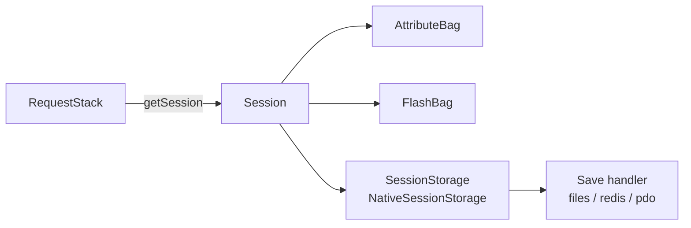

# La session

!!! tip "In a nutshell"
    La session est l'état serveur propre à chaque visiteur ; accédez-y via
    `RequestStack::getSession()` (ou un type-hint `SessionInterface` sur l'action),
    jamais via un constructeur de service. Elle est **lazy** — pas de cookie tant que
    vous n'y touchez pas — et `migrate()` après le login déjoue la fixation de session.

!!! example "Real-world analogy"
    Une session est le **vestiaire** de la réception : un casier privé par visiteur,
    identifié par un ticket (le cookie de session). Rien n'est loué tant que le
    visiteur ne dépose rien — c'est la paresse (lazy) : un visiteur qui ne dépose
    rien ne reçoit pas de ticket (pas de `Set-Cookie`). Régénérer le ticket quand il
    passe au badge VIP (`migrate()` après le login) empêche quiconque de réutiliser
    un vieux talon glissé plus tôt — la fixation de session.

!!! abstract "Learning objectives"
    À la fin de ce chapitre, vous saurez :

    - [ ] Obtenir la session via `RequestStack::getSession()` et par type-hint.
    - [ ] Lire/écrire des attributs via l'attribute bag et comprendre le stockage.
    - [ ] Expliquer les sessions lazy, la migration et l'invalidation pour la sécurité.

    **Syllabus:** `Controllers → The Session` ·
    **Level:** Expert ·
    **Est. time:** 16 min ·
    **Prerequisites:** [The Request](request.md), [Web Security](../php-web-security/web-security.md)

---

## Theory

Une **session** est un état côté serveur, propre à chaque visiteur, identifié par un
id de session stocké dans un cookie. Dans Symfony, vous interagissez avec
`Symfony\Component\HttpFoundation\Session\SessionInterface`, dont les attributs sont
conservés dans un **attribute bag** :

```php
$session->set('cart_id', 42);
$id = $session->get('cart_id', null);
$session->remove('cart_id');
$session->has('cart_id');
```

La session possède aussi le [flash bag](flash-messages.md) et des métadonnées
(création, dernière utilisation, durée de vie).

!!! question "Predict first"
    Une request ne lit ni n'écrit jamais la session. Symfony envoie-t-il quand même un
    `Set-Cookie` de session et appelle-t-il `session_start()` ?

??? note "Reveal"
    Non — les sessions Symfony sont **lazy** : `session_start()` et le cookie ne se
    déclenchent qu'à la première lecture/écriture. C'est pourquoi toucher la session
    sur une page publique la rend non cacheable. Accédez-y via
    `RequestStack::getSession()`, pas via un constructeur de service.

## Deep Dive — how it works internally

### Getting the session — the Symfony 8 way

N'injectez **pas** `SessionInterface` dans un constructeur de service (elle est
liée au scope de la request). À la place :

- **Dans un service :** injectez `RequestStack` et appelez `getSession()`.
- **Dans un controller :** type-hintez `SessionInterface` sur l'action — le
  `Symfony\Component\HttpKernel\Controller\ArgumentResolver\SessionValueResolver`
  (priorité **120**) la fournit, ou appelez `$request->getSession()`.

```php
// In a service: inject RequestStack, then call getSession()
public function __construct(private RequestStack $requestStack) {}

public function cartCount(): int
{
    return \count($this->requestStack->getSession()->get('cart', []));
}

// In an action: SessionValueResolver (priority 120) fills the type-hint
public function show(SessionInterface $session, Request $request): Response
{
    $session->set('last_seen', time());
    $same = $request->getSession();   // same session instance
    // ...
}
```



### Storage & lazy start

`Session` délègue la persistance à une
`Symfony\Component\HttpFoundation\Session\Storage\SessionStorageInterface`
(par défaut `NativeSessionStorage`), qui utilise un **save handler** (fichiers par
défaut ; Redis/PDO configurables). Les sessions Symfony sont **lazy** : le
`session_start()` sous-jacent et le header `Set-Cookie` ne se déclenchent que
lorsque vous lisez ou écrivez réellement la session. Une request qui ne touche
jamais la session n'envoie aucun cookie de session — important pour le cache HTTP
et la vie privée.

```php
// Session delegates to a SessionStorageInterface implementation
$storage = new NativeSessionStorage(['cookie_samesite' => 'lax']); // default storage
$session = new Session($storage);

// Lazy: no session_start(), no Set-Cookie has happened yet...
$session->set('seen', true); // ...first write starts the session + emits the cookie
```

### Security operations

- **`migrate($destroy)`** — régénère l'id de session (nouveau cookie) tout en
  conservant les données. Appelez-la après le login pour prévenir la **fixation de
  session** (les authenticators de Symfony le font automatiquement).
- **`invalidate()`** — efface les données *et* régénère l'id ; à utiliser au logout.

!!! note "Source reference"
    `Symfony\Component\HttpFoundation\Session\Session` et `SessionInterface` —
    [symfony/symfony `8.0`](https://github.com/symfony/symfony/blob/8.0/src/Symfony/Component/HttpFoundation/Session/Session.php).

### Configuration

`framework.session` contrôle le handler, les flags du cookie et la durée de vie.

### Null behavior

Le `null` rencontré ici est la **request courante**, pas la session elle-même.
`RequestStack::getCurrentRequest()` retourne `?Request` — `null` en CLI, dans un
worker, ou partout en dehors du cycle de la request HTTP. Cette absence conditionne
ensuite la façon d'atteindre la session :

- `RequestStack::getSession()` et `Request::getSession()` ne retournent **pas**
  `null` en l'absence de session — elles *lèvent* une `SessionNotFoundException`. Le
  bug n'est donc pas un retour null, mais une exception quand vous appelez
  `getSession()` depuis un contexte sans request (une commande console) ou une
  request sans session.
- À l'intérieur du bag, `$session->get('cart')` retourne `null` pour une clé absente
  sauf si vous passez une valeur par défaut — `$session->get('cart', [])` est
  l'idiome sûr avant un `count()` ou une itération.

Vérifiez d'abord la request : `$request = $rs->getCurrentRequest();` puis
`if (!$request || !$request->hasSession()) { return $fallback; }`. L'opérateur
nullsafe rend la lecture concise : `$rs->getCurrentRequest()?->getSession()`
exige toujours qu'une session existe, alors associez-le à `hasSession()` dans le
code accessible depuis la CLI.

!!! note "Null in real life"
    Arriver après la fermeture : le préposé au vestiaire est rentré chez lui (pas de
    request courante), il n'y a donc simplement personne à qui tendre votre ticket —
    vous vérifiez la présence du préposé avant d'agiter le ticket.

## Configuration & code

=== "Controller"

    ```php
    <?php
    declare(strict_types=1);

    namespace App\Controller;

    use Symfony\Bundle\FrameworkBundle\Controller\AbstractController;
    use Symfony\Component\HttpFoundation\Response;
    use Symfony\Component\HttpFoundation\Session\SessionInterface;
    use Symfony\Component\Routing\Attribute\Route;

    final class CartController extends AbstractController
    {
        #[Route('/cart/add/{id}', name: 'cart_add')]
        public function add(int $id, SessionInterface $session): Response
        {
            $items = $session->get('cart', []);
            $items[] = $id;
            $session->set('cart', $items);

            return $this->redirectToRoute('cart_show');
        }
    }
    ```

=== "Service"

    ```php
    <?php
    declare(strict_types=1);

    namespace App\Service;

    use Symfony\Component\HttpFoundation\RequestStack;

    final class CartStore
    {
        public function __construct(private RequestStack $requestStack) {}

        public function count(): int
        {
            $session = $this->requestStack->getSession();
            return \count($session->get('cart', []));
        }
    }
    ```

=== "YAML"

    ```yaml
    # config/packages/framework.yaml
    framework:
        session:
            handler_id: null          # null = default native file handler
            cookie_secure: auto
            cookie_samesite: lax
            gc_maxlifetime: 1440
    ```

## Best practices & anti-patterns

| ✅ À faire | ❌ À éviter |
|---|---|
| `RequestStack::getSession()` dans les services | Injecter `SessionInterface` dans un constructeur de service |
| Garder la session lazy (n'y toucher qu'au besoin) | Lire la session à chaque request sans nécessité |
| `migrate()` après un changement de privilèges | Réutiliser le même id après le login (fixation) |
| Stocker de petits identifiants | Stocker de gros blobs/entités dans la session |

## When (not) to use it / alternatives

- **Utilisez la session** pour l'état par utilisateur faisant autorité côté serveur
  au sein d'une session de navigation (panier, étape de wizard, contexte CSRF).
- **Évitez-la** pour les pages publiques cacheables — toucher la session déjoue les
  caches HTTP partagés en émettant un `Set-Cookie`.
- Pour un état multi-appareils ou de longue durée, persistez plutôt dans un
  datastore.

!!! danger "Certification traps"
    - Les sessions sont **lazy** : pas de cookie/`session_start()` avant la première
      lecture/écriture. Se contenter d'injecter la session ne la démarre pas.
    - Préférez **`RequestStack::getSession()`** ; injecter `SessionInterface`
      directement dans des services est découragé/supprimé en tant que dépendance
      autowireable liée au scope de la request.
    - `migrate()` conserve les données + nouvel id ; `invalidate()` efface les
      données + nouvel id.
    - Toucher la session sur une page envoie un `Set-Cookie`, ce qui rend la
      response de fait **non cacheable** par les proxies partagés.

!!! warning "Common mistakes"
    - Appeler `getSession()` hors d'une request (CLI) — lève une
      `SessionNotFoundException` ; protégez-vous avec `getCurrentRequest()`.
    - Croire que `remove()` et `clear()` sont identiques — `clear()` vide tout
      l'attribute bag.

## Exercises

1. **(Basic)** Stockez la dernière URL visitée dans la session et relisez-la.
2. **(Expert)** Dans un service, récupérez de façon sûre le nombre d'articles du
   panier en retournant `0` quand il n'existe ni session ni request (compatible CLI).

??? success "Solutions"

    **1.**
    ```php
    $session->set('last_url', $request->getUri());
    $last = $session->get('last_url');
    ```

    **2.**
    ```php
    public function count(): int
    {
        $request = $this->requestStack->getCurrentRequest();
        if (!$request || !$request->hasSession()) {
            return 0;
        }
        return \count($request->getSession()->get('cart', []));
    }
    ```

## Certification questions

??? question "Q1. Recommended way for a service to access the session?"
    - [ ] A. Inject `SessionInterface` in the constructor.
    - [x] B. Inject `RequestStack` and call `getSession()`. ✅
    - [ ] C. Use `$_SESSION` directly.
    - [ ] D. Autowire `Session` and store it as a property.

    **Why:** la session est liée au scope de la request ; `RequestStack` est le point
    d'entrée stable. **Ref:** [sessions](https://symfony.com/doc/current/session.html).

??? question "Q2. When does a lazy Symfony session actually start?"
    - [ ] A. On every request automatically.
    - [x] B. Only when the session is first read or written. ✅
    - [ ] C. When the kernel boots.
    - [ ] D. When `RequestStack` is injected.

    **Why:** les sessions lazy évitent un `Set-Cookie` pour les requests qui ne les utilisent jamais.
    **Ref:** [sessions](https://symfony.com/doc/current/session.html).

??? question "Q3. Which call prevents session fixation after login?"
    - [x] A. `migrate()` (regenerate the id) ✅
    - [ ] B. `clear()`
    - [ ] C. `remove('id')`
    - [ ] D. `save()`

    **Why:** régénérer l'id invalide tout id pré-login qu'un attaquant aurait planté.
    **Ref:** [session security](https://symfony.com/doc/current/session.html).

??? question "Q4. What is a side effect of touching the session on a public page?"
    - [x] A. A `Set-Cookie` header makes it uncacheable by shared proxies. ✅
    - [ ] B. Nothing; sessions never affect caching.
    - [ ] C. It doubles the response size.
    - [ ] D. It disables Twig caching.

    **Why:** les caches partagés ne doivent pas stocker des responses `Set-Cookie` propres à un utilisateur.
    **Ref:** [http cache](https://symfony.com/doc/current/http_cache.html).

## Key takeaways

- Obtenez la session via `RequestStack::getSession()` ou un type-hint sur l'action.
- Attribute bag : `set/get/has/remove/clear` ; il contient aussi le flash bag.
- Les sessions sont lazy — cookie/démarrage seulement à la première utilisation.
- `migrate()` = nouvel id, données conservées (défense contre la fixation) ; `invalidate()` = purge + nouvel id.

## Last-minute revision

!!! tip "Cheat sheet"
    - Service : `RequestStack::getSession()`. Controller : type-hint `SessionInterface`.
    - Stockage : `NativeSessionStorage` + save handler (files/redis/pdo).
    - Lazy : pas de `Set-Cookie` avant d'y toucher ⇒ n'y touchez pas sur les pages cacheables.
    - `migrate()` après le login ; `invalidate()` au logout.

## Connections

- **Dépend de :** [The Request](request.md) — `RequestStack`/`Request::getSession()` est le point d'entrée.
- **Réutilisé dans :** [Flash Messages](flash-messages.md) — le flash bag est un bag à l'intérieur de la session.
- **À ne pas confondre avec :** [Cookies](cookies.md) — la session garde l'état côté serveur ; seul son id voyage dans un cookie.

## Official References
- [Official Symfony docs — Sessions](https://symfony.com/doc/current/session.html)
- [Symfony source — Session](https://github.com/symfony/symfony/blob/8.0/src/Symfony/Component/HttpFoundation/Session/Session.php)

## Video references

!!! tip "Watch & learn"
    Voici des chaînes vidéo officielles, mises à jour en continu — cherchez-y
    "Symfony controllers" pour renforcer ce chapitre. Nous lions des chaînes stables
    plutôt que des vidéos individuelles pour que les références ne périment jamais.

    - [SymfonyCasts screencasts](https://symfonycasts.com/tracks/symfony) — tutoriels scénarisés à suivre en codant.
    - [Symfony official YouTube](https://www.youtube.com/@SymfonyOfficial) — conférences et keynotes SymfonyCon.
    - [Official docs for this topic](https://symfony.com/doc/current/session.html) — certaines pages de la doc Symfony intègrent un screencast.

## Confidence check

Je suis prêt quand je peux :

- [ ] expliquer **pourquoi** les sessions sont lazy et liées au scope de la request
- [ ] lire/écrire les attributs de session et configurer le handler en Symfony 8
- [ ] déboguer une `SessionNotFoundException` provoquée par un appel à `getSession()` en CLI
- [ ] distinguer `migrate()` (données conservées, nouvel id) de `invalidate()` (purge + nouvel id)
- [ ] expliquer comment toucher la session émet un `Set-Cookie` et déjoue les caches partagés

---

<small>Related: [Flash Messages](flash-messages.md) · [The Request](request.md) · [Cookies](cookies.md) · [Security](../security/index.md)</small>
