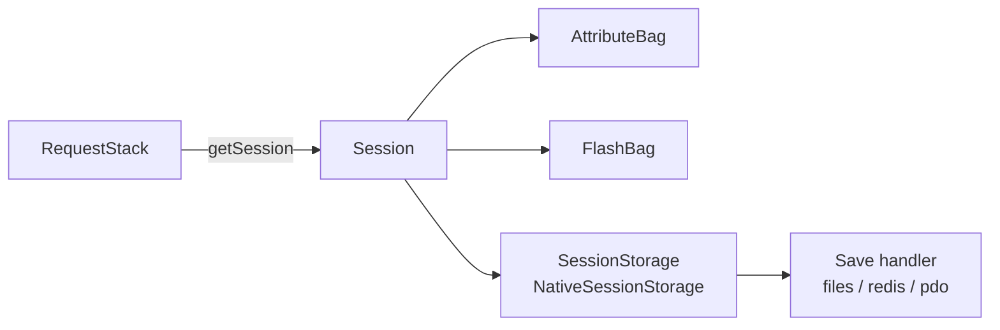

# The Session

!!! abstract "Learning objectives"
    By the end of this chapter you can:

    - [ ] Obtain the session via `RequestStack::getSession()` and type-hinting.
    - [ ] Read/write attributes through the attribute bag and understand storage.
    - [ ] Explain lazy sessions, migration, and invalidation for security.

    **Syllabus:** `Controllers → The Session` ·
    **Level:** Expert ·
    **Est. time:** 16 min ·
    **Prerequisites:** [The Request](request.md), [Web Security](../php-web-security/web-security.md)

---

## Theory

A **session** is server-side, per-visitor state keyed by a session id stored in a
cookie. In Symfony you interact with
`Symfony\Component\HttpFoundation\Session\SessionInterface`, whose attributes are
held in an **attribute bag**:

```php
$session->set('cart_id', 42);
$id = $session->get('cart_id', null);
$session->remove('cart_id');
$session->has('cart_id');
```

The session also owns the [flash bag](flash-messages.md) and metadata (created,
last-used, lifetime).

## Deep Dive — how it works internally

### Getting the session — the Symfony 8 way

Do **not** inject `SessionInterface` into a service constructor (it is
request-scoped). Instead:

- **In a service:** inject `RequestStack` and call `getSession()`.
- **In a controller:** type-hint `SessionInterface` on the action — the
  `Symfony\Component\HttpKernel\Controller\ArgumentResolver\SessionValueResolver`
  (priority **120**) supplies it, or call `$request->getSession()`.



### Storage & lazy start

`Session` delegates persistence to a
`Symfony\Component\HttpFoundation\Session\Storage\SessionStorageInterface`
(default `NativeSessionStorage`), which uses a **save handler** (files by
default; Redis/PDO configurable). Symfony sessions are **lazy**: the underlying
`session_start()` and the `Set-Cookie` header fire only when you actually read or
write the session. A request that never touches the session sends no session
cookie — important for HTTP caching and privacy.

### Security operations

- **`migrate($destroy)`** — regenerates the session id (new cookie) while keeping
  data. Call after login to prevent **session fixation** (Symfony's authenticators
  do this automatically).
- **`invalidate()`** — clears data *and* regenerates the id; use on logout.

!!! note "Source reference"
    `Symfony\Component\HttpFoundation\Session\Session` and `SessionInterface` —
    [symfony/symfony `8.0`](https://github.com/symfony/symfony/blob/8.0/src/Symfony/Component/HttpFoundation/Session/Session.php).

### Configuration

`framework.session` controls the handler, cookie flags, and lifetime.

## Configuration & code

=== "Controller"

    ```php
    <?php
    declare(strict_types=1);

    namespace App\Controller;

    use Symfony\Bundle\FrameworkBundle\Controller\AbstractController;
    use Symfony\Component\HttpFoundation\Response;
    use Symfony\Component\HttpFoundation\Session\SessionInterface;
    use Symfony\Component\Routing\Attribute\Route;

    final class CartController extends AbstractController
    {
        #[Route('/cart/add/{id}', name: 'cart_add')]
        public function add(int $id, SessionInterface $session): Response
        {
            $items = $session->get('cart', []);
            $items[] = $id;
            $session->set('cart', $items);

            return $this->redirectToRoute('cart_show');
        }
    }
    ```

=== "Service"

    ```php
    <?php
    declare(strict_types=1);

    namespace App\Service;

    use Symfony\Component\HttpFoundation\RequestStack;

    final class CartStore
    {
        public function __construct(private RequestStack $requestStack) {}

        public function count(): int
        {
            $session = $this->requestStack->getSession();
            return \count($session->get('cart', []));
        }
    }
    ```

=== "YAML"

    ```yaml
    # config/packages/framework.yaml
    framework:
        session:
            handler_id: null          # null = default native file handler
            cookie_secure: auto
            cookie_samesite: lax
            gc_maxlifetime: 1440
    ```

## Best practices & anti-patterns

| ✅ Do | ❌ Avoid |
|---|---|
| `RequestStack::getSession()` in services | Injecting `SessionInterface` into a service ctor |
| Keep the session lazy (touch only when needed) | Reading the session on every request unnecessarily |
| `migrate()` after privilege change | Reusing the same id post-login (fixation) |
| Store small identifiers | Storing large blobs/entities in the session |

## When (not) to use it / alternatives

- **Use the session** for server-authoritative per-user state within a browsing
  session (cart, wizard step, CSRF context).
- **Avoid** it for cacheable public pages — touching the session defeats shared
  HTTP caches by emitting a `Set-Cookie`.
- For cross-device or long-lived state, persist to a datastore instead.

!!! danger "Certification traps"
    - Sessions are **lazy**: no cookie/`session_start()` until first read/write.
      Merely injecting the session does not start it.
    - Prefer **`RequestStack::getSession()`**; injecting `SessionInterface` directly
      into services is discouraged/removed as an autowireable request-scoped
      dependency.
    - `migrate()` keeps data + new id; `invalidate()` clears data + new id.
    - Touching the session on a page sends `Set-Cookie`, which makes the response
      effectively **uncacheable** by shared proxies.

!!! warning "Common mistakes"
    - Calling `getSession()` outside a request (CLI) — throws
      `SessionNotFoundException`; guard with `getCurrentRequest()`.
    - Assuming `remove()` and `clear()` are the same — `clear()` empties the whole
      attribute bag.

## Exercises

1. **(Basic)** Store the last visited URL in the session and read it back.
2. **(Expert)** In a service, safely fetch the cart count returning `0` when no
   session/request exists (CLI-safe).

??? success "Solutions"

    **1.**
    ```php
    $session->set('last_url', $request->getUri());
    $last = $session->get('last_url');
    ```

    **2.**
    ```php
    public function count(): int
    {
        $request = $this->requestStack->getCurrentRequest();
        if (!$request || !$request->hasSession()) {
            return 0;
        }
        return \count($request->getSession()->get('cart', []));
    }
    ```

## Certification questions

??? question "Q1. Recommended way for a service to access the session?"
    - [ ] A. Inject `SessionInterface` in the constructor.
    - [x] B. Inject `RequestStack` and call `getSession()`. ✅
    - [ ] C. Use `$_SESSION` directly.
    - [ ] D. Autowire `Session` and store it as a property.

    **Why:** the session is request-scoped; `RequestStack` is the stable entry
    point. **Ref:** [sessions](https://symfony.com/doc/current/session.html).

??? question "Q2. When does a lazy Symfony session actually start?"
    - [ ] A. On every request automatically.
    - [x] B. Only when the session is first read or written. ✅
    - [ ] C. When the kernel boots.
    - [ ] D. When `RequestStack` is injected.

    **Why:** lazy sessions avoid a `Set-Cookie` for requests that never use them.
    **Ref:** [sessions](https://symfony.com/doc/current/session.html).

??? question "Q3. Which call prevents session fixation after login?"
    - [x] A. `migrate()` (regenerate the id) ✅
    - [ ] B. `clear()`
    - [ ] C. `remove('id')`
    - [ ] D. `save()`

    **Why:** regenerating the id invalidates any pre-login id an attacker planted.
    **Ref:** [session security](https://symfony.com/doc/current/session.html).

??? question "Q4. What is a side effect of touching the session on a public page?"
    - [x] A. A `Set-Cookie` header makes it uncacheable by shared proxies. ✅
    - [ ] B. Nothing; sessions never affect caching.
    - [ ] C. It doubles the response size.
    - [ ] D. It disables Twig caching.

    **Why:** shared caches must not store per-user `Set-Cookie` responses.
    **Ref:** [http cache](https://symfony.com/doc/current/http_cache.html).

## Key takeaways

- Get the session via `RequestStack::getSession()` or an action type-hint.
- Attribute bag: `set/get/has/remove/clear`; also holds the flash bag.
- Sessions are lazy — cookie/start only on first use.
- `migrate()` = new id keep data (fixation defence); `invalidate()` = wipe + new id.

## Last-minute revision

!!! tip "Cheat sheet"
    - Service: `RequestStack::getSession()`. Controller: type-hint `SessionInterface`.
    - Storage: `NativeSessionStorage` + save handler (files/redis/pdo).
    - Lazy: no `Set-Cookie` until touched ⇒ don't touch on cacheable pages.
    - `migrate()` after login; `invalidate()` on logout.

## Official References
- [Official Symfony docs — Sessions](https://symfony.com/doc/current/session.html)
- [Symfony source — Session](https://github.com/symfony/symfony/blob/8.0/src/Symfony/Component/HttpFoundation/Session/Session.php)

---

<small>Related: [Flash Messages](flash-messages.md) · [The Request](request.md) · [Cookies](cookies.md) · [Security](../security/index.md)</small>
