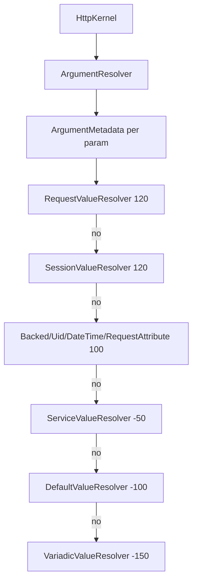

# Argument Value Resolvers

!!! tip "In a nutshell"
    Les value resolvers sont le mécanisme par lequel Symfony remplit chaque
    argument de controller — la `Request`, un `int $id` de route, un DTO
    `#[MapRequestPayload]`. Ils forment une chaîne ordonnée par priorité
    (`Request`/`Session` à 120) plus des resolvers « ciblés » activés uniquement
    par attribut. Retenez l'ordre, et qu'un resolver décline en **ne yieldant
    rien**.

!!! example "Real-world analogy"
    Un value resolver est un **traducteur** qui transforme le bordereau brut de
    la request en l'objet typé que votre action a demandé — un `Uuid`, un
    `\DateTimeImmutable`, un DTO validé. Imaginez une file de traducteurs
    spécialisés (la chaîne de priorités) : chacun lit les métadonnées de
    l'argument, puis le traduit ou hausse les épaules et passe le bordereau au
    traducteur suivant. Ce haussement d'épaules — décliner en ne yieldant rien —
    est la façon dont la chaîne trouve le seul resolver qui parle la langue de
    l'argument.

!!! abstract "Learning objectives"
    À la fin de ce chapitre, vous saurez :

    - [ ] Expliquer comment `ArgumentResolverInterface` remplit chaque argument de controller.
    - [ ] Nommer les resolvers intégrés, leurs attributs et leurs priorités.
    - [ ] Écrire un `ValueResolverInterface` personnalisé et le cibler précisément.

    **Syllabus:** `Controllers → Argument value resolvers` ·
    **Level:** Expert ·
    **Est. time:** 22 min ·
    **Prerequisites:** [The Request](request.md), [DI](../dependency-injection/index.md)

---

## Pour les nuls

### L'idée en une phrase
Un résolveur d'arguments transforme la requête brute en objets typés que ton action attend — un `Uuid`, une entité, un DTO validé — automatiquement.

### Imagine dans la vraie vie
Une file de traducteurs spécialisés : chacun lit les métadonnées de l'argument, et soit le traduit, soit hausse les épaules et fait passer le bordereau au traducteur suivant. Ce haussement d'épaules — refuser en ne produisant rien — est comment la chaîne trouve le seul traducteur qui parle la langue de l'argument.

### Dans Symfony
`public function show(Article $article)` reçoit automatiquement l'entité `Article` déjà chargée depuis la base, sans que tu écrives toi-même `$em->find($id)` — un résolveur dédié fait ce travail à ta place.

### Exemple simple
```php
#[Route('/commandes/{status}')]
public function parStatut(Status $status): Response { /* Status déjà résolu depuis l'enum */ }
```

### Comment le mémoriser 🧠
Les résolveurs sont classés par **priorité** (`Request`/`Session` à 120, en tête de chaîne) — le premier qui accepte de traduire gagne ; les autres n'ont jamais leur mot à dire sur cet argument.


## Theory

Quand le kernel invoque votre controller, quelque chose doit fournir les
arguments — `Request $request`, `int $id`, `#[MapRequestPayload] Dto $dto`.
C'est le travail de
`Symfony\Component\HttpKernel\Controller\ArgumentResolverInterface` et d'une
chaîne de **value resolvers**, chacun étant un
`Symfony\Component\HttpKernel\Controller\ValueResolverInterface`.

```php
public function resolve(Request $request, ArgumentMetadata $argument): iterable;
```

Un resolver inspecte les métadonnées de l'argument (nom, type, attributs,
variadique, valeur par défaut) et **yield** zéro ou plusieurs valeurs. Le
premier resolver qui yield gagne pour cet argument.

!!! question "Predict first"
    Votre resolver personnalisé ne gère pas l'argument courant. Retournez-vous
    `null`, retournez-vous `false`, ou faites-vous autre chose ?

??? note "Reveal"
    Ne yieldez **rien** — `return [];` — pour qu'`ArgumentResolver` essaie le
    resolver suivant. `return null;` est un `TypeError` (`resolve()` est
    `: iterable`), tandis que `yield null;` lie un vrai `null`. Le premier
    resolver qui yield gagne.

## Deep Dive — how it works internally

`Symfony\Component\HttpKernel\Controller\ArgumentResolver::getArguments()`
construit une `ArgumentMetadata` pour chaque paramètre (via
`ArgumentMetadataFactory`) et parcourt la liste ordonnée des resolvers. Le
`resolve()` de chaque resolver est un generator : yielder une valeur fournit
l'argument (les resolvers variadiques en yieldent plusieurs) ; ne rien yielder
passe au resolver suivant. Si aucun ne yield, une `\RuntimeException` explique
que l'argument n'a pas pu être résolu.

```php
// ArgumentResolver::getArguments(), heavily simplified
foreach ($this->argumentMetadataFactory->createArgumentMetadata($controller) as $metadata) {
    foreach ($this->resolvers as $resolver) {
        $resolved = [...$resolver->resolve($request, $metadata)]; // generator
        if ($resolved !== []) {
            $arguments = [...$arguments, ...$resolved]; // first to yield wins
            continue 2;                                 // next parameter
        }
    }

    throw new \RuntimeException('...requires that you provide a value...');
}
```



### Built-in resolvers & priorities (Symfony 8)

Les resolvers sont des services taggés `controller.argument_value_resolver`
avec une `priority` (la plus haute s'exécute en premier) :

| Priorité | Resolver | Résout |
|---|---|---|
| 120 | `RequestValueResolver` | le type-hint `Request` |
| 120 | `SessionValueResolver` | le type-hint `SessionInterface` |
| 100 | `BackedEnumValueResolver` | un backed enum depuis un paramètre de route |
| 100 | `UidValueResolver` | un `AbstractUid` (p. ex. `Uuid`) depuis un paramètre |
| 100 | `DateTimeValueResolver` | un `\DateTimeInterface` depuis un paramètre/timestamp |
| 100 | `RequestAttributeValueResolver` | les paramètres/attributs de route par nom |
| -50 | `ServiceValueResolver` | les services autowirés (via `#[Autowire]`, DI) |
| -100 | `DefaultValueResolver` | la valeur par défaut du paramètre |
| -150 | `VariadicValueResolver` | `...$args` depuis un attribut tableau |

### Targeted resolvers (attribute-driven)

Certains resolvers ne sont **pas** dans la chaîne de priorités ; ils portent le
tag `controller.targeted_value_resolver` et ne s'exécutent **que** lorsque
l'argument porte leur attribut :

| Attribut | Resolver | Rôle |
|---|---|---|
| `#[MapRequestPayload]` | `RequestPayloadValueResolver` | Désérialiser + valider le body en DTO |
| `#[MapQueryString]` | `RequestPayloadValueResolver` | Désérialiser + valider la query string en DTO |
| `#[MapQueryParameter]` | `QueryParameterValueResolver` | Lier un seul paramètre de query, typé |
| `#[MapUploadedFile]` | `RequestPayloadValueResolver` | Lier + valider un upload |
| `#[CurrentUser]` | `UserValueResolver` (security) | Injecter l'utilisateur authentifié |

`#[MapEntity]` (Doctrine) existe aussi mais est **hors périmètre** ici — c'est
une fonctionnalité du DoctrineBundle, pas du cœur HttpKernel.

Vous pouvez aussi épingler un resolver sur un argument avec
`#[ValueResolver(MyResolver::class)]` (optionnellement `disabled: true`), ce
qui restreint la résolution à ce seul resolver.

```php
use Symfony\Component\HttpKernel\Attribute\ValueResolver;

public function show(
    // pin: only ClientLocaleResolver may resolve this argument
    #[ValueResolver(ClientLocaleResolver::class)] ClientLocale $locale,
    // disabled: true excludes that resolver for this argument
    #[ValueResolver(SomeResolver::class, disabled: true)] string $raw,
): Response { /* ... */ }
```

!!! note "Source reference"
    `ValueResolverInterface`, `ArgumentResolver`, et les resolvers intégrés —
    [symfony/symfony `8.0`](https://github.com/symfony/symfony/tree/8.0/src/Symfony/Component/HttpKernel/Controller/ArgumentResolver).

### RequestPayload internals

`RequestPayloadValueResolver` est aussi un event subscriber
`kernel.controller_arguments` : il utilise le **Serializer** pour construire le
DTO et le **Validator** pour le valider, en lançant un `422`
(`UnprocessableEntityHttpException`) en cas d'échec de validation ou un `400`
si l'entrée est malformée.

```php
public function create(#[MapRequestPayload] CreateOrderInput $payload): JsonResponse
{
    // RequestPayloadValueResolver already ran before this line:
    //   Serializer built $payload from the body — malformed JSON → 400
    //   Validator checked constraints — violations → 422 UnprocessableEntityHttpException
    return new JsonResponse(['ok' => true], 201);
}
```

### Performance

La résolution s'exécute une fois par appel de controller. Les resolvers sont
des services lazy dans un locator ; seuls ceux de la chaîne sont considérés, et
les resolvers ciblés ne s'activent que sur leur attribut — le coût est donc
faible et prévisible.

### Null behavior

Ici, la subtilité est **« ne rien yielder » vs « yielder `null` »** — ce n'est
pas la même chose, et les confondre est le bug de resolver classique :

- *Ne rien yielder* (`return [];`, ou un generator qui ne `yield` jamais)
  signifie « pas mon argument » — le resolver décline et `ArgumentResolver`
  passe au suivant. `null` n'est jamais lié.
- *Yielder `null`* (`yield null;`) signifie « la valeur est `null` » — une
  vraie valeur d'argument, délibérée, liée à un paramètre nullable.

```php
public function resolve(Request $request, ArgumentMetadata $argument): iterable
{
    if (Money::class !== $argument->getType()) {
        return []; // decline: "not my argument" — the chain moves on
    }

    if (!$request->query->has('amount')) {
        yield null; // deliberate value: binds null to a nullable parameter
        return;
    }

    yield new Money($request->query->getInt('amount'));
}
```

Deux pièges en découlent. Premièrement, `return null;` au lieu de `return [];`
est un `TypeError` : `resolve()` est déclaré `: iterable`, et `null` n'est pas
itérable. Déclinez toujours avec un tableau vide. Deuxièmement, si aucun
resolver ne yield et que le paramètre n'a pas de valeur par défaut,
`ArgumentResolver` lance une `\RuntimeException` (« could not resolve
argument ») — il ne passe pas discrètement `null`. Le `DefaultValueResolver`
(-100) existe précisément pour fournir la valeur par défaut déclarée avant cet
échec ; un paramètre nullable tel que
`#[MapQueryString] ?SearchQuery $q = null` se résout à `null` quand la query
string est vide *grâce à cette valeur par défaut*, pas parce qu'un resolver n'a
rien retourné.

!!! note "Null in real life"
    Un traducteur qui hausse les épaules et vous passe au suivant (il décline)
    n'est pas la même chose qu'un traducteur qui vous tend une page
    délibérément blanche (`null`). L'un signifie « demandez à quelqu'un
    d'autre » ; l'autre est une réponse réelle, mais vide.

## Configuration & code

=== "Built-in attributes"

    ```php
    <?php
    declare(strict_types=1);

    namespace App\Controller;

    use App\Dto\SearchQuery;
    use Symfony\Component\HttpFoundation\JsonResponse;
    use Symfony\Component\HttpKernel\Attribute\MapQueryParameter;
    use Symfony\Component\HttpKernel\Attribute\MapQueryString;
    use Symfony\Component\HttpKernel\Attribute\MapRequestPayload;
    use Symfony\Component\Routing\Attribute\Route;
    use Symfony\Component\Uid\Uuid;

    final class ApiController
    {
        #[Route('/api/items/{id}', name: 'api_item', methods: ['GET'])]
        public function item(Uuid $id): JsonResponse   // UidValueResolver
        {
            return new JsonResponse(['id' => (string) $id]);
        }

        #[Route('/api/search', methods: ['GET'])]
        public function search(
            #[MapQueryParameter] int $page = 1,          // QueryParameterValueResolver
            #[MapQueryString] ?SearchQuery $query = null, // RequestPayloadValueResolver
        ): JsonResponse {
            return new JsonResponse(['page' => $page]);
        }

        #[Route('/api/items', methods: ['POST'])]
        public function create(#[MapRequestPayload] SearchQuery $payload): JsonResponse
        {
            return new JsonResponse(['ok' => true], 201);
        }
    }
    ```

=== "Custom resolver"

    ```php
    <?php
    declare(strict_types=1);

    namespace App\Resolver;

    use App\Model\ClientLocale;
    use Symfony\Component\HttpFoundation\Request;
    use Symfony\Component\HttpKernel\Controller\ValueResolverInterface;
    use Symfony\Component\HttpKernel\ControllerMetadata\ArgumentMetadata;

    final class ClientLocaleResolver implements ValueResolverInterface
    {
        public function resolve(Request $request, ArgumentMetadata $argument): iterable
        {
            if (ClientLocale::class !== $argument->getType()) {
                return []; // yield nothing → next resolver handles it
            }

            yield new ClientLocale($request->getPreferredLanguage() ?? 'en');
        }
    }
    ```

=== "Tag / priority (YAML)"

    ```yaml
    # config/services.yaml (autoconfigure tags this automatically;
    # set an explicit priority only when ordering matters)
    services:
        App\Resolver\ClientLocaleResolver:
            tags:
                - { name: controller.argument_value_resolver, priority: 150 }
    ```

## Best practices & anti-patterns

| ✅ À faire | ❌ À éviter |
|---|---|
| Retourner `[]` (ne rien yielder) quand le resolver ne s'applique pas | Lancer une exception quand le type ne correspond pas |
| Utiliser `#[MapRequestPayload]`/`#[MapQueryString]` pour les DTO | Un `json_decode` manuel + une validation à la main |
| Garder les resolvers légers et sans effets de bord | Faire silencieusement du travail DB/HTTP dans un resolver |
| Cibler avec `#[ValueResolver(...)]` quand c'est nécessaire | Gonfler les priorités pour lutter contre la chaîne |

## When (not) to use a custom resolver / alternatives

- **Resolver personnalisé** — un type d'argument transverse utilisé par de
  nombreux controllers (un value object dérivé de la request).
- **Préférez les resolvers intégrés** — pour les scalaires, utilisez
  `#[MapQueryParameter]` ; pour les bodies, `#[MapRequestPayload]` ; pour
  l'utilisateur, `#[CurrentUser]`.
- **Ne construisez pas** un resolver pour un seul controller — lisez simplement
  la `Request` sur place.

!!! danger "Certification traps"
    - L'interface est **`ValueResolverInterface`** (`resolve()` retournant un
      `iterable`). L'ancienne `ArgumentValueResolverInterface`
      (`supports()` + `resolve()`) a été **supprimée** — ne la mentionnez pas.
    - `RequestValueResolver` et `SessionValueResolver` sont à la priorité **120**,
      *au-dessus* du groupe 100 (`RequestAttribute`, `BackedEnum`, `DateTime`, `Uid`).
    - Les resolvers de `#[MapRequestPayload]`/`#[MapQueryParameter]`/`#[MapUploadedFile]`
      sont **ciblés** (`controller.targeted_value_resolver`) — ils ne s'exécutent
      que si l'attribut est présent, pas selon la priorité de la chaîne.
    - Échec de validation avec `#[MapRequestPayload]` ⇒ **422** ; body malformé ⇒ **400**.
    - Un resolver signale « pas pour moi » en **ne yieldant rien** (`return [];`),
      pas via une méthode `supports()`.
    - `#[MapEntity]` relève de Doctrine (hors périmètre), pas d'un resolver du
      cœur HttpKernel.

!!! warning "Common mistakes"
    - Implémenter l'`ArgumentValueResolverInterface` supprimée — elle n'existe
      plus en Symfony 8.
    - Attendre de `#[MapQueryString]` qu'il lie un seul scalaire — il construit un
      **DTO** ; utilisez `#[MapQueryParameter]` pour une seule valeur.

## Exercises

1. **(Basic)** Liez `?page=2&limit=20` à deux arguments `int` typés avec des
   valeurs par défaut.
2. **(Expert)** Écrivez un `ValueResolverInterface` qui injecte un value object
   `ClientIp` pour tout argument de ce type, et taggez-le au-dessus des
   resolvers par défaut.

??? success "Solutions"

    **1.**
    ```php
    public function list(
        #[MapQueryParameter] int $page = 1,
        #[MapQueryParameter] int $limit = 20,
    ): Response { /* ... */ }
    ```

    **2.** Implémentez `resolve()` ; protégez avec
    `ClientIp::class !== $argument->getType()` et `return [];`, sinon
    `yield new ClientIp($request->getClientIp());`.
    L'autoconfigure le tagge ; réglez `priority: 150` s'il doit précéder un
    resolver intégré.

## Certification questions

??? question "Q1. Which interface does a custom value resolver implement in Symfony 8?"
    - [ ] A. `ArgumentValueResolverInterface`
    - [x] B. `ValueResolverInterface` (`resolve(): iterable`) ✅
    - [ ] C. `ArgumentResolverInterface`
    - [ ] D. `ControllerResolverInterface`

    **Why:** l'interface scindée `supports()`/`resolve()` a été supprimée ;
    `resolve()` retourne désormais un `iterable`. **Ref:** [value resolvers](https://symfony.com/doc/8.0/controller/value_resolver.html).

??? question "Q2. How does a resolver indicate it does not handle an argument?"
    - [x] A. Yield nothing (return an empty iterable). ✅
    - [ ] B. Return `false`.
    - [ ] C. Throw `UnsupportedArgumentException`.
    - [ ] D. Return `null`.

    **Why:** ne rien yielder passe l'argument au resolver suivant.
    **Ref:** [value resolvers](https://symfony.com/doc/8.0/controller/value_resolver.html).

??? question "Q3. Which resolver has the highest default priority?"
    - [x] A. `RequestValueResolver` / `SessionValueResolver` (120) ✅
    - [ ] B. `DefaultValueResolver`
    - [ ] C. `VariadicValueResolver`
    - [ ] D. `RequestAttributeValueResolver`

    **Why:** les resolvers `Request`/`Session` s'exécutent en premier à la
    priorité 120 ; la résolution par attribut est à 100. **Ref:** [FrameworkBundle web.php](https://github.com/symfony/symfony/blob/8.0/src/Symfony/Bundle/FrameworkBundle/Resources/config/web.php).

??? question "Q4. `#[MapRequestPayload]` on an invalid body produces which status?"
    - [ ] A. 400 always
    - [x] B. 422 on validation failure (400 if the body is malformed) ✅
    - [ ] C. 500
    - [ ] D. 200 with null

    **Why:** le flux serializer/validator lance une
    `UnprocessableEntityHttpException` (422) pour les erreurs de validation.
    **Ref:** [mapping request payload](https://symfony.com/doc/8.0/controller/value_resolver.html#mapping-the-whole-request-payload).

??? question "Q5. `#[MapQueryParameter]` vs `#[MapQueryString]` — the difference?"
    - [x] A. `MapQueryParameter` binds one typed param; `MapQueryString` maps the whole query into a DTO. ✅
    - [ ] B. They are identical.
    - [ ] C. `MapQueryString` binds one param; `MapQueryParameter` a DTO.
    - [ ] D. Both require Doctrine.

    **Why:** l'un lie un seul scalaire, l'autre désérialise + valide un DTO.
    **Ref:** [value resolver](https://symfony.com/doc/8.0/controller/value_resolver.html).

## Key takeaways

- `ArgumentResolver` parcourt des `ValueResolverInterface` ordonnés ; le premier
  qui yield gagne.
- `resolve()` retourne un `iterable` ; ne yieldez rien pour décliner.
- Chaîne intégrée : Request/Session (120) → Backed/Uid/DateTime/RequestAttribute
  (100) → Service (-50) → Default (-100) → Variadic (-150).
- Les resolvers à attribut (`MapRequestPayload`, `MapQueryParameter`,
  `MapUploadedFile`, `CurrentUser`) sont **ciblés** — activés par l'attribut.

## Last-minute revision

!!! tip "Cheat sheet"
    - Interface : `ValueResolverInterface::resolve(Request, ArgumentMetadata): iterable`.
    - Tag : `controller.argument_value_resolver` (chaîne) /
      `controller.targeted_value_resolver` (attribut uniquement).
    - Priorités : Request/Session 120 · attributs 100 · Service -50 · Default -100 · Variadic -150.
    - `#[MapRequestPayload]`→DTO du body (422/400) · `#[MapQueryString]`→DTO de la query ·
      `#[MapQueryParameter]`→un paramètre · `#[CurrentUser]`→l'utilisateur.

## Connections

- **Dépend de :** [Architecture → Request handling](../architecture/request-handling.md) — le kernel exécute `ArgumentResolver` avant d'invoquer votre controller.
- **Réutilisé dans :** [File Upload](file-upload.md) — `#[MapUploadedFile]` est l'un des resolvers ciblés.
- **À ne pas confondre avec :** [The Request](request.md) — `RequestValueResolver` remplit l'argument `Request` ; les attributs Map* construisent des DTO.

## Official References
- [Official Symfony docs — Value Resolvers](https://symfony.com/doc/8.0/controller/value_resolver.html)
- [Symfony source — ArgumentResolver](https://github.com/symfony/symfony/tree/8.0/src/Symfony/Component/HttpKernel/Controller/ArgumentResolver.php)
- [Symfony source — value resolver services (web.php)](https://github.com/symfony/symfony/blob/8.0/src/Symfony/Bundle/FrameworkBundle/Resources/config/web.php)

## Video references

!!! tip "Watch & learn"
    Ce sont des chaînes vidéo officielles, mises à jour en continu — cherchez-y
    "Symfony controllers" pour consolider ce chapitre. Nous lions des chaînes stables
    plutôt que des vidéos individuelles pour que les références ne périment jamais.

    - [SymfonyCasts screencasts](https://symfonycasts.com/tracks/symfony) — tutoriels scénarisés à suivre en codant.
    - [Symfony official YouTube](https://www.youtube.com/@SymfonyOfficial) — conférences et keynotes SymfonyCon.
    - [Official docs for this topic](https://symfony.com/doc/8.0/controller/value_resolver.html) — certaines pages de la doc Symfony intègrent un screencast.

## Confidence check

Je suis prêt quand je peux :

- [ ] expliquer **pourquoi** la chaîne de resolvers existe et comment fonctionne « le premier qui yield gagne »
- [ ] écrire un `ValueResolverInterface` et le cibler en Symfony 8
- [ ] déboguer un argument non résolu (`RuntimeException`) ou un `TypeError` dû à `return null`
- [ ] distinguer resolvers de chaîne vs ciblés et les priorités 120/100/-50/-100/-150
- [ ] expliquer comment `ArgumentMetadata` pilote la résolution et le 422/400 des payloads

---

<small>Related: [The Request](request.md) · [The Session](session.md) · [File Upload](file-upload.md) · [DI](../dependency-injection/index.md) · [Security](../security/index.md)</small>
