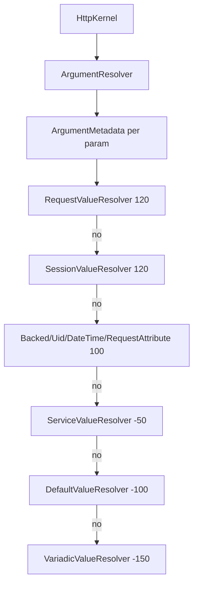

# Argument Value Resolvers

!!! abstract "Learning objectives"
    By the end of this chapter you can:

    - [ ] Explain how `ArgumentResolverInterface` fills every controller argument.
    - [ ] Name the built-in resolvers, their attributes, and their priorities.
    - [ ] Write a custom `ValueResolverInterface` and target it precisely.

    **Syllabus:** `Controllers → Argument value resolvers` ·
    **Level:** Expert ·
    **Est. time:** 22 min ·
    **Prerequisites:** [The Request](request.md), [DI](../dependency-injection/index.md)

---

## Theory

When the kernel invokes your controller, something must supply the arguments —
`Request $request`, `int $id`, `#[MapRequestPayload] Dto $dto`. That is the job of
`Symfony\Component\HttpKernel\Controller\ArgumentResolverInterface` and a chain of
**value resolvers**, each a
`Symfony\Component\HttpKernel\Controller\ValueResolverInterface`.

```php
public function resolve(Request $request, ArgumentMetadata $argument): iterable;
```

A resolver inspects the argument's metadata (name, type, attributes, variadic,
default) and **yields** zero or more values. The first resolver that yields wins
for that argument.

## Deep Dive — how it works internally

`Symfony\Component\HttpKernel\Controller\ArgumentResolver::getArguments()` builds
`ArgumentMetadata` for each parameter (via `ArgumentMetadataFactory`) and walks
the ordered resolver list. Each resolver's `resolve()` is a generator: yielding a
value provides the argument (variadic resolvers yield several); yielding nothing
passes to the next resolver. If none yields, a `\RuntimeException` explains that
the argument could not be resolved.



### Built-in resolvers & priorities (Symfony 8)

Resolvers are services tagged `controller.argument_value_resolver` with a
`priority` (higher runs first):

| Priority | Resolver | Resolves |
|---|---|---|
| 120 | `RequestValueResolver` | `Request` type-hint |
| 120 | `SessionValueResolver` | `SessionInterface` type-hint |
| 100 | `BackedEnumValueResolver` | backed enum from a route param |
| 100 | `UidValueResolver` | `AbstractUid` (e.g. `Uuid`) from a param |
| 100 | `DateTimeValueResolver` | `\DateTimeInterface` from a param/timestamp |
| 100 | `RequestAttributeValueResolver` | route params/attributes by name |
| -50 | `ServiceValueResolver` | autowired services (via `#[Autowire]`, DI) |
| -100 | `DefaultValueResolver` | the parameter's default value |
| -150 | `VariadicValueResolver` | `...$args` from an array attribute |

### Targeted resolvers (attribute-driven)

Some resolvers are **not** in the priority chain; they carry the
`controller.targeted_value_resolver` tag and run **only** when the argument has
their attribute:

| Attribute | Resolver | Purpose |
|---|---|---|
| `#[MapRequestPayload]` | `RequestPayloadValueResolver` | Deserialize + validate the body into a DTO |
| `#[MapQueryString]` | `RequestPayloadValueResolver` | Deserialize + validate the query string into a DTO |
| `#[MapQueryParameter]` | `QueryParameterValueResolver` | Bind one query param, typed |
| `#[MapUploadedFile]` | `MapUploadedFileValueResolver` | Bind + validate an upload |
| `#[CurrentUser]` | `UserValueResolver` (security) | Inject the authenticated user |

`#[MapEntity]` (Doctrine) also exists but is **out of scope** here — it is a
DoctrineBundle feature, not core HttpKernel.

You can also pin a resolver on an argument with `#[ValueResolver(MyResolver::class)]`
(optionally `disabled: true`), which restricts resolution to that resolver.

!!! note "Source reference"
    `ValueResolverInterface`, `ArgumentResolver`, and the built-in resolvers —
    [symfony/symfony `8.0`](https://github.com/symfony/symfony/blob/8.0/src/Symfony/Component/HttpKernel/Controller/ArgumentResolver).

### RequestPayload internals

`RequestPayloadValueResolver` is also a `kernel.controller_arguments` /
event subscriber: it uses the **Serializer** to build the DTO and the
**Validator** to validate it, throwing `422` (`UnprocessableEntityHttpException`)
on validation failure or `400` on malformed input.

### Performance

Resolution runs once per controller call. Resolvers are lazy services in a
locator; only those in the chain are considered, and targeted resolvers only
activate on their attribute — so the cost is small and predictable.

## Configuration & code

=== "Built-in attributes"

    ```php
    <?php
    declare(strict_types=1);

    namespace App\Controller;

    use App\Dto\SearchQuery;
    use Symfony\Component\HttpFoundation\JsonResponse;
    use Symfony\Component\HttpKernel\Attribute\MapQueryParameter;
    use Symfony\Component\HttpKernel\Attribute\MapQueryString;
    use Symfony\Component\HttpKernel\Attribute\MapRequestPayload;
    use Symfony\Component\Routing\Attribute\Route;
    use Symfony\Component\Uid\Uuid;

    final class ApiController
    {
        #[Route('/api/items/{id}', name: 'api_item', methods: ['GET'])]
        public function item(Uuid $id): JsonResponse   // UidValueResolver
        {
            return new JsonResponse(['id' => (string) $id]);
        }

        #[Route('/api/search', methods: ['GET'])]
        public function search(
            #[MapQueryParameter] int $page = 1,          // QueryParameterValueResolver
            #[MapQueryString] ?SearchQuery $query = null, // RequestPayloadValueResolver
        ): JsonResponse {
            return new JsonResponse(['page' => $page]);
        }

        #[Route('/api/items', methods: ['POST'])]
        public function create(#[MapRequestPayload] SearchQuery $payload): JsonResponse
        {
            return new JsonResponse(['ok' => true], 201);
        }
    }
    ```

=== "Custom resolver"

    ```php
    <?php
    declare(strict_types=1);

    namespace App\Resolver;

    use App\Model\ClientLocale;
    use Symfony\Component\HttpFoundation\Request;
    use Symfony\Component\HttpKernel\Controller\ValueResolverInterface;
    use Symfony\Component\HttpKernel\ControllerMetadata\ArgumentMetadata;

    final class ClientLocaleResolver implements ValueResolverInterface
    {
        public function resolve(Request $request, ArgumentMetadata $argument): iterable
        {
            if (ClientLocale::class !== $argument->getType()) {
                return []; // yield nothing → next resolver handles it
            }

            yield new ClientLocale($request->getPreferredLanguage() ?? 'en');
        }
    }
    ```

=== "Tag / priority (YAML)"

    ```yaml
    # config/services.yaml (autoconfigure tags this automatically;
    # set an explicit priority only when ordering matters)
    services:
        App\Resolver\ClientLocaleResolver:
            tags:
                - { name: controller.argument_value_resolver, priority: 150 }
    ```

## Best practices & anti-patterns

| ✅ Do | ❌ Avoid |
|---|---|
| Return `[]` (yield nothing) when not applicable | Throwing when the type doesn't match |
| Use `#[MapRequestPayload]`/`#[MapQueryString]` for DTOs | Manual `json_decode` + hand validation |
| Keep resolvers cheap and side-effect-free | Doing DB/HTTP work in a resolver silently |
| Target with `#[ValueResolver(...)]` when needed | Cranking priorities to fight the chain |

## When (not) to use a custom resolver / alternatives

- **Custom resolver** — a cross-cutting argument type used by many controllers
  (a value object derived from the request).
- **Prefer built-ins** — for scalars use `#[MapQueryParameter]`; for bodies use
  `#[MapRequestPayload]`; for the user use `#[CurrentUser]`.
- **Don't** build a resolver for one controller — just read the `Request` there.

!!! danger "Certification traps"
    - The interface is **`ValueResolverInterface`** (`resolve()` returning
      `iterable`). The old `ArgumentValueResolverInterface`
      (`supports()` + `resolve()`) was **removed** — do not reference it.
    - `RequestValueResolver` and `SessionValueResolver` sit at priority **120**,
      *above* the 100-group (`RequestAttribute`, `BackedEnum`, `DateTime`, `Uid`).
    - `#[MapRequestPayload]`/`#[MapQueryParameter]`/`#[MapUploadedFile]` resolvers
      are **targeted** (`controller.targeted_value_resolver`) — they run only when
      the attribute is present, not by chain priority.
    - `#[MapRequestPayload]` validation failure ⇒ **422**; malformed body ⇒ **400**.
    - A resolver signals "not mine" by **yielding nothing** (`return [];`), not by a
      `supports()` method.
    - `#[MapEntity]` is Doctrine (out of scope), not a core HttpKernel resolver.

!!! warning "Common mistakes"
    - Implementing the removed `ArgumentValueResolverInterface` — it no longer
      exists in Symfony 8.
    - Expecting `#[MapQueryString]` to bind a single scalar — it builds a **DTO**;
      use `#[MapQueryParameter]` for one value.

## Exercises

1. **(Basic)** Bind `?page=2&limit=20` to two typed `int` arguments with defaults.
2. **(Expert)** Write a `ValueResolverInterface` that injects a `ClientIp` value
   object for any argument of that type, and tag it above the default resolvers.

??? success "Solutions"

    **1.**
    ```php
    public function list(
        #[MapQueryParameter] int $page = 1,
        #[MapQueryParameter] int $limit = 20,
    ): Response { /* ... */ }
    ```

    **2.** Implement `resolve()`; guard `ClientIp::class !== $argument->getType()`
    with `return [];`, else `yield new ClientIp($request->getClientIp());`.
    Autoconfigure tags it; set `priority: 150` if it must precede a built-in.

## Certification questions

??? question "Q1. Which interface does a custom value resolver implement in Symfony 8?"
    - [ ] A. `ArgumentValueResolverInterface`
    - [x] B. `ValueResolverInterface` (`resolve(): iterable`) ✅
    - [ ] C. `ArgumentResolverInterface`
    - [ ] D. `ControllerResolverInterface`

    **Why:** the split `supports()`/`resolve()` interface was removed; `resolve()`
    now returns an `iterable`. **Ref:** [value resolvers](https://symfony.com/doc/current/controller/value_resolver.html).

??? question "Q2. How does a resolver indicate it does not handle an argument?"
    - [x] A. Yield nothing (return an empty iterable). ✅
    - [ ] B. Return `false`.
    - [ ] C. Throw `UnsupportedArgumentException`.
    - [ ] D. Return `null`.

    **Why:** yielding nothing passes the argument to the next resolver.
    **Ref:** [value resolvers](https://symfony.com/doc/current/controller/value_resolver.html).

??? question "Q3. Which resolver has the highest default priority?"
    - [x] A. `RequestValueResolver` / `SessionValueResolver` (120) ✅
    - [ ] B. `DefaultValueResolver`
    - [ ] C. `VariadicValueResolver`
    - [ ] D. `RequestAttributeValueResolver`

    **Why:** the `Request`/`Session` resolvers run first at priority 120; attribute
    resolution is 100. **Ref:** [FrameworkBundle web.php](https://github.com/symfony/symfony/blob/8.0/src/Symfony/Bundle/FrameworkBundle/Resources/config/web.php).

??? question "Q4. `#[MapRequestPayload]` on an invalid body produces which status?"
    - [ ] A. 400 always
    - [x] B. 422 on validation failure (400 if the body is malformed) ✅
    - [ ] C. 500
    - [ ] D. 200 with null

    **Why:** the serializer/validator flow throws `UnprocessableEntityHttpException`
    (422) for validation errors. **Ref:** [mapping request payload](https://symfony.com/doc/current/controller/value_resolver.html#mapping-the-whole-request-payload).

??? question "Q5. `#[MapQueryParameter]` vs `#[MapQueryString]` — the difference?"
    - [x] A. `MapQueryParameter` binds one typed param; `MapQueryString` maps the whole query into a DTO. ✅
    - [ ] B. They are identical.
    - [ ] C. `MapQueryString` binds one param; `MapQueryParameter` a DTO.
    - [ ] D. Both require Doctrine.

    **Why:** one is a single scalar, the other deserializes+validates a DTO.
    **Ref:** [value resolver](https://symfony.com/doc/current/controller/value_resolver.html).

## Key takeaways

- `ArgumentResolver` walks ordered `ValueResolverInterface`s; the first to yield wins.
- `resolve()` returns an `iterable`; yield nothing to decline.
- Built-in chain: Request/Session (120) → Backed/Uid/DateTime/RequestAttribute
  (100) → Service (-50) → Default (-100) → Variadic (-150).
- Attribute resolvers (`MapRequestPayload`, `MapQueryParameter`,
  `MapUploadedFile`, `CurrentUser`) are **targeted** — activated by the attribute.

## Last-minute revision

!!! tip "Cheat sheet"
    - Interface: `ValueResolverInterface::resolve(Request, ArgumentMetadata): iterable`.
    - Tag: `controller.argument_value_resolver` (chain) /
      `controller.targeted_value_resolver` (attribute-only).
    - Priorities: Request/Session 120 · attrs 100 · Service -50 · Default -100 · Variadic -150.
    - `#[MapRequestPayload]`→body DTO (422/400) · `#[MapQueryString]`→query DTO ·
      `#[MapQueryParameter]`→one param · `#[CurrentUser]`→user.

## References

- [Official Symfony docs — Value Resolvers](https://symfony.com/doc/current/controller/value_resolver.html)
- [Symfony source — ArgumentResolver](https://github.com/symfony/symfony/blob/8.0/src/Symfony/Component/HttpKernel/Controller/ArgumentResolver.php)
- [Symfony source — value resolver services (web.php)](https://github.com/symfony/symfony/blob/8.0/src/Symfony/Bundle/FrameworkBundle/Resources/config/web.php)

---

<small>Related: [The Request](request.md) · [The Session](session.md) · [File Upload](file-upload.md) · [DI](../dependency-injection/index.md) · [Security](../security/index.md)</small>
