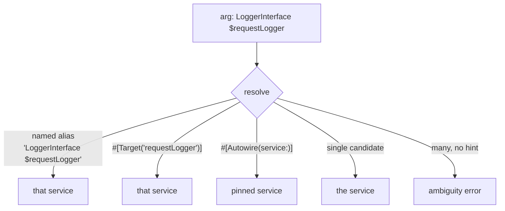

# Autowiring

!!! tip "In a nutshell"
    L'autowiring lit le type-hint d'un paramètre de constructeur et injecte le
    service correspondant — le tout résolu à la **compilation**, donc les erreurs
    sont des erreurs de build. Il ne devine jamais les scalaires. Fait à plus haut
    rendement : plusieurs candidats sans alias par défaut → une **erreur
    d'ambiguïté** ; on lève l'ambiguïté avec `#[Target]`, `#[Autowire]` ou un alias
    nommé.

!!! example "Real-world analogy"
    L'autowiring est un serveur qui lit votre commande par *type* — « je prendrai
    le poisson » — et la cuisine sait exactement de quel plat il s'agit. Type-hintez
    une `LoggerInterface` et le container sert l'unique logger enregistré. Commandez
    « le poisson » alors qu'il existe deux plats de poisson et aucun choix par
    défaut, et le serveur s'arrête pour demander lequel (l'erreur d'ambiguïté)
    plutôt que de deviner.

!!! abstract "Learning objectives"
    À la fin de ce chapitre, vous saurez :

    - [ ] Expliquer comment les type-hints sont résolus en services à la compilation.
    - [ ] Lever une ambiguïté avec les **named autowiring aliases**, `#[Target]`,
          `#[Autowire]` et `bind`.
    - [ ] Diagnostiquer et corriger les erreurs d'ambiguïté / « cannot autowire ».

    **Syllabus:** `Dependency Injection → Autowiring` ·
    **Level:** Advanced / Expert ·
    **Est. time:** 40 min ·
    **Prerequisites:** [Service Registration](registration.md)

---

## Theory

L'**autowiring** supprime la corvée de lister chaque argument de constructeur.
Le container lit le **type-hint** d'un paramètre et injecte le service enregistré
pour ce type. La résolution se fait entièrement à la **compilation**, donc les
erreurs apparaissent comme des erreurs de build, pas comme des surprises à
l'exécution. L'autowiring gère les *objets par type* ; il ne peut pas deviner les
scalaires — ceux-ci viennent de `bind` ou de `#[Autowire]`.

```php
public function __construct(
    // Object: resolved by its type-hint at compile time
    private MailerInterface $mailer,
    // Scalar: never guessed — inject it with #[Autowire]...
    #[Autowire('%kernel.environment%')]
    private string $env,
    // ...or with a YAML bind: `string $env: '%kernel.environment%'`
) {}
```

!!! question "Predict first"
    Deux services implémentent `TransportInterface` et aucun alias par défaut n'est
    défini. Vous type-hintez `TransportInterface`. Que fait le container à la
    compilation ?

??? note "Reveal"
    Il lève une **erreur d'ambiguïté** listant les candidats — l'autowiring n'en
    choisit jamais un silencieusement. Levez l'ambiguïté avec `#[Target('name')]`,
    `#[Autowire(service: 'id')]`, un alias nommé, ou `bind`.

## Deep Dive — how it works internally

### Type → service resolution

La `Symfony\Component\DependencyInjection\Compiler\AutowirePass` inspecte le type
de chaque argument. Elle cherche un service dont l'id **est égal au type** (FQCN)
ou un **alias** de cette interface/classe vers un id concret. FrameworkBundle et
votre glob `App\:` créent ces ids ; les interfaces nécessitent un alias explicite
ou auto-généré (une seule implémentation → auto-alias dans certains cas, sinon
c'est à vous de le définir).

```yaml
# config/services.yaml
services:
    # The App\ glob registers each class with its FQCN as service id
    App\:
        resource: '../src/'
    # Explicit alias so AutowirePass can resolve the interface type-hint
    App\Payment\GatewayInterface: '@App\Payment\StripeGateway'
```

### Ambiguity

Si un type a **plusieurs** services candidats et aucun alias par défaut,
l'autowiring **échoue** avec une erreur d'ambiguïté listant les candidats. Vous la
résolvez avec :

- un **named autowiring alias** — un alias dont l'id est `Type $paramName`,
  apparié au nom de la variable de l'argument ;
- `#[Target('name')]` — sélectionne explicitement un alias nommé, découplé du nom
  de la variable ;
- `#[Autowire(service: 'id')]` — épingle un service précis ;
- `bind` en YAML — lie `Type $name` à un service.



### Named aliases and `#[Target]`

Les installations de type Monolog enregistrent plusieurs loggers comme alias
nommés, par exemple `Psr\Log\LoggerInterface $requestLogger`. L'autowiring
correspond quand votre paramètre s'appelle `$requestLogger`. Comme s'appuyer sur le
nom de la variable est fragile, `#[Target('requestLogger')]` énonce explicitement
l'alias visé — renommer le paramètre ne casse plus le câblage.

```php
public function __construct(
    // Matches the named alias 'Psr\Log\LoggerInterface $requestLogger'
    // only because the parameter is named $requestLogger
    private LoggerInterface $requestLogger,
    // #[Target] names the alias explicitly — the parameter name is free
    #[Target('requestLogger')]
    private LoggerInterface $logger,
) {}
```

### `#[Autowire]` vs aliases

`#[Autowire]` est la surcharge locale, par argument (service, value, env, param,
expression). Les alias sont des correspondances globales type→id. Préférez les
alias/`#[Target]` pour « quelle implémentation de cette interface » ; utilisez
`#[Autowire]` pour des valeurs ou des épinglages ponctuels.

```php
public function __construct(
    // Global mapping: pick the implementation via a named alias
    #[Target('smsTransport')]
    private TransportInterface $transport,
    // Local per-argument overrides with #[Autowire]
    #[Autowire(service: 'app.rate_limiter')] // pin an exact service
    private RateLimiterFactory $limiter,
    #[Autowire(env: 'API_KEY')]              // environment variable
    private string $apiKey,
    #[Autowire(param: 'kernel.debug')]       // container parameter
    private bool $debug,
) {}
```

!!! note "Source reference"
    `Symfony\Component\DependencyInjection\Compiler\AutowirePass` &
    les attributs `Autowire`/`Target` —
    [symfony/symfony `8.0`](https://github.com/symfony/symfony/blob/8.0/src/Symfony/Component/DependencyInjection/Compiler/AutowirePass.php).

### Null behavior

L'autowiring résout un paramètre par type. Si le type est **nullable** et qu'aucun
service ne correspond, vous pouvez rendre l'argument optionnel pour qu'il soit
résolu à `null` au lieu de faire échouer le build — par exemple un paramètre
`?SomeInterface $dep = null`, ou `#[Autowire(service: 'app.maybe')]` sur un
argument nullable. Sans type nullable et valeur par défaut, autowirer un **type non
enregistré** est une *erreur de compilation* pure et dure (« Cannot autowire … no
such service exists »), jamais un `null` silencieux. C'est la distinction clé : une
dépendance manquante est un échec de build sauf si vous optez explicitement pour
null via `?Type $x = null`. Le bug classique consiste à s'attendre à ce qu'une
interface sans implémentation ni alias devienne discrètement `null` — elle casse la
construction du container à la place.

```php
public function __construct(
    // Nullable + default: a missing service becomes null, not a build error
    private ?SomeInterface $dep = null,
    // Pinned id on a nullable arg: null when 'app.maybe' does not exist
    #[Autowire(service: 'app.maybe')]
    private ?MaybeInterface $maybe = null,
) {}
```

!!! note "Null in real life"
    Commander un plat que la cuisine n'a pas en stock bloque toute la commande
    (erreur de build) ; le marquer « optionnel — à omettre si indisponible »
    (nullable + valeur par défaut) laisse le repas partir avec cet élément
    simplement absent (null).

!!! info "Expert note"
    L'id d'un named autowiring alias est littéralement la chaîne `Type $paramName`,
    appariée au **nom de la variable du constructeur**. Renommez le paramètre et le
    câblage casse silencieusement. Les seniors utilisent `#[Target('name')]` pour
    que l'alias visé soit énoncé dans le code et survive aux refactorings.

??? example "Debugging story"
    **Symptôme :** `Cannot autowire … no such service exists` pour une interface
    qui avait « manifestement » une implémentation. **Diagnostic :**
    l'implémentation était enregistrée, mais aucun alias ne reliait l'*interface* à
    elle (une classe hors `App\` venant d'une bibliothèque). **Correctif :**
    ajouter un alias `Interface: '@Concrete'` (ou `#[AsAlias]`).
    **Prévention :** rappelez-vous que l'auto-alias à implémentation unique ne se
    déclenche que pour les services enregistrés via le glob `App\:` ; les classes
    de bibliothèques ont besoin d'un alias explicite.

??? abstract "Source-code tour"
    - `Symfony\Component\DependencyInjection\Compiler\AutowirePass` — résout le
      type-hint de chaque argument en id de service ou alias à la compilation.
    - `Symfony\Component\DependencyInjection\Attribute\Autowire` &
      `Symfony\Component\DependencyInjection\Attribute\Target` — surcharges par
      argument et sélection explicite d'alias nommé.
    - `Symfony\Component\DependencyInjection\Alias` — les correspondances
      interface→id que la pass suit ; l'ambiguïté survient quand plusieurs
      correspondent et qu'aucune n'est par défaut.
    - `Symfony\Component\DependencyInjection\Reference` — le câblage résolu que la
      pass réécrit sur la `Definition`.

## Configuration & code

=== "PHP Attributes"

    ```php
    <?php
    declare(strict_types=1);

    namespace App\Notification;

    use Psr\Log\LoggerInterface;
    use Symfony\Component\DependencyInjection\Attribute\Autowire;
    use Symfony\Component\DependencyInjection\Attribute\Target;

    final class Notifier
    {
        public function __construct(
            // Resolve the named alias 'LoggerInterface $notificationLogger'.
            #[Target('notificationLogger')]
            private readonly LoggerInterface $logger,
            // Pin an exact service or a value.
            #[Autowire(service: 'app.sms_transport')]
            private readonly TransportInterface $transport,
            #[Autowire('%kernel.environment%')]
            private readonly string $env,
        ) {}
    }
    ```

=== "YAML"

    ```yaml
    # config/services.yaml
    services:
        _defaults:
            autowire: true
            bind:
                # Bind by type + name for every service in this file.
                Psr\Log\LoggerInterface $notificationLogger: '@monolog.logger.notification'
                string $adminEmail: '%app.admin_email%'
    ```

=== "Console"

    ```console
    $ php bin/console debug:autowiring --all
    $ php bin/console debug:autowiring logger
    ```

## Best practices & anti-patterns

| ✅ À faire | ❌ À éviter |
|---|---|
| Type-hinter des interfaces | Type-hinter des classes concrètes sans nécessité |
| `#[Target]` pour les alias nommés | S'appuyer uniquement sur le nom du paramètre |
| `#[Autowire]` pour les scalaires/épinglages | Autowirer des scalaires (impossible) |
| Alias interface → une implémentation | Laisser une ambiguïté non résolue |

## When (not) to use it / alternatives

Autowirez par défaut — c'est la voie idiomatique. Ne le désactivez
(`autowire: false`) que pour les services où vous devez contrôler chaque argument
(rare). Pour les scalaires/la config, utilisez les [parameters](parameters.md) +
`#[Autowire]` ; pour de nombreuses implémentations, utilisez les [tags](tags.md) ;
pour un accès à la demande, utilisez les [service locators](service-locators.md).

!!! danger "Certification traps"
    - L'autowiring s'exécute à la **compilation** ; les échecs sont des erreurs de
      build.
    - Il résout les **objets par type**, jamais les scalaires — ceux-ci nécessitent
      `bind`/`#[Autowire]`.
    - L'id d'un named autowiring alias est littéralement `Type $paramName` ; le
      **nom du paramètre doit correspondre** (ou utilisez `#[Target]`).
    - Plusieurs candidats sans défaut/alias → **erreur d'ambiguïté**, pas un choix
      silencieux.
    - `#[Target]` découple le câblage du nom de la variable.

!!! warning "Common mistakes"
    - S'attendre à ce qu'une interface s'autowire sans implémentation aliasée.
    - Renommer un paramètre de constructeur et casser une correspondance d'alias
      nommé.
    - Utiliser `#[Autowire('app.foo')]` (littéral) alors que vous vouliez
      `service: 'app.foo'`.

## Exercises

1. **(Advanced)** Deux services `TransportInterface` existent. Injectez celui des
   SMS dans un `Notifier` sans renommer le paramètre pour correspondre à un alias.
2. **(Expert)** Expliquez pourquoi `#[Target]` est plus robuste que la
   correspondance par nom de paramètre.

??? success "Solutions"

    **1.** Utilisez `#[Autowire(service: 'app.sms_transport')]` sur le paramètre,
    ou `#[Target('smsTransport')]` si un alias nommé existe. Les deux fixent le
    choix indépendamment du nom de la variable.

    **2.** Une correspondance d'alias nommé dépend du fait que le paramètre du
    constructeur porte exactement le nom de l'alias ; renommer le paramètre casse
    le câblage silencieusement. `#[Target('name')]` nomme l'alias explicitement, si
    bien que le paramètre peut être renommé librement et que l'intention est
    documentée dans le code.

## Certification questions

??? question "Q1. What can autowiring resolve automatically?"
    - [x] A. Object dependencies by type-hint ✅
    - [ ] B. Scalar/string arguments
    - [ ] C. Array parameters
    - [ ] D. Environment variables

    **Why:** L'autowiring fait correspondre un type-hint à un service ; les
    scalaires/env nécessitent un binding explicite. **Ref:** [Autowiring](https://symfony.com/doc/current/service_container/autowiring.html).

??? question "Q2. Two services implement one interface and no default is set. Autowiring…"
    - [ ] A. Picks the first one
    - [x] B. Throws an ambiguity error ✅
    - [ ] C. Injects `null`
    - [ ] D. Picks the last one

    **Why:** L'ambiguïté est une erreur de build pure et dure ; vous devez lever
    l'ambiguïté vous-même.
    **Ref:** [Autowiring](https://symfony.com/doc/current/service_container/autowiring.html).

??? question "Q3. What does `#[Target('requestLogger')]` do?"
    - [x] A. Selects the named autowiring alias `...$requestLogger` explicitly ✅
    - [ ] B. Creates a new service
    - [ ] C. Tags the service
    - [ ] D. Makes the service public

    **Why:** `#[Target]` se lie à un alias nommé sans dépendre du nom du
    paramètre. **Ref:** [Autowiring aliases](https://symfony.com/doc/current/service_container/autowiring.html#fixing-non-autowireable-arguments).

??? question "Q4. When does autowiring resolution occur?"
    - [x] A. At container compilation ✅
    - [ ] B. On each `get()`
    - [ ] C. On autoload
    - [ ] D. At kernel termination

    **Why:** L'`AutowirePass` s'exécute pendant la compilation ; le container dumpé
    a des arguments déjà résolus. **Ref:** [Compiling the container](https://symfony.com/doc/current/components/dependency_injection/compilation.html).

## Key takeaways

- L'autowiring injecte les objets par type-hint à la compilation.
- Levez l'ambiguïté avec les alias nommés, `#[Target]`, `#[Autowire(service:)]` ou
  `bind`.
- Les scalaires ne sont jamais autowirés — liez-les explicitement.
- L'ambiguïté est une erreur de build, pas un choix silencieux.

## Last-minute revision

!!! tip "Cheat sheet"
    - `AutowirePass` : type-hint → id de service / alias.
    - Id d'alias nommé = `Type $paramName` ; `#[Target('name')]` = explicite.
    - `#[Autowire(service:/value:/env:/param:/expression:)]`.
    - Debug : `debug:autowiring [--all]`.

## Connections

- **Depends on:** [Service Registration](registration.md) — l'autowiring remplit
  les arguments des definitions enregistrées.
- **Reused in:** [Controllers](../controllers/value-resolvers.md),
  [Console](../console/custom-commands.md) — les dépendances des actions et des
  commandes sont autowirées de la même manière.
- **Confused with:** [Parameters](parameters.md) — les scalaires ne sont **jamais**
  autowirés ; ils nécessitent `bind` ou `#[Autowire]`.

## Official References
- [Official Symfony docs — Autowiring](https://symfony.com/doc/current/service_container/autowiring.html)
- [Symfony source — AutowirePass](https://github.com/symfony/symfony/blob/8.0/src/Symfony/Component/DependencyInjection/Compiler/AutowirePass.php)

## Video references

!!! tip "Watch & learn"
    Voici des chaînes vidéo officielles, mises à jour en continu — cherchez-y
    « dependency injection » pour consolider ce chapitre. Nous lions des chaînes
    stables plutôt que des vidéos individuelles pour que les références ne
    périment jamais.

    - [SymfonyCasts screencasts](https://symfonycasts.com/tracks/symfony) — tutoriels scénarisés à suivre en codant.
    - [Symfony official YouTube](https://www.youtube.com/@SymfonyOfficial) — conférences et keynotes des SymfonyCon.
    - [Official docs for this topic](https://symfony.com/doc/current/service_container/autowiring.html) — certaines pages de la doc Symfony intègrent un screencast.

## Confidence check

Je suis prêt quand je peux :

- [ ] expliquer **pourquoi** l'autowiring supprime le boilerplate des arguments et
      quand il ne le peut pas
- [ ] lever une ambiguïté avec `#[Target]`, `#[Autowire]`, un alias nommé ou `bind`
- [ ] déboguer une erreur de build d'ambiguïté ou « cannot autowire »
- [ ] repérer que les scalaires ne sont jamais autowirés et que la résolution est
      faite à la compilation
- [ ] expliquer comment l'`AutowirePass` fait correspondre un type-hint à un id de
      service/alias

---

<small>Related: [Registration](registration.md) · [Parameters](parameters.md) ·
[Service Locators](service-locators.md)</small>
