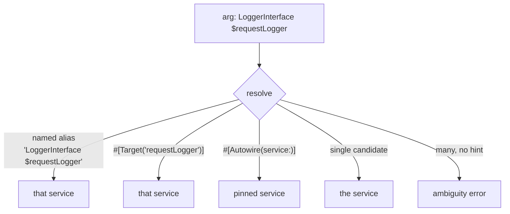

# Autowiring

!!! tip "In a nutshell"
    Autowiring reads a constructor parameter's type-hint and injects the matching
    service — all resolved at **compile time**, so mistakes are build errors. It
    never guesses scalars. Highest-yield fact: multiple candidates with no default
    alias → an **ambiguity error**; disambiguate with `#[Target]`, `#[Autowire]`,
    or a named alias.

!!! abstract "Learning objectives"
    By the end of this chapter you can:

    - [ ] Explain how type-hints resolve to services at compile time.
    - [ ] Disambiguate with **named autowiring aliases**, `#[Target]`,
          `#[Autowire]` and `bind`.
    - [ ] Diagnose and fix ambiguity / "cannot autowire" errors.

    **Syllabus:** `Dependency Injection → Autowiring` ·
    **Level:** Advanced / Expert ·
    **Est. time:** 40 min ·
    **Prerequisites:** [Service Registration](registration.md)

---

## Theory

**Autowiring** removes the boilerplate of listing every constructor argument.
The container reads a parameter's **type-hint** and injects the service registered
for that type. It resolves entirely at **compile time**, so mistakes surface as
build errors, not runtime surprises. Autowiring handles *objects by type*; it
cannot guess scalars — those come from `bind` or `#[Autowire]`.

## Deep Dive — how it works internally

### Type → service resolution

The `Symfony\Component\DependencyInjection\Compiler\AutowirePass` inspects each
argument's type. It looks for a service whose id **equals the type** (FQCN) or an
**alias** from that interface/class to a concrete id. FrameworkBundle and your
`App\:` glob create those ids; interfaces need an explicit or auto-generated alias
(one implementation → auto-alias in some cases, otherwise you define it).

### Ambiguity

If a type has **multiple** candidate services and no default alias, autowiring
**fails** with an ambiguity error listing the candidates. You resolve it by:

- a **named autowiring alias** — an alias whose id is `Type $paramName`, matched by
  the argument variable name;
- `#[Target('name')]` — matches a named alias explicitly, decoupled from the
  variable name;
- `#[Autowire(service: 'id')]` — pin an exact service;
- `bind` in YAML — bind `Type $name` to a service.



### Named aliases and `#[Target]`

Monolog-style setups register several loggers as named aliases like
`Psr\Log\LoggerInterface $requestLogger`. Autowiring matches when your parameter is
named `$requestLogger`. Because relying on the variable name is fragile,
`#[Target('requestLogger')]` states the intended alias explicitly — renaming the
parameter no longer breaks wiring.

### `#[Autowire]` vs aliases

`#[Autowire]` is the local, per-argument override (service, value, env, param,
expression). Aliases are global type→id mappings. Prefer aliases/`#[Target]` for
"which implementation of this interface"; use `#[Autowire]` for values or one-off
pins.

!!! note "Source reference"
    `Symfony\Component\DependencyInjection\Compiler\AutowirePass` &
    the `Autowire`/`Target` attributes —
    [symfony/symfony `8.0`](https://github.com/symfony/symfony/blob/8.0/src/Symfony/Component/DependencyInjection/Compiler/AutowirePass.php).

## Configuration & code

=== "PHP Attributes"

    ```php
    <?php
    declare(strict_types=1);

    namespace App\Notification;

    use Psr\Log\LoggerInterface;
    use Symfony\Component\DependencyInjection\Attribute\Autowire;
    use Symfony\Component\DependencyInjection\Attribute\Target;

    final class Notifier
    {
        public function __construct(
            // Resolve the named alias 'LoggerInterface $notificationLogger'.
            #[Target('notificationLogger')]
            private readonly LoggerInterface $logger,
            // Pin an exact service or a value.
            #[Autowire(service: 'app.sms_transport')]
            private readonly TransportInterface $transport,
            #[Autowire('%kernel.environment%')]
            private readonly string $env,
        ) {}
    }
    ```

=== "YAML"

    ```yaml
    # config/services.yaml
    services:
        _defaults:
            autowire: true
            bind:
                # Bind by type + name for every service in this file.
                Psr\Log\LoggerInterface $notificationLogger: '@monolog.logger.notification'
                string $adminEmail: '%app.admin_email%'
    ```

=== "Console"

    ```console
    $ php bin/console debug:autowiring --all
    $ php bin/console debug:autowiring logger
    ```

## Best practices & anti-patterns

| ✅ Do | ❌ Avoid |
|---|---|
| Type-hint interfaces | Type-hinting concrete classes needlessly |
| `#[Target]` for named aliases | Relying on the parameter name alone |
| `#[Autowire]` for scalars/pins | Autowiring scalars (impossible) |
| Alias interface → one impl | Leaving ambiguity unresolved |

## When (not) to use it / alternatives

Autowire by default — it is the idiomatic path. Turn it off (`autowire: false`)
only for services where you must control every argument (rare). For scalars/config
use [parameters](parameters.md) + `#[Autowire]`; for many implementations use
[tags](tags.md); for on-demand access use [service locators](service-locators.md).

!!! danger "Certification traps"
    - Autowiring runs at **compile time**; failures are build errors.
    - It resolves **objects by type**, never scalars — those need `bind`/`#[Autowire]`.
    - A named autowiring alias id is literally `Type $paramName`; the **parameter
      name must match** (or use `#[Target]`).
    - Multiple candidates with no default/alias → **ambiguity error**, not a silent
      pick.
    - `#[Target]` decouples wiring from the variable name.

!!! warning "Common mistakes"
    - Expecting an interface to autowire with no implementation aliased.
    - Renaming a constructor param and breaking a named-alias match.
    - Using `#[Autowire('app.foo')]` (literal) when you meant `service: 'app.foo'`.

## Exercises

1. **(Advanced)** Two `TransportInterface` services exist. Inject the SMS one into a
   `Notifier` without renaming the parameter to match an alias.
2. **(Expert)** Explain why `#[Target]` is more robust than matching by parameter
   name.

??? success "Solutions"

    **1.** Use `#[Autowire(service: 'app.sms_transport')]` on the parameter, or
    `#[Target('smsTransport')]` if a named alias exists. Both pin the choice
    regardless of the variable name.

    **2.** A named-alias match depends on the constructor parameter being named
    exactly like the alias; renaming the parameter silently breaks wiring.
    `#[Target('name')]` names the alias explicitly, so the parameter can be renamed
    freely and the intent is documented in code.

## Certification questions

??? question "Q1. What can autowiring resolve automatically?"
    - [x] A. Object dependencies by type-hint ✅
    - [ ] B. Scalar/string arguments
    - [ ] C. Array parameters
    - [ ] D. Environment variables

    **Why:** Autowiring maps a type-hint to a service; scalars/env need explicit
    binding. **Ref:** [Autowiring](https://symfony.com/doc/current/service_container/autowiring.html).

??? question "Q2. Two services implement one interface and no default is set. Autowiring…"
    - [ ] A. Picks the first one
    - [x] B. Throws an ambiguity error ✅
    - [ ] C. Injects `null`
    - [ ] D. Picks the last one

    **Why:** Ambiguity is a hard build error; you must disambiguate.
    **Ref:** [Autowiring](https://symfony.com/doc/current/service_container/autowiring.html).

??? question "Q3. What does `#[Target('requestLogger')]` do?"
    - [x] A. Selects the named autowiring alias `...$requestLogger` explicitly ✅
    - [ ] B. Creates a new service
    - [ ] C. Tags the service
    - [ ] D. Makes the service public

    **Why:** `#[Target]` binds to a named alias without relying on the parameter
    name. **Ref:** [Autowiring aliases](https://symfony.com/doc/current/service_container/autowiring.html#fixing-non-autowireable-arguments).

??? question "Q4. When does autowiring resolution occur?"
    - [x] A. At container compilation ✅
    - [ ] B. On each `get()`
    - [ ] C. On autoload
    - [ ] D. At kernel termination

    **Why:** `AutowirePass` runs during compilation; the dumped container has
    resolved arguments. **Ref:** [Compiling the container](https://symfony.com/doc/current/components/dependency_injection/compilation.html).

## Key takeaways

- Autowiring injects objects by type-hint at compile time.
- Disambiguate with named aliases, `#[Target]`, `#[Autowire(service:)]`, or `bind`.
- Scalars are never autowired — bind them explicitly.
- Ambiguity is a build error, not a silent choice.

## Last-minute revision

!!! tip "Cheat sheet"
    - `AutowirePass`: type-hint → service id / alias.
    - Named alias id = `Type $paramName`; `#[Target('name')]` = explicit.
    - `#[Autowire(service:/value:/env:/param:/expression:)]`.
    - Debug: `debug:autowiring [--all]`.

## Official References
- [Official Symfony docs — Autowiring](https://symfony.com/doc/current/service_container/autowiring.html)
- [Symfony source — AutowirePass](https://github.com/symfony/symfony/blob/8.0/src/Symfony/Component/DependencyInjection/Compiler/AutowirePass.php)

---

<small>Related: [Registration](registration.md) · [Parameters](parameters.md) ·
[Service Locators](service-locators.md)</small>
