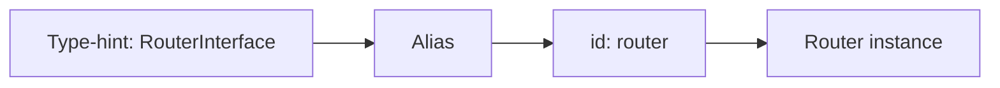

# Built-in Services

!!! tip "In a nutshell"
    Les bundles de Symfony enregistrent des centaines de services ; vous les
    atteignez en **autowirant une interface**, pas via l'id brut. Apprenez les
    services phares et utilisez `debug:container` / `debug:autowiring` pour
    découvrir les autres. Fait à plus haut rendement : injectez `RequestStack`
    (puis `getCurrentRequest()`), jamais une `Request` brute.

!!! example "Real-world analogy"
    Les services intégrés du framework sont le garde-manger de la maison — des
    centaines de produits de base déjà en stock (`router`, `logger`,
    `serializer`). Vous ne les prenez pas par numéro d'étagère (id brut) ; vous
    demandez par *type d'ingrédient* (autowirer l'interface) et la cuisine sait
    quel bocal. `debug:autowiring` est l'index du garde-manger qui vous dit quel
    type-hint correspond à quel bocal.

!!! abstract "Learning objectives"
    À la fin de ce chapitre, vous saurez :

    - [ ] Nommer les services courants du framework et les interfaces que vous
          autowirez pour les atteindre.
    - [ ] Découvrir les services et leurs ids avec `debug:container` et
          `debug:autowiring`.
    - [ ] Distinguer l'**id** d'un service, sa **classe** et son **autowiring
          alias**.

    **Syllabus:** `Dependency Injection → Built-in Services` ·
    **Level:** Advanced / Expert ·
    **Est. time:** 25 min ·
    **Prerequisites:** [The Service Container](container.md)

---

## Theory

FrameworkBundle (et les autres bundles) enregistrent des centaines de services
pendant la compilation. Vous les référencez rarement par id brut ; vous les
**autowirez** en type-hintant une interface. Connaître les services phares — et
savoir *trouver* les autres — vaut plusieurs points à l'examen.

| Concept | Type d'autowire courant | Id typique |
|---|---|---|
| Routing | `UrlGeneratorInterface` / `RouterInterface` | `router` |
| Events | `EventDispatcherInterface` | `event_dispatcher` |
| Kernel | `HttpKernelInterface` | `http_kernel` |
| Request courante | `RequestStack` | `request_stack` |
| Parameters | `ParameterBagInterface` | `parameter_bag` |
| Logging | `LoggerInterface` | `logger` |
| Cache | `CacheInterface` | `cache.app` |
| Serializer | `SerializerInterface` | `serializer` |
| Validation | `ValidatorInterface` | `validator` |

!!! question "Predict first"
    Vous injectez `RequestStack` dans un service qui s'exécute aussi depuis une
    commande console, et appelez `getCurrentRequest()->getPathInfo()`. Que se
    passe-t-il dans la commande ?

??? note "Reveal"
    `getCurrentRequest()` retourne **`null`** hors du cycle HTTP, donc l'appel
    chaîné provoque une erreur fatale. Utilisez
    `getCurrentRequest()?->getPathInfo()` ou protégez-vous en amont — et gardez les
    services indépendants de la request libres de toute request.

## Deep Dive — how it works internally

### Where they come from

L'`Extension::load()` de chaque bundle (voir [Semantic Configuration](semantic-config.md))
enregistre des services dans le `ContainerBuilder`. L'extension de FrameworkBundle
câble `router`, `event_dispatcher`, `request_stack`, `http_kernel` et les autres,
puis ajoute des **autowiring aliases** : un alias du FQCN d'une interface vers un
id de service concret pour que la résolution `type-hint → service` fonctionne. Ce
sont ces alias que `debug:autowiring` liste.

### id vs class vs alias

- **id** — la clé texte dans le container (`router`, `event_dispatcher`).
- **class** — l'implémentation concrète (`Symfony\Bundle\FrameworkBundle\Routing\Router`).
- **autowiring alias** — un `Alias` d'un type (`Symfony\Component\Routing\RouterInterface`)
  vers un id de service, permettant au compilateur de l'injecter par type-hint.

`debug:container <id>` inspecte la definition ; `debug:autowiring <Type>` montre
quels type-hints sont résolus et vers quoi.



### RequestStack, not Request

Vous ne pouvez pas injecter une `Request` directement (elle n'existe pas tant
qu'une request n'est pas traitée et elle change à chaque sub-request). Injectez
`Symfony\Component\HttpFoundation\RequestStack` et appelez `getCurrentRequest()`,
ou utilisez un argument de controller / `#[MapRequestPayload]`. C'est un piège
classique.

!!! note "Source reference"
    FrameworkBundle câble les services de base dans
    `Symfony\Bundle\FrameworkBundle\DependencyInjection\FrameworkExtension` —
    [symfony/symfony `8.0`](https://github.com/symfony/symfony/blob/8.0/src/Symfony/Bundle/FrameworkBundle/DependencyInjection/FrameworkExtension.php).

### Null behavior

Le null vedette ici est `RequestStack::getCurrentRequest()`, qui retourne
**`null`** quand il n'y a pas de request active — hors du cycle HTTP (une commande
console, un worker Messenger, certains cas limites de `kernel.terminate`). C'est
pourquoi l'exemple du chapitre écrit
`$this->requestStack->getCurrentRequest()?->getPathInfo()` : l'opérateur nullsafe
court-circuite en `null` au lieu de « method call on null ». Il en va de même pour
`getMainRequest()`. Le bug classique consiste à injecter `RequestStack` dans un
service qui s'exécute *aussi* dans une commande et à appeler
`getCurrentRequest()->…` sans le `?->`, ce qui provoque une erreur fatale dès
qu'il n'y a pas de request. Protégez-vous avec `?->`, un
`if (null === $request) { return; }` en amont, ou gardez les services indépendants
de la request totalement libres de celle-ci.

!!! note "Null in real life"
    Demander « quelle est la commande de la table en cours ? » quand le restaurant
    est fermé (pas de request) — il n'y a pas de table, donc `getCurrentRequest()`
    ne rend rien (null) ; vérifiez avant de la lire.

## Configuration & code

=== "PHP Attributes"

    ```php
    <?php
    declare(strict_types=1);

    namespace App\Service;

    use Psr\Log\LoggerInterface;
    use Symfony\Component\HttpFoundation\RequestStack;
    use Symfony\Component\Routing\Generator\UrlGeneratorInterface;

    final class LinkBuilder
    {
        public function __construct(
            private readonly UrlGeneratorInterface $urls,
            private readonly RequestStack $requestStack,
            private readonly LoggerInterface $logger,
        ) {}

        public function currentPath(): ?string
        {
            return $this->requestStack->getCurrentRequest()?->getPathInfo();
        }
    }
    ```

=== "Console"

    ```console
    $ php bin/console debug:container --show-private
    $ php bin/console debug:container router
    $ php bin/console debug:autowiring logger
    $ php bin/console debug:autowiring --all
    ```

## Best practices & anti-patterns

| ✅ À faire | ❌ À éviter |
|---|---|
| Autowirer par interface (`LoggerInterface`) | Coder en dur des ids comme `'logger'` |
| Utiliser `debug:autowiring` pour trouver les types | Deviner les ids de services |
| Injecter `RequestStack` | Injecter `Request` directement |
| `--show-private` pour voir les services cachés | Supposer qu'un service est public |

## When (not) to use it / alternatives

Préférez le service du framework à une réimplémentation maison (par exemple
utilisez `SerializerInterface`, pas un helper JSON artisanal). Quand vous n'avez
besoin que d'une méthode, injectez quand même l'interface ; ne la tirez pas du
container. Si un service intégré n'est *pas* public et pas aliasé, vous
l'atteignez en injectant le service qui le possède, pas par id.

!!! danger "Certification traps"
    - `RequestStack` est injectable ; une `Request` brute ne l'est **pas**.
    - `debug:container` masque les services privés sauf si vous passez
      `--show-private`.
    - L'**id** (`router`) et le **type d'autowiring** (`RouterInterface`) sont des
      clés différentes.
    - `parameter_bag` expose les parameters comme un service
      (`ParameterBagInterface`).

!!! warning "Common mistakes"
    - Type-hinter une classe concrète du framework au lieu de son interface.
    - S'attendre à ce que chaque service intégré soit public/récupérable via
      `get()`.

## Exercises

1. **(Advanced)** Quelle commande liste ce vers quoi un type-hint
   `MailerInterface` est résolu ?
2. **(Expert)** Vous avez besoin de la locale courante dans un service. Quel
   service intégré injectez-vous et comment la lisez-vous ?

??? success "Solutions"

    **1.** `php bin/console debug:autowiring mailer` (ou le FQCN complet). Elle
    montre la cible de l'alias pour `MailerInterface`.

    **2.** Injectez `RequestStack` et appelez
    `$this->requestStack->getCurrentRequest()?->getLocale()`. (Vous pouvez aussi
    injecter une valeur via `#[Autowire]`.) Une `Request` ne peut pas être injectée
    directement.

## Certification questions

??? question "Q1. How do you inject the current request into a service?"
    - [ ] A. Type-hint `Request`
    - [x] B. Inject `RequestStack` and call `getCurrentRequest()` ✅
    - [ ] C. Inject `HttpKernelInterface`
    - [ ] D. Use `$container->get('request')`

    **Why:** La request est propre à chaque cycle et peut changer ; `RequestStack`
    fournit un accès sûr. **Ref:** [RequestStack](https://symfony.com/doc/current/service_container/request.html).

??? question "Q2. Which command shows private services too?"
    - [ ] A. `debug:autowiring`
    - [x] B. `debug:container --show-private` ✅
    - [ ] C. `debug:config`
    - [ ] D. `debug:router`

    **Why:** Par défaut, `debug:container` ne liste que les services publics et
    les alias.
    **Ref:** [Debugging services](https://symfony.com/doc/current/service_container/debug.html).

??? question "Q3. `parameter_bag` is…"
    - [x] A. A service exposing container parameters via `ParameterBagInterface` ✅
    - [ ] B. A YAML file
    - [ ] C. An env-var processor
    - [ ] D. A compiler pass

    **Why:** Il permet aux services de lire les parameters à l'exécution via une
    interface injectée. **Ref:** [Parameters](https://symfony.com/doc/current/configuration.html#configuration-parameters).

## Key takeaways

- Autowirez les services du framework par leur **interface**, pas par leur id.
- `debug:container` et `debug:autowiring` sont vos outils de découverte.
- id ≠ classe ≠ autowiring alias.
- Injectez `RequestStack`, jamais une `Request` brute.

## Last-minute revision

!!! tip "Cheat sheet"
    - `router`, `event_dispatcher`, `http_kernel`, `request_stack`,
      `parameter_bag`, `logger`, `serializer`, `validator`, `cache.app`.
    - Trouver un type : `debug:autowiring <needle>` ; inspecter :
      `debug:container <id>`.
    - `--show-private` révèle les services cachés.

## Connections

- **Depends on:** [The Service Container](container.md) — les services intégrés ne
  sont que des services du container câblés par les bundles.
- **Reused in:** [Controllers](../controllers/request.md),
  [Console](../console/custom-commands.md) — les mêmes interfaces sont injectées
  quel que soit le point d'entrée.
- **Confused with:** [Autowiring](autowiring.md) — vous atteignez les services
  intégrés en autowirant une interface, pas via l'id brut.

## Official References
- [Official Symfony docs — Debugging services](https://symfony.com/doc/current/service_container/debug.html)
- [Official Symfony docs — Service Container](https://symfony.com/doc/current/service_container.html)
- [Symfony source — FrameworkExtension](https://github.com/symfony/symfony/blob/8.0/src/Symfony/Bundle/FrameworkBundle/DependencyInjection/FrameworkExtension.php)

## Video references

!!! tip "Watch & learn"
    Voici des chaînes vidéo officielles, mises à jour en continu — cherchez-y
    « dependency injection » pour consolider ce chapitre. Nous lions des chaînes
    stables plutôt que des vidéos individuelles pour que les références ne
    périment jamais.

    - [SymfonyCasts screencasts](https://symfonycasts.com/tracks/symfony) — tutoriels scénarisés à suivre en codant.
    - [Symfony official YouTube](https://www.youtube.com/@SymfonyOfficial) — conférences et keynotes des SymfonyCon.
    - [Official docs for this topic](https://symfony.com/doc/current/service_container/request.html) — certaines pages de la doc Symfony intègrent un screencast.

## Confidence check

Je suis prêt quand je peux :

- [ ] expliquer **pourquoi** on autowire une interface plutôt qu'un id de service
      brut
- [ ] découvrir le type d'autowire d'un service avec `debug:autowiring` dans
      Symfony 8
- [ ] déboguer un `getCurrentRequest()` à `null` hors du cycle HTTP
- [ ] repérer qu'une `Request` brute n'est pas injectable mais que `RequestStack`
      l'est
- [ ] expliquer la différence entre l'id d'un service, sa classe et son alias

---

<small>Related: [The Service Container](container.md) · [Autowiring](autowiring.md) ·
[Parameters](parameters.md)</small>
