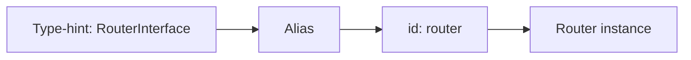

# Built-in Services

!!! tip "In a nutshell"
    Symfony's bundles register hundreds of services; you reach them by
    **autowiring an interface**, not by raw id. Learn the headline ones and use
    `debug:container` / `debug:autowiring` to discover the rest. Highest-yield
    fact: inject `RequestStack` (then `getCurrentRequest()`), never a raw
    `Request`.

!!! example "Real-world analogy"
    The framework's built-in services are the house pantry — hundreds of staples
    already stocked (`router`, `logger`, `serializer`). You don't fetch them by
    shelf number (raw id); you ask by *ingredient type* (autowire the interface) and
    the kitchen knows which jar. `debug:autowiring` is the pantry index that tells
    you which type-hint maps to which jar.

!!! abstract "Learning objectives"
    By the end of this chapter you can:

    - [ ] Name the common framework services and the interfaces you autowire to
          reach them.
    - [ ] Discover services and their ids with `debug:container` and
          `debug:autowiring`.
    - [ ] Distinguish a service **id**, its **class**, and its **autowiring alias**.

    **Syllabus:** `Dependency Injection → Built-in Services` ·
    **Level:** Advanced / Expert ·
    **Est. time:** 25 min ·
    **Prerequisites:** [The Service Container](container.md)

---

## Theory

FrameworkBundle (and the other bundles) register hundreds of services during
compilation. You rarely reference them by raw id; you **autowire** them by
type-hinting an interface. Knowing the headline services — and how to *find* the
rest — is worth several exam points.

| Concept | Common autowire type | Typical id |
|---|---|---|
| Routing | `UrlGeneratorInterface` / `RouterInterface` | `router` |
| Events | `EventDispatcherInterface` | `event_dispatcher` |
| Kernel | `HttpKernelInterface` | `http_kernel` |
| Current request | `RequestStack` | `request_stack` |
| Parameters | `ParameterBagInterface` | `parameter_bag` |
| Logging | `LoggerInterface` | `logger` |
| Cache | `CacheInterface` | `cache.app` |
| Serializer | `SerializerInterface` | `serializer` |
| Validation | `ValidatorInterface` | `validator` |

## Deep Dive — how it works internally

### Where they come from

Each bundle's `Extension::load()` (see [Semantic Configuration](semantic-config.md))
registers services into the `ContainerBuilder`. FrameworkBundle's extension wires
`router`, `event_dispatcher`, `request_stack`, `http_kernel` and the rest, then
adds **autowiring aliases**: an alias from an interface FQCN to a concrete service
id so `type-hint → service` resolution works. These aliases are what
`debug:autowiring` lists.

### id vs class vs alias

- **id** — the string key in the container (`router`, `event_dispatcher`).
- **class** — the concrete implementation (`Symfony\Bundle\FrameworkBundle\Routing\Router`).
- **autowiring alias** — an `Alias` from a type (`Symfony\Component\Routing\RouterInterface`)
  to a service id, letting the compiler inject it by type-hint.

`debug:container <id>` inspects the definition; `debug:autowiring <Type>` shows
which type-hints resolve and to what.



### RequestStack, not Request

You cannot inject a `Request` directly (it does not exist until a request is
handled and it changes per sub-request). Inject
`Symfony\Component\HttpFoundation\RequestStack` and call `getCurrentRequest()`, or
use a controller argument / `#[MapRequestPayload]`. This is a classic trap.

!!! note "Source reference"
    FrameworkBundle wires the core services in
    `Symfony\Bundle\FrameworkBundle\DependencyInjection\FrameworkExtension` —
    [symfony/symfony `8.0`](https://github.com/symfony/symfony/blob/8.0/src/Symfony/Bundle/FrameworkBundle/DependencyInjection/FrameworkExtension.php).

### Null behavior

The headline null here is `RequestStack::getCurrentRequest()`, which returns
**`null`** when there is no active request — outside the HTTP cycle (a console
command, a Messenger worker, some `kernel.terminate` edges). That is why the
chapter's example writes
`$this->requestStack->getCurrentRequest()?->getPathInfo()`: the nullsafe operator
short-circuits to `null` instead of "method call on null". The same holds for
`getMainRequest()`. The common bug is injecting `RequestStack` into a service that
*also* runs in a command and calling `getCurrentRequest()->…` without the `?->`,
which fatals the moment there is no request. Guard with `?->`, an early
`if (null === $request) { return; }`, or keep request-agnostic services free of the
request altogether.

!!! note "Null in real life"
    Asking "what's the current table's order?" when the restaurant is closed (no
    request) — there is no table, so `getCurrentRequest()` hands back nothing
    (null); check before reading it.

## Configuration & code

=== "PHP Attributes"

    ```php
    <?php
    declare(strict_types=1);

    namespace App\Service;

    use Psr\Log\LoggerInterface;
    use Symfony\Component\HttpFoundation\RequestStack;
    use Symfony\Component\Routing\Generator\UrlGeneratorInterface;

    final class LinkBuilder
    {
        public function __construct(
            private readonly UrlGeneratorInterface $urls,
            private readonly RequestStack $requestStack,
            private readonly LoggerInterface $logger,
        ) {}

        public function currentPath(): ?string
        {
            return $this->requestStack->getCurrentRequest()?->getPathInfo();
        }
    }
    ```

=== "Console"

    ```console
    $ php bin/console debug:container --show-private
    $ php bin/console debug:container router
    $ php bin/console debug:autowiring logger
    $ php bin/console debug:autowiring --all
    ```

## Best practices & anti-patterns

| ✅ Do | ❌ Avoid |
|---|---|
| Autowire by interface (`LoggerInterface`) | Hard-coding ids like `'logger'` |
| Use `debug:autowiring` to find types | Guessing service ids |
| Inject `RequestStack` | Injecting `Request` directly |
| `--show-private` to see hidden services | Assuming a service is public |

## When (not) to use it / alternatives

Prefer the framework service over rolling your own (e.g. use `SerializerInterface`,
not a hand-rolled JSON helper). When you only need one method, still inject the
interface; do not pull it from the container. If a built-in service is *not*
public and not aliased, you reach it by injecting the owning service, not by id.

!!! danger "Certification traps"
    - `RequestStack` is injectable; a raw `Request` is **not**.
    - `debug:container` hides private services unless you pass `--show-private`.
    - The **id** (`router`) and the **autowiring type**
      (`RouterInterface`) are different keys.
    - `parameter_bag` exposes parameters as a service (`ParameterBagInterface`).

!!! warning "Common mistakes"
    - Type-hinting a concrete framework class instead of its interface.
    - Expecting every built-in service to be public/fetchable by `get()`.

## Exercises

1. **(Advanced)** Which command lists what a `MailerInterface` type-hint resolves
   to?
2. **(Expert)** You need the current locale in a service. Which built-in service do
   you inject and how do you read it?

??? success "Solutions"

    **1.** `php bin/console debug:autowiring mailer` (or the full FQCN). It shows
    the alias target for `MailerInterface`.

    **2.** Inject `RequestStack` and call
    `$this->requestStack->getCurrentRequest()?->getLocale()`. (Alternatively inject
    a value via `#[Autowire]`.) A `Request` cannot be injected directly.

## Certification questions

??? question "Q1. How do you inject the current request into a service?"
    - [ ] A. Type-hint `Request`
    - [x] B. Inject `RequestStack` and call `getCurrentRequest()` ✅
    - [ ] C. Inject `HttpKernelInterface`
    - [ ] D. Use `$container->get('request')`

    **Why:** The request is per-cycle and may change; `RequestStack` gives safe
    access. **Ref:** [RequestStack](https://symfony.com/doc/current/service_container/request.html).

??? question "Q2. Which command shows private services too?"
    - [ ] A. `debug:autowiring`
    - [x] B. `debug:container --show-private` ✅
    - [ ] C. `debug:config`
    - [ ] D. `debug:router`

    **Why:** By default `debug:container` lists public services and aliases only.
    **Ref:** [Debugging services](https://symfony.com/doc/current/service_container/debug.html).

??? question "Q3. `parameter_bag` is…"
    - [x] A. A service exposing container parameters via `ParameterBagInterface` ✅
    - [ ] B. A YAML file
    - [ ] C. An env-var processor
    - [ ] D. A compiler pass

    **Why:** It lets services read parameters at runtime through an injected
    interface. **Ref:** [Parameters](https://symfony.com/doc/current/configuration.html#configuration-parameters).

## Key takeaways

- Autowire framework services by their **interface**, not their id.
- `debug:container` and `debug:autowiring` are your discovery tools.
- id ≠ class ≠ autowiring alias.
- Inject `RequestStack`, never a raw `Request`.

## Last-minute revision

!!! tip "Cheat sheet"
    - `router`, `event_dispatcher`, `http_kernel`, `request_stack`,
      `parameter_bag`, `logger`, `serializer`, `validator`, `cache.app`.
    - Find a type: `debug:autowiring <needle>`; inspect: `debug:container <id>`.
    - `--show-private` reveals hidden services.

## Official References
- [Official Symfony docs — Debugging services](https://symfony.com/doc/current/service_container/debug.html)
- [Official Symfony docs — Service Container](https://symfony.com/doc/current/service_container.html)
- [Symfony source — FrameworkExtension](https://github.com/symfony/symfony/blob/8.0/src/Symfony/Bundle/FrameworkBundle/DependencyInjection/FrameworkExtension.php)

---

<small>Related: [The Service Container](container.md) · [Autowiring](autowiring.md) ·
[Parameters](parameters.md)</small>
