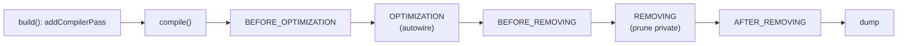

# Compiler Passes

!!! tip "In a nutshell"
    Un compiler pass est un hook qui réécrit les définitions de service pendant la
    compilation — l'autowiring de Symfony et la collecte de tags sont eux-mêmes des
    passes. On l'enregistre dans `Kernel::build()` ou dans le `build()` d'un
    bundle. Fait le plus rentable : il n'existe **pas d'attribut
    `#[CompilerPass]`**, et une `priority` plus élevée s'exécute *plus tôt* au sein
    d'une phase.

!!! example "Real-world analogy"
    Un compiler pass est un chef de cuisine qui fait la mise en place *avant* le
    service : il parcourt les fiches de poste (les définitions) et — par exemple —
    rassemble toutes les recettes « sauce » taguées sur le tableau pour les agrafer
    à la checklist du poste principal. Il réarrange les recettes sur le papier ;
    aucun plat n'est encore cuisiné (aucun service n'est instancié). Tout se passe
    une seule fois, pendant la préparation d'avant-service (la compilation).

!!! abstract "Learning objectives"
    À la fin de ce chapitre, vous saurez :

    - [ ] Implémenter `CompilerPassInterface` et l'enregistrer dans
          `Kernel::build()` ou dans le `build()` d'un bundle.
    - [ ] Nommer les phases de `PassConfig` et leur ordre.
    - [ ] Collecter les services tagués avec `findTaggedServiceIds()` et décider
          quand un pass l'emporte sur l'autoconfiguration.

    **Syllabus:** `Dependency Injection → Compiler Passes` ·
    **Level:** Expert ·
    **Est. time:** 40 min ·
    **Prerequisites:** [Tags](tags.md)

---

## Pour les nuls

### L'idée en une phrase
Un compiler pass réécrit les définitions de services **pendant** la compilation, avant que quoi que ce soit ne soit réellement instancié.

### Imagine dans la vraie vie
Un compiler pass est un manager de cuisine qui fait la mise en place *avant* le service : il parcourt les fiches de poste (les définitions) et — disons — rassemble toutes les recettes de "sauce" étiquetées sur le tableau et les agrafe dans la checklist du poste principal. Il réorganise sur papier ; aucun plat n'est encore cuisiné.

### Dans Symfony
L'autowiring et la collecte des services tagués de Symfony **sont eux-mêmes** des compiler passes — ce ne sont pas des mécanismes magiques séparés, juste des passes exécutées avant les tiennes.

### Exemple simple
```php
class MonPass implements CompilerPassInterface {
    public function process(ContainerBuilder $container): void { /* réécrit des définitions */ }
}
```

### Comment le mémoriser 🧠
Il n'existe **pas** d'attribut `#[CompilerPass]` — l'enregistrement se fait toujours dans `Kernel::build()` ou le `build()` d'un bundle. Et une priorité plus haute s'exécute **plus tôt** dans sa phase.

---


## Theory

Un **compiler pass** est un hook qui s'exécute pendant la **compilation** du
container et peut lire et réécrire les définitions de service avant que le
container soit dumpé. Le câblage propre à Symfony (autowiring, decoration, collecte
de tags, suppression des services privés) est entièrement fait de compiler passes.
Vous en écrivez un quand vous devez transformer des définitions par programme — le
plus souvent pour câbler tous les services portant un tag donné.

!!! question "Predict first"
    Vous voudriez un attribut `#[CompilerPass]` pour enregistrer votre pass.
    Existe-t-il — et au sein d'une phase, une `priority` plus élevée s'exécute-t-elle
    plus tôt ou plus tard ?

??? note "Reveal"
    Il n'existe **pas** d'attribut `#[CompilerPass]` — enregistrez avec
    `addCompilerPass()` dans `Kernel::build()` ou `Bundle::build()`. Une `priority`
    plus élevée s'exécute **plus tôt** au sein de sa phase.

## Deep Dive — how it works internally

### The interface and registration

Un pass implémente
`Symfony\Component\DependencyInjection\Compiler\CompilerPassInterface` :

```php
public function process(ContainerBuilder $container): void;
```

Vous l'enregistrez vous-même — il n'existe **pas d'attribut `#[CompilerPass]`**
(un piège classique). Enregistrez-le par programme :

- Dans l'application : `Kernel::build(ContainerBuilder $container)` via
  `$container->addCompilerPass(new MyPass());`
- Dans un bundle : `Bundle::build(ContainerBuilder $container)` de la même façon.

`addCompilerPass()` accepte une **phase** et une **priority** (la plus élevée
s'exécute en premier au sein de la phase).

```php
// src/Kernel.php — application hook (same call works in Bundle::build())
protected function build(ContainerBuilder $container): void
{
    $container->addCompilerPass(
        new MyPass(),
        PassConfig::TYPE_BEFORE_OPTIMIZATION, // phase (this is the default)
        priority: 10,                         // higher runs earlier in the phase
    );
}
```

### The `PassConfig` phases

`Symfony\Component\DependencyInjection\Compiler\PassConfig` exécute les passes dans
cet ordre fixe :

| Constante de phase | Rôle |
|---|---|
| `TYPE_BEFORE_OPTIMIZATION` | la plupart des passes utilisateur : lire les tags, ajouter des arguments |
| `TYPE_OPTIMIZE` | autowiring, résolution des références (cœur) |
| `TYPE_BEFORE_REMOVING` | dernière chance avant l'élagage |
| `TYPE_REMOVE` | suppression des services privés/inutilisés |
| `TYPE_AFTER_REMOVING` | s'exécute après la suppression |

La phase par défaut est `TYPE_BEFORE_OPTIMIZATION`. Enregistrez-y votre pass sauf
si vous devez spécifiquement agir après l'autowiring ou la suppression.



### Collecting tagged services

Dans `process()`, `$container->findTaggedServiceIds('app.handler')` renvoie
`['service_id' => [['attr' => 'value'], ...]]` — l'id associé à chaque occurrence
du tag avec ses attributs. Vous mutez ensuite la définition d'un collecteur, par ex.
`$container->findDefinition('registry')->addMethodCall('add', [new Reference($id)])`.

```php
public function process(ContainerBuilder $container): void
{
    // ['service_id' => [['attr' => 'value'], ...]]
    foreach ($container->findTaggedServiceIds('app.handler') as $id => $tags) {
        // Mutate the collector definition: one addMethodCall() per tagged id
        $container->findDefinition('registry')
            ->addMethodCall('add', [new Reference($id)]);
    }
}
```

!!! note "Source reference"
    `Symfony\Component\DependencyInjection\Compiler\PassConfig` définit l'ordre des
    phases —
    [symfony/symfony `8.0`](https://github.com/symfony/symfony/blob/8.0/src/Symfony/Component/DependencyInjection/Compiler/PassConfig.php).

### Null behavior

Les passes travaillent sur des `Definition`s : les questions de null sont donc des
questions de compilation. `findDefinition($id)` / `getDefinition($id)` **lèvent**
une `ServiceNotFoundException` si l'id est absent — vérifiez toujours `has($id)` /
`hasDefinition($id)` d'abord et faites un `return` anticipé, sinon un bundle
manquant fait planter la compilation. `findTaggedServiceIds($tag)` renvoie un
**tableau vide** quand rien ne porte le tag (jamais `null`), donc un simple
`foreach` est sûr. Quand vous câblez un collaborateur *optionnel* dans un pass,
construisez la référence avec
`new Reference($id, ContainerInterface::NULL_ON_INVALID_REFERENCE)` pour qu'une
cible manquante se résolve en `null` à l'exécution au lieu de lever une exception.
Le bug classique est de sauter la garde `has()` et de laisser le pass exploser dès
que le service cible n'est pas enregistré.

```php
// findDefinition()/getDefinition() throw ServiceNotFoundException — guard first
if (!$container->hasDefinition('app.registry')) { // or has() for aliases too
    return;
}
$registry = $container->getDefinition('app.registry');

// Empty array (never null) when nothing carries the tag — plain foreach is safe
foreach ($container->findTaggedServiceIds('app.handler') as $id => $tags) {
    // Optional collaborator: a missing target resolves to null at runtime
    $registry->addMethodCall('add', [
        new Reference($id, ContainerInterface::NULL_ON_INVALID_REFERENCE),
    ]);
}
```

!!! note "Null in real life"
    Attraper une fiche recette qui n'est pas sur le tableau lève une exception
    (un get sans garde) ; vérifier le tableau d'abord (`has()`) et hausser les
    épaules si elle manque est le bon réflexe de mise en place.

!!! info "Expert note"
    Aller chercher un *vrai* service dans `process()` (`$container->get(...)`) est
    le signe révélateur d'un pass cassé : à la compilation, rien n'est instancié.
    Vous ne touchez qu'à des `Definition`s et des `Reference`s. Si vous avez besoin
    de l'objet, ajoutez une `Reference` à la définition consommatrice et laissez le
    container d'exécution le construire.

??? example "Debugging story"
    **Symptôme :** un pass qui supprimait un service provoquait ailleurs un échec
    d'autowiring. **Diagnostic :** il était enregistré en
    `TYPE_BEFORE_OPTIMIZATION` ; il supprimait donc une définition dont la phase
    d'optimisation avait encore besoin pour résoudre une `Reference`.
    **Correction :** déplacer la suppression vers `TYPE_BEFORE_REMOVING` /
    `TYPE_REMOVE`. **À éviter :** faites correspondre la phase à l'intention —
    lire/ajouter des arguments avant l'optimisation, élaguer uniquement dans les
    phases de suppression.

??? abstract "Source-code tour"
    - `Symfony\Component\DependencyInjection\Compiler\CompilerPassInterface` — la
      seule méthode que vous implémentez, `process(ContainerBuilder)`.
    - `Symfony\Component\DependencyInjection\Compiler\PassConfig` — fixe l'ordre des
      phases et contient les passes intégrées (`AutowirePass`, les passes de
      suppression).
    - `ContainerBuilder::addCompilerPass()` / `findTaggedServiceIds()` — enregistrer
      un pass ; y collecter les définitions taguées.
    - `Symfony\Component\DependencyInjection\Reference` — ce que vous ajoutez à une
      `Definition` collectrice, résolu en instance à l'exécution.

## Configuration & code

=== "PHP Attributes"

    ```php
    <?php
    declare(strict_types=1);

    namespace App;

    use App\Handler\HandlerCompilerPass;
    use Symfony\Component\DependencyInjection\ContainerBuilder;
    use Symfony\Component\DependencyInjection\Compiler\PassConfig;
    use Symfony\Component\HttpKernel\Kernel as BaseKernel;
    use Symfony\Bundle\FrameworkBundle\Kernel\MicroKernelTrait;

    final class Kernel extends BaseKernel
    {
        use MicroKernelTrait;

        // Register the pass here — there is NO #[CompilerPass] attribute.
        protected function build(ContainerBuilder $container): void
        {
            $container->addCompilerPass(
                new HandlerCompilerPass(),
                PassConfig::TYPE_BEFORE_OPTIMIZATION,
                priority: 0,
            );
        }
    }
    ```

=== "The pass"

    ```php
    <?php
    declare(strict_types=1);

    namespace App\Handler;

    use Symfony\Component\DependencyInjection\Compiler\CompilerPassInterface;
    use Symfony\Component\DependencyInjection\ContainerBuilder;
    use Symfony\Component\DependencyInjection\Reference;

    final class HandlerCompilerPass implements CompilerPassInterface
    {
        public function process(ContainerBuilder $container): void
        {
            if (!$container->has(HandlerRegistry::class)) {
                return;
            }

            $registry = $container->findDefinition(HandlerRegistry::class);

            foreach ($container->findTaggedServiceIds('app.handler') as $id => $tags) {
                $registry->addMethodCall('add', [new Reference($id)]);
            }
        }
    }
    ```

## Best practices & anti-patterns

| ✅ Do | ❌ Avoid |
|---|---|
| Protéger avec `has()`/`hasDefinition()` | Supposer qu'un service existe |
| Enregistrer dans `build()` (phase par défaut) | Chercher un attribut `#[CompilerPass]` |
| Préférer `tagged_iterator` quand il suffit | Un pass pour une simple collecte |
| Utiliser des `Reference`, pas des instances | Instancier des services dans un pass |

## When (not) to use it / alternatives

Ne recourez à un pass que lorsque les outils déclaratifs ne suffisent pas. Pour
« injecter tous les services tagués », un argument
[`tagged_iterator`/`tagged_locator`](tags.md) est plus simple. Utilisez
l'autoconfiguration pour *appliquer* un tag. Utilisez un pass quand vous devez
inspecter des définitions, recâbler conditionnellement, supprimer ou modifier des
arguments — une logique qu'aucun attribut n'exprime.

!!! danger "Certification traps"
    - **Il n'existe pas d'attribut `#[CompilerPass]`** — enregistrez via
      `addCompilerPass()` dans `Kernel::build()` ou `Bundle::build()`.
    - Ordre des phases : before-optimization → optimization → before-removing →
      removing → after-removing.
    - Les passes s'exécutent **uniquement à la compilation** ; vous manipulez des
      `Definition`s, jamais des instances.
    - Une `priority` plus élevée s'exécute **plus tôt** au sein d'une phase.
    - Autowiring/decoration/suppression sont eux-mêmes des passes dans des phases
      précises.

!!! warning "Common mistakes"
    - Récupérer un vrai service (`$container->get()`) dans `process()`.
    - S'enregistrer dans la mauvaise phase et s'exécuter après la suppression des
      services.
    - Oublier la garde `has()` et planter quand un bundle est absent.

## Exercises

1. **(Expert)** Écrivez un pass qui injecte chaque service tagué `app.handler`
   dans un `HandlerRegistry` via `addMethodCall('add', ...)`, et enregistrez-le
   dans le kernel.
2. **(Expert)** Dans quelle phase supprimeriez-vous un service, et pourquoi pas en
   before-optimization ?

??? success "Solutions"

    **1.** Voir les exemples pass + kernel ci-dessus : implémentez
    `CompilerPassInterface`, bouclez sur `findTaggedServiceIds('app.handler')`,
    ajoutez un appel de méthode avec une `Reference`, et enregistrez avec
    `addCompilerPass()` dans `Kernel::build()`.

    **2.** La suppression a sa place dans `TYPE_REMOVE` (ou vous vous reposez sur
    le pass de suppression intégré). La faire en before-optimization supprimerait
    un service que l'autowiring (phase d'optimisation) pourrait encore devoir
    référencer, cassant la résolution.

## Certification questions

??? question "Q1. How do you register a custom compiler pass?"
    - [ ] A. Add `#[CompilerPass]` to the class
    - [x] B. Call `addCompilerPass()` in `Kernel::build()` or a bundle's `build()` ✅
    - [ ] C. Tag it `container.compiler_pass`
    - [ ] D. Put it in `services.yaml`

    **Why:** Il n'existe pas d'attribut de compiler pass ; l'enregistrement est
    programmatique.
    **Ref:** [Compiler passes](https://symfony.com/doc/8.0/service_container/compiler_passes.html).

??? question "Q2. What is the default compilation phase for a pass?"
    - [x] A. `TYPE_BEFORE_OPTIMIZATION` ✅
    - [ ] B. `TYPE_OPTIMIZE`
    - [ ] C. `TYPE_REMOVE`
    - [ ] D. `TYPE_AFTER_REMOVING`

    **Why:** Les passes enregistrées sans phase s'exécutent avant l'optimisation.
    **Ref:** [Compiler passes](https://symfony.com/doc/8.0/service_container/compiler_passes.html).

??? question "Q3. `findTaggedServiceIds('t')` returns…"
    - [x] A. A map of service id → array of tag attribute sets ✅
    - [ ] B. Instantiated services
    - [ ] C. A `ServiceLocator`
    - [ ] D. Only the first tagged id

    **Why:** Elle renvoie les ids des définitions avec les attributs de chaque
    occurrence du tag.
    **Ref:** [Tags & passes](https://symfony.com/doc/8.0/service_container/tags.html).

??? question "Q4. Inside `process()` you should manipulate…"
    - [x] A. `Definition` objects (build-time metadata) ✅
    - [ ] B. Live service instances
    - [ ] C. The HTTP request
    - [ ] D. The event dispatcher at runtime

    **Why:** La compilation ne manipule que des définitions ; rien n'est encore
    instancié.
    **Ref:** [Compiler passes](https://symfony.com/doc/8.0/service_container/compiler_passes.html).

## Key takeaways

- Un pass s'exécute à la compilation et réécrit des `Definition`s.
- Enregistrez avec `addCompilerPass()` — **aucun attribut n'existe**.
- Phases : before-opt → opt → before-removing → removing → after-removing.
- Préférez les arguments tagués/l'autoconfiguration ; réservez le pass à la vraie
  logique de transformation.

## Last-minute revision

!!! tip "Cheat sheet"
    - `CompilerPassInterface::process(ContainerBuilder $c)`.
    - Enregistrement : `Kernel::build()` / `Bundle::build()` → `addCompilerPass($pass, phase, priority)`.
    - `PassConfig::TYPE_*` ; défaut = `TYPE_BEFORE_OPTIMIZATION`.
    - `findTaggedServiceIds()`, `findDefinition()`, `new Reference($id)`.

## Connections

- **Depends on:** [The Service Container](container.md) — les passes réécrivent
  des `Definition`s pendant `compile()`.
- **Reused in:** [Messenger](../messenger/index.md),
  [Security](../security/voters.md) — la collecte des handlers et des voters est
  câblée par des passes.
- **Confused with:** [Tags](tags.md) — un tag ne fait qu'étiqueter ; un pass est ce
  qui *consomme* l'étiquette (quand un `tagged_iterator` ne suffit pas).

## Official References
- [Official Symfony docs — Compiler Passes](https://symfony.com/doc/8.0/service_container/compiler_passes.html)
- [Official Symfony docs — How to Work with Tags](https://symfony.com/doc/8.0/service_container/tags.html)
- [Symfony source — PassConfig](https://github.com/symfony/symfony/blob/8.0/src/Symfony/Component/DependencyInjection/Compiler/PassConfig.php)

## Video references

!!! tip "Watch & learn"
    Ce sont des chaînes vidéo officielles, mises à jour en continu — recherchez-y
    "dependency injection" pour consolider ce chapitre. Nous lions des chaînes
    stables plutôt que des vidéos individuelles afin que les références ne se
    périment jamais.

    - [SymfonyCasts screencasts](https://symfonycasts.com/tracks/symfony) — tutoriels scénarisés à suivre en codant.
    - [Symfony official YouTube](https://www.youtube.com/@SymfonyOfficial) — conférences et keynotes SymfonyCon.
    - [Official docs for this topic](https://symfony.com/doc/8.0/service_container/compiler_passes.html) — certaines pages de la doc Symfony intègrent un screencast.

## Confidence check

Je suis prêt quand je peux :

- [ ] expliquer **pourquoi** les passes existent (transformer les définitions avant
  le dump)
- [ ] en enregistrer un dans `Kernel::build()` et choisir la bonne phase
- [ ] déboguer un pass qui s'exécute dans la mauvaise phase ou saute sa garde
  `has()`
- [ ] repérer le piège : il n'existe pas d'attribut `#[CompilerPass]`
- [ ] expliquer pourquoi une `priority` plus élevée s'exécute plus tôt et pourquoi
  `get()` est interdit ici

---

<small>Related: [Tags](tags.md) · [The Service Container](container.md) ·
[Semantic Configuration](semantic-config.md)</small>
