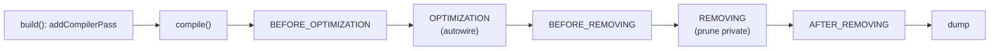

# Compiler Passes

!!! tip "In a nutshell"
    A compiler pass is a hook that rewrites service definitions during
    compilation — Symfony's own autowiring and tag-collection are passes. You
    register one in `Kernel::build()` or a bundle's `build()`. Highest-yield fact:
    there is **no `#[CompilerPass]` attribute**, and higher `priority` runs
    *earlier* within a phase.

!!! example "Real-world analogy"
    A compiler pass is a kitchen manager doing prep *before* service: they walk the
    station cards (definitions) and — say — collect every "sauce" recipe tagged on
    the board and staple them into the master station's checklist. They rearrange
    recipes on paper; no food is cooked yet (no service is instantiated). It all
    happens once, during pre-service prep (compilation).

!!! abstract "Learning objectives"
    By the end of this chapter you can:

    - [ ] Implement `CompilerPassInterface` and register it in `Kernel::build()` or
          a bundle's `build()`.
    - [ ] Name the `PassConfig` phases and their order.
    - [ ] Collect tagged services with `findTaggedServiceIds()` and decide when a
          pass beats autoconfiguration.

    **Syllabus:** `Dependency Injection → Compiler Passes` ·
    **Level:** Expert ·
    **Est. time:** 40 min ·
    **Prerequisites:** [Tags](tags.md)

---

## Theory

A **compiler pass** is a hook that runs during container **compilation** and can
read and rewrite service definitions before the container is dumped. Symfony's own
wiring (autowiring, decoration, tag collection, removal of private services) is all
compiler passes. You write one when you need to transform definitions
programmatically — most often to wire up all services carrying a given tag.

## Deep Dive — how it works internally

### The interface and registration

A pass implements
`Symfony\Component\DependencyInjection\Compiler\CompilerPassInterface`:

```php
public function process(ContainerBuilder $container): void;
```

You register it — there is **no `#[CompilerPass]` attribute** (a classic trap).
Register it programmatically:

- In the application: `Kernel::build(ContainerBuilder $container)` via
  `$container->addCompilerPass(new MyPass());`
- In a bundle: `Bundle::build(ContainerBuilder $container)` the same way.

`addCompilerPass()` accepts a **phase** and a **priority** (higher runs first
within the phase).

### The `PassConfig` phases

`Symfony\Component\DependencyInjection\Compiler\PassConfig` runs passes in this
fixed order:

| Phase constant | Purpose |
|---|---|
| `TYPE_BEFORE_OPTIMIZATION` | most user passes: read tags, add args |
| `TYPE_OPTIMIZATION` | autowiring, resolve refs (core) |
| `TYPE_BEFORE_REMOVING` | last chance before pruning |
| `TYPE_REMOVING` | remove private/unused services |
| `TYPE_AFTER_REMOVING` | runs after removal |

Default phase is `TYPE_BEFORE_OPTIMIZATION`. Register there unless you specifically
need to act after autowiring or removal.



### Collecting tagged services

Inside `process()`, `$container->findTaggedServiceIds('app.handler')` returns
`['service_id' => [['attr' => 'value'], ...]]` — the id mapped to each occurrence
of the tag with its attributes. You then mutate a collector definition, e.g.
`$container->findDefinition('registry')->addMethodCall('add', [new Reference($id)])`.

!!! note "Source reference"
    `Symfony\Component\DependencyInjection\Compiler\PassConfig` defines the phase
    order —
    [symfony/symfony `8.0`](https://github.com/symfony/symfony/blob/8.0/src/Symfony/Component/DependencyInjection/Compiler/PassConfig.php).

## Configuration & code

=== "PHP Attributes"

    ```php
    <?php
    declare(strict_types=1);

    namespace App;

    use App\Handler\HandlerCompilerPass;
    use Symfony\Component\DependencyInjection\ContainerBuilder;
    use Symfony\Component\DependencyInjection\Compiler\PassConfig;
    use Symfony\Component\HttpKernel\Kernel as BaseKernel;
    use Symfony\Bundle\FrameworkBundle\Kernel\MicroKernelTrait;

    final class Kernel extends BaseKernel
    {
        use MicroKernelTrait;

        // Register the pass here — there is NO #[CompilerPass] attribute.
        protected function build(ContainerBuilder $container): void
        {
            $container->addCompilerPass(
                new HandlerCompilerPass(),
                PassConfig::TYPE_BEFORE_OPTIMIZATION,
                priority: 0,
            );
        }
    }
    ```

=== "The pass"

    ```php
    <?php
    declare(strict_types=1);

    namespace App\Handler;

    use Symfony\Component\DependencyInjection\Compiler\CompilerPassInterface;
    use Symfony\Component\DependencyInjection\ContainerBuilder;
    use Symfony\Component\DependencyInjection\Reference;

    final class HandlerCompilerPass implements CompilerPassInterface
    {
        public function process(ContainerBuilder $container): void
        {
            if (!$container->has(HandlerRegistry::class)) {
                return;
            }

            $registry = $container->findDefinition(HandlerRegistry::class);

            foreach ($container->findTaggedServiceIds('app.handler') as $id => $tags) {
                $registry->addMethodCall('add', [new Reference($id)]);
            }
        }
    }
    ```

## Best practices & anti-patterns

| ✅ Do | ❌ Avoid |
|---|---|
| Guard with `has()`/`hasDefinition()` | Assuming a service exists |
| Register in `build()` (default phase) | Looking for a `#[CompilerPass]` attribute |
| Prefer `tagged_iterator` when it suffices | A pass for simple collection |
| Use `Reference`, not instances | Instantiating services in a pass |

## When (not) to use it / alternatives

Reach for a pass only when the declarative tools cannot do it. For "inject all
tagged services" a [`tagged_iterator`/`tagged_locator`](tags.md) argument is
simpler. Use autoconfiguration to *apply* a tag. Use a pass when you must inspect
definitions, conditionally rewire, remove or alter arguments — logic no attribute
expresses.

!!! danger "Certification traps"
    - **There is no `#[CompilerPass]` attribute** — register via
      `addCompilerPass()` in `Kernel::build()` or `Bundle::build()`.
    - Phase order: before-optimization → optimization → before-removing →
      removing → after-removing.
    - Passes run at **compile time only**; you manipulate `Definition`s, never
      instances.
    - Higher `priority` runs **earlier** within a phase.
    - Autowiring/decoration/removal are themselves passes in specific phases.

!!! warning "Common mistakes"
    - Fetching a real service (`$container->get()`) inside `process()`.
    - Registering in the wrong phase and running after services are removed.
    - Forgetting the `has()` guard, crashing when a bundle is absent.

## Exercises

1. **(Expert)** Write a pass that injects every `app.handler`-tagged service into a
   `HandlerRegistry` via `addMethodCall('add', ...)`, and register it in the kernel.
2. **(Expert)** In which phase would you remove a service, and why not
   before-optimization?

??? success "Solutions"

    **1.** See the pass + kernel examples above: implement
    `CompilerPassInterface`, loop `findTaggedServiceIds('app.handler')`, add a
    method call with a `Reference`, and register with `addCompilerPass()` in
    `Kernel::build()`.

    **2.** Removal belongs in `TYPE_REMOVING` (or you rely on the built-in removal
    pass). Doing it in before-optimization would delete a service that autowiring
    (optimization phase) might still need to reference, breaking resolution.

## Certification questions

??? question "Q1. How do you register a custom compiler pass?"
    - [ ] A. Add `#[CompilerPass]` to the class
    - [x] B. Call `addCompilerPass()` in `Kernel::build()` or a bundle's `build()` ✅
    - [ ] C. Tag it `container.compiler_pass`
    - [ ] D. Put it in `services.yaml`

    **Why:** There is no compiler-pass attribute; registration is programmatic.
    **Ref:** [Compiler passes](https://symfony.com/doc/current/service_container/compiler_passes.html).

??? question "Q2. What is the default compilation phase for a pass?"
    - [x] A. `TYPE_BEFORE_OPTIMIZATION` ✅
    - [ ] B. `TYPE_OPTIMIZATION`
    - [ ] C. `TYPE_REMOVING`
    - [ ] D. `TYPE_AFTER_REMOVING`

    **Why:** Passes registered without a phase run before optimization.
    **Ref:** [Compiler passes](https://symfony.com/doc/current/service_container/compiler_passes.html).

??? question "Q3. `findTaggedServiceIds('t')` returns…"
    - [x] A. A map of service id → array of tag attribute sets ✅
    - [ ] B. Instantiated services
    - [ ] C. A `ServiceLocator`
    - [ ] D. Only the first tagged id

    **Why:** It returns definitions' ids with each tag occurrence's attributes.
    **Ref:** [Tags & passes](https://symfony.com/doc/current/service_container/tags.html).

??? question "Q4. Inside `process()` you should manipulate…"
    - [x] A. `Definition` objects (build-time metadata) ✅
    - [ ] B. Live service instances
    - [ ] C. The HTTP request
    - [ ] D. The event dispatcher at runtime

    **Why:** Compilation deals only with definitions; nothing is instantiated yet.
    **Ref:** [Compiler passes](https://symfony.com/doc/current/service_container/compiler_passes.html).

## Key takeaways

- A pass runs at compile time and rewrites `Definition`s.
- Register with `addCompilerPass()` — **no attribute exists**.
- Phases: before-opt → opt → before-removing → removing → after-removing.
- Prefer tagged arguments/autoconfigure; use a pass for real transformation logic.

## Last-minute revision

!!! tip "Cheat sheet"
    - `CompilerPassInterface::process(ContainerBuilder $c)`.
    - Register: `Kernel::build()` / `Bundle::build()` → `addCompilerPass($pass, phase, priority)`.
    - `PassConfig::TYPE_*`; default = `TYPE_BEFORE_OPTIMIZATION`.
    - `findTaggedServiceIds()`, `findDefinition()`, `new Reference($id)`.

## Official References
- [Official Symfony docs — Compiler Passes](https://symfony.com/doc/current/service_container/compiler_passes.html)
- [Official Symfony docs — How to Work with Tags](https://symfony.com/doc/current/service_container/tags.html)
- [Symfony source — PassConfig](https://github.com/symfony/symfony/blob/8.0/src/Symfony/Component/DependencyInjection/Compiler/PassConfig.php)

---

<small>Related: [Tags](tags.md) · [The Service Container](container.md) ·
[Semantic Configuration](semantic-config.md)</small>
