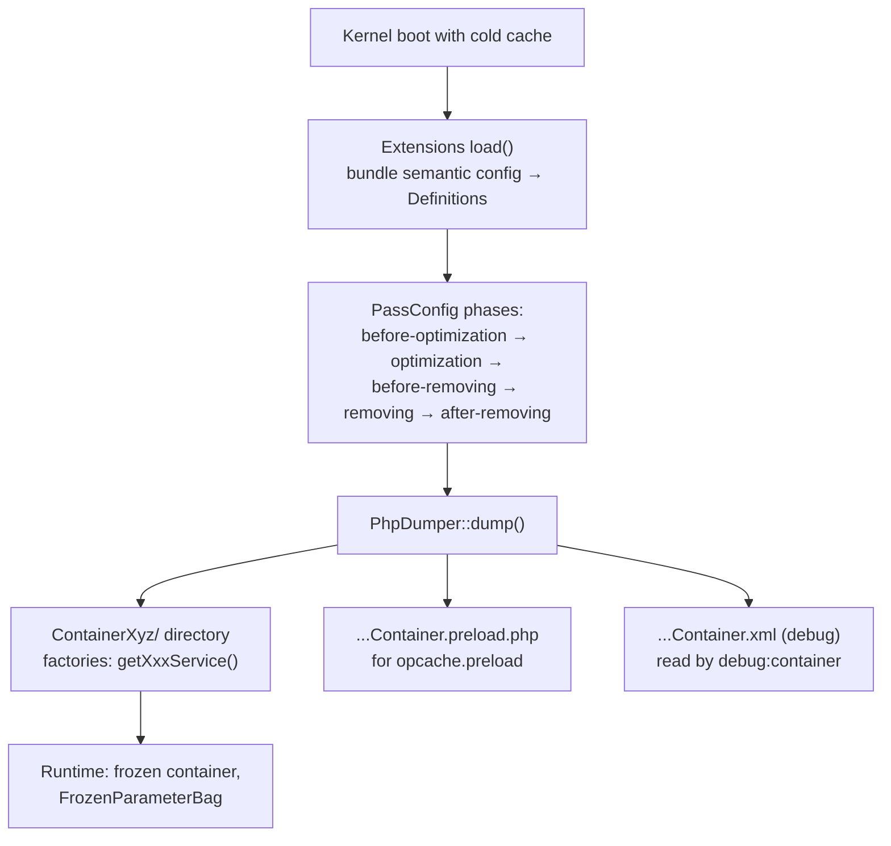

# Inside the Compiled Container

!!! tip "In a nutshell"
    Après le warmup, `var/cache/{env}/` contient le container sous forme de
    **PHP dumpé brut** : un répertoire `Container{hash}/` produit par
    `PhpDumper` avec une factory (`getXxxService()`) par service survivant, un
    fichier `.preload.php` pour le préchargement OPcache, et (en debug) un
    instantané XML que `debug:container` lit. Les services privés que vous
    voyez dans `debug:container` peuvent n'avoir **aucune factory du tout** —
    inlinés ou supprimés pendant les removing passes. À l'exécution, le
    container est **frozen** : modifier `services.yaml` en prod ne change rien
    tant que le cache n'est pas reconstruit.

!!! example "Real-world analogy"
    La compilation, c'est transformer le plan d'un architecte en maison
    préfabriquée. Le plan (YAML/attributs/`Definition`s) est examiné par des
    inspecteurs dans un ordre fixe (les phases de compiler passes), les
    couloirs internes redondants sont fusionnés dans des pièces (services
    privés inlinés), puis l'usine coule le béton (`PhpDumper` écrit les
    fichiers PHP). Les visiteurs peuvent encore voir les couloirs sur le
    *plan archivé* (`debug:container` lit l'instantané XML), mais ils
    n'existent pas comme structures séparées dans le bâtiment fini — et vous
    ne pouvez pas déplacer un mur en modifiant le plan ; il faut reconstruire
    (reconstruction du cache).

!!! abstract "Learning objectives"
    À la fin de ce chapitre, vous saurez :

    - [ ] Nommer ce qui atterrit dans `var/cache/{env}/` après le warmup et à
          quoi sert chaque artefact (classe dumpée, factories par service,
          `.preload.php`, dump XML de debug).
    - [ ] Tracer le flux de compilation : `load()` des extensions → phases de
          `PassConfig` → `PhpDumper::dump()`.
    - [ ] Expliquer pourquoi `debug:container` liste des services que le code
          dumpé a inlinés, et ce qu'un container frozen interdit à l'exécution.

    **Syllabus:** `Dependency Injection → Compiled Container` ·
    **Level:** Expert ·
    **Est. time:** 20 min ·
    **Prerequisites:** [Compiler Passes](compiler-passes.md)

---

## Pour les nuls

### L'idée en une phrase
Le container compilé est du PHP tout ce qu'il y a de plus ordinaire, écrit sur disque une seule fois — c'est pour ça qu'utiliser Symfony en production est rapide.

### Imagine dans la vraie vie
La compilation, c'est transformer le plan d'un architecte en maison préfabriquée. Le plan (YAML/attributs/`Definition`) est examiné par des inspecteurs dans un ordre fixe (les phases de compiler pass), les couloirs internes redondants sont fusionnés en pièces (services privés inlinés), puis l'usine coule le béton (`PhpDumper` écrit les fichiers PHP).

### Dans Symfony
Modifier `services.yaml` en production **ne change absolument rien** tant que le cache n'est pas reconstruit — le container à l'exécution lit uniquement les fichiers PHP déjà générés dans `var/cache/{env}/`, jamais le YAML source.

### Exemple simple
```console
$ php bin/console cache:clear --env=prod  # seule façon de faire prendre en compte un changement
```

### Comment le mémoriser 🧠
Un service privé visible dans `debug:container` peut n'avoir **aucune factory du tout** — inliné ou supprimé pendant les passes de nettoyage. Voir un service dans le debug ne garantit pas qu'il existe encore comme objet séparé dans le container compilé.
          → `PhpDumper::dump()`.
    - [ ] Explain why `debug:container` lists services the dumped code
          inlined, and what a frozen container forbids at runtime.

---


## Theory

Le `ContainerBuilder` que vous configurez — définitions, références,
paramètres — ne s'exécute jamais en production. C'est un **artefact de build**
qui est compilé une fois puis dumpé sur disque en PHP ordinaire, de sorte
qu'à l'exécution « récupérer un service » revient juste à appeler une méthode
générée contenant des expressions `new`. Le pipeline de compilation :

1. **Chargement des extensions** — l'extension de chaque bundle reçoit sa
   config sémantique traitée et enregistre des définitions.
2. **Compiler passes** — exécutées selon les phases fixes de
   [`PassConfig`](https://github.com/symfony/symfony/blob/8.0/src/Symfony/Component/DependencyInjection/Compiler/PassConfig.php) :
   *before-optimization → optimization (autowiring, résolution des
   références) → before-removing → removing (inline/élagage des services
   privés, non utilisés) → after-removing*.
3. **Dump** — `PhpDumper` transforme les définitions survivantes en code PHP
   et l'écrit sous `var/cache/{env}/`.

```php
$builder = new ContainerBuilder(); // build-time object, never runs in prod
// 1. extensions load() their definitions into $builder ...

$builder->compile();               // 2. runs the PassConfig phases in order

$dumper = new PhpDumper($builder); // 3. dump plain PHP under var/cache/{env}/
$code = $dumper->dump();           //    generated factories use `new` inside
```

Voici ce que vous y trouvez après `cache:warmup` (les noms varient selon la
classe du kernel, l'env et un hash de contenu ; considérez-les comme des
formes, pas des chaînes exactes) :

| Artefact | Rôle |
|---|---|
| Répertoire `Container{hash}/` | La classe du container dumpé plus ses factories de services — conceptuellement une méthode factory `getXxxService()` par service ; en prod, le dumper peut scinder les factories en un fichier chacune, chargé à la demande |
| `{KernelClass}Container.php` | Point d'entrée qui requiert/instancie le container dumpé |
| `{KernelClass}Container.preload.php` | Liste générée des classes chaudes pour `opcache.preload` — pointez votre php.ini dessus en prod |
| `{KernelClass}Container.xml` | Instantané en mode debug du `ContainerBuilder` **pré-dump**, utilisé par `debug:container` |

Deux paramètres préfixés d'un point façonnent le dump (voir les
[docs de performance](https://symfony.com/doc/8.0/performance.html)) :
`.container.dumper.inline_factories` (inliner chaque factory dans un unique
fichier de container au lieu de fichiers par service) et
`.container.dumper.inline_class_loader` (laisser le code dumpé inliner des
indications de chargement de classes). Ce sont des réglages de build — le
point de tête marque les paramètres qui n'atteignent jamais le container
d'exécution.

```yaml
# config/services.yaml — build-time only (the leading dot never reaches runtime)
parameters:
    .container.dumper.inline_factories: true     # single file, factories inlined
    .container.dumper.inline_class_loader: true  # inline class-loading hints
```

## Deep Dive — how it works internally

### Why `debug:container` shows what the dump doesn't contain

Pendant les phases de **removing**, un service privé référencé par exactement
un consommateur est typiquement **inliné** : son expression `new` est
intégrée directement dans la factory du consommateur, et sa propre factory
disparaît. Les services privés non référencés sont carrément **supprimés**.
`debug:container` ne lit pas le PHP dumpé — il travaille depuis l'instantané
pré-dump du builder — et liste donc allègrement des services qui n'existent
plus comme entrées séparées dans le code compilé. Cette asymétrie est un angle
d'examen favori.



!!! question "Predict first"
    `debug:container app.mailer_decorator` affiche une définition complète,
    pourtant un grep dans le code du container dumpé ne trouve aucune factory
    `getAppMailerDecoratorService`. Le cache est-il périmé ?

??? note "Reveal"
    Non. Le service est **privé et inliné** (ou remplacé par un alias) : les
    removing passes ont intégré son instanciation dans la factory de son
    unique consommateur, donc il n'a pas de factory autonome dans le dump.
    `debug:container` lit l'instantané pré-dump, où la définition existe
    encore.

### Frozen at runtime

Le container dumpé étend la classe `Container` d'exécution, pas
`ContainerBuilder`. Conséquences :

- **Les paramètres sont frozen** — le sac d'exécution est en lecture seule
  (`FrozenParameterBag`) ; `setParameter()` à l'exécution échoue.
- **`$container->set()` est une issue de secours, pas une API** — il existe
  pour les services synthétiques (comme le kernel qui s'injecte lui-même) et
  les doublures de test ; vous ne pouvez pas remplacer un service déjà
  initialisé, et les services privés ne sont pas settables de l'extérieur.
  Concevez plutôt avec l'injection.
- **Les modifications de config ne font rien avant la reconstruction** — en
  prod, la config n'est pas suivie comme ressource ; modifier `services.yaml`
  exige un `cache:clear`/warmup pour que le container soit re-dumpé.

```php
// The dump extends Container (runtime), not ContainerBuilder (build time)
$container->getParameter('kernel.debug');   // OK: read-only access

$container->setParameter('app.flag', true); // throws — FrozenParameterBag

// set() is only for synthetic services and test doubles
$container->set('kernel', $kernel);

// Editing services.yaml in prod changes nothing until:
//   php bin/console cache:clear
```

!!! note "Source reference"
    `Symfony\Component\DependencyInjection\Dumper\PhpDumper` — la classe qui
    écrit le container compilé (méthodes factory, chemins de code
    proxy/lazy, liste de preload) —
    [symfony/symfony `8.0`](https://github.com/symfony/symfony/blob/8.0/src/Symfony/Component/DependencyInjection/Dumper/PhpDumper.php) ;
    ordre des phases dans
    [`PassConfig`](https://github.com/symfony/symfony/blob/8.0/src/Symfony/Component/DependencyInjection/Compiler/PassConfig.php).

## Configuration & code

=== "Inspect the dump (bash)"

    ```bash
    # Warm the prod container, then look at what was dumped
    APP_ENV=prod php bin/console cache:warmup

    ls var/cache/prod/
    # → Container* directory, *Container.php, *Container.preload.php, …

    # The build-time view (snapshot), including inlined/removed privates:
    php bin/console debug:container --env=prod
    php bin/console debug:container --parameters --env=prod
    ```

=== "Dump parameters (YAML)"

    ```yaml
    # config/services.yaml
    parameters:
        # Build-time knobs (leading dot = never available at runtime):
        # inline all service factories into a single container class
        .container.dumper.inline_factories: true
        # inline class-loading hints in the dumped code
        .container.dumper.inline_class_loader: true
    ```

=== "Standalone compile & dump (PHP)"

    ```php
    <?php
    declare(strict_types=1);

    // Component-level illustration of what the kernel automates.
    use Symfony\Component\DependencyInjection\ContainerBuilder;
    use Symfony\Component\DependencyInjection\Dumper\PhpDumper;

    $builder = new ContainerBuilder();
    $builder->register('app.greeter', \stdClass::class)
        ->setPublic(true);

    $builder->compile(); // runs all PassConfig phases

    $dumper = new PhpDumper($builder);
    file_put_contents(
        __DIR__.'/var/cache/CompiledContainer.php',
        $dumper->dump(['class' => 'CompiledContainer']),
    );
    ```

## Best practices & anti-patterns

| ✅ Do | ❌ Avoid |
|---|---|
| Faire confiance à `debug:container` pour les *définitions*, au dump pour la *forme à l'exécution* | Greper le dump pour conclure qu'un service « n'existe pas » |
| Brancher `opcache.preload` sur le `.preload.php` généré en prod | Maintenir une liste de preload à la main |
| Reconstruire le cache après tout changement de config en prod | Modifier `services.yaml` sur une machine de prod en attendant un effet immédiat |
| Garder le code d'exécution exempt de `$container->set()` | Échanger des services à l'exécution hors tests/synthétiques |

## When (not) to use it / alternatives

Vous ne choisissez pas d'activer ou non la compilation — chaque application
Symfony embarque un container dumpé. Ce que vous choisissez, c'est jusqu'où
vous appuyer sur ses entrailles : inspectez le dump quand vous déboguez le
câblage ou la performance (quelles factories existent, ce qui a été inliné),
laissez-le tranquille sinon. Si vous êtes tenté de muter le container à
l'exécution, les alternatives supportées sont une
[compiler pass](compiler-passes.md) (recâblage au build), une
[factory](factories.md) (logique de construction à l'exécution), ou un
[service locator](service-locators.md) (*choix* à l'exécution parmi des
services préconstruits).

!!! danger "Certification traps"
    - Ordre de compilation : `load()` des extensions → passes selon les phases
      de `PassConfig` (*before-optimization → optimization → before-removing →
      removing → after-removing*) → dump par `PhpDumper`.
    - `debug:container` liste des **services privés/inlinés** qui n'ont
      aucune factory dans le code dumpé — il lit un instantané de build, pas
      le dump.
    - En prod, **modifier `services.yaml` n'a aucun effet tant que le cache
      n'est pas reconstruit** — le container est déjà du PHP dumpé.
    - Le container d'exécution est **frozen** : paramètres en lecture seule,
      et `$container->set()` ne peut pas remplacer un service déjà initialisé
      (il est prévu pour les services synthétiques et les tests).
    - Le fichier `.preload.php` est *généré pour vous* ; vous ne faites que le
      référencer depuis `opcache.preload`.

!!! warning "Common mistakes"
    - Confondre le `ContainerBuilder` (build, contient des `Definition`s) avec
      le container d'exécution dumpé (contient des instances et des
      factories).
    - Lire `.container.dumper.inline_factories` comme un paramètre
      d'exécution — les paramètres préfixés d'un point n'existent qu'au build.
    - Supposer que la sortie de `debug:container` égale ce qu'OPcache exécute.

## Exercises

1. **(Expert)** Après un déploiement, un collègue corrige à chaud un argument
   dans `services.yaml` directement sur le serveur de prod ; rien ne change,
   et il n'y a aucune erreur. Expliquez précisément pourquoi, et donnez les
   deux commandes qui rendent le correctif effectif.
2. **(Expert)** Esquissez (dans l'ordre) ce qui se passe entre « le kernel
   démarre avec un répertoire de cache vide » et « le premier service est
   servi », en nommant les cinq phases de `PassConfig` et la classe qui écrit
   les fichiers.

??? success "Solutions"

    **1.** En prod, le container a été compilé et dumpé dans
    `var/cache/prod/` sous forme de PHP ; le kernel exécute ce dump et ne
    relit jamais `services.yaml` (pas de suivi de ressources en debug).
    Reconstruisez : `php bin/console cache:clear --env=prod` (ou
    `cache:warmup` après nettoyage) — le container est alors recompilé avec le
    nouvel argument.

    **2.** Le kernel démarre → les extensions des bundles `load()` leur config
    dans le `ContainerBuilder` → `compile()` exécute les passes phase par
    phase : *before-optimization*, *optimization* (autowiring, résolution des
    références), *before-removing*, *removing* (inline/élagage des privés),
    *after-removing* → `PhpDumper::dump()` écrit la classe du
    container/les factories, le fichier `.preload.php` et (en debug)
    l'instantané XML → la classe dumpée est instanciée et les factories
    `getXxxService()` servent les instances.

## Certification questions

??? question "Q1. Which artifact does `debug:container` rely on, and why can it show services absent from the dumped code?"
    - [x] A. A build-time snapshot of the ContainerBuilder — inlined/removed privates still exist there ✅
    - [ ] B. The dumped PHP container — it lists exactly the generated factories
    - [ ] C. The raw YAML files — it re-parses config on every call
    - [ ] D. OPcache statistics

    **Why:** La commande inspecte les définitions pré-dump ; les removing
    passes inlinent ou élaguent ensuite les services privés du code généré.
    **Ref:** [Container compilation](https://symfony.com/doc/8.0/components/dependency_injection/compilation.html).

??? question "Q2. Correct order of the PassConfig phases?"
    - [x] A. before-optimization → optimization → before-removing → removing → after-removing ✅
    - [ ] B. optimization → before-optimization → removing → after-removing → before-removing
    - [ ] C. removing → optimization → before-optimization → after-removing → before-removing
    - [ ] D. There is no fixed order; passes run by priority only

    **Why:** `PassConfig` code en dur les cinq phases ; la priorité n'ordonne
    les passes qu'*au sein* d'une phase.
    **Ref:** [Container compilation](https://symfony.com/doc/8.0/components/dependency_injection/compilation.html).

??? question "Q3. You edit services.yaml on a prod server. When does the container reflect it?"
    - [ ] A. Immediately — YAML is re-read per request
    - [ ] B. After restarting PHP-FPM only
    - [x] C. After the cache is rebuilt (cache:clear / warmup re-runs compilation and the dump) ✅
    - [ ] D. Never — prod containers cannot change

    **Why:** La prod exécute le container PHP dumpé et ne suit pas les
    ressources de config ; seule une reconstruction relance la compilation.
    **Ref:** [Container compilation](https://symfony.com/doc/8.0/components/dependency_injection/compilation.html).

??? question "Q4. What is `{Kernel}Container.preload.php` for?"
    - [x] A. It lists hot container/service classes for OPcache preloading via `opcache.preload` ✅
    - [ ] B. It preloads Doctrine entities into APCu
    - [ ] C. It is executed before every request by the kernel
    - [ ] D. It stores serialized service instances

    **Why:** Le dumper génère un script de preload ; le référencer depuis
    `opcache.preload` compile ces classes en mémoire partagée au démarrage du
    serveur.
    **Ref:** [Performance](https://symfony.com/doc/8.0/performance.html).

## Key takeaways

- Le container que vous exécutez est du **PHP généré** dans
  `var/cache/{env}/`, écrit par `PhpDumper` après les cinq phases de
  `PassConfig`.
- Les services privés sont inlinés/supprimés pendant les phases de removing —
  `debug:container` les montre toujours (instantané ≠ dump).
- `.preload.php` est auto-généré pour `opcache.preload` ;
  `.container.dumper.inline_factories`/`inline_class_loader` ajustent le dump
  au build.
- Container d'exécution = frozen : paramètres en lecture seule, `set()`
  seulement pour les cas synthétiques/de test, les modifications de config
  exigent une reconstruction du cache.

## Last-minute revision

!!! tip "Cheat sheet"
    - Flux : `load()` des extensions → passes (before-opt → opt →
      before-removing → removing → after-removing) → `PhpDumper::dump()`.
    - `var/cache/{env}/` : factories `Container{hash}/`, classe d'entrée,
      `.preload.php`, instantané XML (debug) pour `debug:container`.
    - Service privé inliné = visible dans `debug:container`, pas de factory
      propre dans le dump.
    - Exécution frozen : `FrozenParameterBag`, pas de remplacement de services
      initialisés via `set()`.
    - Changement de config en prod → `cache:clear`/`cache:warmup`, toujours.

## Connections

- **Depends on:** [Compiler Passes](compiler-passes.md) — les phases qui
  s'exécutent avant le dump ; [The Service Container](container.md) — la
  séparation `Definition`-vs-instance que ce chapitre achève.
- **Reused in:** [Lazy Services & Native Lazy Objects](lazy-services.md) —
  les factories lazy font partie du code dumpé ;
  [Parameters](parameters.md) — pourquoi les paramètres d'exécution sont
  frozen.
- **Confused with:** [Semantic Configuration](semantic-config.md) — le
  `load()` des extensions se produit *avant* la compilation ; ce chapitre
  traite de ce qui se passe *après*.

## Official References

- [Official Symfony docs — Compiling the Container](https://symfony.com/doc/8.0/components/dependency_injection/compilation.html)
- [Official Symfony docs — Performance (preloading, inline factories)](https://symfony.com/doc/8.0/performance.html)
- [Symfony source — PhpDumper](https://github.com/symfony/symfony/blob/8.0/src/Symfony/Component/DependencyInjection/Dumper/PhpDumper.php)
- [Symfony source — PassConfig](https://github.com/symfony/symfony/blob/8.0/src/Symfony/Component/DependencyInjection/Compiler/PassConfig.php)

## Video references

!!! tip "Watch & learn"
    Ce sont des chaînes vidéo officielles, mises à jour en continu — cherchez-y
    "dependency injection" pour consolider ce chapitre. Nous lions des chaînes
    stables plutôt que des vidéos individuelles pour que les références ne
    périment jamais.

    - [SymfonyCasts screencasts](https://symfonycasts.com/tracks/symfony) — tutoriels scénarisés à suivre en codant.
    - [Symfony official YouTube](https://www.youtube.com/@SymfonyOfficial) — conférences et keynotes SymfonyCon.
    - [Official docs for this topic](https://symfony.com/doc/8.0/components/dependency_injection/compilation.html) — certaines pages de la doc Symfony intègrent un screencast.

## Confidence check

Je suis prêt quand je peux :

- [ ] lister ce que contient `var/cache/{env}/` après le warmup et le rôle de
      chaque fichier
- [ ] réciter le flux de compilation, y compris les cinq phases de
      `PassConfig`
- [ ] expliquer l'asymétrie `debug:container`-vs-dump pour les services privés
- [ ] énoncer ce que « frozen container » interdit (`setParameter`,
      remplacement de services initialisés)
- [ ] répondre pourquoi les modifications de config en prod exigent une
      reconstruction du cache

---

<small>Related: [Compiler Passes](compiler-passes.md) ·
[The Service Container](container.md) ·
[Lazy Services & Native Lazy Objects](lazy-services.md)</small>
