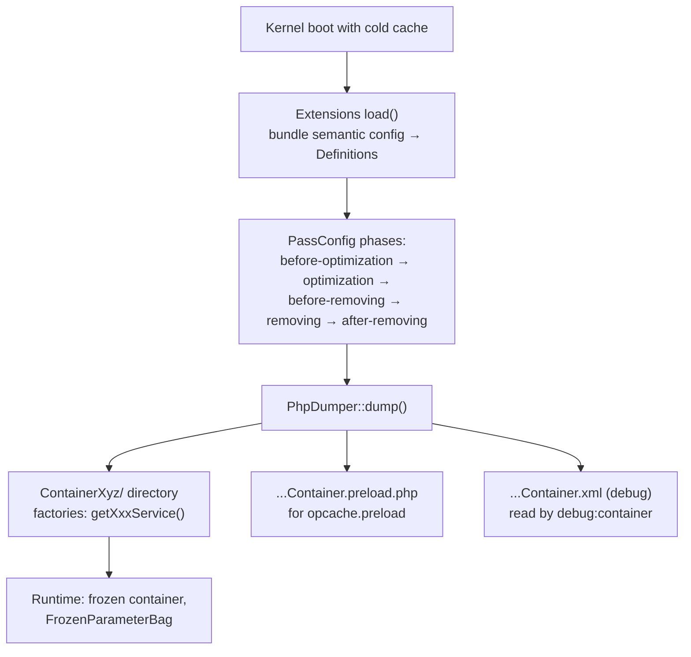

# Inside the Compiled Container

!!! tip "In a nutshell"
    After warmup, `var/cache/{env}/` holds the container as **plain dumped
    PHP**: a `Container{hash}/` directory produced by `PhpDumper` with a
    factory (`getXxxService()`) per surviving service, a `.preload.php` file
    for OPcache preloading, and (in debug) an XML snapshot that
    `debug:container` reads. Private services you see in `debug:container` may
    have **no factory at all** — inlined or removed during the removing
    passes. At runtime the container is **frozen**: editing `services.yaml` in
    prod changes nothing until the cache is rebuilt.

!!! example "Real-world analogy"
    Compilation is turning an architect's blueprint into a prefab house. The
    blueprint (YAML/attributes/`Definition`s) is reviewed by inspectors in a
    fixed order (compiler-pass phases), redundant internal corridors are
    merged into rooms (private services inlined), then the factory pours
    concrete (`PhpDumper` writes PHP files). Visitors can still see corridors
    on the *archived blueprint* (`debug:container` reads the XML snapshot),
    but they don't exist as separate structures in the finished building — and
    you can't move a wall by editing the blueprint; you must rebuild
    (cache rebuild).

!!! abstract "Learning objectives"
    By the end of this chapter you can:

    - [ ] Name what lands in `var/cache/{env}/` after warmup and what each
          artifact is for (dumped class, per-service factories,
          `.preload.php`, XML debug dump).
    - [ ] Trace the compilation flow: extension `load()` → `PassConfig` phases
          → `PhpDumper::dump()`.
    - [ ] Explain why `debug:container` lists services the dumped code
          inlined, and what a frozen container forbids at runtime.

    **Syllabus:** `Dependency Injection → Compiled Container` ·
    **Level:** Expert ·
    **Est. time:** 20 min ·
    **Prerequisites:** [Compiler Passes](compiler-passes.md)

---

## Theory

The `ContainerBuilder` you configure — definitions, references, parameters —
never runs in production. It is a **build-time artifact** that gets compiled
once and dumped to disk as ordinary PHP, so that at runtime "getting a
service" is just calling a generated method with `new` expressions inside. The
compilation pipeline:

1. **Extension load** — each bundle's extension receives its processed
   semantic config and registers definitions.
2. **Compiler passes** — run in the fixed
   [`PassConfig`](https://github.com/symfony/symfony/blob/8.0/src/Symfony/Component/DependencyInjection/Compiler/PassConfig.php)
   phases: *before-optimization → optimization (autowiring, reference
   resolution) → before-removing → removing (inline/prune private, unused
   services) → after-removing*.
3. **Dump** — `PhpDumper` turns the surviving definitions into PHP code and
   writes it under `var/cache/{env}/`.

```php
$builder = new ContainerBuilder(); // build-time object, never runs in prod
// 1. extensions load() their definitions into $builder ...

$builder->compile();               // 2. runs the PassConfig phases in order

$dumper = new PhpDumper($builder); // 3. dump plain PHP under var/cache/{env}/
$code = $dumper->dump();           //    generated factories use `new` inside
```

What you find there after `cache:warmup` (names vary with kernel class, env
and a content hash, so treat these as shapes, not exact strings):

| Artifact | Purpose |
|---|---|
| `Container{hash}/` directory | The dumped container class plus its service factories — conceptually one `getXxxService()` factory method per service; in prod the dumper can split factories into one file each, loaded on demand |
| `{KernelClass}Container.php` | Entry point requiring/instantiating the dumped container |
| `{KernelClass}Container.preload.php` | Generated list of hot classes for `opcache.preload` — point your php.ini at it in prod |
| `{KernelClass}Container.xml` | Debug-mode snapshot of the **pre-dump** `ContainerBuilder`, used by `debug:container` |

Two dot-prefixed parameters shape the dump (see the
[performance docs](https://symfony.com/doc/current/performance.html)):
`.container.dumper.inline_factories` (inline every factory into a single
container file instead of per-service files) and
`.container.dumper.inline_class_loader` (let the dumped code inline class
loading hints). They are build-time knobs — the leading dot marks parameters
that never reach the runtime container.

```yaml
# config/services.yaml — build-time only (the leading dot never reaches runtime)
parameters:
    .container.dumper.inline_factories: true     # single file, factories inlined
    .container.dumper.inline_class_loader: true  # inline class-loading hints
```

## Deep Dive — how it works internally

### Why `debug:container` shows what the dump doesn't contain

During the **removing** phases, a private service referenced by exactly one
consumer is typically **inlined**: its `new` expression is embedded directly
inside the consumer's factory, and its own factory disappears. Unreferenced
private services are **removed** outright. `debug:container` doesn't read the
dumped PHP — it works from the pre-dump builder snapshot — so it happily lists
services that no longer exist as separate entries in the compiled code. That
asymmetry is a favourite exam angle.



!!! question "Predict first"
    `debug:container app.mailer_decorator` prints a full definition, yet
    grepping the dumped container code finds no `getAppMailerDecoratorService`
    factory. Is the cache stale?

??? note "Reveal"
    No. The service is **private and inlined** (or aliased away): the removing
    passes embedded its instantiation inside its single consumer's factory, so
    it has no standalone factory in the dump. `debug:container` reads the
    pre-dump snapshot, where the definition still exists.

### Frozen at runtime

The dumped container extends the runtime `Container` class, not
`ContainerBuilder`. Consequences:

- **Parameters are frozen** — the runtime bag is read-only
  (`FrozenParameterBag`); `setParameter()` at runtime fails.
- **`$container->set()` is an escape hatch, not an API** — it exists for
  synthetic services (like the kernel injecting itself) and test doubles; you
  cannot replace a service that has already been initialized, and private
  services aren't settable from outside. Design with injection instead.
- **Config edits do nothing until rebuild** — in prod the config is not
  resource-tracked; editing `services.yaml` requires `cache:clear`/warmup for
  the container to be re-dumped.

!!! note "Source reference"
    `Symfony\Component\DependencyInjection\Dumper\PhpDumper` — the class that
    writes the compiled container (factory methods, proxy/lazy code paths,
    preload list) —
    [symfony/symfony `8.0`](https://github.com/symfony/symfony/blob/8.0/src/Symfony/Component/DependencyInjection/Dumper/PhpDumper.php);
    phase order in
    [`PassConfig`](https://github.com/symfony/symfony/blob/8.0/src/Symfony/Component/DependencyInjection/Compiler/PassConfig.php).

## Configuration & code

=== "Inspect the dump (bash)"

    ```bash
    # Warm the prod container, then look at what was dumped
    APP_ENV=prod php bin/console cache:warmup

    ls var/cache/prod/
    # → Container* directory, *Container.php, *Container.preload.php, …

    # The build-time view (snapshot), including inlined/removed privates:
    php bin/console debug:container --env=prod
    php bin/console debug:container --parameters --env=prod
    ```

=== "Dump parameters (YAML)"

    ```yaml
    # config/services.yaml
    parameters:
        # Build-time knobs (leading dot = never available at runtime):
        # inline all service factories into a single container class
        .container.dumper.inline_factories: true
        # inline class-loading hints in the dumped code
        .container.dumper.inline_class_loader: true
    ```

=== "Standalone compile & dump (PHP)"

    ```php
    <?php
    declare(strict_types=1);

    // Component-level illustration of what the kernel automates.
    use Symfony\Component\DependencyInjection\ContainerBuilder;
    use Symfony\Component\DependencyInjection\Dumper\PhpDumper;

    $builder = new ContainerBuilder();
    $builder->register('app.greeter', \stdClass::class)
        ->setPublic(true);

    $builder->compile(); // runs all PassConfig phases

    $dumper = new PhpDumper($builder);
    file_put_contents(
        __DIR__.'/var/cache/CompiledContainer.php',
        $dumper->dump(['class' => 'CompiledContainer']),
    );
    ```

## Best practices & anti-patterns

| ✅ Do | ❌ Avoid |
|---|---|
| Trust `debug:container` for *definitions*, the dump for *runtime shape* | Grepping the dump to conclude a service "doesn't exist" |
| Wire `opcache.preload` to the generated `.preload.php` in prod | Hand-maintaining a preload list |
| Rebuild the cache after any prod config change | Editing `services.yaml` on a prod box and expecting live effect |
| Keep runtime code free of `$container->set()` | Swapping services at runtime outside tests/synthetics |

## When (not) to use it / alternatives

You don't opt in or out of compilation — every Symfony app ships a dumped
container. What you choose is how deeply to rely on its internals: inspect the
dump when debugging wiring or performance (which factories exist, what got
inlined), leave it alone otherwise. If you're tempted to mutate the container
at runtime, the supported alternatives are a
[compiler pass](compiler-passes.md) (build-time rewiring), a
[factory](factories.md) (runtime construction logic), or a
[service locator](service-locators.md) (runtime *choice* among prebuilt
services).

!!! danger "Certification traps"
    - Compilation order: extension `load()` → passes in `PassConfig` phases
      (*before-optimization → optimization → before-removing → removing →
      after-removing*) → `PhpDumper` dump.
    - `debug:container` lists **private/inlined services** that have no
      factory in the dumped code — it reads a build-time snapshot, not the
      dump.
    - In prod, **editing `services.yaml` has no effect until the cache is
      rebuilt** — the container is already dumped PHP.
    - The runtime container is **frozen**: read-only parameters, and
      `$container->set()` cannot replace an already-initialized service (it's
      meant for synthetic services and tests).
    - The `.preload.php` file is *generated for you*; you only reference it
      from `opcache.preload`.

!!! warning "Common mistakes"
    - Confusing the `ContainerBuilder` (build-time, has `Definition`s) with
      the dumped runtime container (has instances and factories).
    - Reading `.container.dumper.inline_factories` as a runtime parameter —
      dot-prefixed parameters exist only at build time.
    - Assuming `debug:container` output equals what OPcache executes.

## Exercises

1. **(Expert)** After deploying, a colleague hot-fixes an argument in
   `services.yaml` directly on the prod server; nothing changes, and there is
   no error. Explain precisely why, and give the two commands that make the
   fix live.
2. **(Expert)** Sketch (in order) what happens between "kernel boots with an
   empty cache directory" and "the first service is served", naming the five
   `PassConfig` phases and the class that writes the files.

??? success "Solutions"

    **1.** In prod the container was compiled and dumped to
    `var/cache/prod/` as PHP; the kernel executes that dump and never re-reads
    `services.yaml` (no debug resource tracking). Rebuild:
    `php bin/console cache:clear --env=prod` (or `cache:warmup` after clearing)
    — then the container is re-compiled with the new argument.

    **2.** Kernel boots → bundle extensions `load()` their config into the
    `ContainerBuilder` → `compile()` runs passes phase by phase:
    *before-optimization*, *optimization* (autowiring, reference resolution),
    *before-removing*, *removing* (inline/prune privates), *after-removing* →
    `PhpDumper::dump()` writes the container class/factories, the
    `.preload.php` file and (in debug) the XML snapshot → the dumped class is
    instantiated and `getXxxService()` factories serve instances.

## Certification questions

??? question "Q1. Which artifact does `debug:container` rely on, and why can it show services absent from the dumped code?"
    - [x] A. A build-time snapshot of the ContainerBuilder — inlined/removed privates still exist there ✅
    - [ ] B. The dumped PHP container — it lists exactly the generated factories
    - [ ] C. The raw YAML files — it re-parses config on every call
    - [ ] D. OPcache statistics

    **Why:** The command inspects pre-dump definitions; the removing passes
    inline or prune private services from the generated code afterwards.
    **Ref:** [Container compilation](https://symfony.com/doc/current/components/dependency_injection/compilation.html).

??? question "Q2. Correct order of the PassConfig phases?"
    - [x] A. before-optimization → optimization → before-removing → removing → after-removing ✅
    - [ ] B. optimization → before-optimization → removing → after-removing → before-removing
    - [ ] C. removing → optimization → before-optimization → after-removing → before-removing
    - [ ] D. There is no fixed order; passes run by priority only

    **Why:** `PassConfig` hard-codes the five phases; priority only orders
    passes *within* a phase.
    **Ref:** [Container compilation](https://symfony.com/doc/current/components/dependency_injection/compilation.html).

??? question "Q3. You edit services.yaml on a prod server. When does the container reflect it?"
    - [ ] A. Immediately — YAML is re-read per request
    - [ ] B. After restarting PHP-FPM only
    - [x] C. After the cache is rebuilt (cache:clear / warmup re-runs compilation and the dump) ✅
    - [ ] D. Never — prod containers cannot change

    **Why:** Prod executes the dumped PHP container and does not track config
    resources; only a rebuild re-runs compilation.
    **Ref:** [Container compilation](https://symfony.com/doc/current/components/dependency_injection/compilation.html).

??? question "Q4. What is `{Kernel}Container.preload.php` for?"
    - [x] A. It lists hot container/service classes for OPcache preloading via `opcache.preload` ✅
    - [ ] B. It preloads Doctrine entities into APCu
    - [ ] C. It is executed before every request by the kernel
    - [ ] D. It stores serialized service instances

    **Why:** The dumper generates a preload script; referencing it from
    `opcache.preload` compiles those classes into shared memory at server
    start.
    **Ref:** [Performance](https://symfony.com/doc/current/performance.html).

## Key takeaways

- The container you run is **generated PHP** in `var/cache/{env}/`, written by
  `PhpDumper` after the five `PassConfig` phases.
- Private services get inlined/removed in the removing phases —
  `debug:container` still shows them (snapshot ≠ dump).
- `.preload.php` is auto-generated for `opcache.preload`;
  `.container.dumper.inline_factories`/`inline_class_loader` tune the dump at
  build time.
- Runtime container = frozen: read-only parameters, `set()` only for
  synthetic/test cases, config edits need a cache rebuild.

## Last-minute revision

!!! tip "Cheat sheet"
    - Flow: extensions `load()` → passes (before-opt → opt → before-removing →
      removing → after-removing) → `PhpDumper::dump()`.
    - `var/cache/{env}/`: `Container{hash}/` factories, entry class,
      `.preload.php`, XML snapshot (debug) for `debug:container`.
    - Inlined private service = visible in `debug:container`, no own factory
      in the dump.
    - Frozen runtime: `FrozenParameterBag`, no replacing initialized services
      via `set()`.
    - Prod config change → `cache:clear`/`cache:warmup`, always.

## Connections

- **Depends on:** [Compiler Passes](compiler-passes.md) — the phases that run
  before the dump; [The Service Container](container.md) — the
  `Definition`-vs-instance split this chapter finishes.
- **Reused in:** [Lazy Services & Native Lazy Objects](lazy-services.md) —
  lazy factories are part of the dumped code;
  [Parameters](parameters.md) — why runtime parameters are frozen.
- **Confused with:** [Semantic Configuration](semantic-config.md) — extension
  `load()` happens *before* compilation; this chapter is about what happens
  *after*.

## Official References

- [Official Symfony docs — Compiling the Container](https://symfony.com/doc/current/components/dependency_injection/compilation.html)
- [Official Symfony docs — Performance (preloading, inline factories)](https://symfony.com/doc/current/performance.html)
- [Symfony source — PhpDumper](https://github.com/symfony/symfony/blob/8.0/src/Symfony/Component/DependencyInjection/Dumper/PhpDumper.php)
- [Symfony source — PassConfig](https://github.com/symfony/symfony/blob/8.0/src/Symfony/Component/DependencyInjection/Compiler/PassConfig.php)

## Video references

!!! tip "Watch & learn"
    These are official, continuously-updated video channels — search them for
    "dependency injection" to reinforce this chapter. We link stable channels rather than
    individual videos so the references never rot.

    - [SymfonyCasts screencasts](https://symfonycasts.com/tracks/symfony) — scripted, code-along tutorials.
    - [Symfony official YouTube](https://www.youtube.com/@SymfonyOfficial) — SymfonyCon conference talks & keynotes.
    - [Official docs for this topic](https://symfony.com/doc/current/components/dependency_injection/compilation.html) — some Symfony doc pages embed a screencast.

## Confidence check

I'm ready when I can:

- [ ] list what `var/cache/{env}/` contains after warmup and each file's job
- [ ] recite the compilation flow including the five `PassConfig` phases
- [ ] explain the `debug:container`-vs-dump asymmetry for private services
- [ ] state what "frozen container" forbids (`setParameter`, replacing
      initialized services)
- [ ] answer why prod config edits require a cache rebuild

---

<small>Related: [Compiler Passes](compiler-passes.md) ·
[The Service Container](container.md) ·
[Lazy Services & Native Lazy Objects](lazy-services.md)</small>
