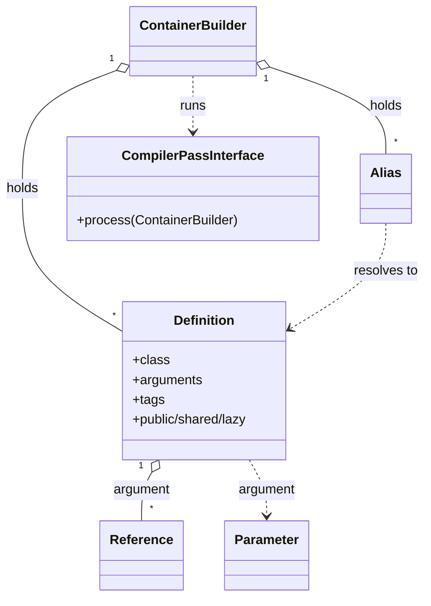
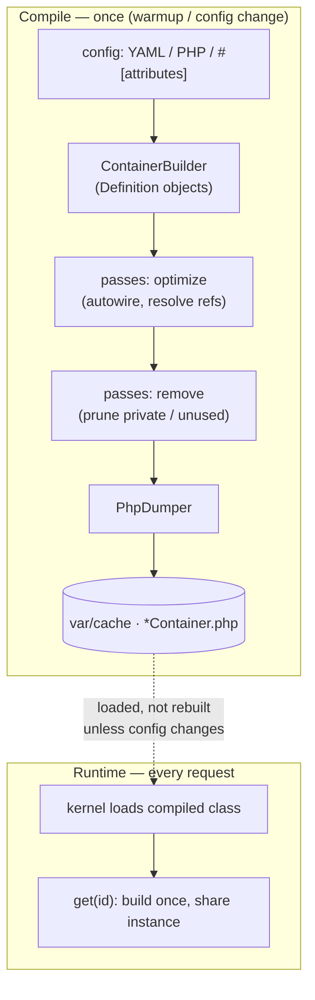

# The Service Container

!!! tip "In a nutshell"
    Le container construit vos objets, injecte leurs dépendances et vous les
    rend — vous décrivez *comment* construire un service, il fait le reste.
    Retenez la séparation : un `ContainerBuilder` compile tout une seule fois en
    une classe PHP dumpée qui sert les instances au runtime. Le fait le plus
    rentable à l'examen : les services sont **privés et partagés (shared) par
    défaut**.

!!! example "Real-world analogy"
    Le container est la cuisine d'un restaurant. Vous commandez un plat (vous
    demandez un service) ; la cuisine rassemble et assemble les ingrédients (ses
    dépendances) et le dresse — vous ne touchez jamais aux casseroles (`new`).
    **Compiler** le container, c'est préparer la cuisine *une fois* avant le
    service (mise en place), pour que chaque commande de la soirée soit rapide.
    Demander un plat qui n'est pas à la carte (un id privé ou supprimé) vous vaut
    un refus poli, pas une assiette.

!!! abstract "Learning objectives"
    À la fin de ce chapitre, vous saurez :

    - [ ] Définir ce qu'est un *service* et distinguer la **compilation** du **runtime**.
    - [ ] Retracer le cycle de vie de la compilation du container et expliquer le
          **cache du container compilé** dans `var/cache/`.
    - [ ] Expliquer la sémantique de `ContainerInterface::get()` et pourquoi les
          services sont **privés par défaut**.

    **Syllabus:** `Dependency Injection → Service Container` ·
    **Level:** Advanced / Expert ·
    **Est. time:** 40 min ·
    **Prerequisites:** [Symfony Architecture](../architecture/index.md)

---

## Pour les nuls

### L'idée en une phrase
Le container fabrique tes objets et leur injecte leurs dépendances à ta place — tu décris *comment* construire un service, il fait le reste.

### Imagine dans la vraie vie
Le container est une cuisine de restaurant. Tu commandes un plat (tu demandes un service) ; la cuisine rassemble et assemble les ingrédients (ses dépendances) et le dresse — tu ne touches jamais aux casseroles (`new`) toi-même.

### Dans Symfony
Injecter `LoggerInterface` dans le constructeur d'un service suffit — tu n'écris jamais `new Logger(...)` toi-même ; le container sait déjà comment le construire et te le fournit tout prêt.

### Exemple simple
```php
public function __construct(private LoggerInterface $logger) {} // le container fournit tout
```

### Comment le mémoriser 🧠
Les services sont **privés et partagés par défaut** — "privé" veut dire que seul le container peut les injecter (pas de `$container->get()` direct depuis ton code applicatif), "partagé" veut dire qu'une seule instance est réutilisée partout dans la même requête.


## Theory

Un **service** est tout objet qui accomplit un travail et est géré par le
container : un mailer, un logger, un repository, votre propre `InvoiceGenerator`.
Les value objects (un `Order`, un `Money`) ne sont *pas* des services — ils
transportent des données, ils ne sont pas câblés.

```php
// A service: does a job, has dependencies, is wired by the container
final class InvoiceGenerator { /* logger injected, registered once */ }

// Value objects: carry data, built with `new`, NOT services
$order = new Order(42);
$price = new Money(1999, 'EUR');
```

Le **service container** (aussi appelé *DI container*) est l'objet qui instancie
les services, injecte leurs dépendances et les fournit à la demande. Dans Symfony,
il est défini par `Symfony\Component\DependencyInjection\ContainerInterface`. Vous
ne construisez presque jamais de services avec `new` ; vous décrivez *comment* ils
se construisent et laissez le container s'en charger — de façon lazy, une seule
fois, et en mode shared par défaut.

```php
use Symfony\Component\DependencyInjection\ContainerInterface;

// Manual wiring with `new` — what you almost never do:
$generator = new InvoiceGenerator(new Logger());

// The container (ContainerInterface) builds it for you — lazily, once, shared:
$generator = $container->get(InvoiceGenerator::class);
```

L'idée cruciale : il existe **deux containers**.

| | Build time | Runtime |
|---|---|---|
| Class | `ContainerBuilder` | dumped `App\..\Container*` |
| Holds | `Definition` objects | real service instances |
| When | cache warmup / first request | every request |
| Mutable? | yes (until frozen) | no |

!!! question "Predict first"
    A service is registered `public: false`. At runtime you call
    `$container->get(App\Invoice\InvoiceGenerator::class)`. What happens?

??? note "Reveal"
    Cela lève une `ServiceNotFoundException`. Les services privés ne peuvent pas
    être récupérés par id depuis le container au runtime — le compiler peut même
    les avoir inlinés ou supprimés. Injectez le service via l'autowiring au lieu
    de le tirer du container.

## Deep Dive — how it works internally

### Definitions, not instances (build time)

Pendant la compilation, rien n'est instancié. Chaque service est une
`Symfony\Component\DependencyInjection\Definition` : une recette contenant la
classe, les arguments, les appels de méthodes, les tags, les drapeaux
`public`/`shared`/`lazy` et la factory. Une
`Symfony\Component\DependencyInjection\Reference` pointe vers un autre service par
son id ; un `Symfony\Component\DependencyInjection\Alias` fait résoudre un id vers
un autre ; un `Symfony\Component\DependencyInjection\Parameter` référence un
parameter du container. Tous ces objets sont de pures métadonnées.

```php
use Symfony\Component\DependencyInjection\Alias;
use Symfony\Component\DependencyInjection\Definition;
use Symfony\Component\DependencyInjection\Parameter;
use Symfony\Component\DependencyInjection\Reference;

// Definition: the recipe — nothing is instantiated here
$def = new Definition(App\Invoice\InvoiceGenerator::class);
$def->setArgument(0, new Reference('logger'));       // Reference: points to another service id
$def->setArgument(1, new Parameter('kernel.debug')); // Parameter: references a container parameter
$def->setPublic(false);  // public flag
$def->setShared(true);   // shared flag
$def->setLazy(false);    // lazy flag

// Alias: makes one id resolve to another
$containerBuilder->setAlias('app.invoices', new Alias(App\Invoice\InvoiceGenerator::class));
```

`ContainerBuilder` étend `Container` et stocke en plus ces definitions, aliases,
extensions et compiler passes.



### The compilation pipeline

`ContainerBuilder::compile()` exécute les passes enregistrées dans
`Symfony\Component\DependencyInjection\Compiler\PassConfig`, puis **fige** les
parameters et marque le container comme compilé. Les passes résolvent
l'autowiring, inlinent les services privés, suppriment les definitions inutilisées
(privées et non référencées) et valident les references. Voir
[Compiler Passes](compiler-passes.md) pour l'ordre des phases.

```php
use Symfony\Component\DependencyInjection\Compiler\PassConfig;

// Passes are registered into a PassConfig phase…
$containerBuilder->addCompilerPass(new AppPass(), PassConfig::TYPE_BEFORE_OPTIMIZATION);

// …then ContainerBuilder::compile() runs them all, freezes parameters
// and marks the container compiled
$containerBuilder->compile();
```


### The compiled container cache

Après compilation, `Symfony\Component\DependencyInjection\Dumper\PhpDumper` écrit
une classe PHP optimisée (p. ex. `App_KernelDevContainer`) dans
`var/cache/<env>/`. Cette classe possède une méthode codée en dur par service
public et des factories `getXxxService()` — aucune réflexion, aucun parsing YAML
au runtime. À la requête suivante, le kernel charge directement cette classe ; le
`ContainerBuilder` n'est plus jamais sollicité. En `dev`, le `ConfigCache`
vérifie les ressources suivies (fichiers de config) et ne reconstruit que
lorsqu'elles changent ; en `prod`, vous le préchauffez une fois au déploiement.

```php
use Symfony\Component\Config\ConfigCache;
use Symfony\Component\DependencyInjection\Dumper\PhpDumper;

$file = 'var/cache/dev/App_KernelDevContainer.php';
$cache = new ConfigCache($file, true); // dev: tracks the config resources

if (!$cache->isFresh()) {              // rebuild only when tracked config changed
    $containerBuilder->compile();
    $dumper = new PhpDumper($containerBuilder); // dumps the optimised PHP class
    $code = $dumper->dump(['class' => 'App_KernelDevContainer']);
    $cache->write($code, $containerBuilder->getResources());
}

require_once $file;
$container = new \App_KernelDevContainer(); // hard-coded getXxxService() factories inside
```



!!! note "Source reference"
    `Symfony\Component\DependencyInjection\ContainerBuilder` &
    `Container` —
    [symfony/symfony `8.0`](https://github.com/symfony/symfony/blob/8.0/src/Symfony/Component/DependencyInjection/ContainerBuilder.php).

### `get()` at runtime

`ContainerInterface::get($id, $invalidBehavior)` retourne un service. Par défaut,
les services sont **shared** : le premier `get()` construit et met en cache
l'instance, les appels suivants retournent le même objet. Un service
`shared: false` est reconstruit à chaque appel. Le second argument contrôle ce
qui se passe pour un id manquant (`EXCEPTION_ON_INVALID_REFERENCE`,
`NULL_ON_INVALID_REFERENCE`, etc.).

```php
use Symfony\Component\DependencyInjection\ContainerInterface;

// Shared (default): first get() builds, later calls return the SAME object
$a = $container->get('logger');
$b = $container->get('logger'); // $a === $b — unless defined with `shared: false`

// Second argument: EXCEPTION_ON_INVALID_REFERENCE (default) throws on a missing id
$container->get('missing.id', ContainerInterface::EXCEPTION_ON_INVALID_REFERENCE);

// NULL_ON_INVALID_REFERENCE returns null instead
$maybe = $container->get('missing.id', ContainerInterface::NULL_ON_INVALID_REFERENCE);
```

### Public vs private — and why private is the default

Un service **public** peut être récupéré avec `$container->get('id')`. Un service
**privé** ne le peut pas ; il ne peut être qu'*injecté* dans d'autres services.
Depuis Symfony 4, **les services sont privés par défaut**, parce que :

- Le compiler peut **inliner** un service privé directement dans son unique
  consommateur, et **supprimer** les services privés que rien ne référence —
  container plus petit, plus rapide.
- Cela impose une vraie dependency injection au lieu de l'anti-pattern
  service-locator consistant à piocher dans le container partout.

Récupérer un service privé (ou supprimé) par id lève une
`ServiceNotFoundException`. C'est pourquoi les controllers utilisent l'autowiring
ou la `ServiceSubscriberInterface`, et non `$container->get()`.

```php
use Symfony\Contracts\Service\ServiceSubscriberInterface;

// Private (or removed) id: $container->get() throws ServiceNotFoundException
$container->get(App\Invoice\InvoiceGenerator::class); // ServiceNotFoundException!

// Sanctioned alternative: declare the needed services explicitly
final class InvoiceController implements ServiceSubscriberInterface
{
    public static function getSubscribedServices(): array
    {
        return ['generator' => App\Invoice\InvoiceGenerator::class];
    }
}
```

### Null behavior

`ContainerInterface::get($id, $invalidBehavior)` décide de ce que fait un id
*manquant*. Le défaut `EXCEPTION_ON_INVALID_REFERENCE` lève une
`ServiceNotFoundException` ; passez `ContainerInterface::NULL_ON_INVALID_REFERENCE`
et `get()` retourne `null` à la place — la façon officielle de modéliser une
dépendance *optionnelle*. Un service **privé** ou **supprimé** par le compiler est
« manquant » du point de vue du container public alors qu'il existe, donc `get()`
sur celui-ci lève aussi. Protégez-vous avec `has($id)` avant `get()`, ou typez la
dépendance injectée comme nullable (`?LoggerInterface $logger = null`) pour qu'une
reference résolue à `null` soit légale. Le bug classique : laisser remonter une
`ServiceNotFoundException` parce que vous supposiez qu'un service optionnel était
toujours présent.

```php
use Psr\Log\LoggerInterface;
use Symfony\Component\DependencyInjection\ContainerInterface;

// EXCEPTION_ON_INVALID_REFERENCE (default): missing id → ServiceNotFoundException
$container->get('app.reporter');

// NULL_ON_INVALID_REFERENCE: missing id → null (optional dependency)
$reporter = $container->get('app.reporter', ContainerInterface::NULL_ON_INVALID_REFERENCE);

// Guard with has() before get()…
$reporter = $container->has('app.reporter') ? $container->get('app.reporter') : null;

// …or make the injected dependency nullable
public function __construct(private ?LoggerInterface $logger = null) {}
```

!!! note "Null in real life"
    Un id de service manquant, c'est le serveur qui annonce « nous n'en avons plus
    ce soir » — avec `NULL_ON_INVALID_REFERENCE`, vous recevez une assiette vide
    (null) au lieu d'une dispute.

!!! info "Expert note"
    `debug:container` lit le container *dumpé*, donc il montre le monde après
    compilation — les services privés inlinés ou supprimés n'y figurent tout
    simplement pas. Quand un service « disparaît », vérifiez s'il était privé et
    non référencé : la passe de suppression l'a élagué. Ajoutez `--show-private`
    pour voir les ids privés que le compiler a conservés.

??? example "Debugging story"
    **Symptôme :** une modification de `services.yaml` restait sans effet en `prod`.
    **Diagnostic :** le container compilé dans `var/cache/prod/` n'avait jamais été
    reconstruit — le déploiement avait sauté `cache:clear`, donc le `*Container.php`
    dumpé contenait encore les anciens arguments résolus. **Correctif :** exécuter
    `cache:warmup` dans l'étape de release. **À éviter :** traitez le container
    compilé comme un artefact de build ; ne modifiez jamais `var/cache/` à la main,
    et préchauffez toujours le cache au déploiement.

??? abstract "Source-code tour"
    - `Symfony\Component\DependencyInjection\ContainerBuilder` — le container du
      build time ; détient les `Definition`s et exécute `compile()`.
    - `Symfony\Component\DependencyInjection\Definition` &
      `Symfony\Component\DependencyInjection\Reference` — la recette et le pointeur
      « câble-moi vers cet id ».
    - `Symfony\Component\DependencyInjection\Compiler\PassConfig` — la liste
      ordonnée des passes que `compile()` exécute.
    - `Symfony\Component\DependencyInjection\Dumper\PhpDumper` — transforme le
      builder figé en `*Container.php` optimisé servi au runtime.

## Configuration & code

=== "PHP Attributes"

    ```php
    <?php
    declare(strict_types=1);

    namespace App\Invoice;

    use Psr\Log\LoggerInterface;

    // Autowired + registered by services.yaml resource loading.
    final class InvoiceGenerator
    {
        public function __construct(
            private readonly LoggerInterface $logger,
        ) {}

        public function generate(int $orderId): string
        {
            $this->logger->info('Generating invoice', ['order' => $orderId]);

            return \sprintf('INV-%06d', $orderId);
        }
    }
    ```

=== "YAML"

    ```yaml
    # config/services.yaml
    services:
        _defaults:
            autowire: true      # inject by type-hint
            autoconfigure: true # apply tags by interface
            public: false       # private by default

        App\:
            resource: '../src/'
            exclude: '../src/{Entity,Kernel.php}'
    ```

=== "Console"

    ```console
    $ php bin/console debug:container App\\Invoice\\InvoiceGenerator
    $ php bin/console cache:clear   # rebuilds the compiled container
    ```

## Best practices & anti-patterns

| ✅ Do | ❌ Avoid |
|---|---|
| Injecter les dépendances via le constructeur | `$container->get('id')` dans le code métier |
| Garder les services privés | Rendre les services publics « par sécurité » |
| Laisser le compiler supprimer les services inutilisés | Instancier avec `new` des services câblés |
| Traiter le container compilé comme un artefact de build | Modifier `var/cache/` à la main |

## When (not) to use it / alternatives

Tout ce qui a un comportement et des dépendances appartient au container.
N'enregistrez **pas** les value objects, entités ou DTOs — construisez-les avec
`new`. Quand vous avez besoin de *nombreux* services à la demande sans tous les
instancier, utilisez un [service locator](service-locators.md) plutôt que
d'injecter le container entier.

!!! danger "Certification traps"
    - Les services sont **privés par défaut** depuis Symfony 4 ; `$container->get()`
      sur un id privé lève une `ServiceNotFoundException`.
    - `Definition`/`Reference`/`Alias` n'existent **qu'au build time** ; le container
      au runtime détient des instances, pas des definitions.
    - Le container compilé est une **classe PHP dumpée** dans `var/cache/`, pas le
      `ContainerBuilder`.
    - Les services sont **shared** par défaut — même instance à chaque `get()` répété.

!!! warning "Common mistakes"
    - S'attendre à ce que des changements de config prennent effet sans
      reconstruction du cache en `prod`.
    - Confondre *public* (récupérable par id) et *shared* (instance unique) — ce
      sont des drapeaux indépendants.
    - Supposer que l'autowiring ou la suppression se produit au runtime ; tout se
      passe à la compilation.

## Exercises

1. **(Advanced)** Expliquez, en une phrase chacune, la différence entre une
   `Definition` et l'objet qu'elle finit par produire.
2. **(Expert)** Un collègue appelle `$this->container->get(MailerInterface::class)`
   dans un service et obtient `ServiceNotFoundException`. Pourquoi, et quel est le
   correctif ?
3. **(Expert)** Où se trouve sur le disque le container compilé pour l'environnement
   `prod`, et qu'est-ce qui déclenche sa régénération ?

??? success "Solutions"

    **1.** Une `Definition` est une métadonnée de build time (classe, arguments,
    drapeaux) détenue par le `ContainerBuilder` ; l'objet produit est l'instance au
    runtime que le container dumpé crée à partir de cette recette.

    **2.** `MailerInterface` se résout vers un service **privé**, donc il n'est pas
    récupérable par id. Injectez-le via le constructeur (autowiring) au lieu de le
    tirer du container.

    **3.** `var/cache/prod/` (une classe `*Container.php` dumpée). Elle est
    régénérée par `cache:clear` / `cache:warmup` — typiquement au déploiement ; en
    `dev`, le `ConfigCache` la reconstruit automatiquement quand un fichier de
    config suivi change.

## Certification questions

??? question "Q1. Why are Symfony services private by default?"
    - [ ] A. To make them read-only
    - [x] B. So the compiler can inline/remove them and enforce proper DI ✅
    - [ ] C. Because public services are deprecated
    - [ ] D. To make `get()` faster

    **Why:** Les services privés peuvent être inlinés dans leur unique consommateur
    et élagués s'ils sont inutilisés, et cela décourage l'anti-pattern
    service-locator.
    **Ref:** [Service container](https://symfony.com/doc/8.0/service_container.html).

??? question "Q2. When does autowiring resolution happen?"
    - [x] A. At container **compilation** (build time) ✅
    - [ ] B. On every `get()` call at runtime
    - [ ] C. When the class file is autoloaded
    - [ ] D. During HTTP kernel termination

    **Why:** L'autowiring est une compiler pass ; le container dumpé a ses
    arguments déjà résolus. **Ref:** [Autowiring](https://symfony.com/doc/8.0/service_container/autowiring.html).

??? question "Q3. `$container->get('some.private.service')` returns…"
    - [ ] A. The service instance
    - [x] B. Throws `ServiceNotFoundException` ✅
    - [ ] C. `null`
    - [ ] D. A new instance each call

    **Why:** Les services privés ne sont pas récupérables par id depuis le container
    public.
    **Ref:** [Service container](https://symfony.com/doc/8.0/service_container.html).

??? question "Q4. What is stored in `var/cache/prod/`?"
    - [ ] A. The `ContainerBuilder`
    - [ ] B. YAML definitions
    - [x] C. A dumped, compiled PHP container class ✅
    - [ ] D. Serialized service instances

    **Why:** `PhpDumper` écrit une classe PHP optimisée avec une méthode par service.
    **Ref:** [Compiling the container](https://symfony.com/doc/8.0/components/dependency_injection/compilation.html).

## Key takeaways

- Un service est un objet géré par le container ; les value objects ne sont pas des
  services.
- Build time = `ContainerBuilder` + `Definition`s ; runtime = container dumpé +
  instances.
- La compilation exécute les passes, résout l'autowiring, supprime les services
  privés/inutilisés, puis dumpe une classe PHP dans `var/cache/`.
- Les services sont **privés** et **shared** par défaut.

## Last-minute revision

!!! tip "Cheat sheet"
    - `ContainerBuilder.compile()` → `PassConfig` → freeze → `PhpDumper` → cache.
    - Privé ≠ shared : drapeaux indépendants. Les deux valent par défaut un état
      « caché, instance unique ».
    - `get()` sur un id privé → `ServiceNotFoundException`.
    - `Definition`/`Reference`/`Alias`/`Parameter` = métadonnées de build time
      uniquement.

## Connections

- **Depends on:** [Symfony Architecture](../architecture/index.md) — le kernel
  construit et démarre le container.
- **Reused in:** [Controllers](../controllers/abstract-controller.md),
  [Console](../console/custom-commands.md),
  [Messenger](../messenger/index.md) — chaque point d'entrée tire ses
  collaborateurs de ce container.
- **Confused with:** [Service Locators](service-locators.md) — un locator est un
  petit sous-ensemble PSR-11, pas le container entier.

## Official References
- [Official Symfony docs — Service Container](https://symfony.com/doc/8.0/service_container.html)
- [Official Symfony docs — Compiling the Container](https://symfony.com/doc/8.0/components/dependency_injection/compilation.html)
- [Symfony source — ContainerBuilder](https://github.com/symfony/symfony/blob/8.0/src/Symfony/Component/DependencyInjection/ContainerBuilder.php)

## Video references

!!! tip "Watch & learn"
    Voici des chaînes vidéo officielles, mises à jour en continu — cherchez-y
    « dependency injection » pour consolider ce chapitre. Nous référençons des
    chaînes stables plutôt que des vidéos individuelles, afin que les références ne
    périment jamais.

    - [SymfonyCasts screencasts](https://symfonycasts.com/tracks/symfony) — tutoriels scénarisés à coder en suivant.
    - [Symfony official YouTube](https://www.youtube.com/@SymfonyOfficial) — conférences et keynotes SymfonyCon.
    - [Official docs for this topic](https://symfony.com/doc/8.0/service_container.html) — certaines pages de la doc Symfony intègrent un screencast.

## Confidence check

Je suis prêt quand je peux :

- [ ] expliquer **pourquoi** le container existe et quel problème résout la DI
- [ ] construire et câbler un service dans Symfony 8 (`autowire` + le glob `App\:`)
- [ ] déboguer une `ServiceNotFoundException` levée sur un id privé
- [ ] repérer le piège : les services sont privés **et** shared par défaut
- [ ] expliquer compile-time (`ContainerBuilder`) vs runtime (container dumpé)

---

<small>Related: [Registration](registration.md) · [Autowiring](autowiring.md) ·
[Compiler Passes](compiler-passes.md)</small>
