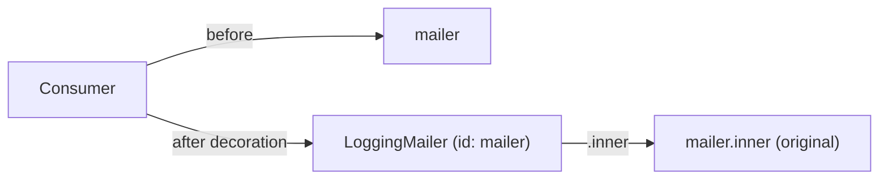

# Service Decoration

!!! tip "In a nutshell"
    La decoration enveloppe un service existant dans un nouveau service portant la
    même interface, ajoutant un comportement (logging, cache) sans toucher à
    l'original — le decorator reprend l'id et reçoit l'original en tant que
    `.inner`. Fait le plus rentable : **plus la `decoration_priority` est élevée =
    appliqué en premier = le plus interne** (au plus près de l'original).

!!! example "Real-world analogy"
    Un decorator est un poste de garniture par lequel chaque assiette passe avant
    de sortir : le plat (le service d'origine) n'est pas touché, mais il récolte
    une touche finale (logging, cache) sous le même nom. `.inner` est l'assiette
    reçue du poste précédent ; `decoration_priority` détermine la position de
    chaque poste sur la ligne de passe — la priorité la plus haute est la plus
    proche de la cuisine (la plus interne).

!!! abstract "Learning objectives"
    À la fin de ce chapitre, vous saurez :

    - [ ] Décorer un service avec `decorates` et référencer l'original via
          `.inner`.
    - [ ] Contrôler la chaîne avec `decoration_priority` et
          `decoration_on_invalid`.
    - [ ] Décorer via les attributs `#[AsDecorator]` et `#[AutowireDecorated]`.

    **Syllabus:** `Dependency Injection → Service Decoration` ·
    **Level:** Advanced / Expert ·
    **Est. time:** 30 min ·
    **Prerequisites:** [Service Registration](registration.md)

---

## Theory

La **decoration** enveloppe un service existant dans un nouveau service qui
implémente la même interface, ajoutant un comportement (logging, cache,
validation) sans toucher à l'original. C'est l'implémentation, côté container DI,
du pattern Decorator : le decorator remplace l'id du service et reçoit l'original
comme dépendance.

Contrairement à un [compiler pass](compiler-passes.md) qui réécrit des
définitions, la decoration est déclarative — vous dites « ce service décore cet
id » et le container recâble tous ceux qui dépendaient de l'original pour qu'ils
reçoivent désormais le decorator.

!!! question "Predict first"
    Deux decorators ciblent `mailer` : le cache avec `decoration_priority: 20`, le
    logging avec `10`. Lequel les consommateurs atteignent-ils en premier, et
    lequel est au plus près de l'original ?

??? note "Reveal"
    La priorité la plus élevée est appliquée **en premier** et finit **la plus
    interne** : le cache (20) enveloppe donc directement l'original. Les
    consommateurs atteignent d'abord le decorator de plus basse priorité, le plus
    externe — le logging (10) — qui délègue vers l'intérieur au cache, puis à
    l'original.

## Deep Dive — how it works internally

### What the compiler does

À la compilation, `Symfony\Component\DependencyInjection\Compiler\DecoratorServicePass`
traite chaque définition ayant une cible `decorates`. Il :

1. Renomme l'id du service d'origine en un id interne
   (`decorator_id.inner`), en conservant la véritable implémentation.
2. Fait reprendre au **decorator** l'**id public** du service décoré.
3. Réécrit l'argument `.inner` du decorator en une `Reference` vers l'original
   renommé.

Ainsi, tous les consommateurs existants reçoivent le decorator de façon
transparente ; le decorator détient l'original derrière `.inner`.

```php
use Symfony\Component\DependencyInjection\Reference;

// What DecoratorServicePass does with a `decorates` target:
$decorator = $containerBuilder->getDefinition(App\Mail\LoggingMailer::class);
$decorator->setDecoratedService('mailer'); // YAML: decorates: 'mailer'

// After the pass runs:
// 1. the original is renamed to the inner id (decorator_id.inner):
//    'App\Mail\LoggingMailer.inner' → the real implementation
// 2. the decorator now owns the public id 'mailer'
// 3. its '.inner' argument is rewritten to a Reference to the renamed original:
new Reference('App\Mail\LoggingMailer.inner');
```



### Chaining and priority

Plusieurs decorators sur le même id forment une **chaîne**. `decoration_priority`
(défaut `0`) les ordonne : **la priorité la plus élevée enveloppe au plus
interne**, c'est-à-dire s'exécute au plus près de l'original ; le nombre le plus
haut n'est le plus externe que si… attention : priorité plus élevée = appliqué en
premier = **le plus interne**. Le service effectivement résolu par les
consommateurs est le dernier decorator (le plus externe). Retenez la règle exacte :
une `decoration_priority` plus élevée est **plus proche de l'original** (interne),
plus basse est externe.

```yaml
services:
    # Higher decoration_priority = applied first = innermost (wraps the original)
    App\Mail\CachingMailer:
        decorates: mailer
        decoration_priority: 20   # inner

    # Lower priority (default 0) = outermost — what consumers actually receive
    App\Mail\LoggingMailer:
        decorates: mailer
        decoration_priority: 10   # outer
```

### Missing decorated service

`decoration_on_invalid` contrôle le comportement quand l'id décoré n'existe pas :
`exception` (défaut), `ignore` (abandonner le decorator), ou `null` (injecter
`null` en tant que `.inner`). Utilisez `ignore`/`null` pour la decoration
optionnelle de services potentiellement absents.

```yaml
services:
    App\Mail\LoggingMailer:
        decorates: maybe_absent_mailer
        # exception (default): compilation fails if the decorated id is missing
        # ignore: the decorator definition is dropped entirely
        # null: null is injected as the .inner argument
        decoration_on_invalid: ignore
```

!!! note "Source reference"
    `Symfony\Component\DependencyInjection\Compiler\DecoratorServicePass` —
    [symfony/symfony `8.0`](https://github.com/symfony/symfony/blob/8.0/src/Symfony/Component/DependencyInjection/Compiler/DecoratorServicePass.php).

### Null behavior

`decoration_on_invalid` décide de ce qui se passe quand l'**id décoré n'existe
pas** à la compilation. `exception` (défaut) fait échouer le build ; `ignore`
abandonne complètement le decorator ; et `null` injecte **`null`** en tant que
`.inner`. Si vous choisissez `null`, l'argument `.inner` doit l'accepter — typez-le
`?MailerInterface` (avec `#[AutowireDecorated]`) — et chaque méthode de délégation
doit se protéger avec l'opérateur nullsafe (`$this->inner?->send(...)`) ou un
repli `??`. Le bug classique : déclarer `decoration_on_invalid: null` tout en
gardant un type `.inner` non nullable, transformant un enrobage optionnel en
`TypeError` dès que la cible est absente.

```php
// YAML: decoration_on_invalid: exception (default) | ignore | null
final class LoggingMailer implements MailerInterface
{
    public function __construct(
        #[AutowireDecorated]
        private readonly ?MailerInterface $inner, // nullable: null may be injected as .inner
    ) {}

    public function send(RawMessage $message, ?Envelope $envelope = null): void
    {
        // Guard delegation: nullsafe operator (or a `??` fallback) — avoids a TypeError
        $this->inner?->send($message, $envelope);
    }
}
```

!!! note "Null in real life"
    Un inner `null`, c'est un poste de garniture sans assiette qui descend la
    ligne — vous devez vérifier que le tapis est vide (`?->`) avant d'essayer
    d'assaisonner le néant.

!!! info "Expert note"
    Injecter le service décoré par son propre id à l'intérieur du decorator
    provoque une récursion infinie — le decorator a repris cet id. Prenez toujours
    l'original via `.inner` / `#[AutowireDecorated]`, jamais en re-récupérant l'id
    public.

??? example "Debugging story"
    **Symptôme :** après l'ajout de `decoration_on_invalid: null`, les requêtes
    échouaient en erreur fatale avec un `TypeError` sur `.inner`.
    **Diagnostic :** l'argument `.inner` était typé `MailerInterface` non nullable,
    mais la cible étant absente, le compilateur a injecté `null`.
    **Correction :** le typer `?MailerInterface` et protéger la délégation avec
    `$this->inner?->send(...)`. **À éviter :** dès que vous optez pour `null`,
    rendez le type inner nullable et utilisez l'opérateur nullsafe.

??? abstract "Source-code tour"
    - `Symfony\Component\DependencyInjection\Compiler\DecoratorServicePass` —
      renomme l'id décoré en `*.inner` et confie l'id public au decorator.
    - `Symfony\Component\DependencyInjection\Definition::setDecoratedService()` —
      la façon dont `decorates`, `decoration_priority` et `decoration_on_invalid`
      sont stockés.
    - `Symfony\Component\DependencyInjection\Reference` — l'argument `.inner` est
      réécrit en référence vers l'original renommé.
    - `Symfony\Component\DependencyInjection\Attribute\AsDecorator` &
      `AutowireDecorated` — les équivalents en attributs des clés YAML.

## Configuration & code

=== "PHP Attributes"

    ```php
    <?php
    declare(strict_types=1);

    namespace App\Mail;

    use Psr\Log\LoggerInterface;
    use Symfony\Component\DependencyInjection\Attribute\AsDecorator;
    use Symfony\Component\DependencyInjection\Attribute\AutowireDecorated;
    use Symfony\Component\Mailer\MailerInterface;
    use Symfony\Component\Mime\RawMessage;
    use Symfony\Component\Mailer\Envelope;

    #[AsDecorator(decorates: MailerInterface::class)]
    final class LoggingMailer implements MailerInterface
    {
        public function __construct(
            #[AutowireDecorated]                  // injects the .inner service
            private readonly MailerInterface $inner,
            private readonly LoggerInterface $logger,
        ) {}

        public function send(RawMessage $message, ?Envelope $envelope = null): void
        {
            $this->logger->info('Sending email');
            $this->inner->send($message, $envelope);
        }
    }
    ```

=== "YAML"

    ```yaml
    # config/services.yaml
    services:
        App\Mail\LoggingMailer:
            decorates: 'Symfony\Component\Mailer\MailerInterface'
            decoration_priority: 10
            decoration_on_invalid: exception
            arguments:
                $inner: '@.inner'   # the original, renamed service
                $logger: '@logger'
    ```

=== "Console"

    ```console
    $ php bin/console debug:container --show-private mailer
    ```

## Best practices & anti-patterns

| ✅ Do | ❌ Avoid |
|---|---|
| Implémenter la même interface | Changer le contrat public |
| Injecter `.inner` / `#[AutowireDecorated]` | Re-récupérer le service par son id |
| Utiliser la priorité pour des chaînes déterministes | Se fier à l'ordre des définitions |
| Déléguer à `.inner` pour les chemins inchangés | Réimplémenter l'original |

## When (not) to use it / alternatives

Décorez quand vous voulez ajouter de façon transparente un comportement
transversal autour d'un service existant. Préférez la decoration à un compiler
pass dans ce cas — elle est déclarative et plus sûre. Si vous devez *choisir
entre* des implémentations plutôt qu'envelopper, utilisez un
[alias](registration.md) ou une [factory](factories.md). Si vous devez exécuter
*plusieurs* handlers, utilisez plutôt les [tags](tags.md).

!!! danger "Certification traps"
    - `.inner` est la référence spéciale vers le service **d'origine** (renommé).
    - Le decorator **reprend l'id décoré** ; les consommateurs n'en savent rien.
    - Une `decoration_priority` plus élevée = appliqué en premier = **plus proche
      de l'original** (le plus interne).
    - `#[AutowireDecorated]` injecte `.inner` ; sans lui, l'argument n'est pas le
      service inner.
    - `decoration_on_invalid: null` injecte `null`, pas un wrapper no-op.

!!! warning "Common mistakes"
    - Oublier d'implémenter l'interface décorée — erreurs d'autowiring/de type.
    - Injecter le service par son propre id dans le decorator → récursion infinie.
    - Supposer que la priorité la plus basse s'exécute en premier.

## Exercises

1. **(Advanced)** Décorez `MailerInterface` pour ajouter du logging, en déléguant
   à l'original.
2. **(Expert)** Deux decorators ciblent le même id ; vous voulez que celui de
   cache soit directement autour de l'original et que le logging soit à
   l'extérieur. Fixez les priorités.

??? success "Solutions"

    **1.** Voir l'exemple avec attributs ci-dessus : `#[AsDecorator(MailerInterface::class)]`
    plus `#[AutowireDecorated]` pour le service inner, puis déléguez dans `send()`.

    **2.** Donnez au decorator de cache la `decoration_priority` la **plus élevée**
    (par ex. `20`) pour qu'il soit appliqué en premier (le plus interne), et au
    logging la **plus basse** (par ex. `10`) pour qu'il enveloppe le cache à
    l'extérieur — les consommateurs atteignent d'abord le logging, puis le cache,
    puis l'original.

## Certification questions

??? question "Q1. In a decorator, what is `@.inner`?"
    - [ ] A. The decorator itself
    - [x] B. A reference to the original (decorated) service ✅
    - [ ] C. The parent bundle
    - [ ] D. A private alias to `service_container`

    **Why:** Le compilateur renomme le service décoré et l'expose sous `.inner`.
    **Ref:** [Decorating services](https://symfony.com/doc/current/service_container/service_decoration.html).

??? question "Q2. Which attribute injects the decorated (inner) service?"
    - [ ] A. `#[Autowire('.inner')]` only
    - [x] B. `#[AutowireDecorated]` ✅
    - [ ] C. `#[Inner]`
    - [ ] D. `#[AsDecorator]`

    **Why:** `#[AutowireDecorated]` se résout en la référence `.inner` pour le
    paramètre. **Ref:** [Service decoration](https://symfony.com/doc/current/service_container/service_decoration.html).

??? question "Q3. With two decorators, higher `decoration_priority` means…"
    - [x] A. Applied first, sits closer to the original (innermost) ✅
    - [ ] B. Applied last, outermost
    - [ ] C. It is ignored
    - [ ] D. It becomes public

    **Why:** Les decorators de priorité plus élevée sont appliqués en premier et
    finissent les plus internes ; les consommateurs voient celui de plus basse
    priorité (le plus externe). **Ref:** [Decoration priority](https://symfony.com/doc/current/service_container/service_decoration.html#decoration-priority).

??? question "Q4. `decoration_on_invalid: ignore` does what if the target is missing?"
    - [x] A. Removes the decorator, leaving nothing ✅
    - [ ] B. Injects `null`
    - [ ] C. Throws an exception
    - [ ] D. Creates an empty service

    **Why:** `ignore` abandonne le decorator ; `null` injecterait `null` ;
    `exception` (défaut) lève une exception.
    **Ref:** [Service decoration](https://symfony.com/doc/current/service_container/service_decoration.html).

## Key takeaways

- La decoration enveloppe un service de façon transparente ; le decorator reprend
  l'id.
- `.inner` / `#[AutowireDecorated]` vous donne l'original.
- `decoration_priority` : plus élevée = le plus interne (appliqué en premier).
- `decoration_on_invalid` : `exception` | `ignore` | `null`.

## Last-minute revision

!!! tip "Cheat sheet"
    - YAML : `decorates:`, `arguments: { $x: '@.inner' }`, `decoration_priority`,
      `decoration_on_invalid`.
    - Attributs : `#[AsDecorator(decorates: X::class)]` + `#[AutowireDecorated]`.
    - `DecoratorServicePass` renomme l'original → `.inner`, le decorator → id public.
    - Priorité plus élevée = le plus interne.

## Connections

- **Depends on:** [Compiler Passes](compiler-passes.md) — `DecoratorServicePass`
  effectue le recâblage à la compilation.
- **Reused in:** [Messenger](../miscellaneous/messenger.md),
  [Security](../security/authenticators.md) — les middlewares et handlers sont
  couramment décorés pour ajouter du logging ou du cache.
- **Confused with:** [Factories](factories.md) — une factory *construit* un
  service ; un decorator *enveloppe* un service existant sous son id.

## Official References
- [Official Symfony docs — Service Decoration](https://symfony.com/doc/current/service_container/service_decoration.html)
- [Symfony source — DecoratorServicePass](https://github.com/symfony/symfony/blob/8.0/src/Symfony/Component/DependencyInjection/Compiler/DecoratorServicePass.php)

## Video references

!!! tip "Watch & learn"
    Ce sont des chaînes vidéo officielles, mises à jour en continu — recherchez-y
    "dependency injection" pour consolider ce chapitre. Nous lions des chaînes
    stables plutôt que des vidéos individuelles afin que les références ne se
    périment jamais.

    - [SymfonyCasts screencasts](https://symfonycasts.com/tracks/symfony) — tutoriels scénarisés à suivre en codant.
    - [Symfony official YouTube](https://www.youtube.com/@SymfonyOfficial) — conférences et keynotes SymfonyCon.
    - [Official docs for this topic](https://symfony.com/doc/current/service_container/service_decoration.html) — certaines pages de la doc Symfony intègrent un screencast.

## Confidence check

Je suis prêt quand je peux :

- [ ] expliquer **pourquoi** la decoration l'emporte sur l'héritage pour le
  comportement transversal
- [ ] décorer un service avec `#[AsDecorator]` + `#[AutowireDecorated]` dans
  Symfony 8
- [ ] déboguer une récursion infinie ou un `TypeError` d'un `.inner` à `null`
- [ ] repérer qu'une `decoration_priority` plus élevée = le plus interne (appliqué
  en premier)
- [ ] expliquer ce que `DecoratorServicePass` renomme et recâble

---

<small>Related: [Registration](registration.md) · [Factories](factories.md) ·
[Compiler Passes](compiler-passes.md)</small>
