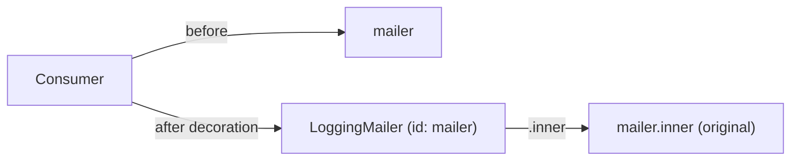

# Service Decoration

!!! tip "In a nutshell"
    Decoration wraps an existing service in a new one with the same interface,
    adding behaviour (logging, caching) without touching the original — the
    decorator takes over the id and receives the original as `.inner`.
    Highest-yield fact: **higher `decoration_priority` = applied first = innermost**
    (closest to the original).

!!! example "Real-world analogy"
    A decorator is a garnish station every plate passes through on its way out: the
    dish (original service) is untouched, but it picks up a sprinkle (logging,
    caching) under the same name. `.inner` is the plate handed in from the previous
    station; `decoration_priority` is where each station sits on the pass line —
    higher priority sits closest to the kitchen (innermost).

!!! abstract "Learning objectives"
    By the end of this chapter you can:

    - [ ] Decorate a service with `decorates` and reference the original via
          `.inner`.
    - [ ] Control the chain with `decoration_priority` and
          `decoration_on_invalid`.
    - [ ] Decorate with attributes using `#[AsDecorator]` and `#[AutowireDecorated]`.

    **Syllabus:** `Dependency Injection → Service Decoration` ·
    **Level:** Advanced / Expert ·
    **Est. time:** 30 min ·
    **Prerequisites:** [Service Registration](registration.md)

---

## Theory

**Decoration** wraps an existing service in a new one that implements the same
interface, adding behaviour (logging, caching, validation) without touching the
original. It is the DI-container implementation of the Decorator pattern: the
decorator replaces the service id, and receives the original as a dependency.

Unlike a [compiler pass](compiler-passes.md) that rewrites definitions, decoration
is declarative — you say "this service decorates that id" and the container
rewires everyone who depended on the original to now get the decorator.

!!! question "Predict first"
    Two decorators target `mailer`: caching with `decoration_priority: 20`, logging
    with `10`. Which one do consumers hit first, and which sits nearest the original?

??? note "Reveal"
    Higher priority is applied **first** and ends up **innermost**, so caching (20)
    wraps the original directly. Consumers hit the lowest-priority, outermost
    decorator first — logging (10) — which delegates inward to caching, then the
    original.

## Deep Dive — how it works internally

### What the compiler does

At compile time, `Symfony\Component\DependencyInjection\Compiler\DecoratorServicePass`
processes every definition with a `decorates` target. It:

1. Renames the original service id to an inner id
   (`decorator_id.inner`), keeping the real implementation.
2. Makes the **decorator** take over the **public id** of the decorated service.
3. Rewrites the decorator's `.inner` argument to a `Reference` to the renamed
   original.

So all existing consumers transparently receive the decorator; the decorator
holds the original behind `.inner`.

```php
use Symfony\Component\DependencyInjection\Reference;

// What DecoratorServicePass does with a `decorates` target:
$decorator = $containerBuilder->getDefinition(App\Mail\LoggingMailer::class);
$decorator->setDecoratedService('mailer'); // YAML: decorates: 'mailer'

// After the pass runs:
// 1. the original is renamed to the inner id (decorator_id.inner):
//    'App\Mail\LoggingMailer.inner' → the real implementation
// 2. the decorator now owns the public id 'mailer'
// 3. its '.inner' argument is rewritten to a Reference to the renamed original:
new Reference('App\Mail\LoggingMailer.inner');
```



### Chaining and priority

Multiple decorators on the same id form a **chain**. `decoration_priority`
(default `0`) orders them: **higher priority wraps the inner-most**, i.e. runs
closer to the original; the highest number is the outermost only when… careful:
higher priority = applied first = **innermost**. The service actually resolved by
consumers is the last (outermost) decorator. Know the exact rule: higher
`decoration_priority` is **closer to the original** (inner), lower is outer.

```yaml
services:
    # Higher decoration_priority = applied first = innermost (wraps the original)
    App\Mail\CachingMailer:
        decorates: mailer
        decoration_priority: 20   # inner

    # Lower priority (default 0) = outermost — what consumers actually receive
    App\Mail\LoggingMailer:
        decorates: mailer
        decoration_priority: 10   # outer
```

### Missing decorated service

`decoration_on_invalid` controls behaviour when the decorated id does not exist:
`exception` (default), `ignore` (drop the decorator), or `null` (inject `null` as
`.inner`). Use `ignore`/`null` for optional decoration of services that may be
absent.

```yaml
services:
    App\Mail\LoggingMailer:
        decorates: maybe_absent_mailer
        # exception (default): compilation fails if the decorated id is missing
        # ignore: the decorator definition is dropped entirely
        # null: null is injected as the .inner argument
        decoration_on_invalid: ignore
```

!!! note "Source reference"
    `Symfony\Component\DependencyInjection\Compiler\DecoratorServicePass` —
    [symfony/symfony `8.0`](https://github.com/symfony/symfony/blob/8.0/src/Symfony/Component/DependencyInjection/Compiler/DecoratorServicePass.php).

### Null behavior

`decoration_on_invalid` decides what happens when the **decorated id does not
exist** at compile time. `exception` (default) fails the build; `ignore` drops the
decorator entirely; and `null` injects **`null`** as `.inner`. If you choose `null`,
the `.inner` argument must accept it — type it `?MailerInterface` (with
`#[AutowireDecorated]`) — and every delegating method must guard with the nullsafe
operator (`$this->inner?->send(...)`) or a `??` fallback. The common bug is
declaring `decoration_on_invalid: null` but keeping a non-nullable `.inner` type,
turning an optional wrap into a `TypeError` the moment the target is absent.

```php
// YAML: decoration_on_invalid: exception (default) | ignore | null
final class LoggingMailer implements MailerInterface
{
    public function __construct(
        #[AutowireDecorated]
        private readonly ?MailerInterface $inner, // nullable: null may be injected as .inner
    ) {}

    public function send(RawMessage $message, ?Envelope $envelope = null): void
    {
        // Guard delegation: nullsafe operator (or a `??` fallback) — avoids a TypeError
        $this->inner?->send($message, $envelope);
    }
}
```

!!! note "Null in real life"
    A `null` inner is a garnish station with no plate coming down the line — you
    must check the belt is empty (`?->`) before you try to season nothing.

!!! info "Expert note"
    Injecting the decorated service by its own id inside the decorator causes
    infinite recursion — the decorator has taken over that id. Always take the
    original through `.inner` / `#[AutowireDecorated]`, never by re-fetching the
    public id.

??? example "Debugging story"
    **Symptom:** after adding `decoration_on_invalid: null`, requests fatalled with a
    `TypeError` on `.inner`. **Diagnosis:** the `.inner` argument was typed
    non-nullable `MailerInterface`, but with the target absent the compiler injected
    `null`. **Fix:** type it `?MailerInterface` and guard delegation with
    `$this->inner?->send(...)`. **Avoid:** whenever you opt into `null`, make the
    inner type nullable and use the nullsafe operator.

??? abstract "Source-code tour"
    - `Symfony\Component\DependencyInjection\Compiler\DecoratorServicePass` — renames
      the decorated id to `*.inner` and hands the public id to the decorator.
    - `Symfony\Component\DependencyInjection\Definition::setDecoratedService()` — how
      `decorates`, `decoration_priority` and `decoration_on_invalid` are stored.
    - `Symfony\Component\DependencyInjection\Reference` — the `.inner` argument is
      rewritten to a reference to the renamed original.
    - `Symfony\Component\DependencyInjection\Attribute\AsDecorator` &
      `AutowireDecorated` — the attribute equivalents of the YAML keys.

## Configuration & code

=== "PHP Attributes"

    ```php
    <?php
    declare(strict_types=1);

    namespace App\Mail;

    use Psr\Log\LoggerInterface;
    use Symfony\Component\DependencyInjection\Attribute\AsDecorator;
    use Symfony\Component\DependencyInjection\Attribute\AutowireDecorated;
    use Symfony\Component\Mailer\MailerInterface;
    use Symfony\Component\Mime\RawMessage;
    use Symfony\Component\Mailer\Envelope;

    #[AsDecorator(decorates: MailerInterface::class)]
    final class LoggingMailer implements MailerInterface
    {
        public function __construct(
            #[AutowireDecorated]                  // injects the .inner service
            private readonly MailerInterface $inner,
            private readonly LoggerInterface $logger,
        ) {}

        public function send(RawMessage $message, ?Envelope $envelope = null): void
        {
            $this->logger->info('Sending email');
            $this->inner->send($message, $envelope);
        }
    }
    ```

=== "YAML"

    ```yaml
    # config/services.yaml
    services:
        App\Mail\LoggingMailer:
            decorates: 'Symfony\Component\Mailer\MailerInterface'
            decoration_priority: 10
            decoration_on_invalid: exception
            arguments:
                $inner: '@.inner'   # the original, renamed service
                $logger: '@logger'
    ```

=== "Console"

    ```console
    $ php bin/console debug:container --show-private mailer
    ```

## Best practices & anti-patterns

| ✅ Do | ❌ Avoid |
|---|---|
| Implement the same interface | Changing the public contract |
| Inject `.inner` / `#[AutowireDecorated]` | Re-fetching the service by id |
| Use priority for deterministic chains | Relying on definition order |
| Delegate to `.inner` for untouched paths | Reimplementing the original |

## When (not) to use it / alternatives

Decorate when you want to add cross-cutting behaviour around an existing service
transparently. Prefer decoration over a compiler pass for this case — it is
declarative and safer. If you need to *choose between* implementations rather than
wrap, use an [alias](registration.md) or [factory](factories.md). If you need to
run *many* handlers, use [tags](tags.md) instead.

!!! danger "Certification traps"
    - `.inner` is the special reference to the **original** (renamed) service.
    - The decorator **takes over the decorated id**; consumers are unaware.
    - Higher `decoration_priority` = applied first = **closer to the original**
      (innermost).
    - `#[AutowireDecorated]` injects `.inner`; without it the arg is not the inner
      service.
    - `decoration_on_invalid: null` injects `null`, not a no-op wrapper.

!!! warning "Common mistakes"
    - Forgetting to implement the decorated interface — autowiring/type errors.
    - Injecting the service by its own id inside the decorator → infinite recursion.
    - Assuming lower priority runs first.

## Exercises

1. **(Advanced)** Decorate `MailerInterface` to add logging, delegating to the
   original.
2. **(Expert)** Two decorators target the same id; you need the caching one to sit
   directly around the original and logging on the outside. Set priorities.

??? success "Solutions"

    **1.** See the attribute example above: `#[AsDecorator(MailerInterface::class)]`
    plus `#[AutowireDecorated]` for the inner service, then delegate in `send()`.

    **2.** Give the caching decorator the **higher** `decoration_priority` (e.g.
    `20`) so it is applied first (innermost), and logging the **lower** (e.g. `10`)
    so it wraps caching on the outside — consumers hit logging first, then caching,
    then the original.

## Certification questions

??? question "Q1. In a decorator, what is `@.inner`?"
    - [ ] A. The decorator itself
    - [x] B. A reference to the original (decorated) service ✅
    - [ ] C. The parent bundle
    - [ ] D. A private alias to `service_container`

    **Why:** The compiler renames the decorated service and exposes it as `.inner`.
    **Ref:** [Decorating services](https://symfony.com/doc/8.0/service_container/service_decoration.html).

??? question "Q2. Which attribute injects the decorated (inner) service?"
    - [ ] A. `#[Autowire('.inner')]` only
    - [x] B. `#[AutowireDecorated]` ✅
    - [ ] C. `#[Inner]`
    - [ ] D. `#[AsDecorator]`

    **Why:** `#[AutowireDecorated]` resolves to the `.inner` reference for the
    parameter. **Ref:** [Service decoration](https://symfony.com/doc/8.0/service_container/service_decoration.html).

??? question "Q3. With two decorators, higher `decoration_priority` means…"
    - [x] A. Applied first, sits closer to the original (innermost) ✅
    - [ ] B. Applied last, outermost
    - [ ] C. It is ignored
    - [ ] D. It becomes public

    **Why:** Higher priority decorators are applied first and end up innermost;
    consumers see the lowest-priority (outermost) one. **Ref:** [Decoration priority](https://symfony.com/doc/8.0/service_container/service_decoration.html#decoration-priority).

??? question "Q4. `decoration_on_invalid: ignore` does what if the target is missing?"
    - [x] A. Removes the decorator, leaving nothing ✅
    - [ ] B. Injects `null`
    - [ ] C. Throws an exception
    - [ ] D. Creates an empty service

    **Why:** `ignore` drops the decorator; `null` would inject `null`; `exception`
    (default) throws. **Ref:** [Service decoration](https://symfony.com/doc/8.0/service_container/service_decoration.html).

## Key takeaways

- Decoration wraps a service transparently; the decorator takes over the id.
- `.inner` / `#[AutowireDecorated]` gives you the original.
- `decoration_priority`: higher = innermost (applied first).
- `decoration_on_invalid`: `exception` | `ignore` | `null`.

## Last-minute revision

!!! tip "Cheat sheet"
    - YAML: `decorates:`, `arguments: { $x: '@.inner' }`, `decoration_priority`,
      `decoration_on_invalid`.
    - Attrs: `#[AsDecorator(decorates: X::class)]` + `#[AutowireDecorated]`.
    - `DecoratorServicePass` renames original → `.inner`, decorator → public id.
    - Higher priority = innermost.

## Connections

- **Depends on:** [Compiler Passes](compiler-passes.md) — `DecoratorServicePass`
  does the rewiring at compile time.
- **Reused in:** [Messenger](../messenger/index.md),
  [Security](../security/authenticators.md) — middleware and handlers are commonly
  decorated to add logging or caching.
- **Confused with:** [Factories](factories.md) — a factory *builds* a service; a
  decorator *wraps* an existing one under its id.

## Official References
- [Official Symfony docs — Service Decoration](https://symfony.com/doc/8.0/service_container/service_decoration.html)
- [Symfony source — DecoratorServicePass](https://github.com/symfony/symfony/blob/8.0/src/Symfony/Component/DependencyInjection/Compiler/DecoratorServicePass.php)

## Video references

!!! tip "Watch & learn"
    These are official, continuously-updated video channels — search them for
    "dependency injection" to reinforce this chapter. We link stable channels rather than
    individual videos so the references never rot.

    - [SymfonyCasts screencasts](https://symfonycasts.com/tracks/symfony) — scripted, code-along tutorials.
    - [Symfony official YouTube](https://www.youtube.com/@SymfonyOfficial) — SymfonyCon conference talks & keynotes.
    - [Official docs for this topic](https://symfony.com/doc/8.0/service_container/service_decoration.html) — some Symfony doc pages embed a screencast.

## Confidence check

I'm ready when I can:

- [ ] explain **why** decoration beats subclassing for cross-cutting behaviour
- [ ] decorate a service with `#[AsDecorator]` + `#[AutowireDecorated]` in Symfony 8
- [ ] debug an infinite recursion or a `null` `.inner` `TypeError`
- [ ] spot that higher `decoration_priority` = innermost (applied first)
- [ ] explain what `DecoratorServicePass` renames and rewires

---

<small>Related: [Registration](registration.md) · [Factories](factories.md) ·
[Compiler Passes](compiler-passes.md)</small>
