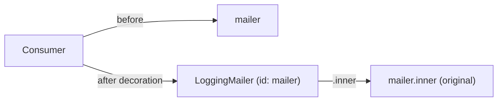

# Service Decoration

!!! abstract "Learning objectives"
    By the end of this chapter you can:

    - [ ] Decorate a service with `decorates` and reference the original via
          `.inner`.
    - [ ] Control the chain with `decoration_priority` and
          `decoration_on_invalid`.
    - [ ] Decorate with attributes using `#[AsDecorator]` and `#[AutowireDecorated]`.

    **Syllabus:** `Dependency Injection → Service Decoration` ·
    **Level:** Advanced / Expert ·
    **Est. time:** 30 min ·
    **Prerequisites:** [Service Registration](registration.md)

---

## Theory

**Decoration** wraps an existing service in a new one that implements the same
interface, adding behaviour (logging, caching, validation) without touching the
original. It is the DI-container implementation of the Decorator pattern: the
decorator replaces the service id, and receives the original as a dependency.

Unlike a [compiler pass](compiler-passes.md) that rewrites definitions, decoration
is declarative — you say "this service decorates that id" and the container
rewires everyone who depended on the original to now get the decorator.

## Deep Dive — how it works internally

### What the compiler does

At compile time, `Symfony\Component\DependencyInjection\Compiler\DecoratorServicePass`
processes every definition with a `decorates` target. It:

1. Renames the original service id to an inner id
   (`decorator_id.inner`), keeping the real implementation.
2. Makes the **decorator** take over the **public id** of the decorated service.
3. Rewrites the decorator's `.inner` argument to a `Reference` to the renamed
   original.

So all existing consumers transparently receive the decorator; the decorator
holds the original behind `.inner`.



### Chaining and priority

Multiple decorators on the same id form a **chain**. `decoration_priority`
(default `0`) orders them: **higher priority wraps the inner-most**, i.e. runs
closer to the original; the highest number is the outermost only when… careful:
higher priority = applied first = **innermost**. The service actually resolved by
consumers is the last (outermost) decorator. Know the exact rule: higher
`decoration_priority` is **closer to the original** (inner), lower is outer.

### Missing decorated service

`decoration_on_invalid` controls behaviour when the decorated id does not exist:
`exception` (default), `ignore` (drop the decorator), or `null` (inject `null` as
`.inner`). Use `ignore`/`null` for optional decoration of services that may be
absent.

!!! note "Source reference"
    `Symfony\Component\DependencyInjection\Compiler\DecoratorServicePass` —
    [symfony/symfony `8.0`](https://github.com/symfony/symfony/blob/8.0/src/Symfony/Component/DependencyInjection/Compiler/DecoratorServicePass.php).

## Configuration & code

=== "PHP Attributes"

    ```php
    <?php
    declare(strict_types=1);

    namespace App\Mail;

    use Psr\Log\LoggerInterface;
    use Symfony\Component\DependencyInjection\Attribute\AsDecorator;
    use Symfony\Component\DependencyInjection\Attribute\AutowireDecorated;
    use Symfony\Component\Mailer\MailerInterface;
    use Symfony\Component\Mime\RawMessage;
    use Symfony\Component\Mailer\Envelope;

    #[AsDecorator(decorates: MailerInterface::class)]
    final class LoggingMailer implements MailerInterface
    {
        public function __construct(
            #[AutowireDecorated]                  // injects the .inner service
            private readonly MailerInterface $inner,
            private readonly LoggerInterface $logger,
        ) {}

        public function send(RawMessage $message, ?Envelope $envelope = null): void
        {
            $this->logger->info('Sending email');
            $this->inner->send($message, $envelope);
        }
    }
    ```

=== "YAML"

    ```yaml
    # config/services.yaml
    services:
        App\Mail\LoggingMailer:
            decorates: 'Symfony\Component\Mailer\MailerInterface'
            decoration_priority: 10
            decoration_on_invalid: exception
            arguments:
                $inner: '@.inner'   # the original, renamed service
                $logger: '@logger'
    ```

=== "Console"

    ```console
    $ php bin/console debug:container --show-private mailer
    ```

## Best practices & anti-patterns

| ✅ Do | ❌ Avoid |
|---|---|
| Implement the same interface | Changing the public contract |
| Inject `.inner` / `#[AutowireDecorated]` | Re-fetching the service by id |
| Use priority for deterministic chains | Relying on definition order |
| Delegate to `.inner` for untouched paths | Reimplementing the original |

## When (not) to use it / alternatives

Decorate when you want to add cross-cutting behaviour around an existing service
transparently. Prefer decoration over a compiler pass for this case — it is
declarative and safer. If you need to *choose between* implementations rather than
wrap, use an [alias](registration.md) or [factory](factories.md). If you need to
run *many* handlers, use [tags](tags.md) instead.

!!! danger "Certification traps"
    - `.inner` is the special reference to the **original** (renamed) service.
    - The decorator **takes over the decorated id**; consumers are unaware.
    - Higher `decoration_priority` = applied first = **closer to the original**
      (innermost).
    - `#[AutowireDecorated]` injects `.inner`; without it the arg is not the inner
      service.
    - `decoration_on_invalid: null` injects `null`, not a no-op wrapper.

!!! warning "Common mistakes"
    - Forgetting to implement the decorated interface — autowiring/type errors.
    - Injecting the service by its own id inside the decorator → infinite recursion.
    - Assuming lower priority runs first.

## Exercises

1. **(Advanced)** Decorate `MailerInterface` to add logging, delegating to the
   original.
2. **(Expert)** Two decorators target the same id; you need the caching one to sit
   directly around the original and logging on the outside. Set priorities.

??? success "Solutions"

    **1.** See the attribute example above: `#[AsDecorator(MailerInterface::class)]`
    plus `#[AutowireDecorated]` for the inner service, then delegate in `send()`.

    **2.** Give the caching decorator the **higher** `decoration_priority` (e.g.
    `20`) so it is applied first (innermost), and logging the **lower** (e.g. `10`)
    so it wraps caching on the outside — consumers hit logging first, then caching,
    then the original.

## Certification questions

??? question "Q1. In a decorator, what is `@.inner`?"
    - [ ] A. The decorator itself
    - [x] B. A reference to the original (decorated) service ✅
    - [ ] C. The parent bundle
    - [ ] D. A private alias to `service_container`

    **Why:** The compiler renames the decorated service and exposes it as `.inner`.
    **Ref:** [Decorating services](https://symfony.com/doc/current/service_container/service_decoration.html).

??? question "Q2. Which attribute injects the decorated (inner) service?"
    - [ ] A. `#[Autowire('.inner')]` only
    - [x] B. `#[AutowireDecorated]` ✅
    - [ ] C. `#[Inner]`
    - [ ] D. `#[AsDecorator]`

    **Why:** `#[AutowireDecorated]` resolves to the `.inner` reference for the
    parameter. **Ref:** [Service decoration](https://symfony.com/doc/current/service_container/service_decoration.html).

??? question "Q3. With two decorators, higher `decoration_priority` means…"
    - [x] A. Applied first, sits closer to the original (innermost) ✅
    - [ ] B. Applied last, outermost
    - [ ] C. It is ignored
    - [ ] D. It becomes public

    **Why:** Higher priority decorators are applied first and end up innermost;
    consumers see the lowest-priority (outermost) one. **Ref:** [Decoration priority](https://symfony.com/doc/current/service_container/service_decoration.html#decoration-priority).

??? question "Q4. `decoration_on_invalid: ignore` does what if the target is missing?"
    - [x] A. Removes the decorator, leaving nothing ✅
    - [ ] B. Injects `null`
    - [ ] C. Throws an exception
    - [ ] D. Creates an empty service

    **Why:** `ignore` drops the decorator; `null` would inject `null`; `exception`
    (default) throws. **Ref:** [Service decoration](https://symfony.com/doc/current/service_container/service_decoration.html).

## Key takeaways

- Decoration wraps a service transparently; the decorator takes over the id.
- `.inner` / `#[AutowireDecorated]` gives you the original.
- `decoration_priority`: higher = innermost (applied first).
- `decoration_on_invalid`: `exception` | `ignore` | `null`.

## Last-minute revision

!!! tip "Cheat sheet"
    - YAML: `decorates:`, `arguments: { $x: '@.inner' }`, `decoration_priority`,
      `decoration_on_invalid`.
    - Attrs: `#[AsDecorator(decorates: X::class)]` + `#[AutowireDecorated]`.
    - `DecoratorServicePass` renames original → `.inner`, decorator → public id.
    - Higher priority = innermost.

## References

- [Official Symfony docs — Service Decoration](https://symfony.com/doc/current/service_container/service_decoration.html)
- [Symfony source — DecoratorServicePass](https://github.com/symfony/symfony/blob/8.0/src/Symfony/Component/DependencyInjection/Compiler/DecoratorServicePass.php)

---

<small>Related: [Registration](registration.md) · [Factories](factories.md) ·
[Compiler Passes](compiler-passes.md)</small>
