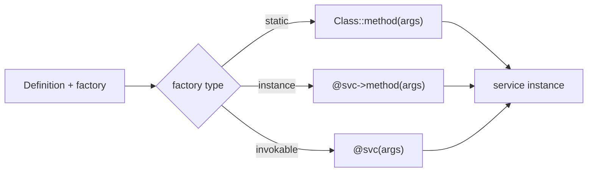

# Factories

!!! tip "In a nutshell"
    Une factory construit un service que le container ne peut pas simplement
    instancier avec `new` — une méthode statique, la méthode d'un autre service, ou
    un objet invokable — et le container stocke sa valeur de retour. Fait le plus
    rentable : les `arguments:` vont à la **méthode de la factory** (pas à un
    constructeur), et il n'existe **pas d'attribut `#[Factory]`** (utilisez
    `#[Autowire(factory:)]`).

!!! example "Real-world analogy"
    Une factory est un plat que la cuisine ne peut pas simplement prendre sur
    l'étagère — il est préparé à la commande par un spécialiste (une méthode
    statique, un autre service, ou un invokable) qui l'assemble à partir
    d'ingrédients frais et rend l'assiette terminée. Le container conserve
    l'assiette que le spécialiste retourne ; les `arguments:` sont le bon de
    commande du spécialiste, pas les ingrédients bruts d'un constructeur.

!!! abstract "Learning objectives"
    À la fin de ce chapitre, vous saurez :

    - [ ] Construire un service avec une factory **statique**, **d'instance** ou
          **invokable**.
    - [ ] Passer des arguments à une méthode de factory.
    - [ ] Utiliser une factory par **expression** et l'approche par attribut sans
          `#[AsDecorator]` (`#[Autowire(factory: ...)]`).

    **Syllabus:** `Dependency Injection → Factories` ·
    **Level:** Advanced / Expert ·
    **Est. time:** 30 min ·
    **Prerequisites:** [Service Registration](registration.md)

---

## Theory

Parfois, un service ne peut pas être créé en instanciant simplement la classe avec
`new` : il provient d'une **factory** — une méthode statique, la méthode d'un autre
service, ou un objet invokable qui retourne l'instance configurée. Le container
appelle la factory et stocke sa valeur de retour comme service. C'est courant pour
les clients tiers, les objets construits à partir d'une connexion, ou les classes
avec un constructeur privé.

!!! question "Predict first"
    Un service est construit par une factory et vous définissez
    `arguments: ['EUR']`. Ces arguments vont-ils au constructeur de la classe ou
    ailleurs — et existe-t-il un attribut `#[Factory]` ?

??? note "Reveal"
    Ils vont à la **méthode de la factory**, pas au constructeur. Il n'existe
    **pas** d'attribut `#[Factory]` — configurez les factories via
    `#[Autowire(factory: [...])]` ou la config YAML/PHP.

## Deep Dive — how it works internally

### The `factory` on a Definition

Une `Symfony\Component\DependencyInjection\Definition` peut porter une `factory`.
Au moment du build, le compiler enregistre *comment* obtenir l'instance ; le
container dumpé appelle alors la factory au lieu de `new`. Formes de factory :

| Forme | Valeur de la Definition | Appelée comme |
|---|---|---|
| Méthode statique | `[Foo::class, 'create']` | `Foo::create(...)` |
| Méthode d'instance | `['@factory_service', 'make']` | `$factory->make(...)` |
| Service invokable | `'@factory_service'` | `$factory(...)` |
| Forme courte « named constructor » | `'Foo::create'` (chaîne YAML) | `Foo::create(...)` |

Les `arguments` de la definition sont passés à la méthode de la factory (pas au
constructeur).

```php
use Symfony\Component\DependencyInjection\Definition;
use Symfony\Component\DependencyInjection\Reference;

// The Definition carries the factory; the dumped container calls it instead of `new`
$def = new Definition(App\Payment\Gateway::class);

$def->setFactory([App\Payment\Gateway::class, 'fromDsn']);                // static: Gateway::fromDsn(...)
$def->setFactory([new Reference('App\Payment\GatewayFactory'), 'create']); // instance: $factory->create(...)
$def->setFactory(new Reference('App\Payment\GatewayFactory'));             // invokable: $factory(...)

// arguments go to the factory method, NOT to the constructor
$def->setArguments(['EUR']);
```



### Expression factories

Pour une logique dynamique, le composant ExpressionLanguage permet à une factory
d'être une expression via `expression:` en YAML, évaluée au build/runtime avec des
variables connues (`service('id')`, `parameter('x')`). À utiliser avec parcimonie —
c'est plus difficile à déboguer que du PHP classique.

### Attributes

Sur un paramètre de constructeur, vous pouvez demander une valeur produite par une
factory avec `#[Autowire(factory: [ClientFactory::class, 'create'])]`, ou faire
pointer un service entier vers une factory avec l'attribut de service
`#[Autowire]`. Il n'existe **pas d'attribut `#[Factory]` dédié** — les factories se
configurent via `#[Autowire(factory:)]` ou la config YAML/PHP. (À ne pas confondre
avec `#[AsAlias]`, qui crée un alias, pas une construction.)

!!! note "Source reference"
    La gestion des factories vit dans `Definition::setFactory()` et est dumpée par
    `PhpDumper` —
    [symfony/symfony `8.0`](https://github.com/symfony/symfony/blob/8.0/src/Symfony/Component/DependencyInjection/Definition.php).

### Null behavior

Le container stocke **ce que la factory retourne**, quoi que ce soit. Si une
factory peut légitimement retourner `null` — par exemple un client optionnel
construit seulement quand un DSN est configuré — l'argument consommateur doit être
typé nullable (`?Gateway $gateway`) et les appelants doivent se protéger avec
`?->` / `??`. Une factory qui retourne `null` *par accident* (une branche oubliée,
une résolution manquée) est un bug pénible : il apparaît plus tard, là où le
« service » est utilisé, sous la forme d'un `TypeError` ou d'un appel de méthode
sur null, plutôt qu'au moment du build. Les factories pilotées par des variables
d'environnement en sont la source classique — `#[Autowire(env: 'GATEWAY_DSN')]`
produit une chaîne vide quand la variable n'est pas définie, donc testez-la
explicitement plutôt que de supposer une valeur. Gardez les types de retour des
factories explicites (`: Gateway` vs `: ?Gateway`) pour que l'intention soit
appliquée.

!!! note "Null in real life"
    Un plat à la commande qui revient en assiette vide (la factory retourne null)
    n'est pas intercepté au passe — le convive le découvre plus tard ; déclarez
    donc d'emblée si « pas de plat » est un résultat autorisé.

## Configuration & code

=== "PHP Attributes"

    ```php
    <?php
    declare(strict_types=1);

    namespace App\Payment;

    use Symfony\Component\DependencyInjection\Attribute\Autowire;

    final class GatewayFactory
    {
        public function __construct(
            #[Autowire(env: 'GATEWAY_DSN')]
            private readonly string $dsn,
        ) {}

        public function create(string $currency): Gateway
        {
            return new Gateway($this->dsn, $currency);
        }
    }

    final class Checkout
    {
        public function __construct(
            // Value produced by an instance-method factory call.
            #[Autowire(factory: [GatewayFactory::class, 'create'])]
            private readonly Gateway $gateway,
        ) {}
    }
    ```

=== "YAML"

    ```yaml
    # config/services.yaml
    services:
        App\Payment\GatewayFactory: ~

        # Instance-method factory with arguments.
        App\Payment\Gateway:
            factory: ['@App\Payment\GatewayFactory', 'create']
            arguments: ['EUR']

        # Static factory (short string form).
        App\Payment\Ledger:
            factory: 'App\Payment\Ledger::open'
            arguments: ['%kernel.project_dir%/var/ledger']
    ```

=== "Console"

    ```console
    $ php bin/console debug:container --show-arguments App\\Payment\\Gateway
    ```

## Best practices & anti-patterns

| ✅ Do | ❌ Avoid |
|---|---|
| Une factory pour une construction non triviale | Une factory quand `new` + autowiring suffit |
| Passer les arguments via `arguments:` | Coder la config en dur dans la factory |
| Une factory statique pour les constructeurs privés | Exposer le constructeur brut |
| Du PHP simple plutôt que des expressions | Une logique `expression:` complexe |

## When (not) to use it / alternatives

Utilisez une factory quand la construction exige des décisions à l'exécution, des
ressources externes, ou un « named constructor ». Si l'objet peut être autowiré
directement, passez-vous de la factory. Pour choisir entre plusieurs
implémentations, préférez un [alias](registration.md) ; pour envelopper un
service, utilisez la [décoration](decoration.md).

!!! danger "Certification traps"
    - Les `arguments:` d'un service construit par une factory sont passés à la
      **méthode de la factory**, pas à un constructeur.
    - Il n'existe **pas d'attribut `#[Factory]`** ; utilisez
      `#[Autowire(factory:)]` ou la config.
    - Une factory d'instance utilise `['@service', 'method']` ; une factory
      statique utilise `[Class::class, 'method']` ou la chaîne `'Class::method'`.
    - Une factory invokable est simplement `'@service'` (c'est `__invoke` qui est
      appelé).

!!! warning "Common mistakes"
    - Écrire `factory: '@svc::method'` (invalide) au lieu de `['@svc', 'method']`.
    - S'attendre à ce que les arguments du constructeur de la factory soient ceux
      du service.
    - Recourir aux expression factories quand une petite factory PHP est plus
      claire.

## Exercises

1. **(Advanced)** Configurez `Gateway` pour qu'il soit construit par
   `GatewayFactory::create('EUR')`, la factory étant un service.
2. **(Expert)** Une classe `Ledger` a un constructeur privé et une méthode
   statique `open(string $path)`. Enregistrez-la.

??? success "Solutions"

    **1.**
    ```yaml
    services:
        App\Payment\Gateway:
            factory: ['@App\Payment\GatewayFactory', 'create']
            arguments: ['EUR']
    ```

    **2.**
    ```yaml
    services:
        App\Payment\Ledger:
            factory: 'App\Payment\Ledger::open'
            arguments: ['%kernel.project_dir%/var/ledger']
    ```
    La factory statique contourne le constructeur privé.

## Certification questions

??? question "Q1. Where do a factory-built service's `arguments` go?"
    - [ ] A. To its constructor
    - [x] B. To the factory method ✅
    - [ ] C. To `__invoke` only
    - [ ] D. They are ignored

    **Why:** Avec une factory, le container appelle la factory et lui passe les
    `arguments`. **Ref:** [Factories](https://symfony.com/doc/current/service_container/factories.html).

??? question "Q2. Which attribute configures a factory-produced value?"
    - [ ] A. `#[Factory]`
    - [x] B. `#[Autowire(factory: [...])]` ✅
    - [ ] C. `#[AsFactory]`
    - [ ] D. `#[AsAlias]`

    **Why:** Il n'existe pas d'attribut `#[Factory]` ; c'est
    `#[Autowire(factory:)]` qui est utilisé.
    **Ref:** [Autowire attribute](https://symfony.com/doc/current/service_container/autowiring.html).

??? question "Q3. How do you reference an **instance-method** factory in YAML?"
    - [x] A. `factory: ['@service_id', 'method']` ✅
    - [ ] B. `factory: '@service_id::method'`
    - [ ] C. `factory: 'service_id.method'`
    - [ ] D. `factory: @service_id`

    **Why:** Un tableau `[référence, méthode]` désigne une méthode sur un service.
    **Ref:** [Factories](https://symfony.com/doc/current/service_container/factories.html).

## Key takeaways

- Les factories construisent des services que le container ne peut pas instancier
  directement avec `new`.
- Statique `[Class, 'm']`, instance `['@svc', 'm']`, invokable `'@svc'`.
- Les `arguments:` alimentent la méthode de la factory.
- Pas d'attribut `#[Factory]` — utilisez `#[Autowire(factory:)]` ou la config.

## Last-minute revision

!!! tip "Cheat sheet"
    - Statique : `factory: 'Class::method'`. Instance : `['@svc', 'method']`.
      Invokable : `factory: '@svc'`.
    - Arguments → méthode de la factory, pas le constructeur.
    - Attribut : `#[Autowire(factory: [F::class, 'create'])]`.

## Connections

- **Dépend de :** [Service Registration](registration.md) — une factory est un
  indicateur sur la `Definition` du service.
- **Réutilisé dans :** [Messenger](../miscellaneous/messenger.md),
  [Miscellaneous — Cache](../miscellaneous/cache.md) — les transports et les pools
  sont souvent construits par des factories.
- **À ne pas confondre avec :** [Decoration](decoration.md) — une factory
  *construit* un service ; un décorateur *enveloppe* un service existant.

## Official References
- [Official Symfony docs — Using a Factory](https://symfony.com/doc/current/service_container/factories.html)
- [Symfony source — Definition](https://github.com/symfony/symfony/blob/8.0/src/Symfony/Component/DependencyInjection/Definition.php)

## Video references

!!! tip "Watch & learn"
    Voici des chaînes vidéo officielles, mises à jour en continu — cherchez-y
    "dependency injection" pour consolider ce chapitre. Nous référençons des
    chaînes stables plutôt que des vidéos individuelles afin que les références ne
    périment jamais.

    - [SymfonyCasts screencasts](https://symfonycasts.com/tracks/symfony) — tutoriels scénarisés à suivre en codant.
    - [Symfony official YouTube](https://www.youtube.com/@SymfonyOfficial) — conférences et keynotes SymfonyCon.
    - [Official docs for this topic](https://symfony.com/doc/current/service_container/factories.html) — certaines pages de la doc Symfony intègrent un screencast.

## Confidence check

Je suis prêt quand je peux :

- [ ] expliquer **pourquoi** certains services ont besoin d'une factory au lieu de `new`
- [ ] configurer des factories statiques, d'instance et invokables en Symfony 8
- [ ] déboguer une factory qui retourne `null` dans un argument non nullable
- [ ] repérer que les `arguments:` alimentent la méthode de la factory et qu'il n'y a pas de `#[Factory]`
- [ ] expliquer comment `Definition::setFactory()` change ce que le container dumpé appelle

---

<small>Related: [Registration](registration.md) · [Decoration](decoration.md) ·
[Autowiring](autowiring.md)</small>
