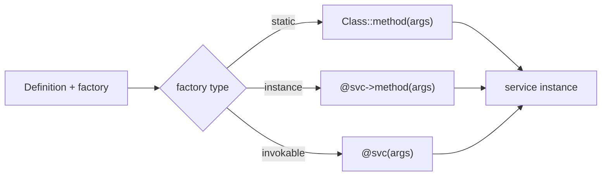

# Factories

!!! tip "In a nutshell"
    A factory builds a service the container cannot just `new` — a static method,
    another service's method, or an invokable object — and the container stores its
    return value. Highest-yield fact: `arguments:` go to the **factory method**
    (not a constructor), and there is **no `#[Factory]` attribute** (use
    `#[Autowire(factory:)]`).

!!! example "Real-world analogy"
    A factory is a dish the kitchen can't just grab off the shelf — it's made to
    order by a specialist (a static method, another service, or an invokable) who
    assembles it from live inputs and hands back the finished plate. The container
    keeps the plate the specialist returns; the `arguments:` are the specialist's
    order ticket, not the raw ingredients of a constructor.

!!! abstract "Learning objectives"
    By the end of this chapter you can:

    - [ ] Build a service with a **static**, **instance**, or **invokable**
          factory.
    - [ ] Pass arguments to a factory method.
    - [ ] Use an **expression** factory and the `#[AsDecorator]`-free attribute
          approach (`#[Autowire(factory: ...)]`).

    **Syllabus:** `Dependency Injection → Factories` ·
    **Level:** Advanced / Expert ·
    **Est. time:** 30 min ·
    **Prerequisites:** [Service Registration](registration.md)

---

## Theory

Sometimes a service cannot be created by simply `new`-ing the class: it comes from
a **factory** — a static method, another service's method, or an invokable object
that returns the configured instance. The container calls the factory and stores
its return value as the service. This is common for third-party clients, objects
built from a connection, or classes with private constructors.

!!! question "Predict first"
    A service is built by a factory and you set `arguments: ['EUR']`. Do those go to
    the class constructor or somewhere else — and is there a `#[Factory]` attribute?

??? note "Reveal"
    They go to the **factory method**, not the constructor. There is **no**
    `#[Factory]` attribute — configure factories via `#[Autowire(factory: [...])]`
    or YAML/PHP config.

## Deep Dive — how it works internally

### The `factory` on a Definition

A `Symfony\Component\DependencyInjection\Definition` can carry a `factory`. At
build time the compiler records *how* to obtain the instance; the dumped container
then calls the factory instead of `new`. Forms of factory:

| Form | Definition value | Called as |
|---|---|---|
| Static method | `[Foo::class, 'create']` | `Foo::create(...)` |
| Instance method | `['@factory_service', 'make']` | `$factory->make(...)` |
| Invokable service | `'@factory_service'` | `$factory(...)` |
| Named-constructor short form | `'Foo::create'` (YAML string) | `Foo::create(...)` |

`arguments` on the definition are passed to the factory method (not the
constructor).

```php
use Symfony\Component\DependencyInjection\Definition;
use Symfony\Component\DependencyInjection\Reference;

// The Definition carries the factory; the dumped container calls it instead of `new`
$def = new Definition(App\Payment\Gateway::class);

$def->setFactory([App\Payment\Gateway::class, 'fromDsn']);                // static: Gateway::fromDsn(...)
$def->setFactory([new Reference('App\Payment\GatewayFactory'), 'create']); // instance: $factory->create(...)
$def->setFactory(new Reference('App\Payment\GatewayFactory'));             // invokable: $factory(...)

// arguments go to the factory method, NOT to the constructor
$def->setArguments(['EUR']);
```



### Expression factories

For dynamic logic the ExpressionLanguage component lets a factory be an
expression via `expression:` in YAML, evaluated at build/runtime against known
variables (`service('id')`, `parameter('x')`). Use sparingly — it is harder to
debug than plain PHP.

```yaml
services:
    # Expression factory: service('id') fetches a service, parameter('x') a parameter
    App\Payment\Gateway:
        factory: '@=service("App\\Payment\\GatewayFactory").create(parameter("app.currency"))'
```

### Attributes

On a constructor parameter you can request a value produced by a factory with
`#[Autowire(factory: [ClientFactory::class, 'create'])]`, or point a whole service
at a factory with the `#[Autowire]` service attribute. There is **no dedicated
`#[Factory]` attribute** — factories are configured via `#[Autowire(factory:)]` or
YAML/PHP config. (Do not confuse with `#[AsAlias]`, which aliases, not builds.)

```php
use Symfony\Component\DependencyInjection\Attribute\Autowire;

final class Checkout
{
    public function __construct(
        // There is NO #[Factory] attribute — use #[Autowire(factory: ...)]
        #[Autowire(factory: [ClientFactory::class, 'create'])]
        private readonly Client $client,
    ) {}
}

// #[AsAlias] only makes a class the alias of an existing id — it builds nothing
```

!!! note "Source reference"
    Factory handling lives in `Definition::setFactory()` and is dumped by
    `PhpDumper` —
    [symfony/symfony `8.0`](https://github.com/symfony/symfony/blob/8.0/src/Symfony/Component/DependencyInjection/Definition.php).

### Null behavior

The container stores **whatever the factory returns**. If a factory can
legitimately return `null` — e.g. an optional client built only when a DSN is
configured — the consuming argument must be typed nullable (`?Gateway $gateway`) and
callers must guard with `?->` / `??`. A factory that *accidentally* returns `null`
(a missed branch, an unresolved lookup) is a nasty bug: it surfaces later, wherever
the "service" is used, as a `TypeError` or a null-method call rather than at build
time. Env-driven factories are the classic source — `#[Autowire(env: 'GATEWAY_DSN')]`
yields an empty string when unset, so branch on it explicitly rather than assuming a
value. Keep factory return types explicit (`: Gateway` vs `: ?Gateway`) so the
intent is enforced.

```php
final class GatewayFactory
{
    public function __construct(
        #[Autowire(env: 'GATEWAY_DSN')] private readonly string $dsn, // '' when unset
    ) {}

    // Explicit return type — `: ?Gateway` (not `: Gateway`) says null is allowed
    public function create(): ?Gateway
    {
        return $this->dsn !== '' ? new Gateway($this->dsn) : null;
    }
}

// Consumer side: nullable type + guarded calls
public function __construct(private readonly ?Gateway $gateway) {}

$receipt = $this->gateway?->charge($amount) ?? Receipt::skipped(); // ?-> and ?? guards
```

!!! note "Null in real life"
    A made-to-order dish that comes back an empty plate (factory returns null) isn't
    caught at the pass — the diner discovers it later, so declare up front whether
    "no dish" is an allowed outcome.

## Configuration & code

=== "PHP Attributes"

    ```php
    <?php
    declare(strict_types=1);

    namespace App\Payment;

    use Symfony\Component\DependencyInjection\Attribute\Autowire;

    final class GatewayFactory
    {
        public function __construct(
            #[Autowire(env: 'GATEWAY_DSN')]
            private readonly string $dsn,
        ) {}

        public function create(string $currency): Gateway
        {
            return new Gateway($this->dsn, $currency);
        }
    }

    final class Checkout
    {
        public function __construct(
            // Value produced by an instance-method factory call.
            #[Autowire(factory: [GatewayFactory::class, 'create'])]
            private readonly Gateway $gateway,
        ) {}
    }
    ```

=== "YAML"

    ```yaml
    # config/services.yaml
    services:
        App\Payment\GatewayFactory: ~

        # Instance-method factory with arguments.
        App\Payment\Gateway:
            factory: ['@App\Payment\GatewayFactory', 'create']
            arguments: ['EUR']

        # Static factory (short string form).
        App\Payment\Ledger:
            factory: 'App\Payment\Ledger::open'
            arguments: ['%kernel.project_dir%/var/ledger']
    ```

=== "Console"

    ```console
    $ php bin/console debug:container --show-arguments App\\Payment\\Gateway
    ```

## Best practices & anti-patterns

| ✅ Do | ❌ Avoid |
|---|---|
| Factory for non-trivial construction | Factory when `new` + autowire works |
| Pass args via `arguments:` | Hard-coding config inside the factory |
| Static factory for private ctors | Exposing the raw constructor |
| Plain PHP over expressions | Complex `expression:` logic |

## When (not) to use it / alternatives

Use a factory when construction needs runtime decisions, external resources, or a
named constructor. If the object can be autowired directly, skip the factory. For
choosing between implementations, prefer an [alias](registration.md); for wrapping
a service, use [decoration](decoration.md).

!!! danger "Certification traps"
    - `arguments:` on a factory-built service are passed to the **factory method**,
      not a constructor.
    - There is **no `#[Factory]` attribute**; use `#[Autowire(factory:)]` or config.
    - Instance factory uses `['@service', 'method']`; static uses
      `[Class::class, 'method']` or the `'Class::method'` string.
    - An invokable factory is just `'@service'` (the `__invoke` is called).

!!! warning "Common mistakes"
    - Writing `factory: '@svc::method'` (invalid) instead of `['@svc', 'method']`.
    - Expecting the factory's own constructor args to be the service's args.
    - Reaching for expression factories when a small PHP factory is clearer.

## Exercises

1. **(Advanced)** Configure `Gateway` to be built by `GatewayFactory::create('EUR')`
   where the factory is a service.
2. **(Expert)** A class `Ledger` has a private constructor and a static
   `open(string $path)`. Register it.

??? success "Solutions"

    **1.**
    ```yaml
    services:
        App\Payment\Gateway:
            factory: ['@App\Payment\GatewayFactory', 'create']
            arguments: ['EUR']
    ```

    **2.**
    ```yaml
    services:
        App\Payment\Ledger:
            factory: 'App\Payment\Ledger::open'
            arguments: ['%kernel.project_dir%/var/ledger']
    ```
    The static factory bypasses the private constructor.

## Certification questions

??? question "Q1. Where do a factory-built service's `arguments` go?"
    - [ ] A. To its constructor
    - [x] B. To the factory method ✅
    - [ ] C. To `__invoke` only
    - [ ] D. They are ignored

    **Why:** With a factory the container calls the factory and passes `arguments`
    to it. **Ref:** [Factories](https://symfony.com/doc/current/service_container/factories.html).

??? question "Q2. Which attribute configures a factory-produced value?"
    - [ ] A. `#[Factory]`
    - [x] B. `#[Autowire(factory: [...])]` ✅
    - [ ] C. `#[AsFactory]`
    - [ ] D. `#[AsAlias]`

    **Why:** There is no `#[Factory]` attribute; `#[Autowire(factory:)]` is used.
    **Ref:** [Autowire attribute](https://symfony.com/doc/current/service_container/autowiring.html).

??? question "Q3. How do you reference an **instance-method** factory in YAML?"
    - [x] A. `factory: ['@service_id', 'method']` ✅
    - [ ] B. `factory: '@service_id::method'`
    - [ ] C. `factory: 'service_id.method'`
    - [ ] D. `factory: @service_id`

    **Why:** An array of `[reference, method]` denotes a method on a service.
    **Ref:** [Factories](https://symfony.com/doc/current/service_container/factories.html).

## Key takeaways

- Factories build services the container cannot `new` directly.
- Static `[Class, 'm']`, instance `['@svc', 'm']`, invokable `'@svc'`.
- `arguments:` feed the factory method.
- No `#[Factory]` attribute — use `#[Autowire(factory:)]` or config.

## Last-minute revision

!!! tip "Cheat sheet"
    - Static: `factory: 'Class::method'`. Instance: `['@svc', 'method']`.
      Invokable: `factory: '@svc'`.
    - Args → factory method, not constructor.
    - Attribute: `#[Autowire(factory: [F::class, 'create'])]`.

## Connections

- **Depends on:** [Service Registration](registration.md) — a factory is a flag on
  the service `Definition`.
- **Reused in:** [Messenger](../messenger/index.md),
  [Miscellaneous — Cache](../miscellaneous/cache.md) — transports and pools are
  often built by factories.
- **Confused with:** [Decoration](decoration.md) — a factory *builds* a service; a
  decorator *wraps* an existing one.

## Official References
- [Official Symfony docs — Using a Factory](https://symfony.com/doc/current/service_container/factories.html)
- [Symfony source — Definition](https://github.com/symfony/symfony/blob/8.0/src/Symfony/Component/DependencyInjection/Definition.php)

## Video references

!!! tip "Watch & learn"
    These are official, continuously-updated video channels — search them for
    "dependency injection" to reinforce this chapter. We link stable channels rather than
    individual videos so the references never rot.

    - [SymfonyCasts screencasts](https://symfonycasts.com/tracks/symfony) — scripted, code-along tutorials.
    - [Symfony official YouTube](https://www.youtube.com/@SymfonyOfficial) — SymfonyCon conference talks & keynotes.
    - [Official docs for this topic](https://symfony.com/doc/current/service_container/factories.html) — some Symfony doc pages embed a screencast.

## Confidence check

I'm ready when I can:

- [ ] explain **why** some services need a factory instead of `new`
- [ ] configure static, instance and invokable factories in Symfony 8
- [ ] debug a factory that returns `null` into a non-nullable argument
- [ ] spot that `arguments:` feed the factory method and there is no `#[Factory]`
- [ ] explain how `Definition::setFactory()` changes what the dumped container calls

---

<small>Related: [Registration](registration.md) · [Decoration](decoration.md) ·
[Autowiring](autowiring.md)</small>
