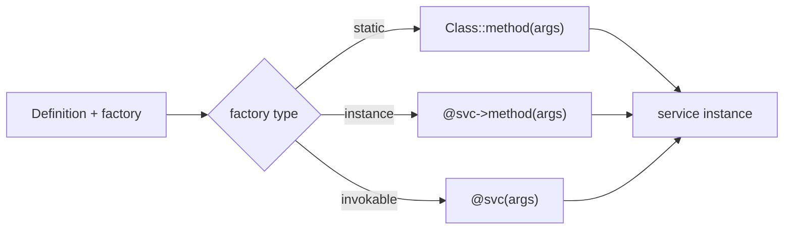

# Factories

!!! abstract "Learning objectives"
    By the end of this chapter you can:

    - [ ] Build a service with a **static**, **instance**, or **invokable**
          factory.
    - [ ] Pass arguments to a factory method.
    - [ ] Use an **expression** factory and the `#[AsDecorator]`-free attribute
          approach (`#[Autowire(factory: ...)]`).

    **Syllabus:** `Dependency Injection → Factories` ·
    **Level:** Advanced / Expert ·
    **Est. time:** 30 min ·
    **Prerequisites:** [Service Registration](registration.md)

---

## Theory

Sometimes a service cannot be created by simply `new`-ing the class: it comes from
a **factory** — a static method, another service's method, or an invokable object
that returns the configured instance. The container calls the factory and stores
its return value as the service. This is common for third-party clients, objects
built from a connection, or classes with private constructors.

## Deep Dive — how it works internally

### The `factory` on a Definition

A `Symfony\Component\DependencyInjection\Definition` can carry a `factory`. At
build time the compiler records *how* to obtain the instance; the dumped container
then calls the factory instead of `new`. Forms of factory:

| Form | Definition value | Called as |
|---|---|---|
| Static method | `[Foo::class, 'create']` | `Foo::create(...)` |
| Instance method | `['@factory_service', 'make']` | `$factory->make(...)` |
| Invokable service | `'@factory_service'` | `$factory(...)` |
| Named-constructor short form | `'Foo::create'` (YAML string) | `Foo::create(...)` |

`arguments` on the definition are passed to the factory method (not the
constructor).



### Expression factories

For dynamic logic the ExpressionLanguage component lets a factory be an
expression via `expression:` in YAML, evaluated at build/runtime against known
variables (`service('id')`, `parameter('x')`). Use sparingly — it is harder to
debug than plain PHP.

### Attributes

On a constructor parameter you can request a value produced by a factory with
`#[Autowire(factory: [ClientFactory::class, 'create'])]`, or point a whole service
at a factory with the `#[Autowire]` service attribute. There is **no dedicated
`#[Factory]` attribute** — factories are configured via `#[Autowire(factory:)]` or
YAML/PHP config. (Do not confuse with `#[AsAlias]`, which aliases, not builds.)

!!! note "Source reference"
    Factory handling lives in `Definition::setFactory()` and is dumped by
    `PhpDumper` —
    [symfony/symfony `8.0`](https://github.com/symfony/symfony/blob/8.0/src/Symfony/Component/DependencyInjection/Definition.php).

## Configuration & code

=== "PHP Attributes"

    ```php
    <?php
    declare(strict_types=1);

    namespace App\Payment;

    use Symfony\Component\DependencyInjection\Attribute\Autowire;

    final class GatewayFactory
    {
        public function __construct(
            #[Autowire(env: 'GATEWAY_DSN')]
            private readonly string $dsn,
        ) {}

        public function create(string $currency): Gateway
        {
            return new Gateway($this->dsn, $currency);
        }
    }

    final class Checkout
    {
        public function __construct(
            // Value produced by an instance-method factory call.
            #[Autowire(factory: [GatewayFactory::class, 'create'])]
            private readonly Gateway $gateway,
        ) {}
    }
    ```

=== "YAML"

    ```yaml
    # config/services.yaml
    services:
        App\Payment\GatewayFactory: ~

        # Instance-method factory with arguments.
        App\Payment\Gateway:
            factory: ['@App\Payment\GatewayFactory', 'create']
            arguments: ['EUR']

        # Static factory (short string form).
        App\Payment\Ledger:
            factory: 'App\Payment\Ledger::open'
            arguments: ['%kernel.project_dir%/var/ledger']
    ```

=== "Console"

    ```console
    $ php bin/console debug:container --show-arguments App\\Payment\\Gateway
    ```

## Best practices & anti-patterns

| ✅ Do | ❌ Avoid |
|---|---|
| Factory for non-trivial construction | Factory when `new` + autowire works |
| Pass args via `arguments:` | Hard-coding config inside the factory |
| Static factory for private ctors | Exposing the raw constructor |
| Plain PHP over expressions | Complex `expression:` logic |

## When (not) to use it / alternatives

Use a factory when construction needs runtime decisions, external resources, or a
named constructor. If the object can be autowired directly, skip the factory. For
choosing between implementations, prefer an [alias](registration.md); for wrapping
a service, use [decoration](decoration.md).

!!! danger "Certification traps"
    - `arguments:` on a factory-built service are passed to the **factory method**,
      not a constructor.
    - There is **no `#[Factory]` attribute**; use `#[Autowire(factory:)]` or config.
    - Instance factory uses `['@service', 'method']`; static uses
      `[Class::class, 'method']` or the `'Class::method'` string.
    - An invokable factory is just `'@service'` (the `__invoke` is called).

!!! warning "Common mistakes"
    - Writing `factory: '@svc::method'` (invalid) instead of `['@svc', 'method']`.
    - Expecting the factory's own constructor args to be the service's args.
    - Reaching for expression factories when a small PHP factory is clearer.

## Exercises

1. **(Advanced)** Configure `Gateway` to be built by `GatewayFactory::create('EUR')`
   where the factory is a service.
2. **(Expert)** A class `Ledger` has a private constructor and a static
   `open(string $path)`. Register it.

??? success "Solutions"

    **1.**
    ```yaml
    services:
        App\Payment\Gateway:
            factory: ['@App\Payment\GatewayFactory', 'create']
            arguments: ['EUR']
    ```

    **2.**
    ```yaml
    services:
        App\Payment\Ledger:
            factory: 'App\Payment\Ledger::open'
            arguments: ['%kernel.project_dir%/var/ledger']
    ```
    The static factory bypasses the private constructor.

## Certification questions

??? question "Q1. Where do a factory-built service's `arguments` go?"
    - [ ] A. To its constructor
    - [x] B. To the factory method ✅
    - [ ] C. To `__invoke` only
    - [ ] D. They are ignored

    **Why:** With a factory the container calls the factory and passes `arguments`
    to it. **Ref:** [Factories](https://symfony.com/doc/current/service_container/factories.html).

??? question "Q2. Which attribute configures a factory-produced value?"
    - [ ] A. `#[Factory]`
    - [x] B. `#[Autowire(factory: [...])]` ✅
    - [ ] C. `#[AsFactory]`
    - [ ] D. `#[AsAlias]`

    **Why:** There is no `#[Factory]` attribute; `#[Autowire(factory:)]` is used.
    **Ref:** [Autowire attribute](https://symfony.com/doc/current/service_container/autowiring.html).

??? question "Q3. How do you reference an **instance-method** factory in YAML?"
    - [x] A. `factory: ['@service_id', 'method']` ✅
    - [ ] B. `factory: '@service_id::method'`
    - [ ] C. `factory: 'service_id.method'`
    - [ ] D. `factory: @service_id`

    **Why:** An array of `[reference, method]` denotes a method on a service.
    **Ref:** [Factories](https://symfony.com/doc/current/service_container/factories.html).

## Key takeaways

- Factories build services the container cannot `new` directly.
- Static `[Class, 'm']`, instance `['@svc', 'm']`, invokable `'@svc'`.
- `arguments:` feed the factory method.
- No `#[Factory]` attribute — use `#[Autowire(factory:)]` or config.

## Last-minute revision

!!! tip "Cheat sheet"
    - Static: `factory: 'Class::method'`. Instance: `['@svc', 'method']`.
      Invokable: `factory: '@svc'`.
    - Args → factory method, not constructor.
    - Attribute: `#[Autowire(factory: [F::class, 'create'])]`.

## Official References
- [Official Symfony docs — Using a Factory](https://symfony.com/doc/current/service_container/factories.html)
- [Symfony source — Definition](https://github.com/symfony/symfony/blob/8.0/src/Symfony/Component/DependencyInjection/Definition.php)

---

<small>Related: [Registration](registration.md) · [Decoration](decoration.md) ·
[Autowiring](autowiring.md)</small>
