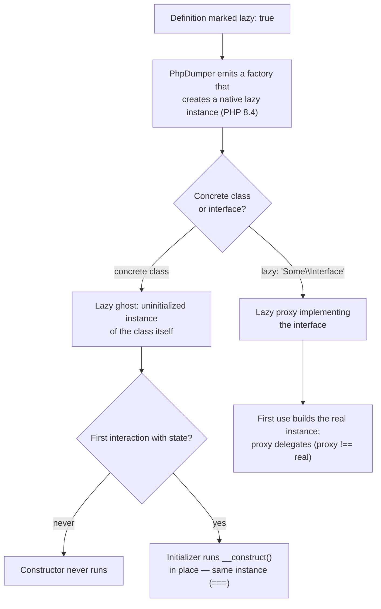

# Lazy Services & Native Lazy Objects

!!! tip "In a nutshell"
    Marquez un service `lazy: true` et le container injecte un **substitut non
    initialisé** dont le vrai constructeur ne s'exécute qu'à la première
    utilisation. Symfony 8 tourne sur PHP 8.4, dont le moteur fournit des
    **native lazy objects** : pour les classes concrètes, le container compilé
    crée un **lazy ghost** (même instance, initialisée sur place), tandis que
    `lazy: 'Some\Interface'` produit un **lazy proxy** (un objet distinct qui
    délègue à l'instance réelle). Plus de
    `friendsofphp/proxy-manager` ni de génération de `LazyGhostTrait`.

!!! example "Real-world analogy"
    Un service lazy, c'est un *poste sous-vide en attente* dans un restaurant :
    le ticket (l'objet) est déjà sur le passe et tout le monde peut le montrer
    du doigt, mais la cuisson coûteuse (le constructeur — connexion DB,
    warm-up, parsing de fichier) ne démarre qu'au moment où un serveur prend
    réellement l'assiette (premier accès à une propriété ou une méthode). Si la
    table annule (la dépendance n'est jamais utilisée), aucune énergie n'a été
    dépensée. Un ghost est la *même assiette* terminée à la dernière seconde ;
    un proxy est un *commis* qui va chercher pour vous une assiette cuisinée à
    part.

!!! abstract "Learning objectives"
    À la fin de ce chapitre, vous saurez :

    - [ ] Déclarer la laziness de trois façons : `lazy: true` (YAML),
          `#[Autoconfigure(lazy: true)]` (attribut) et `->lazy()` (config PHP).
    - [ ] Expliquer les lazy **ghosts** natifs de PHP 8.4 face aux lazy
          **proxies**, et lequel le container compilé de Symfony génère pour
          une définition donnée.
    - [ ] Prédire la sémantique d'identité (`===`), les déclencheurs
          d'initialisation et les cas limites `final` / `readonly`.

    **Syllabus:** `Dependency Injection → Lazy Services` ·
    **Level:** Expert ·
    **Est. time:** 20 min ·
    **Prerequisites:** [Services Registration](registration.md)

---

## Theory

Par défaut, le container instancie un service — et tout son graphe de
dépendances de constructeur — de manière **eager**, dès que quelque chose le
demande. C'est du gaspillage dans deux situations classiques :

1. **Constructeur coûteux** : le service ouvre une connexion, parse un gros
   fichier ou réchauffe un cache dans `__construct()`.
2. **Dépendance rarement utilisée** : un service est *toujours injecté*
   (disons, dans un controller ou un handler construit à chaque request) mais
   n'est *utilisé* que sur un chemin de code rare (un bouton d'export, une
   branche réservée à l'admin).

Marquer la définition **lazy** découple l'*injection* de l'*initialisation* :
les consommateurs reçoivent immédiatement un objet du bon type, mais le vrai
constructeur ne s'exécute qu'à la **première utilisation**. Si le chemin de
code n'est jamais emprunté, le coût n'est jamais payé.

Symfony a toujours supporté cela ; ce qui a changé, c'est le *comment*.
Historiquement, la laziness exigeait de générer des classes proxy basées sur
l'héritage avec le package externe `friendsofphp/proxy-manager`, remplacé
ensuite par la génération de code `LazyGhostTrait`/`LazyProxyTrait` de
`symfony/var-exporter`. Symfony 8 requiert **PHP 8.4**, dont le moteur
supporte les
[native lazy objects](https://www.php.net/manual/en/language.oop5.lazy-objects.php)
— le container compilé émet donc désormais de simples instances lazy au niveau
du moteur, sans aucune classe proxy générée pour les services concrets.

## Deep Dive — how it works internally

### Ghost vs proxy — the two native strategies

PHP 8.4 expose deux stratégies de lazy objects via la réflexion
(`ReflectionClass::newLazyGhost()` et `ReflectionClass::newLazyProxy()`) :

| Stratégie | Ce que vous obtenez | Identité | Usage par Symfony |
|---|---|---|---|
| **Lazy ghost** | Une instance de la classe elle-même, créée **non initialisée** ; l'initializer exécute le vrai constructeur *sur place* à la première utilisation | Le ghost **est** l'objet final (`===` est vérifié) | Par défaut pour une classe concrète marquée `lazy: true` |
| **Lazy proxy** | Un objet distinct qui, à la première utilisation, crée la **vraie instance** et lui délègue tout | Proxy `!==` instance encapsulée | Utilisé quand la définition a besoin d'un type *interface* (`lazy: 'Some\Interface'`) ou quand l'initialisation sur place est impossible |

Parce que les ghosts sont créés à partir de la classe elle-même (pas de
sous-classement), **les classes `final` peuvent être lazy** — le piège
classique « les classes final ne peuvent pas être lazy-proxiées » concernait
les anciens proxies basés sur l'héritage, pas les ghosts natifs. La laziness
d'interface génère toujours une petite classe proxy implémentant cette
interface, si bien que les consommateurs qui type-hintent l'interface restent
découplés de la classe concrète. Le moteur conserve certaines restrictions —
notamment autour des classes `readonly` et de la plupart des classes internes
(niveau C), qui ne peuvent pas être rendues lazy en PHP 8.4 — voir le
[manuel PHP](https://www.php.net/manual/en/language.oop5.lazy-objects.php)
pour les règles exactes.



!!! question "Predict first"
    Un service `lazy: true` est injecté dans trois consommateurs, et plus tard
    l'un d'eux finit par appeler une méthode dessus. Combien d'instances
    existent ensuite, et l'objet détenu par chaque consommateur est-il `===` à
    celui qui a été initialisé ?

??? note "Reveal"
    Une seule instance (le service reste **shared**). Avec un **ghost**,
    l'objet non initialisé remis aux trois consommateurs *est* l'objet qui se
    fait initialiser sur place — `===` est vérifié partout. Ce n'est qu'avec un
    **proxy d'interface** que les consommateurs détiendraient un proxy `!==` la
    vraie instance encapsulée à laquelle il délègue.

### What triggers initialization?

Pour un ghost, essentiellement **toute interaction avec l'état de l'objet** —
lire ou écrire une propriété, appeler une méthode qui touche l'état, cloner,
sérialiser — déclenche l'initializer. Les opérations purement basées sur
l'identité (comme comparer avec `===` ou récupérer le nom de la classe) ne le
font pas. Quand la sémantique exacte des déclencheurs compte, consultez le
[manuel PHP sur les lazy objects](https://www.php.net/manual/en/language.oop5.lazy-objects.php)
plutôt que de deviner : c'est le moteur qui définit la liste précise.

!!! note "Source reference"
    Les factories lazy du container compilé sont émises par
    `Symfony\Component\DependencyInjection\Dumper\PhpDumper` —
    [symfony/symfony `8.0`](https://github.com/symfony/symfony/blob/8.0/src/Symfony/Component/DependencyInjection/Dumper/PhpDumper.php).

## Configuration & code

=== "YAML"

    ```yaml
    # config/services.yaml
    services:
        App\Report\HeavyReportGenerator:
            lazy: true

        # Interface laziness: generates a proxy implementing the interface.
        App\Search\ElasticIndexer:
            lazy: 'App\Search\IndexerInterface'
    ```

=== "PHP Attributes"

    ```php
    <?php
    declare(strict_types=1);

    namespace App\Report;

    use Symfony\Component\DependencyInjection\Attribute\Autoconfigure;

    #[Autoconfigure(lazy: true)]
    final class HeavyReportGenerator
    {
        private array $warmData;

        public function __construct()
        {
            // Imagine expensive warm-up here (parsing, connections…).
            $this->warmData = ['warmed' => true];
        }

        public function generate(): string
        {
            return json_encode($this->warmData, JSON_THROW_ON_ERROR);
        }
    }
    ```

=== "PHP config (services.php)"

    ```php
    <?php
    declare(strict_types=1);

    use App\Report\HeavyReportGenerator;
    use Symfony\Component\DependencyInjection\Loader\Configurator\ContainerConfigurator;

    return static function (ContainerConfigurator $container): void {
        $services = $container->services();

        $services->set(HeavyReportGenerator::class)
            ->lazy();
    };
    ```

## Best practices & anti-patterns

| ✅ Do | ❌ Avoid |
|---|---|
| Réserver `lazy` aux constructeurs coûteux ou aux dépendances rarement utilisées | Tout marquer lazy « pour la performance » (l'indirection a un coût) |
| D'abord garder les constructeurs légers ; la laziness est le plan B | Utiliser la laziness pour cacher un travail lourd qui devrait vivre dans une méthode dédiée |
| Utiliser `lazy: 'Some\Interface'` quand les consommateurs type-hintent l'interface | Supposer qu'un proxy d'interface est `===` l'instance réelle |
| Vérifier dans le manuel PHP les limites `readonly`/classes internes | S'attendre à ce que *toute* classe puisse être lazy |

## When (not) to use it / alternatives

Utilisez la laziness quand la *construction* est le problème. Si le problème
est « je n'ai besoin que d'un service parmi plusieurs par request », un
[service locator](service-locators.md) (lui-même lazy par conception) est le
meilleur outil. Si le travail lourd a lieu dans une *méthode* plutôt que dans
le constructeur, la laziness n'apporte rien — refactorisez plutôt. Et
souvenez-vous que le container est déjà lazy au niveau supérieur : les
services ne sont construits qu'à la première demande, donc `lazy` ne compte
que pour les services *injectés* de manière eager dans quelque chose qui est
lui-même instancié.

!!! danger "Certification traps"
    - `lazy: true` sur une classe concrète produit un **native lazy ghost**
      sous PHP 8.4 — même instance, initialisée sur place, `===` préservé.
    - `lazy: 'Some\Interface'` produit un **lazy proxy** — un objet
      *différent* de l'instance réelle à laquelle il délègue.
    - **Les classes `final` peuvent être lazy** avec les ghosts natifs
      (l'ancienne règle « final casse les proxies » appartenait aux proxies
      basés sur l'héritage de proxy-manager).
    - Symfony 8 n'a **pas** besoin de `friendsofphp/proxy-manager` ni du
      `LazyGhostTrait` de var-exporter pour la laziness du container — le
      moteur PHP 8.4 le fait nativement.
    - Un service lazy reste **shared** ; la laziness change le *moment* où le
      constructeur s'exécute, pas le *nombre* d'instances.

!!! warning "Common mistakes"
    - S'attendre à ce que les effets de bord du constructeur d'un service lazy
      (logging, enregistrement) se produisent au moment de l'injection — ils
      s'exécutent à la première utilisation.
    - Marquer une classe `readonly` lazy sans vérifier les restrictions de
      PHP 8.4 sur les lazy objects.
    - Comparer un proxy d'interface à l'instance encapsulée avec `===` et se
      demander pourquoi ça échoue.

## Exercises

1. **(Expert)** `ReportController` est construit à chaque request et reçoit
   `HeavyReportGenerator`, dont le constructeur prend 300 ms — mais seule la
   route `/report/export` l'appelle. Faites disparaître ce coût pour toutes
   les autres routes en YAML, puis avec l'équivalent en attribut.
2. **(Expert)** Un consommateur type-hinte `IndexerInterface`, et le
   `ElasticIndexer` concret est `final` avec un constructeur coûteux. Quelle
   variante de laziness le container utilise-t-il si vous écrivez
   `lazy: true` vs `lazy: 'App\Search\IndexerInterface'`, et à quelle
   différence d'identité vos tests doivent-ils s'attendre ?

??? success "Solutions"

    **1.** Ajoutez `lazy: true` sous le service `App\Report\HeavyReportGenerator`
    dans `services.yaml`, ou placez `#[Autoconfigure(lazy: true)]` sur la
    classe (voir les onglets ci-dessus). Le controller reçoit désormais un
    ghost non initialisé ; le constructeur de 300 ms ne s'exécute que dans
    `/report/export`, au premier appel de méthode.

    **2.** `lazy: true` donne un lazy **ghost** natif de `ElasticIndexer`
    (autorisé même si la classe est `final`) : l'objet injecté *est* la vraie
    instance, `===` est vérifié. `lazy: 'App\Search\IndexerInterface'` donne un
    lazy **proxy** implémentant l'interface : le proxy est un objet distinct,
    donc `$proxy === $realInstance` vaut `false` — les assertions sur
    l'identité des objets doivent comparer le comportement, pas les instances.

## Certification questions

??? question "Q1. What does the container inject for a `lazy: true` concrete service in Symfony 8?"
    - [x] A. A native PHP 8.4 lazy ghost — the same instance, initialized on first use ✅
    - [ ] B. A subclass generated by friendsofphp/proxy-manager
    - [ ] C. `null` until the service is first requested
    - [ ] D. A `ServiceLocator` wrapping the service

    **Why:** Symfony 8 cible PHP 8.4 et utilise les lazy objects natifs du
    moteur ; les classes concrètes deviennent des lazy ghosts initialisés sur
    place.
    **Ref:** [Lazy services](https://symfony.com/doc/current/service_container/lazy_services.html).

??? question "Q2. `lazy: 'App\PaymentInterface'` on a service definition means…"
    - [x] A. The container builds a lazy proxy implementing that interface, delegating to the real instance ✅
    - [ ] B. The service becomes an alias of the interface
    - [ ] C. The interface is registered as a second service
    - [ ] D. Autowiring is disabled for that service

    **Why:** Donner à `lazy` un nom d'interface demande un lazy proxy typé sur
    l'interface au lieu d'un ghost de la classe concrète.
    **Ref:** [Lazy services](https://symfony.com/doc/current/service_container/lazy_services.html).

??? question "Q3. Which statement about identity is correct?"
    - [x] A. Ghost: `===` the initialized object; interface proxy: `!==` the wrapped real instance ✅
    - [ ] B. Both ghost and proxy are `===` the real instance
    - [ ] C. Both ghost and proxy are `!==` the real instance
    - [ ] D. Identity is undefined until initialization

    **Why:** Un ghost est initialisé sur place (un seul objet) ; un proxy
    délègue à une instance réelle distincte.
    **Ref:** [PHP lazy objects](https://www.php.net/manual/en/language.oop5.lazy-objects.php).

??? question "Q4. When does a lazy ghost's real constructor run?"
    - [ ] A. When the container is compiled
    - [ ] B. When the ghost is injected into a consumer
    - [x] C. On first interaction with the object's state (property/method access) ✅
    - [ ] D. Never — lazy services skip their constructor

    **Why:** L'injection distribue le ghost non initialisé ; le moteur
    déclenche l'initializer au premier accès à l'état.
    **Ref:** [PHP lazy objects](https://www.php.net/manual/en/language.oop5.lazy-objects.php).

## Key takeaways

- `lazy: true` / `#[Autoconfigure(lazy: true)]` / `->lazy()` reportent le
  constructeur à la première utilisation — l'injection reste immédiate.
- Les native lazy objects de PHP 8.4 propulsent Symfony 8 : **ghosts** pour
  les classes concrètes (init sur place, identité préservée), **proxies** pour
  la laziness d'interface.
- Plus de proxy-manager, plus de génération de `LazyGhostTrait` ; les classes
  `final` fonctionnent très bien avec les ghosts.
- La laziness corrige les *constructeurs* coûteux, pas les *méthodes*
  coûteuses.

## Last-minute revision

!!! tip "Cheat sheet"
    - YAML : `lazy: true` · attribut : `#[Autoconfigure(lazy: true)]` ·
      PHP : `->lazy()`.
    - Proxy d'interface : `lazy: 'Some\Interface'`.
    - Ghost = même instance (`===`), init sur place ; proxy = délégué distinct
      (`!==`).
    - Déclencheur : premier accès à l'état. Sémantique shared inchangée.
    - Restrictions PHP 8.4 : classes `readonly` / la plupart des classes
      internes — consultez le manuel.

## Connections

- **Depends on:** [Services Registration](registration.md) — `lazy` est un
  drapeau de définition comme `public`/`shared` ;
  [The Service Container](container.md) — le container compilé émet les
  factories lazy.
- **Reused in:** [Service Locators](service-locators.md) — l'autre outil
  « ne le construis pas avant d'en avoir besoin » ;
  [Inside the Compiled Container](container-dump.md) — là où vit le code des
  factories lazy dumpées.
- **Confused with:** [Factories](factories.md) — une factory personnalise
  *comment* un service est construit ; `lazy` personnalise *quand*.

## Official References

- [Official Symfony docs — Lazy Services](https://symfony.com/doc/current/service_container/lazy_services.html)
- [PHP manual — Lazy objects](https://www.php.net/manual/en/language.oop5.lazy-objects.php)
- [Symfony source — PhpDumper](https://github.com/symfony/symfony/blob/8.0/src/Symfony/Component/DependencyInjection/Dumper/PhpDumper.php)

## Video references

!!! tip "Watch & learn"
    Ce sont des chaînes vidéo officielles, mises à jour en continu — cherchez-y
    "dependency injection" pour consolider ce chapitre. Nous lions des chaînes
    stables plutôt que des vidéos individuelles pour que les références ne
    périment jamais.

    - [SymfonyCasts screencasts](https://symfonycasts.com/tracks/symfony) — tutoriels scénarisés à suivre en codant.
    - [Symfony official YouTube](https://www.youtube.com/@SymfonyOfficial) — conférences et keynotes SymfonyCon.
    - [Official docs for this topic](https://symfony.com/doc/current/service_container/lazy_services.html) — certaines pages de la doc Symfony intègrent un screencast.

## Confidence check

Je suis prêt quand je peux :

- [ ] expliquer **pourquoi** la laziness existe (constructeur coûteux,
      dépendance rarement utilisée)
- [ ] écrire `lazy: true` sous les formes YAML, attribut et config PHP
- [ ] opposer les lazy ghosts natifs et les lazy proxies, identité comprise
- [ ] énoncer ce qui déclenche l'initialisation et ce que le drapeau shared
      signifie toujours
- [ ] repérer les pièges `final`/`readonly`/proxy-manager dans les questions
      d'examen

---

<small>Related: [Services Registration](registration.md) ·
[The Service Container](container.md) ·
[Inside the Compiled Container](container-dump.md)</small>
