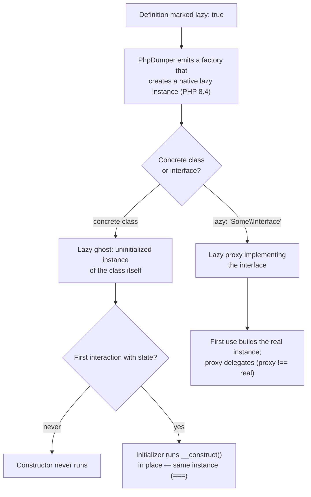

# Lazy Services & Native Lazy Objects

!!! tip "In a nutshell"
    Mark a service `lazy: true` and the container injects an **uninitialized
    stand-in** whose real constructor only runs on first use. Symfony 8 runs on
    PHP 8.4, whose engine provides **native lazy objects**: for concrete classes
    the compiled container creates a **lazy ghost** (same instance, initialized
    in place), while `lazy: 'Some\Interface'` produces a **lazy proxy** (a
    separate object delegating to the real instance). No
    `friendsofphp/proxy-manager` and no `LazyGhostTrait` generation anymore.

!!! example "Real-world analogy"
    A lazy service is a restaurant *sous-vide station on standby*: the ticket
    (the object) is already on the pass and everyone can point at it, but the
    expensive cooking (the constructor — DB connection, warm-up, file parsing)
    only starts the moment a waiter actually picks the plate up (first property
    or method access). If the table cancels (the dependency is never used), no
    energy was spent. A ghost is the *same plate* finished at the last second; a
    proxy is a *runner* who fetches a separately cooked plate for you.

!!! abstract "Learning objectives"
    By the end of this chapter you can:

    - [ ] Declare laziness three ways: `lazy: true` (YAML),
          `#[Autoconfigure(lazy: true)]` (attribute) and `->lazy()` (PHP config).
    - [ ] Explain PHP 8.4 native lazy **ghosts** vs lazy **proxies** and which
          one Symfony's compiled container generates for a given definition.
    - [ ] Predict identity semantics (`===`), initialization triggers, and the
          `final` / `readonly` edge cases.

    **Syllabus:** `Dependency Injection → Lazy Services` ·
    **Level:** Expert ·
    **Est. time:** 20 min ·
    **Prerequisites:** [Services Registration](registration.md)
    **Examen Symfony 8 :** OUI
---

## Pour les nuls

### L'idée en une phrase
Un service paresseux est livré comme une "coquille vide" — le vrai travail de construction (connexion base de données, lecture de fichier) n'a lieu qu'à la première utilisation réelle.

### Imagine dans la vraie vie
Un service paresseux est une station sous-vide en veille dans un restaurant : le ticket (l'objet) est déjà sur le pass et tout le monde peut le pointer du doigt, mais la cuisson coûteuse (le constructeur) ne démarre que lorsqu'un serveur récupère réellement l'assiette (premier accès).

### Dans Symfony
Un service de connexion à une API tierce marqué `lazy: true` ne se connecte réellement que si le code appelle une de ses méthodes — s'il n'est jamais utilisé sur une requête donnée, aucune connexion n'est ouverte pour rien.

### Exemple simple
```php
#[Autoconfigure(lazy: true)]
class ConnexionExterne { public function __construct() { /* coûteux */ } }
```

### Comment le mémoriser 🧠
Pour une classe concrète, PHP 8.4 crée un **ghost** (même instance, initialisée sur place) ; pour une interface, un **proxy** (objet séparé qui délègue) — deux mécanismes différents selon ce que tu déclares paresseux.

---

## Theory

By default the container instantiates a service — and its whole constructor
dependency graph — **eagerly**, the moment something asks for it. That is
wasteful in two classic situations:

1. **Expensive constructor**: the service opens a connection, parses a big
   file, or warms a cache in `__construct()`.
2. **Rarely-used dependency**: a service is *always injected* (say, into a
   controller or a handler built on every request) but only *used* on a rare
   code path (an export button, an admin-only branch).

Marking the definition **lazy** decouples *injection* from *initialization*:
consumers receive an object of the right type immediately, but the real
constructor runs only on **first use**. If the code path is never taken, the
cost is never paid.

Symfony has always supported this; what changed is *how*. Historically laziness
required generating inheritance-based proxy classes with the external
`friendsofphp/proxy-manager` package, later replaced by
`symfony/var-exporter`'s `LazyGhostTrait`/`LazyProxyTrait` code generation.
Symfony 8 requires **PHP 8.4**, whose engine supports
[native lazy objects](https://www.php.net/manual/en/language.oop5.lazy-objects.php)
— so the compiled container now emits plain engine-level lazy instances with no
generated proxy class for concrete services at all.

```yaml
# Symfony 8 / PHP 8.4 — laziness needs NO extra package:
#   friendsofphp/proxy-manager: not required anymore
#   symfony/var-exporter LazyGhostTrait / LazyProxyTrait generation: not used either
services:
    App\Report\HeavyReportGenerator:
        lazy: true   # the compiled container emits a native PHP 8.4 lazy object
```

## Deep Dive — how it works internally

### Ghost vs proxy — the two native strategies

PHP 8.4 exposes two lazy-object strategies through reflection
(`ReflectionClass::newLazyGhost()` and `ReflectionClass::newLazyProxy()`):

| Strategy | What you get | Identity | Symfony usage |
|---|---|---|---|
| **Lazy ghost** | An instance of the class itself, created **uninitialized**; the initializer runs the real constructor *in place* on first use | The ghost **is** the final object (`===` holds) | Default for a concrete class marked `lazy: true` |
| **Lazy proxy** | A separate object that, on first use, creates the **real instance** and forwards everything to it | Proxy `!==` wrapped instance | Used when the definition needs an *interface* type (`lazy: 'Some\Interface'`) or in-place init is impossible |

Because ghosts are created from the class itself (no subclassing), **`final`
classes can be lazy** — the classic "final classes cannot be lazy-proxied" trap
applied to the old inheritance-based proxies, not to native ghosts. Interface
laziness still generates a small proxy class implementing that interface, so
consumers type-hinting the interface stay decoupled from the concrete class.
The engine keeps some restrictions — notably around `readonly` classes and
most internal (C-level) classes, which cannot be made lazy in PHP 8.4 — see
the [PHP manual](https://www.php.net/manual/en/language.oop5.lazy-objects.php)
for the exact rules.

```php
$reflector = new \ReflectionClass(HeavyReportGenerator::class);

// ReflectionClass::newLazyGhost(): uninitialized instance of the class itself —
// works even if the class is `final` (no subclassing involved)
$ghost = $reflector->newLazyGhost(fn (HeavyReportGenerator $r) => $r->__construct());

// ReflectionClass::newLazyProxy(): separate delegating object — the strategy
// behind `lazy: 'Some\Interface'` definitions
$proxy = $reflector->newLazyProxy(fn () => new HeavyReportGenerator());

// PHP 8.4 restrictions: `readonly` classes and most internal classes cannot be lazy
```



!!! question "Predict first"
    A `lazy: true` service is injected into three consumers, and later one of
    them finally calls a method on it. How many instances exist afterwards, and
    is the object each consumer holds `===` the initialized one?

??? note "Reveal"
    One instance (the service is still **shared**). With a **ghost**, the
    uninitialized object handed to all three consumers *is* the object that
    gets initialized in place — `===` holds everywhere. Only with an
    **interface proxy** would consumers hold a proxy that is `!==` the real
    wrapped instance it delegates to.

### What triggers initialization?

For a ghost, essentially **any interaction with the object's state** —
reading or writing a property, calling a method that touches state, cloning,
serializing — triggers the initializer. Purely identity-based operations
(such as comparing with `===` or fetching the class name) do not. When exact
trigger semantics matter, check the
[PHP manual on lazy objects](https://www.php.net/manual/en/language.oop5.lazy-objects.php)
rather than guessing: the engine defines the precise list.

!!! note "Source reference"
    The compiled container's lazy factories are emitted by
    `Symfony\Component\DependencyInjection\Dumper\PhpDumper` —
    [symfony/symfony `8.0`](https://github.com/symfony/symfony/blob/8.0/src/Symfony/Component/DependencyInjection/Dumper/PhpDumper.php).

## Configuration & code

=== "YAML"

    ```yaml
    # config/services.yaml
    services:
        App\Report\HeavyReportGenerator:
            lazy: true

        # Interface laziness: generates a proxy implementing the interface.
        App\Search\ElasticIndexer:
            lazy: 'App\Search\IndexerInterface'
    ```

=== "PHP Attributes"

    ```php
    <?php
    declare(strict_types=1);

    namespace App\Report;

    use Symfony\Component\DependencyInjection\Attribute\Autoconfigure;

    #[Autoconfigure(lazy: true)]
    final class HeavyReportGenerator
    {
        private array $warmData;

        public function __construct()
        {
            // Imagine expensive warm-up here (parsing, connections…).
            $this->warmData = ['warmed' => true];
        }

        public function generate(): string
        {
            return json_encode($this->warmData, JSON_THROW_ON_ERROR);
        }
    }
    ```

=== "PHP config (services.php)"

    ```php
    <?php
    declare(strict_types=1);

    use App\Report\HeavyReportGenerator;
    use Symfony\Component\DependencyInjection\Loader\Configurator\ContainerConfigurator;

    return static function (ContainerConfigurator $container): void {
        $services = $container->services();

        $services->set(HeavyReportGenerator::class)
            ->lazy();
    };
    ```

## Best practices & anti-patterns

| ✅ Do | ❌ Avoid |
|---|---|
| Reserve `lazy` for expensive constructors or rarely-used deps | Marking everything lazy "for performance" (indirection has a cost) |
| Keep constructors cheap first; laziness is the fallback | Using laziness to hide heavy work that belongs in a dedicated method |
| Use `lazy: 'Some\Interface'` when consumers type-hint the interface | Assuming an interface proxy is `===` the real instance |
| Check the PHP manual for `readonly`/internal-class limits | Expecting *every* class to be lazy-capable |

## When (not) to use it / alternatives

Use laziness when the *construction* is the problem. If the problem is "I only
need one of many services per request", a
[service locator](service-locators.md) (itself lazy by design) is the better
tool. If the heavy work happens in a *method* rather than the constructor,
laziness buys nothing — refactor instead. And remember the container is
already lazy at the top level: services are only built when first requested,
so `lazy` only matters for services that get *injected* eagerly into
something that is itself instantiated.

!!! danger "Certification traps"
    - `lazy: true` on a concrete class produces a **native lazy ghost** on
      PHP 8.4 — same instance, initialized in place, `===` preserved.
    - `lazy: 'Some\Interface'` produces a **lazy proxy** — a *different* object
      from the real instance it delegates to.
    - **`final` classes can be lazy** with native ghosts (the old
      "final breaks proxies" rule belonged to inheritance-based proxy-manager
      proxies).
    - Symfony 8 does **not** need `friendsofphp/proxy-manager` or
      var-exporter's `LazyGhostTrait` for container laziness — the PHP 8.4
      engine does it natively.
    - A lazy service is still **shared**; laziness changes *when* the
      constructor runs, not *how many* instances exist.

!!! warning "Common mistakes"
    - Expecting a lazy service's constructor side effects (logging,
      registration) to happen at injection time — they run on first use.
    - Marking a `readonly` class lazy without checking the PHP 8.4
      restrictions on lazy objects.
    - Comparing an interface proxy to the wrapped instance with `===` and
      wondering why it fails.

## Exercises

1. **(Expert)** `ReportController` is built on every request and receives
   `HeavyReportGenerator`, whose constructor takes 300 ms — but only the
   `/report/export` route calls it. Make the cost disappear for every other
   route using YAML, then the attribute equivalent.
2. **(Expert)** A consumer type-hints `IndexerInterface`, and the concrete
   `ElasticIndexer` is `final` with an expensive constructor. Which lazy
   flavour does the container use if you write `lazy: true` vs
   `lazy: 'App\Search\IndexerInterface'`, and what identity difference must
   your tests expect?

??? success "Solutions"

    **1.** Add `lazy: true` under the `App\Report\HeavyReportGenerator` service
    in `services.yaml`, or put `#[Autoconfigure(lazy: true)]` on the class (see
    the tabs above). The controller now receives an uninitialized ghost; the
    300 ms constructor runs only inside `/report/export`, on first method call.

    **2.** `lazy: true` gives a native lazy **ghost** of `ElasticIndexer`
    (allowed even though the class is `final`): the injected object *is* the
    real instance, `===` holds. `lazy: 'App\Search\IndexerInterface'` gives a
    lazy **proxy** implementing the interface: the proxy is a distinct object,
    so `$proxy === $realInstance` is `false` — assertions on object identity
    must compare behaviour, not instances.

## Certification questions

*Question d'entraînement inspirée du syllabus — jamais une question officielle de l'examen.*

??? question "Q1. What does the container inject for a `lazy: true` concrete service in Symfony 8?"
    - [x] A. A native PHP 8.4 lazy ghost — the same instance, initialized on first use ✅
    - [ ] B. A subclass generated by friendsofphp/proxy-manager
    - [ ] C. `null` until the service is first requested
    - [ ] D. A `ServiceLocator` wrapping the service

    **Why:** Symfony 8 targets PHP 8.4 and uses the engine's native lazy
    objects; concrete classes become lazy ghosts initialized in place.
    **Ref:** [Lazy services](https://symfony.com/doc/8.0/service_container/lazy_services.html).

??? question "Q2. `lazy: 'App\PaymentInterface'` on a service definition means…"
    - [x] A. The container builds a lazy proxy implementing that interface, delegating to the real instance ✅
    - [ ] B. The service becomes an alias of the interface
    - [ ] C. The interface is registered as a second service
    - [ ] D. Autowiring is disabled for that service

    **Why:** Setting `lazy` to an interface name requests an interface-typed
    lazy proxy instead of a ghost of the concrete class.
    **Ref:** [Lazy services](https://symfony.com/doc/8.0/service_container/lazy_services.html).

??? question "Q3. Which statement about identity is correct?"
    - [x] A. Ghost: `===` the initialized object; interface proxy: `!==` the wrapped real instance ✅
    - [ ] B. Both ghost and proxy are `===` the real instance
    - [ ] C. Both ghost and proxy are `!==` the real instance
    - [ ] D. Identity is undefined until initialization

    **Why:** A ghost is initialized in place (one object); a proxy delegates
    to a separate real instance.
    **Ref:** [PHP lazy objects](https://www.php.net/manual/en/language.oop5.lazy-objects.php).

??? question "Q4. When does a lazy ghost's real constructor run?"
    - [ ] A. When the container is compiled
    - [ ] B. When the ghost is injected into a consumer
    - [x] C. On first interaction with the object's state (property/method access) ✅
    - [ ] D. Never — lazy services skip their constructor

    **Why:** Injection hands out the uninitialized ghost; the engine triggers
    the initializer on first state access.
    **Ref:** [PHP lazy objects](https://www.php.net/manual/en/language.oop5.lazy-objects.php).

## Key takeaways

- `lazy: true` / `#[Autoconfigure(lazy: true)]` / `->lazy()` defer the
  constructor to first use — injection stays immediate.
- PHP 8.4 native lazy objects power Symfony 8: **ghosts** for concrete classes
  (in-place init, identity preserved), **proxies** for interface laziness.
- No proxy-manager, no `LazyGhostTrait` generation anymore; `final` classes
  are fine with ghosts.
- Laziness fixes expensive *constructors*, not expensive *methods*.

## Last-minute revision

!!! tip "Cheat sheet"
    - YAML: `lazy: true` · attribute: `#[Autoconfigure(lazy: true)]` ·
      PHP: `->lazy()`.
    - Interface proxy: `lazy: 'Some\Interface'`.
    - Ghost = same instance (`===`), init in place; proxy = separate delegate
      (`!==`).
    - Trigger: first state access. Shared semantics unchanged.
    - PHP 8.4 restrictions: `readonly` classes / most internal classes —
      check the manual.

## Connections

- **Depends on:** [Services Registration](registration.md) — `lazy` is a
  definition flag like `public`/`shared`; [The Service Container](container.md)
  — the compiled container emits the lazy factories.
- **Reused in:** [Service Locators](service-locators.md) — the other
  "don't build it until needed" tool;
  [Inside the Compiled Container](container-dump.md) — where the dumped lazy
  factory code lives.
- **Confused with:** [Factories](factories.md) — a factory customizes *how* a
  service is built; `lazy` customizes *when*.

## Official References

- [Official Symfony docs — Lazy Services](https://symfony.com/doc/8.0/service_container/lazy_services.html)
- [PHP manual — Lazy objects](https://www.php.net/manual/en/language.oop5.lazy-objects.php)
- [Symfony source — PhpDumper](https://github.com/symfony/symfony/blob/8.0/src/Symfony/Component/DependencyInjection/Dumper/PhpDumper.php)

## Video references

!!! tip "Watch & learn"
    These are official, continuously-updated video channels — search them for
    "dependency injection" to reinforce this chapter. We link stable channels rather than
    individual videos so the references never rot.

    - [SymfonyCasts screencasts](https://symfonycasts.com/tracks/symfony) — scripted, code-along tutorials.
    - [Symfony official YouTube](https://www.youtube.com/@SymfonyOfficial) — SymfonyCon conference talks & keynotes.
    - [Official docs for this topic](https://symfony.com/doc/8.0/service_container/lazy_services.html) — some Symfony doc pages embed a screencast.

## Confidence check

I'm ready when I can:

- [ ] explain **why** laziness exists (expensive constructor, rarely-used dep)
- [ ] write `lazy: true` in YAML, attribute and PHP-config forms
- [ ] contrast native lazy ghosts and lazy proxies, including identity
- [ ] state what triggers initialization and what the shared flag still means
- [ ] spot the `final`/`readonly`/proxy-manager traps in exam questions

---

<small>Related: [Services Registration](registration.md) ·
[The Service Container](container.md) ·
[Inside the Compiled Container](container-dump.md)</small>
