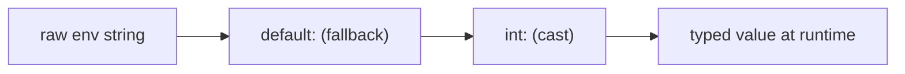

# Configuration Parameters

!!! tip "In a nutshell"
    Les parameters (`%app.name%`) sont de la config statique **figée à la
    compilation** ; les variables d'environnement (`%env(DATABASE_URL)%`) sont
    résolues **à l'exécution**, si bien qu'un même cache compilé fonctionne dans
    tous les environnements. Fait à plus haut rendement : les **processors** d'env
    comme `%env(int:MAX)%` castent/transforment la chaîne brute et s'enchaînent de
    droite à gauche.

!!! example "Real-world analogy"
    Les parameters sont les mesures imprimées de la recette — fixées au moment de
    l'impression du livre de cuisine (compilation). Les variables d'environnement
    sont la note « saler à votre goût » : remplie devant les fourneaux
    (exécution), donc la même recette imprimée fonctionne dans toutes les cuisines.
    Les **processors** d'env sont les étapes de préparation de cette note —
    « couper en dés », « convertir en grammes » — appliquées à la valeur brute
    avant qu'elle n'arrive dans la poêle.

!!! abstract "Learning objectives"
    À la fin de ce chapitre, vous saurez :

    - [ ] Définir des parameters et les référencer avec la syntaxe `%param%`.
    - [ ] Lire des variables d'environnement et les transformer avec les
          **env processors** (`%env(int:FOO)%`).
    - [ ] Injecter parameters/env dans des services via le **binding** et
          `#[Autowire]`, et les lire à l'exécution via `ParameterBagInterface`.

    **Syllabus:** `Dependency Injection → Configuration Parameters` ·
    **Level:** Advanced / Expert ·
    **Est. time:** 35 min ·
    **Prerequisites:** [The Service Container](container.md)

---

## Theory

Un **parameter** est une valeur de configuration nommée, stockée dans le
container : scalaires, tableaux, booléens. Les parameters gardent la configuration
hors de votre code et vous permettent de réutiliser des valeurs. On les référence
avec des signes pourcent : `%app.timezone%`.

Les variables d'environnement sont différentes : elles sont résolues **à
l'exécution**, pas figées dans le container compilé, si bien que le même cache
compilé fonctionne dans tous les environnements. Vous les lisez avec `%env(VAR)%`
et pouvez les faire passer par des **processors** pour caster et transformer.

| Type | Syntaxe | Résolution |
|---|---|---|
| Parameter | `%app.name%` | Compilation (figé) |
| Variable d'env | `%env(APP_SECRET)%` | Exécution |
| Env avec processor | `%env(int:MAX)%` | Exécution |

!!! question "Predict first"
    Vous changez `%env(DATABASE_URL)%` en production. Devez-vous reconstruire le
    container compilé pour que la nouvelle valeur prenne effet ? Et si vous changez
    un `%parameter%` ?

??? note "Reveal"
    Les variables d'env sont résolues à l'**exécution**, donc aucune reconstruction
    n'est nécessaire. Un `%parameter%` est figé dans le container compilé au
    build — le changer nécessite *bel et bien* une reconstruction du cache.

## Deep Dive — how it works internally

### The parameter bag

Les parameters vivent dans une `Symfony\Component\DependencyInjection\ParameterBag\ParameterBagInterface`.
Pendant le build, le `ContainerBuilder` utilise un `ParameterBag` mutable ; lors
du `compile()`, il est **figé** en un `FrozenParameterBag` — après quoi les
parameters sont en lecture seule. Un `%` de début/fin référence un parameter ; un
pourcent littéral s'échappe en le doublant : `%%`.

```php
// ContainerBuilder starts with a mutable ParameterBag
$container = new ContainerBuilder(new ParameterBag());
$container->setParameter('app.ratio', 'ratio: 90%%'); // %% escapes a literal %

$container->compile(); // freezes the bag

$bag = $container->getParameterBag(); // ParameterBagInterface
$bag instanceof FrozenParameterBag;   // true — read-only after compile()
```

### Environment variables are lazy placeholders

`%env(FOO)%` ne lit **pas** `$_ENV` à la compilation. Le compilateur le remplace
par un placeholder ; à l'exécution, le container le résout via
`Symfony\Component\DependencyInjection\EnvVarProcessor`. C'est pourquoi changer une
variable d'env ne nécessite aucune reconstruction du cache. Les valeurs d'env
peuvent provenir de vraies variables d'environnement, d'un fichier `.env` (via
`symfony/dotenv`), ou des `secrets`.

```yaml
# config/services.yaml
parameters:
    # '%env(FOO)%' stays a placeholder at compile time — $_ENV is NOT read here.
    app.foo: '%env(FOO)%'
    # At runtime EnvVarProcessor resolves FOO from the real environment,
    # from a .env file (loaded by symfony/dotenv), or from the secrets vault.
```

### Env processors

Un processor caste/transforme la chaîne brute : `int:`, `float:`, `bool:`,
`string:`, `json:`, `csv:`, `trim:`, `default:`, `resolve:`, `file:`, `base64:`,
`url:`, `query_string:`, `require:`, `not:`, `key:`, `enum:`. Ils s'enchaînent de
droite à gauche : `%env(int:default:fallback_param:MAX_ITEMS)%` lit `MAX_ITEMS`,
se replie sur un parameter, puis caste en int. Les processors implémentent
`EnvVarProcessorInterface` ; vous pouvez ajouter les vôtres.

```yaml
parameters:
    app.max: '%env(int:MAX_ITEMS)%'               # int: cast
    app.rate: '%env(float:RATE)%'                 # float: cast
    app.debug: '%env(bool:APP_DEBUG)%'            # bool: cast (not: negates it)
    app.name: '%env(string:trim:APP_NAME)%'       # trim: first, then string:
    app.opts: '%env(json:OPTIONS)%'               # json: decode
    app.hosts: '%env(csv:HOSTS)%'                 # csv: split
    app.dsn: '%env(resolve:DB_DSN)%'              # resolve: %params% inside value
    app.cert: '%env(base64:file:CERT_PATH)%'      # file: read it, base64: decode
    app.db: '%env(key:path:url:DATABASE_URL)%'    # url: parse, key: pick one part
    app.qs: '%env(query_string:QS)%'              # query_string: parse
    app.cfg: '%env(require:PHP_FILE)%'            # require: the PHP file
    app.level: '%env(enum:App\Enum\Level:LEVEL)%' # enum: backed enum case
    # default: chains right-to-left — read MAX_ITEMS, else the parameter, cast:
    app.limit: '%env(int:default:fallback_param:MAX_ITEMS)%'
    # Custom processors implement EnvVarProcessorInterface.
```



### Injecting values into services

Trois manières, toutes résolues à la compilation dans la definition :

1. **`bind`** dans `_defaults` / un service — lie un argument nommé comme
   `$projectDir` à une valeur pour tous les services.
2. **`#[Autowire]`** sur un paramètre de constructeur — `#[Autowire('%kernel.debug%')]`
   ou `#[Autowire(env: 'DATABASE_URL')]` ou `#[Autowire(param: 'app.name')]`.
3. **`ParameterBagInterface`** injecté comme service, lu à l'exécution avec
   `->get('app.name')` — pour quand la valeur doit varier ou être dynamique.

```php
// bind (services.yaml): _defaults: { bind: { $projectDir: '%kernel.project_dir%' } }
public function __construct(
    string $projectDir,                              // 1. filled by bind
    #[Autowire('%kernel.debug%')] bool $debug,       // 2. parameter expression
    #[Autowire(env: 'DATABASE_URL')] string $dsn,    //    env var
    #[Autowire(param: 'app.name')] string $appName,  //    named parameter
    private ParameterBagInterface $params,           // 3. runtime bag
) {}

public function dynamic(): mixed
{
    return $this->params->get('app.name');           // runtime read
}
```

!!! note "Source reference"
    `Symfony\Component\DependencyInjection\EnvVarProcessor` implémente les
    processors intégrés —
    [symfony/symfony `8.0`](https://github.com/symfony/symfony/blob/8.0/src/Symfony/Component/DependencyInjection/EnvVarProcessor.php).

### Null behavior

Une variable d'env **absente** sans repli fait échouer la résolution, donc la
nullabilité est explicite : `%env(default::SOME_VAR)%` produit **`null`** quand
`SOME_VAR` est manquante (le segment central vide ne nomme *aucun* parameter de
repli), et `%env(default:app.fallback:SOME_VAR)%` se replie d'abord sur un
parameter. Un parameter peut être déclaré `null` directement
(`app.optional: null`). Lire un parameter *manquant* avec
`ParameterBagInterface::get('nope')` lève une `ParameterNotFoundException` — elle
ne retourne jamais `null` — utilisez donc d'abord `has()` pour les recherches
optionnelles. Attention aux casts : `%env(int:MISSING)%` sans défaut échoue, et
`%env(int:default::MISSING)%` caste vide/`null` en `0`, ce qui peut masquer une
mauvaise configuration. Le bug classique consiste à supposer qu'une variable d'env
absente devient silencieusement `null` partout ; sans processor `default:`, c'est
un échec pur et dur.

```php
// Env fallbacks (resolved at runtime):
'%env(default::SOME_VAR)%';             // null when SOME_VAR is unset
'%env(default:app.fallback:SOME_VAR)%'; // falls back to the app.fallback parameter
'%env(int:MISSING)%';                   // unset + no default: -> hard failure
'%env(int:default::MISSING)%';          // unset -> null -> cast to 0 (careful!)

// Parameter bag at runtime (app.optional: null declared in YAML):
$params->get('app.optional');           // null — parameter declared as null
$params->has('nope');                   // false — check first for optional lookups
$params->get('nope');                   // throws ParameterNotFoundException
```

!!! note "Null in real life"
    Une étape de recette indiquant « saler à votre goût » avec le pot manquant
    (env absente) : soit le plat est bloqué (erreur), soit vous notez « omettre si
    absent » (`default::`) et vous le servez sans assaisonnement (null).

## Configuration & code

=== "PHP Attributes"

    ```php
    <?php
    declare(strict_types=1);

    namespace App\Service;

    use Symfony\Component\DependencyInjection\Attribute\Autowire;
    use Symfony\Component\DependencyInjection\ParameterBag\ParameterBagInterface;

    final class Mailer
    {
        public function __construct(
            #[Autowire(param: 'app.sender')]     // container parameter
            private readonly string $sender,
            #[Autowire(env: 'MAILER_DSN')]        // raw env var
            private readonly string $dsn,
            #[Autowire('%env(int:MAILER_RETRIES)%')] // processed env
            private readonly int $retries,
            private readonly ParameterBagInterface $params,
        ) {}

        public function debug(): bool
        {
            return (bool) $this->params->get('kernel.debug');
        }
    }
    ```

=== "YAML"

    ```yaml
    # config/services.yaml
    parameters:
        app.sender: 'no-reply@example.com'
        app.max_items: '%env(int:MAX_ITEMS)%'

    services:
        _defaults:
            autowire: true
            bind:
                $projectDir: '%kernel.project_dir%'
                string $sender: '%app.sender%'
    ```

=== "Console"

    ```console
    $ php bin/console debug:container --parameters
    $ php bin/console debug:container --parameter=kernel.debug
    ```

## Best practices & anti-patterns

| ✅ À faire | ❌ À éviter |
|---|---|
| `#[Autowire(env: 'X')]` pour les secrets/DSN | Figer des secrets dans des parameters |
| Caster l'env avec des processors (`int:`, `bool:`) | Considérer l'env comme déjà typée |
| `bind` pour les arguments nommés partagés | Répéter le même argument par service |
| Injecter `ParameterBagInterface` si dynamique | Injecter tout le bag « au cas où » |

## When (not) to use it / alternatives

Utilisez les **parameters** pour la config statique de l'application qui peut être
figée. Utilisez les **variables d'env** pour tout ce qui change par environnement
ou doit rester secret. Préférez injecter la *valeur unique* via `#[Autowire]`
plutôt que d'injecter toute la `ParameterBagInterface` — dépendance plus étroite,
plus facile à tester.

!!! danger "Certification traps"
    - `%env(FOO)%` est résolu **à l'exécution**, il n'est donc *pas* figé dans le
      cache ; les parameters, eux, *sont* figés à la compilation.
    - Les **processors** d'env s'enchaînent de droite à gauche :
      `%env(int:default:p:VAR)%`.
    - Échappez un `%` littéral en le doublant : `%%`.
    - Vous ne pouvez pas injecter un scalaire par type ; utilisez `bind`,
      `#[Autowire]` ou un parameter.

!!! warning "Common mistakes"
    - S'attendre à ce que `%env(MAX)%` soit un int — c'est une **string** tant que
      vous n'ajoutez pas `int:`.
    - Changer un parameter et oublier qu'il nécessite une reconstruction du cache
      (contrairement aux variables d'env).
    - Utiliser `getParameter()` dans un controller pour des valeurs qu'il vaudrait
      mieux injecter.

## Exercises

1. **(Advanced)** Écrivez l'expression `%env(...)%` qui lit `TIMEOUT`, se replie
   sur le parameter `app.timeout`, et caste en `int`.
2. **(Expert)** Injectez le booléen `kernel.debug` dans un service de deux manières
   différentes.

??? success "Solutions"

    **1.** `%env(int:default:app.timeout:TIMEOUT)%` — lit `TIMEOUT`, se replie sur
    le parameter `app.timeout` s'il est absent, puis caste en `int`.

    **2.** (a) `#[Autowire('%kernel.debug%')] private bool $debug` ; (b) injecter
    `ParameterBagInterface $params` et appeler `$params->get('kernel.debug')`. La
    première est préférable (dépendance plus étroite).

## Certification questions

??? question "Q1. When is `%env(DATABASE_URL)%` resolved?"
    - [ ] A. At container compilation, frozen into the cache
    - [x] B. At runtime, via an env-var processor ✅
    - [ ] C. When `.env` is parsed at deploy
    - [ ] D. Never; it is a literal string

    **Why:** Les placeholders d'env sont résolus à l'exécution pour qu'un même
    container compilé fonctionne dans tous les environnements. **Ref:** [Env vars](https://symfony.com/doc/8.0/configuration.html#configuration-based-on-environment-variables).

??? question "Q2. What does `%env(int:MAX)%` return?"
    - [ ] A. The string value of `MAX`
    - [x] B. `MAX` cast to an integer ✅
    - [ ] C. `null` if `MAX` is unset
    - [ ] D. A parameter named `int`

    **Why:** Le processor `int:` caste la chaîne d'env brute en entier.
    **Ref:** [Env var processors](https://symfony.com/doc/8.0/configuration/env_var_processors.html).

??? question "Q3. Which injects the `app.name` parameter into a constructor arg?"
    - [x] A. `#[Autowire(param: 'app.name')]` ✅
    - [ ] B. `#[Autowire('app.name')]`
    - [ ] C. `#[Parameter('app.name')]`
    - [ ] D. Type-hinting `string`

    **Why:** `param:` nomme un parameter du container ; une chaîne nue sans `%%`
    est un littéral. **Ref:** [Autowire attribute](https://symfony.com/doc/8.0/service_container/autowiring.html).

??? question "Q4. How do you write a literal percent sign in a parameter value?"
    - [ ] A. `\%`
    - [x] B. `%%` ✅
    - [ ] C. `%25`
    - [ ] D. You cannot

    **Why:** Un pourcent doublé s'échappe en un seul `%` littéral.
    **Ref:** [Parameters](https://symfony.com/doc/8.0/configuration.html#configuration-parameters).

## Key takeaways

- Les parameters (`%x%`) sont figés à la compilation ; les variables d'env sont
  résolues à l'exécution.
- Les **processors** d'env castent/transforment et s'enchaînent de droite à gauche.
- Injectez les valeurs via `bind`, `#[Autowire(param:/env:)]` ou
  `ParameterBagInterface`.
- Préférez injecter la valeur unique plutôt que tout le parameter bag.

## Last-minute revision

!!! tip "Cheat sheet"
    - `%param%` figé · `%env(VAR)%` exécution · `%%` pourcent littéral.
    - Processors : `int bool float json csv default resolve file base64 enum`.
    - `#[Autowire(param: 'x')]`, `#[Autowire(env: 'X')]`, `#[Autowire('%env(int:X)%')]`.
    - `FrozenParameterBag` = lecture seule après `compile()`.

## Connections

- **Depends on:** [The Service Container](container.md) — les parameters vivent
  dans le parameter bag (figé).
- **Reused in:** [Autowiring](autowiring.md),
  [Miscellaneous — Configuration](../miscellaneous/configuration.md) — les valeurs
  sont injectées via `#[Autowire]` / `bind`.
- **Confused with:** [Semantic Configuration](semantic-config.md) — la config de
  bundle est validée puis *transformée en* parameters.

## Official References
- [Official Symfony docs — Configuration & Parameters](https://symfony.com/doc/8.0/configuration.html)
- [Official Symfony docs — Env Var Processors](https://symfony.com/doc/8.0/configuration/env_var_processors.html)
- [Symfony source — EnvVarProcessor](https://github.com/symfony/symfony/blob/8.0/src/Symfony/Component/DependencyInjection/EnvVarProcessor.php)

## Video references

!!! tip "Watch & learn"
    Voici des chaînes vidéo officielles, mises à jour en continu — cherchez-y
    « dependency injection » pour consolider ce chapitre. Nous lions des chaînes
    stables plutôt que des vidéos individuelles pour que les références ne
    périment jamais.

    - [SymfonyCasts screencasts](https://symfonycasts.com/tracks/symfony) — tutoriels scénarisés à suivre en codant.
    - [Symfony official YouTube](https://www.youtube.com/@SymfonyOfficial) — conférences et keynotes des SymfonyCon.
    - [Official docs for this topic](https://symfony.com/doc/8.0/configuration.html#configuration-based-on-environment-variables) — certaines pages de la doc Symfony intègrent un screencast.

## Confidence check

Je suis prêt quand je peux :

- [ ] expliquer **pourquoi** les variables d'env sont résolues à l'exécution mais
      les parameters figés
- [ ] lire et caster des variables d'env avec des processors
      (`%env(int:default:p:VAR)%`)
- [ ] déboguer une variable d'env absente qui provoque une erreur au lieu de
      devenir `null`
- [ ] repérer que `%env(MAX)%` est une string tant que `int:` n'est pas ajouté et
      que `%%` échappe un pourcent
- [ ] expliquer le `FrozenParameterBag` et l'endroit où `%env()%` est résolu

---

<small>Related: [The Service Container](container.md) · [Autowiring](autowiring.md) ·
[Registration](registration.md)</small>
