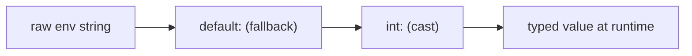

# Configuration Parameters

!!! abstract "Learning objectives"
    By the end of this chapter you can:

    - [ ] Define parameters and reference them with the `%param%` syntax.
    - [ ] Read environment variables and transform them with **env processors**
          (`%env(int:FOO)%`).
    - [ ] Inject parameters/env into services via **binding** and `#[Autowire]`,
          and read them at runtime through `ParameterBagInterface`.

    **Syllabus:** `Dependency Injection → Configuration Parameters` ·
    **Level:** Advanced / Expert ·
    **Est. time:** 35 min ·
    **Prerequisites:** [The Service Container](container.md)

---

## Theory

A **parameter** is a named configuration value stored in the container:
scalars, arrays, booleans. Parameters keep configuration out of your code and let
you reuse values. They are referenced with percent signs: `%app.timezone%`.

Environment variables are different: they are resolved **at runtime**, not baked
into the compiled container, so the same compiled cache works across environments.
You read them with `%env(VAR)%` and can pipe them through **processors** to cast
and transform.

| Kind | Syntax | Resolved |
|---|---|---|
| Parameter | `%app.name%` | Compile time (frozen) |
| Env var | `%env(APP_SECRET)%` | Runtime |
| Processed env | `%env(int:MAX)%` | Runtime |

## Deep Dive — how it works internally

### The parameter bag

Parameters live in a `Symfony\Component\DependencyInjection\ParameterBag\ParameterBagInterface`.
During build the `ContainerBuilder` uses a mutable
`ParameterBag`; on `compile()` it is **frozen** into a
`FrozenParameterBag` — after that, parameters are read-only. A leading/trailing
`%` references a parameter; a literal percent is escaped by doubling: `%%`.

### Environment variables are lazy placeholders

`%env(FOO)%` does **not** read `$_ENV` at compile time. The compiler replaces it
with a placeholder; at runtime the container resolves it through
`Symfony\Component\DependencyInjection\EnvVarProcessor`. This is why changing an
env var needs no cache rebuild. Env values may be sourced from real environment
variables, a `.env` file (via `symfony/dotenv`), or `secrets`.

### Env processors

A processor casts/transforms the raw string: `int:`, `float:`, `bool:`, `string:`,
`json:`, `csv:`, `trim:`, `default:`, `resolve:`, `file:`, `base64:`, `url:`,
`query_string:`, `require:`, `not:`, `key:`, `enum:`. They chain right-to-left:
`%env(int:default:fallback_param:MAX_ITEMS)%` reads `MAX_ITEMS`, falls back to a
parameter, then casts to int. Processors implement
`EnvVarProcessorInterface`; you can add your own.



### Injecting values into services

Three ways, all resolved at compile time into the definition:

1. **`bind`** in `_defaults` / a service — bind a named arg like
   `$projectDir` to a value for all services.
2. **`#[Autowire]`** on a constructor parameter — `#[Autowire('%kernel.debug%')]`
   or `#[Autowire(env: 'DATABASE_URL')]` or `#[Autowire(param: 'app.name')]`.
3. **`ParameterBagInterface`** injected as a service, read at runtime with
   `->get('app.name')` — for when the value must vary or be dynamic.

!!! note "Source reference"
    `Symfony\Component\DependencyInjection\EnvVarProcessor` implements the
    built-in processors —
    [symfony/symfony `8.0`](https://github.com/symfony/symfony/blob/8.0/src/Symfony/Component/DependencyInjection/EnvVarProcessor.php).

## Configuration & code

=== "PHP Attributes"

    ```php
    <?php
    declare(strict_types=1);

    namespace App\Service;

    use Symfony\Component\DependencyInjection\Attribute\Autowire;
    use Symfony\Component\DependencyInjection\ParameterBag\ParameterBagInterface;

    final class Mailer
    {
        public function __construct(
            #[Autowire(param: 'app.sender')]     // container parameter
            private readonly string $sender,
            #[Autowire(env: 'MAILER_DSN')]        // raw env var
            private readonly string $dsn,
            #[Autowire('%env(int:MAILER_RETRIES)%')] // processed env
            private readonly int $retries,
            private readonly ParameterBagInterface $params,
        ) {}

        public function debug(): bool
        {
            return (bool) $this->params->get('kernel.debug');
        }
    }
    ```

=== "YAML"

    ```yaml
    # config/services.yaml
    parameters:
        app.sender: 'no-reply@example.com'
        app.max_items: '%env(int:MAX_ITEMS)%'

    services:
        _defaults:
            autowire: true
            bind:
                $projectDir: '%kernel.project_dir%'
                string $sender: '%app.sender%'
    ```

=== "Console"

    ```console
    $ php bin/console debug:container --parameters
    $ php bin/console debug:container --param kernel.debug
    ```

## Best practices & anti-patterns

| ✅ Do | ❌ Avoid |
|---|---|
| `#[Autowire(env: 'X')]` for secrets/DSNs | Baking secrets into parameters |
| Cast env with processors (`int:`, `bool:`) | Treating env as already-typed |
| `bind` for shared named args | Repeating the same arg per service |
| Inject `ParameterBagInterface` when dynamic | Injecting whole bag "just in case" |

## When (not) to use it / alternatives

Use **parameters** for static app config that can be frozen. Use **env vars** for
anything that changes per environment or must stay secret. Prefer injecting the
*single value* via `#[Autowire]` over injecting the whole `ParameterBagInterface`
— narrower dependency, easier to test.

!!! danger "Certification traps"
    - `%env(FOO)%` is resolved **at runtime**, so it is *not* frozen into the cache;
      parameters *are* frozen at compile time.
    - Env **processors** chain right-to-left: `%env(int:default:p:VAR)%`.
    - Escape a literal `%` by doubling it: `%%`.
    - You cannot inject a scalar by type; use `bind`, `#[Autowire]` or a parameter.

!!! warning "Common mistakes"
    - Expecting `%env(MAX)%` to be an int — it is a **string** until you add `int:`.
    - Changing a parameter and forgetting it needs a cache rebuild (env vars do not).
    - Using `getParameter()` in a controller for values better injected.

## Exercises

1. **(Advanced)** Write the `%env(...)%` expression that reads `TIMEOUT`, defaults
   to the `app.timeout` parameter, and casts to `int`.
2. **(Expert)** Inject the boolean `kernel.debug` into a service two different
   ways.

??? success "Solutions"

    **1.** `%env(int:default:app.timeout:TIMEOUT)%` — reads `TIMEOUT`, falls back to
    the `app.timeout` parameter if unset, then casts to `int`.

    **2.** (a) `#[Autowire('%kernel.debug%')] private bool $debug`; (b) inject
    `ParameterBagInterface $params` and call `$params->get('kernel.debug')`. The
    first is preferred (narrower dependency).

## Certification questions

??? question "Q1. When is `%env(DATABASE_URL)%` resolved?"
    - [ ] A. At container compilation, frozen into the cache
    - [x] B. At runtime, via an env-var processor ✅
    - [ ] C. When `.env` is parsed at deploy
    - [ ] D. Never; it is a literal string

    **Why:** Env placeholders resolve at runtime so one compiled container works
    across environments. **Ref:** [Env vars](https://symfony.com/doc/current/configuration.html#configuration-based-on-environment-variables).

??? question "Q2. What does `%env(int:MAX)%` return?"
    - [ ] A. The string value of `MAX`
    - [x] B. `MAX` cast to an integer ✅
    - [ ] C. `null` if `MAX` is unset
    - [ ] D. A parameter named `int`

    **Why:** The `int:` processor casts the raw env string to an integer.
    **Ref:** [Env var processors](https://symfony.com/doc/current/configuration/env_var_processors.html).

??? question "Q3. Which injects the `app.name` parameter into a constructor arg?"
    - [x] A. `#[Autowire(param: 'app.name')]` ✅
    - [ ] B. `#[Autowire('app.name')]`
    - [ ] C. `#[Parameter('app.name')]`
    - [ ] D. Type-hinting `string`

    **Why:** `param:` names a container parameter; a bare string without `%%` is a
    literal. **Ref:** [Autowire attribute](https://symfony.com/doc/current/service_container/autowiring.html).

??? question "Q4. How do you write a literal percent sign in a parameter value?"
    - [ ] A. `\%`
    - [x] B. `%%` ✅
    - [ ] C. `%25`
    - [ ] D. You cannot

    **Why:** A doubled percent escapes to a single literal `%`.
    **Ref:** [Parameters](https://symfony.com/doc/current/configuration.html#configuration-parameters).

## Key takeaways

- Parameters (`%x%`) are frozen at compile time; env vars resolve at runtime.
- Env **processors** cast/transform and chain right-to-left.
- Inject values via `bind`, `#[Autowire(param:/env:)]`, or `ParameterBagInterface`.
- Prefer injecting the single value over the whole parameter bag.

## Last-minute revision

!!! tip "Cheat sheet"
    - `%param%` frozen · `%env(VAR)%` runtime · `%%` literal percent.
    - Processors: `int bool float json csv default resolve file base64 enum`.
    - `#[Autowire(param: 'x')]`, `#[Autowire(env: 'X')]`, `#[Autowire('%env(int:X)%')]`.
    - `FrozenParameterBag` = read-only after `compile()`.

## Official References
- [Official Symfony docs — Configuration & Parameters](https://symfony.com/doc/current/configuration.html)
- [Official Symfony docs — Env Var Processors](https://symfony.com/doc/current/configuration/env_var_processors.html)
- [Symfony source — EnvVarProcessor](https://github.com/symfony/symfony/blob/8.0/src/Symfony/Component/DependencyInjection/EnvVarProcessor.php)

---

<small>Related: [The Service Container](container.md) · [Autowiring](autowiring.md) ·
[Registration](registration.md)</small>
