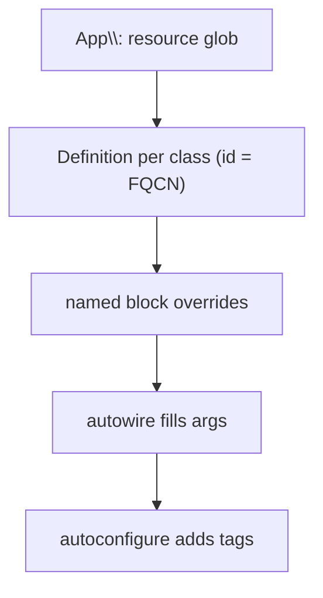

# Service Registration

!!! tip "In a nutshell"
    L'enregistrement indique au container quelles classes sont des services ; le
    glob `App\:` en resource plus `autowire`/`autoconfigure` en couvrent ~95 %.
    Le fait le plus rentable à l'examen : l'**id d'un service auto-enregistré est
    son FQCN**, et `autowire` (arguments par type) et `autoconfigure` (tags par
    interface) sont des drapeaux **indépendants**.

!!! example "Real-world analogy"
    L'enregistrement, c'est rédiger la liste des postes de la cuisine : quelles
    classes sont des cuisiniers en service (services) et lesquelles ne sont que du
    stock de garde-manger (value objects, entités). Le glob `App\:` est un
    « tout le monde dans cette pièce est de service » général, `autowire` remet à
    chaque cuisinier ses ingrédients selon leur type, et un bloc nommé est un
    post-it qui amende l'installation d'un seul cuisinier.

!!! abstract "Learning objectives"
    À la fin de ce chapitre, vous saurez :

    - [ ] Expliquer les `_defaults` de `services.yaml` (`autowire`, `autoconfigure`,
          `public`) et l'auto-enregistrement via `resource`/`exclude`.
    - [ ] Écrire des `Definition`s manuelles avec `arguments`, des `calls` de
          méthodes et des `aliases`.
    - [ ] Configurer un service individuel avec `#[Autoconfigure]`.

    **Syllabus:** `Dependency Injection → Service Registration` ·
    **Level:** Advanced / Expert ·
    **Est. time:** 40 min ·
    **Prerequisites:** [The Service Container](container.md)

---

## Theory

Enregistrer, c'est dire au container quelles classes sont des services et comment
les construire. Le Symfony moderne privilégie la **convention plutôt que la
configuration** : un seul glob `resource` enregistre tout un répertoire,
`autowire` fournit les arguments du constructeur par type, et `autoconfigure`
applique les tags selon les interfaces implémentées. Vous ne passez aux
définitions manuelles que lorsque les conventions ne suffisent plus.

```yaml
# config/services.yaml
services:
    _defaults:
        autowire: true        # fill constructor args by type
        autoconfigure: true   # apply tags based on implemented interfaces
    App\:
        resource: '../src/'   # one resource glob registers the whole directory
```

!!! question "Predict first"
    Using the `App\:` resource glob, what is a service's id — a short name or
    something else? And are `autowire` and `autoconfigure` the same switch?

??? note "Reveal"
    L'id **est le FQCN**. `autowire` (remplir les arguments par type) et
    `autoconfigure` (appliquer les tags par interface/attribut) sont des drapeaux
    **indépendants** — vous pouvez activer l'un sans l'autre.

## Deep Dive — how it works internally

### `_defaults` and PSR-4 resource loading

Les `_defaults` de `services.yaml` fixent les drapeaux de base pour chaque service
défini dans ce fichier. Le bloc `App\:` avec `resource: '../src/'` parcourt le
répertoire et, pour chaque classe, crée une `Definition` dont l'id **est le
FQCN**. `exclude` ignore les chemins qui ne sont pas des services (entités, DTOs,
le Kernel).

```yaml
services:
    _defaults:
        autowire: true
        autoconfigure: true
        public: false

    App\:
        resource: '../src/'
        exclude: '../src/{DependencyInjection,Entity,Kernel.php}'
```

L'ordre d'enregistrement compte : une entrée ultérieure, plus spécifique,
**écrase** le glob pour le même id. Le glob `App\:` enregistre donc d'abord tout,
puis un bloc nommé ajuste un service en particulier.

### Arguments, calls, aliases

- **arguments** — positionnels ou par nom (`$logger:`). Avec l'autowiring, vous
  ne listez que ceux que le container ne peut pas deviner (scalaires, types
  ambigus).
- **calls** — injection par setter : des méthodes invoquées après la construction.
  Privilégiez l'injection par constructeur ; `calls` pour les dépendances
  optionnelles/tardives.
- **aliases** — un second id (ou une interface) pointant vers un service, afin
  qu'il puisse être récupéré/autowiré sous un autre nom.

```yaml
services:
    App\Report\PdfReporter:
        arguments:
            $logger: '@monolog.logger'    # argument by name
        calls:
            - setLogger: ['@logger']      # setter injection after construction

    # Alias: the interface id points at the concrete service.
    App\Report\ReporterInterface: '@App\Report\PdfReporter'
```



### `#[Autoconfigure]` — per-class defaults from the class

Au lieu d'un bloc YAML, `#[Autoconfigure]` sur la classe fixe ses drapeaux —
`public`, `shared`, `lazy`, `tags`, `bind`, `calls`, `properties`,
`constructor`. Il est appliqué par la passe d'autoconfiguration des attributs à la
compilation et se révèle pratique pour les classes de bibliothèque qui embarquent
leur propre câblage.

!!! note "Source reference"
    Attribute autoconfiguration is handled during compilation via
    `Symfony\Component\DependencyInjection\Attribute\Autoconfigure` and
    `ContainerBuilder::registerAttributeForAutoconfiguration()` —
    [symfony/symfony `8.0`](https://github.com/symfony/symfony/blob/8.0/src/Symfony/Component/DependencyInjection/Attribute/Autoconfigure.php).

### Null behavior

Les dépendances obligatoires vont dans le constructeur ; les **optionnelles**,
c'est là que vit le null. L'injection par setter/`calls` d'un service absent, ou
une reference optionnelle `@?service.id`, laisse la propriété à sa valeur par
défaut déclarée — typez-la donc `private ?LoggerInterface $logger = null` et
protégez chaque utilisation par un test de null. Un **alias** pointant vers une
cible inexistante est une *erreur de compilation*, pas un null. Le pattern
`setLogger()` de l'exemple ne reste sûr que parce que la propriété vaut `null` par
défaut et que la classe vérifie avant d'appeler. Le bug classique : une propriété
nullable par défaut qu'un chemin de code obligatoire suppose toujours renseignée —
injectez-la plutôt par le constructeur, pour que le container prouve son existence
au build time.

!!! note "Null in real life"
    Un cuisinier optionnel qui peut ne pas venir (dépendance optionnelle par
    setter) : laissez le poste marqué vide (`= null`) et vérifiez avant de lui
    confier du travail — ne bâtissez pas le menu en supposant qu'il est là.

## Configuration & code

=== "PHP Attributes"

    ```php
    <?php
    declare(strict_types=1);

    namespace App\Report;

    use Psr\Log\LoggerInterface;
    use Symfony\Component\DependencyInjection\Attribute\Autoconfigure;
    use Symfony\Component\DependencyInjection\Attribute\Autowire;

    #[Autoconfigure(lazy: true, tags: ['app.report'])]
    final class PdfReporter
    {
        private ?LoggerInterface $logger = null;

        public function __construct(
            #[Autowire('%kernel.project_dir%/var/reports')]
            private readonly string $dir,
        ) {}

        // Optional setter injection.
        public function setLogger(LoggerInterface $logger): void
        {
            $this->logger = $logger;
        }
    }
    ```

=== "YAML"

    ```yaml
    # config/services.yaml
    services:
        _defaults:
            autowire: true
            autoconfigure: true
            public: false

        App\:
            resource: '../src/'
            exclude: '../src/{Entity,Kernel.php}'

        # Manual definition overriding the glob for one class.
        App\Report\PdfReporter:
            arguments:
                $dir: '%kernel.project_dir%/var/reports'
            calls:
                - setLogger: ['@logger']
            lazy: true

        # Alias: fetch/autowire the interface as this service.
        App\Report\ReporterInterface: '@App\Report\PdfReporter'
    ```

=== "Console"

    ```console
    $ php bin/console debug:container --show-arguments App\\Report\\PdfReporter
    ```

## Best practices & anti-patterns

| ✅ Do | ❌ Avoid |
|---|---|
| S'appuyer sur le glob `App\:` + autowire | Enregistrer chaque classe à la main |
| Injection par constructeur | Injection par setter pour les dépendances obligatoires |
| `exclude` les non-services | Laisser les entités devenir des services |
| Alias interface → implémentation | Dupliquer des définitions complètes |

## When (not) to use it / alternatives

L'auto-enregistrement couvre ~95 % des cas. Écrivez une définition manuelle quand
vous avez besoin d'un argument non autowirable, d'une injection par setter, d'une
[factory](factories.md) ou de drapeaux différents. Utilisez `#[Autoconfigure]`
quand le câblage appartient *à* la classe (code de bibliothèque partagé) ;
utilisez YAML quand c'est de la configuration propre à l'application.

!!! danger "Certification traps"
    - L'**id** du service auto-enregistré **est le FQCN**, pas un nom court.
    - `autoconfigure` (tags par interface) ≠ `autowire` (arguments par type) — deux
      drapeaux indépendants.
    - Une entrée YAML ultérieure, plus spécifique, écrase le glob pour cet id.
    - `exclude` ne supprime pas les fichiers, il saute juste l'enregistrement.

!!! warning "Common mistakes"
    - Autowirer un argument **scalaire** — il doit venir de `bind`/`#[Autowire]`.
    - Mettre tout en `public: true` inutilement.
    - Oublier un alias, puis se demander pourquoi un type-hint d'interface échoue.

## Exercises

1. **(Advanced)** Auto-enregistrez tout ce qui se trouve sous `src/` sauf `Entity/`
   et `Kernel.php`, en privé et autowiré.
2. **(Expert)** Enregistrez `PdfReporter` avec un argument scalaire `$dir` et un
   alias d'interface, en gardant le reste autowiré.

??? success "Solutions"

    **1.**
    ```yaml
    services:
        _defaults: { autowire: true, autoconfigure: true, public: false }
        App\:
            resource: '../src/'
            exclude: '../src/{Entity,Kernel.php}'
    ```

    **2.**
    ```yaml
    services:
        App\Report\PdfReporter:
            arguments:
                $dir: '%kernel.project_dir%/var/reports'
        App\Report\ReporterInterface: '@App\Report\PdfReporter'
    ```
    Seul `$dir` est spécifié ; les autres arguments restent autowirés. L'alias
    permet d'injecter l'interface.

## Certification questions

??? question "Q1. Using the `App\:` resource glob, what is a service's id?"
    - [ ] A. A short snake_case name
    - [x] B. Its fully-qualified class name ✅
    - [ ] C. The file path
    - [ ] D. A random hash

    **Why:** L'auto-enregistrement PSR-4 utilise le FQCN comme id.
    **Ref:** [Service container](https://symfony.com/doc/current/service_container.html).

??? question "Q2. What does `autoconfigure: true` do?"
    - [ ] A. Fills constructor arguments by type
    - [x] B. Applies tags/flags based on implemented interfaces & attributes ✅
    - [ ] C. Makes services public
    - [ ] D. Clears the cache

    **Why:** Autoconfigure ajoute automatiquement les tags (p. ex. event
    subscriber) ; c'est autowire qui remplit les arguments.
    **Ref:** [Autoconfigure](https://symfony.com/doc/current/service_container.html#the-autoconfigure-option).

??? question "Q3. How do you make an interface type-hint resolve to a class?"
    - [x] A. Define an alias `Interface: '@Class'` ✅
    - [ ] B. Type-hint the class instead
    - [ ] C. Make the class public
    - [ ] D. Tag the class

    **Why:** Un alias de l'id de l'interface vers le service concret permet à
    l'autowiring de résoudre le type-hint.
    **Ref:** [Aliasing](https://symfony.com/doc/current/service_container/alias_private.html).

## Key takeaways

- `_defaults` + glob `App\:` + `autowire`/`autoconfigure` couvrent la plupart des
  services.
- Id du service = FQCN ; un bloc spécifique écrase le glob.
- `arguments`/`calls`/`aliases` manuels pour ce que les conventions ne peuvent pas
  exprimer.
- `#[Autoconfigure]` place le câblage par classe sur la classe elle-même.

## Last-minute revision

!!! tip "Cheat sheet"
    - `resource` = enregistrer par glob ; `exclude` = sauter les non-services.
    - `autowire` args-par-type ; `autoconfigure` tags-par-interface — indépendants.
    - `arguments`, `calls` (setters), `aliases` (`Interface: '@Class'`).
    - `#[Autoconfigure(lazy:, public:, tags:, bind:)]`.

## Connections

- **Depends on:** [The Service Container](container.md) — l'enregistrement produit
  les `Definition`s que le container compile.
- **Reused in:** [Autowiring](autowiring.md), [Tags](tags.md),
  [Factories](factories.md) — tous s'appuient sur les definitions enregistrées.
- **Confused with:** [Semantic Configuration](semantic-config.md) —
  `services.yaml` au niveau applicatif vs la config typée d'un bundle réutilisable.

## Official References
- [Official Symfony docs — Service Container](https://symfony.com/doc/current/service_container.html)
- [Official Symfony docs — Aliasing & private services](https://symfony.com/doc/current/service_container/alias_private.html)
- [Symfony source — Autoconfigure attribute](https://github.com/symfony/symfony/blob/8.0/src/Symfony/Component/DependencyInjection/Attribute/Autoconfigure.php)

## Video references

!!! tip "Watch & learn"
    Voici des chaînes vidéo officielles, mises à jour en continu — cherchez-y
    « dependency injection » pour consolider ce chapitre. Nous référençons des
    chaînes stables plutôt que des vidéos individuelles, afin que les références ne
    périment jamais.

    - [SymfonyCasts screencasts](https://symfonycasts.com/tracks/symfony) — tutoriels scénarisés à coder en suivant.
    - [Symfony official YouTube](https://www.youtube.com/@SymfonyOfficial) — conférences et keynotes SymfonyCon.
    - [Official docs for this topic](https://symfony.com/doc/current/service_container.html) — certaines pages de la doc Symfony intègrent un screencast.

## Confidence check

Je suis prêt quand je peux :

- [ ] expliquer **pourquoi** la convention plutôt que la configuration (glob `App\:`) couvre la plupart des cas
- [ ] enregistrer des services avec `_defaults`, `resource`/`exclude` et un alias
- [ ] déboguer un type-hint d'interface qui échoue faute d'alias
- [ ] repérer que l'id est le FQCN et que `autowire` ≠ `autoconfigure`
- [ ] expliquer comment un bloc ultérieur, plus spécifique, écrase le glob pour un id

---

<small>Related: [Autowiring](autowiring.md) · [Factories](factories.md) ·
[Tags](tags.md)</small>
