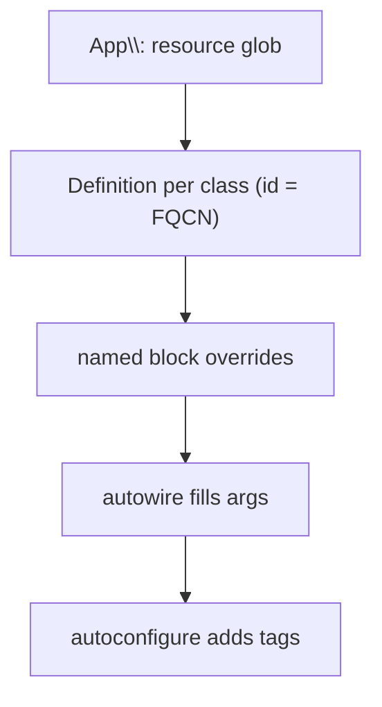

# Service Registration

!!! tip "In a nutshell"
    Registration tells the container which classes are services; the `App\:`
    resource glob plus `autowire`/`autoconfigure` covers ~95% of it. Highest-yield
    fact: an auto-registered service's **id is its FQCN**, and `autowire` (args by
    type) and `autoconfigure` (tags by interface) are **independent** flags.

!!! abstract "Learning objectives"
    By the end of this chapter you can:

    - [ ] Explain `services.yaml` `_defaults` (`autowire`, `autoconfigure`,
          `public`) and `resource`/`exclude` auto-registration.
    - [ ] Write manual `Definition`s with `arguments`, method `calls`, and
          `aliases`.
    - [ ] Configure a single service with `#[Autoconfigure]`.

    **Syllabus:** `Dependency Injection → Service Registration` ·
    **Level:** Advanced / Expert ·
    **Est. time:** 40 min ·
    **Prerequisites:** [The Service Container](container.md)

---

## Theory

Registration is telling the container which classes are services and how to build
them. Modern Symfony favours **convention over configuration**: one `resource`
glob registers a whole directory, `autowire` supplies constructor arguments by
type, and `autoconfigure` applies tags by implemented interface. You drop to
manual definitions only when the conventions cannot express something.

## Deep Dive — how it works internally

### `_defaults` and PSR-4 resource loading

`services.yaml` `_defaults` sets baseline flags for every service defined in that
file. The `App\:` block with `resource: '../src/'` walks the directory, and for
every class creates a `Definition` whose id **is the FQCN**. `exclude` skips
paths that are not services (Entities, DTOs, the Kernel).

```yaml
services:
    _defaults:
        autowire: true
        autoconfigure: true
        public: false

    App\:
        resource: '../src/'
        exclude: '../src/{DependencyInjection,Entity,Kernel.php}'
```

Registration order matters: a later, more specific entry **overrides** the glob for
the same id. So the `App\:` glob first registers everything, then a named block
tweaks one service.

### Arguments, calls, aliases

- **arguments** — positional or by name (`$logger:`). With autowiring you only
  list the ones the container cannot guess (scalars, ambiguous types).
- **calls** — setter injection: methods invoked after construction. Use
  constructor injection first; `calls` for optional/late deps.
- **aliases** — a second id (or an interface) pointing at a service, so it can be
  fetched/autowired under another name.



### `#[Autoconfigure]` — per-class defaults from the class

Instead of a YAML block, `#[Autoconfigure]` on the class sets its flags —
`public`, `shared`, `lazy`, `tags`, `bind`, `calls`, `properties`,
`constructor`. It is applied by the attribute-autoconfiguration pass at compile
time and is handy for library classes that carry their own wiring.

!!! note "Source reference"
    Attribute autoconfiguration is handled during compilation via
    `Symfony\Component\DependencyInjection\Attribute\Autoconfigure` and
    `ContainerBuilder::registerAttributeForAutoconfiguration()` —
    [symfony/symfony `8.0`](https://github.com/symfony/symfony/blob/8.0/src/Symfony/Component/DependencyInjection/Attribute/Autoconfigure.php).

## Configuration & code

=== "PHP Attributes"

    ```php
    <?php
    declare(strict_types=1);

    namespace App\Report;

    use Psr\Log\LoggerInterface;
    use Symfony\Component\DependencyInjection\Attribute\Autoconfigure;
    use Symfony\Component\DependencyInjection\Attribute\Autowire;

    #[Autoconfigure(lazy: true, tags: ['app.report'])]
    final class PdfReporter
    {
        private ?LoggerInterface $logger = null;

        public function __construct(
            #[Autowire('%kernel.project_dir%/var/reports')]
            private readonly string $dir,
        ) {}

        // Optional setter injection.
        public function setLogger(LoggerInterface $logger): void
        {
            $this->logger = $logger;
        }
    }
    ```

=== "YAML"

    ```yaml
    # config/services.yaml
    services:
        _defaults:
            autowire: true
            autoconfigure: true
            public: false

        App\:
            resource: '../src/'
            exclude: '../src/{Entity,Kernel.php}'

        # Manual definition overriding the glob for one class.
        App\Report\PdfReporter:
            arguments:
                $dir: '%kernel.project_dir%/var/reports'
            calls:
                - setLogger: ['@logger']
            lazy: true

        # Alias: fetch/autowire the interface as this service.
        App\Report\ReporterInterface: '@App\Report\PdfReporter'
    ```

=== "Console"

    ```console
    $ php bin/console debug:container --show-arguments App\\Report\\PdfReporter
    ```

## Best practices & anti-patterns

| ✅ Do | ❌ Avoid |
|---|---|
| Rely on the `App\:` glob + autowire | Registering each class by hand |
| Constructor injection | Setter injection for required deps |
| `exclude` non-services | Letting Entities become services |
| Alias interface → impl | Duplicating full definitions |

## When (not) to use it / alternatives

Auto-registration covers ~95% of cases. Write a manual definition when you need a
non-autowirable argument, setter injection, a [factory](factories.md), or
different flags. Use `#[Autoconfigure]` when the wiring belongs *with* the class
(shared library code); use YAML when it is app-specific config.

!!! danger "Certification traps"
    - The auto-registered service **id is the FQCN**, not a short name.
    - `autoconfigure` (tags by interface) ≠ `autowire` (arguments by type) — two
      independent flags.
    - A later, more specific YAML entry overrides the glob for that id.
    - `exclude` does not delete files, it just skips registration.

!!! warning "Common mistakes"
    - Autowiring a **scalar** argument — it must come from `bind`/`#[Autowire]`.
    - Making everything `public: true` unnecessarily.
    - Forgetting an alias, then wondering why an interface type-hint fails.

## Exercises

1. **(Advanced)** Auto-register everything under `src/` except `Entity/` and
   `Kernel.php`, private and autowired.
2. **(Expert)** Register `PdfReporter` with a scalar `$dir` argument and an
   interface alias, keeping the rest autowired.

??? success "Solutions"

    **1.**
    ```yaml
    services:
        _defaults: { autowire: true, autoconfigure: true, public: false }
        App\:
            resource: '../src/'
            exclude: '../src/{Entity,Kernel.php}'
    ```

    **2.**
    ```yaml
    services:
        App\Report\PdfReporter:
            arguments:
                $dir: '%kernel.project_dir%/var/reports'
        App\Report\ReporterInterface: '@App\Report\PdfReporter'
    ```
    Only `$dir` is specified; other args stay autowired. The alias lets the
    interface be injected.

## Certification questions

??? question "Q1. Using the `App\:` resource glob, what is a service's id?"
    - [ ] A. A short snake_case name
    - [x] B. Its fully-qualified class name ✅
    - [ ] C. The file path
    - [ ] D. A random hash

    **Why:** PSR-4 auto-registration uses the FQCN as the id.
    **Ref:** [Service container](https://symfony.com/doc/current/service_container.html).

??? question "Q2. What does `autoconfigure: true` do?"
    - [ ] A. Fills constructor arguments by type
    - [x] B. Applies tags/flags based on implemented interfaces & attributes ✅
    - [ ] C. Makes services public
    - [ ] D. Clears the cache

    **Why:** Autoconfigure adds tags (e.g. event subscriber) automatically;
    autowire is what fills arguments. **Ref:** [Autoconfigure](https://symfony.com/doc/current/service_container.html#the-autoconfigure-option).

??? question "Q3. How do you make an interface type-hint resolve to a class?"
    - [x] A. Define an alias `Interface: '@Class'` ✅
    - [ ] B. Type-hint the class instead
    - [ ] C. Make the class public
    - [ ] D. Tag the class

    **Why:** An alias from the interface id to the concrete service lets autowiring
    resolve the type-hint. **Ref:** [Aliasing](https://symfony.com/doc/current/service_container/alias_private.html).

## Key takeaways

- `_defaults` + `App\:` glob + `autowire`/`autoconfigure` covers most services.
- Service id = FQCN; a specific block overrides the glob.
- Manual `arguments`/`calls`/`aliases` for what conventions cannot express.
- `#[Autoconfigure]` puts per-class wiring on the class itself.

## Last-minute revision

!!! tip "Cheat sheet"
    - `resource` = register glob; `exclude` = skip non-services.
    - `autowire` args-by-type; `autoconfigure` tags-by-interface — independent.
    - `arguments`, `calls` (setters), `aliases` (`Interface: '@Class'`).
    - `#[Autoconfigure(lazy:, public:, tags:, bind:)]`.

## Official References
- [Official Symfony docs — Service Container](https://symfony.com/doc/current/service_container.html)
- [Official Symfony docs — Aliasing & private services](https://symfony.com/doc/current/service_container/alias_private.html)
- [Symfony source — Autoconfigure attribute](https://github.com/symfony/symfony/blob/8.0/src/Symfony/Component/DependencyInjection/Attribute/Autoconfigure.php)

---

<small>Related: [Autowiring](autowiring.md) · [Factories](factories.md) ·
[Tags](tags.md)</small>
