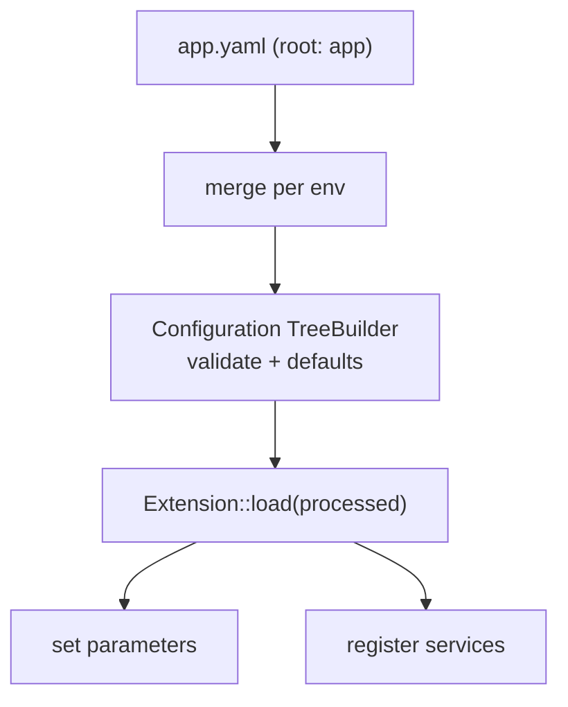

# Semantic (Bundle) Configuration

!!! tip "In a nutshell"
    La configuration sémantique est la configuration typée et validée qu'un bundle
    expose sous sa propre clé racine : `Configuration` définit et valide le schéma,
    `Extension::load()` transforme les valeurs traitées en services et parameters.
    Fait le plus rentable : `prepend()` s'exécute **avant** tous les appels à
    `load()`, ce qui permet à un bundle de définir des valeurs par défaut pour un
    autre.

!!! example "Real-world analogy"
    La configuration sémantique est le bon de commande imprimé d'un bundle, avec un
    commis qui valide. L'arbre `Configuration` est le formulaire — quels champs
    existent, leurs types, leurs valeurs par défaut, lesquels sont obligatoires —
    et il rejette les absurdités avant qu'elles n'atteignent la cuisine.
    `Extension::load()` est le commis qui transforme le formulaire accepté en
    véritables tickets de préparation (services et parameters). `prepend()`
    consiste à préremplir des valeurs par défaut raisonnables sur le formulaire
    d'un *autre* bundle avant que quiconque ne le soumette.

!!! abstract "Learning objectives"
    À la fin de ce chapitre, vous saurez :

    - [ ] Construire un arbre de config validé avec `Configuration` + `TreeBuilder`.
    - [ ] Transformer la config en services et parameters dans `Extension::load()`.
    - [ ] Injecter de la config dans un autre bundle avec `prependExtension()`.

    **Syllabus:** `Dependency Injection → Semantic Configuration` ·
    **Level:** Expert ·
    **Est. time:** 40 min ·
    **Prerequisites:** [Service Registration](registration.md)

---

## Pour les nuls

### L'idée en une phrase
La configuration sémantique est le formulaire de commande d'un bundle, avec un employé qui valide chaque champ avant de le transformer en services réels.

### Imagine dans la vraie vie
La configuration sémantique est le formulaire de commande imprimé d'un bundle, avec un employé qui valide. L'arbre `Configuration` est le formulaire — quels champs existent, leurs types, leurs valeurs par défaut — et il rejette le non-sens avant qu'il n'atteigne la cuisine.

### Dans Symfony
Écrire `framework:` dans `config/packages/framework.yaml` déclenche la validation de l'arbre `Configuration` de FrameworkBundle — une clé mal orthographiée est immédiatement rejetée avec une erreur claire, avant même que le container ne compile.

### Exemple simple
```yaml
mon_bundle:
    activer: true  # validé contre l'arbre Configuration du bundle
```

### Comment le mémoriser 🧠
`prepend()` s'exécute **avant** tous les appels `load()` — c'est ce qui permet à un bundle de fixer des valeurs par défaut sensées sur la configuration d'un *autre* bundle avant que quiconque ne la remplisse.
---


## Theory

La **configuration sémantique** est la config typée et validée qu'un bundle expose
sous sa propre clé racine (par exemple `framework:`, `security:`, `app:`). Au lieu
de parameters bruts, le bundle définit un **schéma** (`Configuration`) et une
**extension** (`Extension`) qui lit les valeurs validées et enregistre les bons
services et parameters. C'est ainsi que les options d'un bundle deviennent des
services opérationnels.

```yaml
# config/packages/*.yaml — each bundle owns one root key
framework:            # FrameworkBundle's semantic config
    secret: '%env(APP_SECRET)%'
security:             # SecurityBundle's semantic config
    firewalls: { main: { lazy: true } }
app:                  # your own root key
    per_page: 10      # validated by Configuration, consumed by Extension
```

!!! question "Predict first"
    Votre bundle doit définir une valeur par défaut pour un *autre* bundle (par
    exemple une option `framework`). Dans quelle méthode le faites-vous, et
    s'exécute-t-elle avant ou après le `load()` de l'autre bundle ?

??? note "Reveal"
    Utilisez `prepend()` (`PrependExtensionInterface`) et
    `prependExtensionConfig('framework', [...])`. Elle s'exécute **avant** tous
    les appels à `load()`, donc le bundle cible se charge avec vos valeurs par
    défaut déjà fusionnées.

## Deep Dive — how it works internally

### Two collaborating classes

- `Symfony\Component\Config\Definition\ConfigurationInterface` — implémentée par
  `Configuration`, qui utilise `Symfony\Component\Config\Definition\Builder\TreeBuilder`
  pour déclarer les clés autorisées, les types, les valeurs par défaut et la
  validation.
- `Symfony\Component\DependencyInjection\Extension\Extension` — son `load(array
  $configs, ContainerBuilder $container)` reçoit la config *fusionnée et traitée*
  et enregistre services/parameters dans le builder.

```php
// Configuration (implements ConfigurationInterface): declares the schema.
final class Configuration implements ConfigurationInterface
{
    public function getConfigTreeBuilder(): TreeBuilder
    {
        $treeBuilder = new TreeBuilder('acme_blog'); // TreeBuilder = keys/types/defaults
        $treeBuilder->getRootNode()
            ->children()
                ->integerNode('per_page')->defaultValue(10)->end()
            ->end();

        return $treeBuilder;
    }
}

// Extension: acts on the processed values.
final class AcmeBlogExtension extends Extension
{
    public function load(array $configs, ContainerBuilder $container): void { /* ... */ }
}
```

### The load lifecycle

Pendant la compilation, le kernel appelle chaque extension enregistrée. Symfony
fusionne la config de chaque fichier d'environnement, la fait passer par l'arbre
`Configuration` (application des valeurs par défaut, normalisation, validation),
puis remet le tableau traité à `load()`. `load()` charge généralement un fichier
de services et définit des parameters à partir des valeurs de config.

```php
public function load(array $configs, ContainerBuilder $container): void
{
    // $configs is a LIST of arrays (one per config file / environment);
    // processConfiguration() merges them through the Configuration tree.
    $config = $this->processConfiguration(new Configuration(), $configs);

    $container->setParameter('acme_blog.per_page', $config['per_page']);
}
```



### `prependExtension` — configure other bundles

`PrependExtensionInterface::prepend(ContainerBuilder $container)` s'exécute
**avant** tous les appels à `load()`. Elle permet à votre bundle d'injecter de la
config par défaut dans un *autre* bundle (par exemple définir une option
`framework`) via `$container->prependExtensionConfig('framework', [...])`. L'ordre
compte : le prepend a lieu d'abord, puis chaque extension se charge avec la config
combinée.

```php
use Symfony\Component\DependencyInjection\ContainerBuilder;
use Symfony\Component\DependencyInjection\Extension\PrependExtensionInterface;

final class AcmeBlogExtension extends Extension implements PrependExtensionInterface
{
    // Runs BEFORE every extension's load().
    public function prepend(ContainerBuilder $container): void
    {
        // Inject default config into ANOTHER bundle (the framework root key).
        $container->prependExtensionConfig('framework', [
            'http_method_override' => false,
        ]);
    }
}
```

### Bundle extension conventions

Un bundle nommé `AcmeBlogBundle` découvre automatiquement `AcmeBlogExtension` et
sa clé racine `acme_blog` (le snake_case du nom du bundle sans `Bundle`).
Symfony 8 prend aussi en charge l'`AbstractBundle` simplifié, où `configure()` et
`loadExtension()` vivent sur la classe du bundle elle-même — aucun fichier
Extension séparé n'est nécessaire.

```php
// Convention: AcmeBlogBundle -> AcmeBlogExtension -> root key "acme_blog"
// ("Bundle" stripped, remainder snake_cased). With AbstractBundle both
// hooks live on the bundle class itself:
final class AcmeBlogBundle extends AbstractBundle
{
    public function configure(DefinitionConfigurator $definition): void
    {
        $definition->rootNode()->children()->scalarNode('title')->end()->end();
    }

    public function loadExtension(array $config, ContainerConfigurator $container, ContainerBuilder $builder): void
    {
        $builder->setParameter('acme_blog.title', $config['title'] ?? null);
    }
}
```

!!! note "Source reference"
    `Symfony\Component\DependencyInjection\Extension\Extension` et
    `PrependExtensionInterface` —
    [symfony/symfony `8.0`](https://github.com/symfony/symfony/blob/8.0/src/Symfony/Component/DependencyInjection/Extension/Extension.php).

### Null behavior

Les valeurs de config arrivent dans `load()`/`loadExtension()` sous forme de
tableau, et c'est sur les clés optionnelles absentes que le null apparaît. Un nœud
sans `defaultValue()` ni `isRequired()` arrive comme **`null`** quand l'utilisateur
l'omet ; `->defaultNull()` rend cela explicite. Ainsi, `$config['title']` n'est
sûr *que* parce que l'arbre le marque `isRequired()` — lisez une clé optionnelle
avec `$config['icon'] ?? null` (ou donnez une valeur par défaut au nœud) plutôt
que de supposer sa présence. Définir un parameter du container à `null` est légal,
mais le code qui autowire ce parameter dans un argument non nullable échoue alors
au build. Le bug classique consiste à croire que `$config['optional']` existe :
sans valeur par défaut dans l'arbre, elle vaut `null`, et la passer directement à
`setParameter()` + `#[Autowire(param:)]` se manifeste par un `TypeError` loin du
fichier de config.

```php
// Tree: title required, icon optional (arrives as null when omitted).
$definition->rootNode()
    ->children()
        ->scalarNode('title')->isRequired()->end()          // must be present
        ->scalarNode('icon')->defaultNull()->end()          // explicit null default
        ->integerNode('per_page')->defaultValue(10)->end()  // always defaulted
    ->end();

// In load()/loadExtension():
$builder->setParameter('acme_blog.title', $config['title']);       // safe: required
$builder->setParameter('acme_blog.icon', $config['icon'] ?? null); // guard optionals
// A null parameter fed via #[Autowire(param: 'acme_blog.icon')] into a
// non-nullable string argument fails with a TypeError at container build.
```

!!! note "Null in real life"
    Un champ optionnel laissé vide sur le bon de commande (clé de config omise)
    parvient au commis comme « rien de saisi » (null) — le formulaire doit le
    rendre obligatoire ou fournir une valeur par défaut, sinon la cuisine reçoit
    un ticket vide.

## Configuration & code

=== "PHP Attributes"

    ```php
    <?php
    declare(strict_types=1);

    namespace Acme\BlogBundle;

    use Symfony\Component\Config\Definition\Configurator\DefinitionConfigurator;
    use Symfony\Component\DependencyInjection\ContainerBuilder;
    use Symfony\Component\DependencyInjection\Loader\Configurator\ContainerConfigurator;
    use Symfony\Component\HttpKernel\Bundle\AbstractBundle;

    final class AcmeBlogBundle extends AbstractBundle
    {
        public function configure(DefinitionConfigurator $definition): void
        {
            $definition->rootNode()
                ->children()
                    ->integerNode('per_page')->defaultValue(10)->min(1)->end()
                    ->scalarNode('title')->isRequired()->end()
                ->end();
        }

        public function loadExtension(
            array $config,
            ContainerConfigurator $container,
            ContainerBuilder $builder,
        ): void {
            $builder->setParameter('acme_blog.per_page', $config['per_page']);
            $builder->setParameter('acme_blog.title', $config['title']);
        }
    }
    ```

=== "YAML"

    ```yaml
    # config/packages/acme_blog.yaml
    acme_blog:
        title: 'My Blog'
        per_page: 20
    ```

=== "Console"

    ```console
    $ php bin/console config:dump-reference acme_blog
    $ php bin/console debug:config acme_blog
    ```

## Best practices & anti-patterns

| ✅ Do | ❌ Avoid |
|---|---|
| Valider/donner des défauts dans `Configuration` | Lire des parameters bruts sans contrôle |
| Définir les parameters depuis la config traitée | Faire aveuglément confiance aux valeurs par environnement |
| `prepend()` pour configurer d'autres bundles | Dupliquer la config d'un autre bundle |
| `AbstractBundle` pour les bundles simples | Une Extension séparée quand c'est inutile |

## When (not) to use it / alternatives

Écrivez de la configuration sémantique pour un **bundle réutilisable** que
d'autres configurent. Pour une application (pas un bundle partagé), des parameters
dans `services.yaml` et `#[Autowire]` suffisent — vous avez rarement besoin d'une
extension personnalisée. Utilisez `prepend` uniquement pour poser des valeurs par
défaut saines pour un autre bundle, pas pour écraser l'intention de l'utilisateur.

!!! danger "Certification traps"
    - `Configuration` **valide et applique les défauts** ; `Extension::load()`
      **agit** sur le résultat — deux responsabilités distinctes.
    - `prepend()` s'exécute **avant** tous les appels à `load()`.
    - La clé racine de config dérive du nom du bundle/de l'extension (`acme_blog`).
    - `config:dump-reference` montre le schéma ; `debug:config` montre les valeurs
      résolues.

!!! warning "Common mistakes"
    - Mettre la logique de validation dans `load()` au lieu de l'arbre.
    - Oublier que `load()` reçoit un **tableau de** tableaux de config à fusionner.
    - Supposer que la clé racine du bundle est le nom de la classe tel quel.

## Exercises

1. **(Expert)** Définissez un nœud de `Configuration` `per_page` (int, défaut 10,
   min 1) et un `title` obligatoire.
2. **(Expert)** Depuis un autre bundle, définissez une valeur par défaut pour
   `framework.http_method_override` sans que l'utilisateur ne la configure.

??? success "Solutions"

    **1.** Voir `configure()` ci-dessus : `integerNode('per_page')->defaultValue(10)
    ->min(1)` et `scalarNode('title')->isRequired()`.

    **2.** Implémentez `PrependExtensionInterface` (ou `prependExtension()` sur
    `AbstractBundle`) et appelez
    `$container->prependExtensionConfig('framework', ['http_method_override' => false]);`
    — elle s'exécute avant le `load()` du FrameworkBundle.

## Certification questions

??? question "Q1. Which class validates a bundle's config schema?"
    - [x] A. `Configuration` (via `TreeBuilder`) ✅
    - [ ] B. `Extension::load()`
    - [ ] C. `Kernel::build()`
    - [ ] D. `ContainerBuilder`

    **Why:** L'arbre définit les clés autorisées, les types, les défauts et la
    validation ; `load()` ne fait que consommer le résultat traité. **Ref:** [Configuration](https://symfony.com/doc/8.0/bundles/configuration.html).

??? question "Q2. When does `prepend()` run relative to `load()`?"
    - [x] A. Before all `load()` calls ✅
    - [ ] B. After all `load()` calls
    - [ ] C. During runtime
    - [ ] D. Only in dev

    **Why:** Le prepend permet à un bundle d'influencer la config des autres avant
    qu'ils ne se chargent.
    **Ref:** [Prepending config](https://symfony.com/doc/8.0/bundles/prepend_extension.html).

??? question "Q3. Which command prints a bundle's config reference tree?"
    - [x] A. `config:dump-reference <bundle>` ✅
    - [ ] B. `debug:container`
    - [ ] C. `debug:autowiring`
    - [ ] D. `debug:router`

    **Why:** Elle dumpe le schéma défini par `Configuration` ; `debug:config`
    montre les valeurs actuelles. **Ref:** [Configuration](https://symfony.com/doc/8.0/bundles/configuration.html).

## Key takeaways

- `Configuration` + `TreeBuilder` = le schéma ; `Extension::load()` = agit dessus.
- La config est fusionnée, validée, complétée par les défauts, puis passée à
  `load()`.
- `prepend()` s'exécute en premier et configure les autres bundles.
- `AbstractBundle` rapatrie configure/load sur la classe du bundle.

## Last-minute revision

!!! tip "Cheat sheet"
    - `ConfigurationInterface::getConfigTreeBuilder()` / `AbstractBundle::configure()`.
    - `Extension::load(array $configs, ContainerBuilder $c)`.
    - `prependExtensionConfig('other_bundle', [...])`.
    - `config:dump-reference` (schéma) vs `debug:config` (valeurs).

## Connections

- **Dépend de :** [Service Registration](registration.md) — `load()` enregistre
  les services que la config décrit.
- **Réutilisé dans :** [Architecture — Flex & bundles](../architecture/flex.md),
  [Security](../security/configuration.md) — chaque bundle expose sa configuration
  sémantique de cette façon.
- **À ne pas confondre avec :** [Parameters](parameters.md) — un parameter est une
  valeur brute ; la configuration sémantique est un *schéma validé* qui produit
  des parameters/services.

## Official References
- [Official Symfony docs — Bundle Configuration](https://symfony.com/doc/8.0/bundles/configuration.html)
- [Official Symfony docs — Prepend Extension](https://symfony.com/doc/8.0/bundles/prepend_extension.html)
- [Symfony source — Extension](https://github.com/symfony/symfony/blob/8.0/src/Symfony/Component/DependencyInjection/Extension/Extension.php)

## Video references

!!! tip "Watch & learn"
    Voici des chaînes vidéo officielles, mises à jour en continu — cherchez-y
    "dependency injection" pour consolider ce chapitre. Nous référençons des
    chaînes stables plutôt que des vidéos individuelles afin que les références ne
    périment jamais.

    - [SymfonyCasts screencasts](https://symfonycasts.com/tracks/symfony) — tutoriels scénarisés à suivre en codant.
    - [Symfony official YouTube](https://www.youtube.com/@SymfonyOfficial) — conférences et keynotes SymfonyCon.
    - [Official docs for this topic](https://symfony.com/doc/8.0/bundles/configuration.html) — certaines pages de la doc Symfony intègrent un screencast.

## Confidence check

Je suis prêt quand je peux :

- [ ] expliquer **pourquoi** les bundles utilisent un schéma validé plutôt que des parameters bruts
- [ ] construire un arbre `Configuration` et un `loadExtension()` en Symfony 8
- [ ] déboguer une clé de config optionnelle qui arrive à `null`
- [ ] repérer que `prepend()` s'exécute avant tous les appels à `load()`
- [ ] expliquer la répartition entre `Configuration` (valide) et `Extension` (agit)

---

<small>Related: [Registration](registration.md) · [Parameters](parameters.md) ·
[Compiler Passes](compiler-passes.md)</small>
