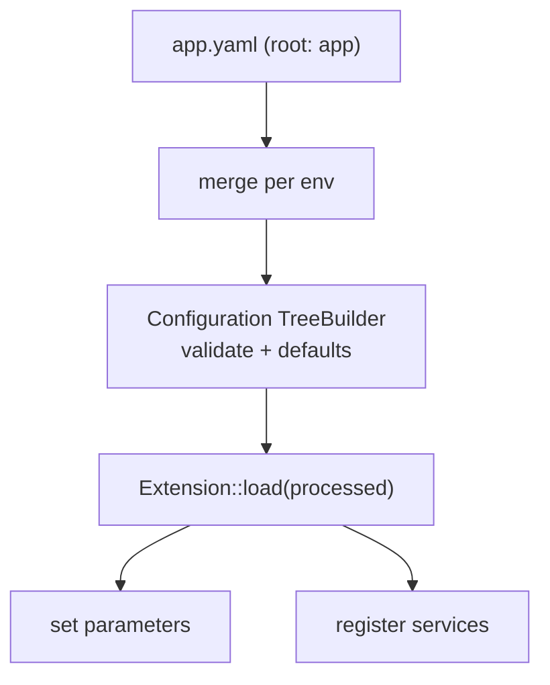

# Semantic (Bundle) Configuration

!!! tip "In a nutshell"
    Semantic config is the typed, validated configuration a bundle exposes under
    its own root key: `Configuration` defines and validates the schema,
    `Extension::load()` turns processed values into services and parameters.
    Highest-yield fact: `prepend()` runs **before** all `load()` calls, letting one
    bundle set defaults for another.

!!! example "Real-world analogy"
    Semantic config is a bundle's printed order form with a validating clerk. The
    `Configuration` tree is the form — which fields exist, their types, defaults,
    which are required — and it rejects nonsense before it reaches the kitchen.
    `Extension::load()` is the clerk turning the accepted form into actual prep
    tickets (services and parameters). `prepend()` is filling in sensible defaults
    on *another* bundle's form before anyone submits it.

!!! abstract "Learning objectives"
    By the end of this chapter you can:

    - [ ] Build a validated config tree with `Configuration` + `TreeBuilder`.
    - [ ] Turn config into services and parameters in `Extension::load()`.
    - [ ] Inject config into another bundle with `prependExtension()`.

    **Syllabus:** `Dependency Injection → Semantic Configuration` ·
    **Level:** Expert ·
    **Est. time:** 40 min ·
    **Prerequisites:** [Service Registration](registration.md)

---

## Theory

**Semantic configuration** is the typed, validated config a bundle exposes under
its own root key (e.g. `framework:`, `security:`, `app:`). Instead of raw
parameters, the bundle defines a **schema** (`Configuration`) and an
**extension** (`Extension`) that reads validated values and registers the right
services and parameters. This is how bundle options become working services.

## Deep Dive — how it works internally

### Two collaborating classes

- `Symfony\Component\Config\Definition\ConfigurationInterface` — implemented by
  `Configuration`, which uses `Symfony\Component\Config\Definition\Builder\TreeBuilder`
  to declare the allowed keys, types, defaults and validation.
- `Symfony\Component\DependencyInjection\Extension\Extension` — its `load(array
  $configs, ContainerBuilder $container)` receives the *merged, processed* config
  and registers services/parameters into the builder.

### The load lifecycle

During compilation the kernel calls each registered extension. Symfony merges the
config from every environment file, runs it through the `Configuration` tree
(applying defaults, normalising, validating), then hands the processed array to
`load()`. `load()` typically loads a services file and sets parameters from the
config values.



### `prependExtension` — configure other bundles

`PrependExtensionInterface::prepend(ContainerBuilder $container)` runs **before**
all `load()` calls. It lets your bundle inject default config into *another*
bundle (e.g. set a `framework` option) via
`$container->prependExtensionConfig('framework', [...])`. Order matters: prepend
happens first, then every extension loads with the combined config.

### Bundle extension conventions

A bundle named `AcmeBlogBundle` auto-discovers `AcmeBlogExtension` and its root
key `acme_blog` (snake_case of the bundle name minus `Bundle`). Symfony 8 also
supports the streamlined `AbstractBundle` where `configure()` and
`loadExtension()` live on the bundle class itself — no separate Extension file
needed.

!!! note "Source reference"
    `Symfony\Component\DependencyInjection\Extension\Extension` and
    `PrependExtensionInterface` —
    [symfony/symfony `8.0`](https://github.com/symfony/symfony/blob/8.0/src/Symfony/Component/DependencyInjection/Extension/Extension.php).

### Null behavior

Config values reach `load()`/`loadExtension()` as an array, and absent optional keys
are where null appears. A node with no `defaultValue()` and no `isRequired()` arrives
as **`null`** when the user omits it; `->defaultNull()` makes that explicit. So
`$config['title']` is safe *only* because the tree marks it `isRequired()` — read an
optional key with `$config['icon'] ?? null` (or give the node a default) rather than
assuming presence. Setting a container parameter to `null` is legal, but code
autowiring that parameter into a non-nullable arg then fails at build. The common
bug is trusting `$config['optional']` to exist: without a tree default it is `null`,
and passing that straight into `setParameter()` + `#[Autowire(param:)]` surfaces as
a `TypeError` far from the config file.

!!! note "Null in real life"
    A blank optional field on the order form (omitted config key) reaches the clerk
    as "nothing entered" (null) — the form must require it or supply a default, or
    the kitchen gets an empty ticket.

## Configuration & code

=== "PHP Attributes"

    ```php
    <?php
    declare(strict_types=1);

    namespace Acme\BlogBundle;

    use Symfony\Component\Config\Definition\Configurator\DefinitionConfigurator;
    use Symfony\Component\DependencyInjection\ContainerBuilder;
    use Symfony\Component\DependencyInjection\Loader\Configurator\ContainerConfigurator;
    use Symfony\Component\HttpKernel\Bundle\AbstractBundle;

    final class AcmeBlogBundle extends AbstractBundle
    {
        public function configure(DefinitionConfigurator $definition): void
        {
            $definition->rootNode()
                ->children()
                    ->integerNode('per_page')->defaultValue(10)->min(1)->end()
                    ->scalarNode('title')->isRequired()->end()
                ->end();
        }

        public function loadExtension(
            array $config,
            ContainerConfigurator $container,
            ContainerBuilder $builder,
        ): void {
            $builder->setParameter('acme_blog.per_page', $config['per_page']);
            $builder->setParameter('acme_blog.title', $config['title']);
        }
    }
    ```

=== "YAML"

    ```yaml
    # config/packages/acme_blog.yaml
    acme_blog:
        title: 'My Blog'
        per_page: 20
    ```

=== "Console"

    ```console
    $ php bin/console config:dump-reference acme_blog
    $ php bin/console debug:config acme_blog
    ```

## Best practices & anti-patterns

| ✅ Do | ❌ Avoid |
|---|---|
| Validate/default in `Configuration` | Reading raw parameters unchecked |
| Set parameters from processed config | Trusting env-specific input blindly |
| `prepend()` to configure other bundles | Duplicating another bundle's config |
| Use `AbstractBundle` for simple bundles | A separate Extension when unneeded |

## When (not) to use it / alternatives

Write semantic config for a **reusable bundle** that others configure. For an
application (not a shared bundle), plain `services.yaml` parameters and
`#[Autowire]` are enough — you rarely need a custom extension. Use `prepend` only
to set sane defaults for another bundle, not to override user intent.

!!! danger "Certification traps"
    - `Configuration` **validates & defaults**; `Extension::load()` **acts** on the
      result — two distinct responsibilities.
    - `prepend()` runs **before** all `load()` calls.
    - The root config key derives from the bundle/extension name (`acme_blog`).
    - `config:dump-reference` shows the schema; `debug:config` shows resolved values.

!!! warning "Common mistakes"
    - Putting validation logic in `load()` instead of the tree.
    - Forgetting that `load()` receives an **array of** config arrays to merge.
    - Assuming the bundle root key is the class name verbatim.

## Exercises

1. **(Expert)** Define a `Configuration` node `per_page` (int, default 10, min 1)
   and a required `title`.
2. **(Expert)** From another bundle, set a default `framework.http_method_override`
   without the user configuring it.

??? success "Solutions"

    **1.** See `configure()` above: `integerNode('per_page')->defaultValue(10)
    ->min(1)` and `scalarNode('title')->isRequired()`.

    **2.** Implement `PrependExtensionInterface` (or `prependExtension()` on
    `AbstractBundle`) and call
    `$container->prependExtensionConfig('framework', ['http_method_override' => false]);`
    — it runs before FrameworkBundle's `load()`.

## Certification questions

??? question "Q1. Which class validates a bundle's config schema?"
    - [x] A. `Configuration` (via `TreeBuilder`) ✅
    - [ ] B. `Extension::load()`
    - [ ] C. `Kernel::build()`
    - [ ] D. `ContainerBuilder`

    **Why:** The tree defines allowed keys, types, defaults and validation;
    `load()` only consumes the processed result. **Ref:** [Configuration](https://symfony.com/doc/current/bundles/configuration.html).

??? question "Q2. When does `prepend()` run relative to `load()`?"
    - [x] A. Before all `load()` calls ✅
    - [ ] B. After all `load()` calls
    - [ ] C. During runtime
    - [ ] D. Only in dev

    **Why:** Prepend lets a bundle influence others' config before they load.
    **Ref:** [Prepending config](https://symfony.com/doc/current/bundles/prepend_extension.html).

??? question "Q3. Which command prints a bundle's config reference tree?"
    - [x] A. `config:dump-reference <bundle>` ✅
    - [ ] B. `debug:container`
    - [ ] C. `debug:autowiring`
    - [ ] D. `debug:router`

    **Why:** It dumps the schema defined by `Configuration`; `debug:config` shows
    current values. **Ref:** [Configuration](https://symfony.com/doc/current/bundles/configuration.html).

## Key takeaways

- `Configuration` + `TreeBuilder` = schema; `Extension::load()` = acts on it.
- Config is merged, validated, defaulted, then passed to `load()`.
- `prepend()` runs first and configures other bundles.
- `AbstractBundle` folds configure/load onto the bundle class.

## Last-minute revision

!!! tip "Cheat sheet"
    - `ConfigurationInterface::getConfigTreeBuilder()` / `AbstractBundle::configure()`.
    - `Extension::load(array $configs, ContainerBuilder $c)`.
    - `prependExtensionConfig('other_bundle', [...])`.
    - `config:dump-reference` (schema) vs `debug:config` (values).

## Official References
- [Official Symfony docs — Bundle Configuration](https://symfony.com/doc/current/bundles/configuration.html)
- [Official Symfony docs — Prepend Extension](https://symfony.com/doc/current/bundles/prepend_extension.html)
- [Symfony source — Extension](https://github.com/symfony/symfony/blob/8.0/src/Symfony/Component/DependencyInjection/Extension/Extension.php)

---

<small>Related: [Registration](registration.md) · [Parameters](parameters.md) ·
[Compiler Passes](compiler-passes.md)</small>
