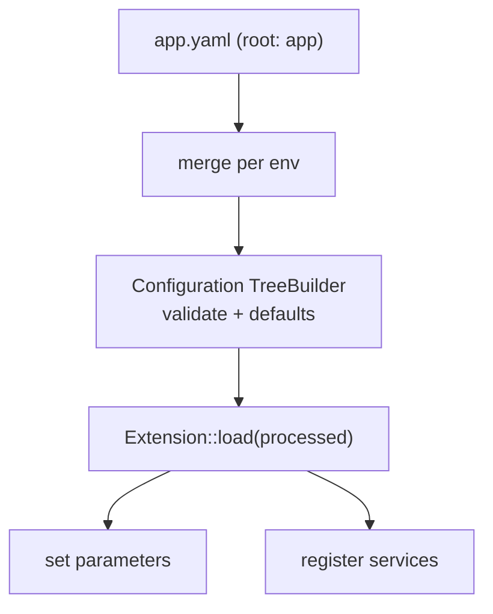

# Semantic (Bundle) Configuration

!!! tip "In a nutshell"
    Semantic config is the typed, validated configuration a bundle exposes under
    its own root key: `Configuration` defines and validates the schema,
    `Extension::load()` turns processed values into services and parameters.
    Highest-yield fact: `prepend()` runs **before** all `load()` calls, letting one
    bundle set defaults for another.

!!! example "Real-world analogy"
    Semantic config is a bundle's printed order form with a validating clerk. The
    `Configuration` tree is the form — which fields exist, their types, defaults,
    which are required — and it rejects nonsense before it reaches the kitchen.
    `Extension::load()` is the clerk turning the accepted form into actual prep
    tickets (services and parameters). `prepend()` is filling in sensible defaults
    on *another* bundle's form before anyone submits it.

!!! abstract "Learning objectives"
    By the end of this chapter you can:

    - [ ] Build a validated config tree with `Configuration` + `TreeBuilder`.
    - [ ] Turn config into services and parameters in `Extension::load()`.
    - [ ] Inject config into another bundle with `prependExtension()`.

    **Syllabus:** `Dependency Injection → Semantic Configuration` ·
    **Level:** Expert ·
    **Est. time:** 40 min ·
    **Prerequisites:** [Service Registration](registration.md)

    **Examen Symfony 8 :** OUI

---

## Pour les nuls

### L'idée en une phrase
La configuration sémantique est le formulaire de commande d'un bundle, avec un employé qui valide chaque champ avant de le transformer en services réels.

### Imagine dans la vraie vie
La configuration sémantique est le formulaire de commande imprimé d'un bundle, avec un employé qui valide. L'arbre `Configuration` est le formulaire — quels champs existent, leurs types, leurs valeurs par défaut — et il rejette le non-sens avant qu'il n'atteigne la cuisine.

### Dans Symfony
Écrire `framework:` dans `config/packages/framework.yaml` déclenche la validation de l'arbre `Configuration` de FrameworkBundle — une clé mal orthographiée est immédiatement rejetée avec une erreur claire, avant même que le container ne compile.

### Exemple simple
```yaml
mon_bundle:
    activer: true  # validé contre l'arbre Configuration du bundle
```

### Comment le mémoriser 🧠
`prepend()` s'exécute **avant** tous les appels `load()` — c'est ce qui permet à un bundle de fixer des valeurs par défaut sensées sur la configuration d'un *autre* bundle avant que quiconque ne la remplisse.
---

## Theory

**Semantic configuration** is the typed, validated config a bundle exposes under
its own root key (e.g. `framework:`, `security:`, `app:`). Instead of raw
parameters, the bundle defines a **schema** (`Configuration`) and an
**extension** (`Extension`) that reads validated values and registers the right
services and parameters. This is how bundle options become working services.

```yaml
# config/packages/*.yaml — each bundle owns one root key
framework:            # FrameworkBundle's semantic config
    secret: '%env(APP_SECRET)%'
security:             # SecurityBundle's semantic config
    firewalls: { main: { lazy: true } }
app:                  # your own root key
    per_page: 10      # validated by Configuration, consumed by Extension
```

!!! question "Predict first"
    Your bundle needs to set a default for *another* bundle (say a `framework`
    option). In which method do you do it, and does it run before or after the other
    bundle's `load()`?

??? note "Reveal"
    Use `prepend()` (`PrependExtensionInterface`) and
    `prependExtensionConfig('framework', [...])`. It runs **before** all `load()`
    calls, so the target bundle loads with your defaults merged in.

## Deep Dive — how it works internally

### Two collaborating classes

- `Symfony\Component\Config\Definition\ConfigurationInterface` — implemented by
  `Configuration`, which uses `Symfony\Component\Config\Definition\Builder\TreeBuilder`
  to declare the allowed keys, types, defaults and validation.
- `Symfony\Component\DependencyInjection\Extension\Extension` — its `load(array
  $configs, ContainerBuilder $container)` receives the *merged, processed* config
  and registers services/parameters into the builder.

```php
// Configuration (implements ConfigurationInterface): declares the schema.
final class Configuration implements ConfigurationInterface
{
    public function getConfigTreeBuilder(): TreeBuilder
    {
        $treeBuilder = new TreeBuilder('acme_blog'); // TreeBuilder = keys/types/defaults
        $treeBuilder->getRootNode()
            ->children()
                ->integerNode('per_page')->defaultValue(10)->end()
            ->end();

        return $treeBuilder;
    }
}

// Extension: acts on the processed values.
final class AcmeBlogExtension extends Extension
{
    public function load(array $configs, ContainerBuilder $container): void { /* ... */ }
}
```

### The load lifecycle

During compilation the kernel calls each registered extension. Symfony merges the
config from every environment file, runs it through the `Configuration` tree
(applying defaults, normalising, validating), then hands the processed array to
`load()`. `load()` typically loads a services file and sets parameters from the
config values.

```php
public function load(array $configs, ContainerBuilder $container): void
{
    // $configs is a LIST of arrays (one per config file / environment);
    // processConfiguration() merges them through the Configuration tree.
    $config = $this->processConfiguration(new Configuration(), $configs);

    $container->setParameter('acme_blog.per_page', $config['per_page']);
}
```



### `prependExtension` — configure other bundles

`PrependExtensionInterface::prepend(ContainerBuilder $container)` runs **before**
all `load()` calls. It lets your bundle inject default config into *another*
bundle (e.g. set a `framework` option) via
`$container->prependExtensionConfig('framework', [...])`. Order matters: prepend
happens first, then every extension loads with the combined config.

```php
use Symfony\Component\DependencyInjection\ContainerBuilder;
use Symfony\Component\DependencyInjection\Extension\PrependExtensionInterface;

final class AcmeBlogExtension extends Extension implements PrependExtensionInterface
{
    // Runs BEFORE every extension's load().
    public function prepend(ContainerBuilder $container): void
    {
        // Inject default config into ANOTHER bundle (the framework root key).
        $container->prependExtensionConfig('framework', [
            'http_method_override' => false,
        ]);
    }
}
```

### Bundle extension conventions

A bundle named `AcmeBlogBundle` auto-discovers `AcmeBlogExtension` and its root
key `acme_blog` (snake_case of the bundle name minus `Bundle`). Symfony 8 also
supports the streamlined `AbstractBundle` where `configure()` and
`loadExtension()` live on the bundle class itself — no separate Extension file
needed.

```php
// Convention: AcmeBlogBundle -> AcmeBlogExtension -> root key "acme_blog"
// ("Bundle" stripped, remainder snake_cased). With AbstractBundle both
// hooks live on the bundle class itself:
final class AcmeBlogBundle extends AbstractBundle
{
    public function configure(DefinitionConfigurator $definition): void
    {
        $definition->rootNode()->children()->scalarNode('title')->end()->end();
    }

    public function loadExtension(array $config, ContainerConfigurator $container, ContainerBuilder $builder): void
    {
        $builder->setParameter('acme_blog.title', $config['title'] ?? null);
    }
}
```

!!! note "Source reference"
    `Symfony\Component\DependencyInjection\Extension\Extension` and
    `PrependExtensionInterface` —
    [symfony/symfony `8.0`](https://github.com/symfony/symfony/blob/8.0/src/Symfony/Component/DependencyInjection/Extension/Extension.php).

### Null behavior

Config values reach `load()`/`loadExtension()` as an array, and absent optional keys
are where null appears. A node with no `defaultValue()` and no `isRequired()` arrives
as **`null`** when the user omits it; `->defaultNull()` makes that explicit. So
`$config['title']` is safe *only* because the tree marks it `isRequired()` — read an
optional key with `$config['icon'] ?? null` (or give the node a default) rather than
assuming presence. Setting a container parameter to `null` is legal, but code
autowiring that parameter into a non-nullable arg then fails at build. The common
bug is trusting `$config['optional']` to exist: without a tree default it is `null`,
and passing that straight into `setParameter()` + `#[Autowire(param:)]` surfaces as
a `TypeError` far from the config file.

```php
// Tree: title required, icon optional (arrives as null when omitted).
$definition->rootNode()
    ->children()
        ->scalarNode('title')->isRequired()->end()          // must be present
        ->scalarNode('icon')->defaultNull()->end()          // explicit null default
        ->integerNode('per_page')->defaultValue(10)->end()  // always defaulted
    ->end();

// In load()/loadExtension():
$builder->setParameter('acme_blog.title', $config['title']);       // safe: required
$builder->setParameter('acme_blog.icon', $config['icon'] ?? null); // guard optionals
// A null parameter fed via #[Autowire(param: 'acme_blog.icon')] into a
// non-nullable string argument fails with a TypeError at container build.
```

!!! note "Null in real life"
    A blank optional field on the order form (omitted config key) reaches the clerk
    as "nothing entered" (null) — the form must require it or supply a default, or
    the kitchen gets an empty ticket.

## Configuration & code

=== "PHP Attributes"

    ```php
    <?php
    declare(strict_types=1);

    namespace Acme\BlogBundle;

    use Symfony\Component\Config\Definition\Configurator\DefinitionConfigurator;
    use Symfony\Component\DependencyInjection\ContainerBuilder;
    use Symfony\Component\DependencyInjection\Loader\Configurator\ContainerConfigurator;
    use Symfony\Component\HttpKernel\Bundle\AbstractBundle;

    final class AcmeBlogBundle extends AbstractBundle
    {
        public function configure(DefinitionConfigurator $definition): void
        {
            $definition->rootNode()
                ->children()
                    ->integerNode('per_page')->defaultValue(10)->min(1)->end()
                    ->scalarNode('title')->isRequired()->end()
                ->end();
        }

        public function loadExtension(
            array $config,
            ContainerConfigurator $container,
            ContainerBuilder $builder,
        ): void {
            $builder->setParameter('acme_blog.per_page', $config['per_page']);
            $builder->setParameter('acme_blog.title', $config['title']);
        }
    }
    ```

=== "YAML"

    ```yaml
    # config/packages/acme_blog.yaml
    acme_blog:
        title: 'My Blog'
        per_page: 20
    ```

=== "Console"

    ```console
    $ php bin/console config:dump-reference acme_blog
    $ php bin/console debug:config acme_blog
    ```

## Best practices & anti-patterns

| ✅ Do | ❌ Avoid |
|---|---|
| Validate/default in `Configuration` | Reading raw parameters unchecked |
| Set parameters from processed config | Trusting env-specific input blindly |
| `prepend()` to configure other bundles | Duplicating another bundle's config |
| Use `AbstractBundle` for simple bundles | A separate Extension when unneeded |

## When (not) to use it / alternatives

Write semantic config for a **reusable bundle** that others configure. For an
application (not a shared bundle), plain `services.yaml` parameters and
`#[Autowire]` are enough — you rarely need a custom extension. Use `prepend` only
to set sane defaults for another bundle, not to override user intent.

!!! danger "Certification traps"
    - `Configuration` **validates & defaults**; `Extension::load()` **acts** on the
      result — two distinct responsibilities.
    - `prepend()` runs **before** all `load()` calls.
    - The root config key derives from the bundle/extension name (`acme_blog`).
    - `config:dump-reference` shows the schema; `debug:config` shows resolved values.

!!! warning "Common mistakes"
    - Putting validation logic in `load()` instead of the tree.
    - Forgetting that `load()` receives an **array of** config arrays to merge.
    - Assuming the bundle root key is the class name verbatim.

## Exercises

1. **(Expert)** Define a `Configuration` node `per_page` (int, default 10, min 1)
   and a required `title`.
2. **(Expert)** From another bundle, set a default `framework.http_method_override`
   without the user configuring it.

??? success "Solutions"

    **1.** See `configure()` above: `integerNode('per_page')->defaultValue(10)
    ->min(1)` and `scalarNode('title')->isRequired()`.

    **2.** Implement `PrependExtensionInterface` (or `prependExtension()` on
    `AbstractBundle`) and call
    `$container->prependExtensionConfig('framework', ['http_method_override' => false]);`
    — it runs before FrameworkBundle's `load()`.

## Certification questions

*Question d'entraînement inspirée du syllabus — jamais une question officielle de l'examen.*

??? question "Q1. Which class validates a bundle's config schema?"
    - [x] A. `Configuration` (via `TreeBuilder`) ✅
    - [ ] B. `Extension::load()`
    - [ ] C. `Kernel::build()`
    - [ ] D. `ContainerBuilder`

    **Why:** The tree defines allowed keys, types, defaults and validation;
    `load()` only consumes the processed result. **Ref:** [Configuration](https://symfony.com/doc/8.0/bundles/configuration.html).

??? question "Q2. When does `prepend()` run relative to `load()`?"
    - [x] A. Before all `load()` calls ✅
    - [ ] B. After all `load()` calls
    - [ ] C. During runtime
    - [ ] D. Only in dev

    **Why:** Prepend lets a bundle influence others' config before they load.
    **Ref:** [Prepending config](https://symfony.com/doc/8.0/bundles/prepend_extension.html).

??? question "Q3. Which command prints a bundle's config reference tree?"
    - [x] A. `config:dump-reference <bundle>` ✅
    - [ ] B. `debug:container`
    - [ ] C. `debug:autowiring`
    - [ ] D. `debug:router`

    **Why:** It dumps the schema defined by `Configuration`; `debug:config` shows
    current values. **Ref:** [Configuration](https://symfony.com/doc/8.0/bundles/configuration.html).

## Key takeaways

- `Configuration` + `TreeBuilder` = schema; `Extension::load()` = acts on it.
- Config is merged, validated, defaulted, then passed to `load()`.
- `prepend()` runs first and configures other bundles.
- `AbstractBundle` folds configure/load onto the bundle class.

## Last-minute revision

!!! tip "Cheat sheet"
    - `ConfigurationInterface::getConfigTreeBuilder()` / `AbstractBundle::configure()`.
    - `Extension::load(array $configs, ContainerBuilder $c)`.
    - `prependExtensionConfig('other_bundle', [...])`.
    - `config:dump-reference` (schema) vs `debug:config` (values).

## Connections

- **Depends on:** [Service Registration](registration.md) — `load()` registers the
  services the config describes.
- **Reused in:** [Architecture — Flex & bundles](../architecture/flex.md),
  [Security](../security/configuration.md) — every bundle exposes semantic config
  this way.
- **Confused with:** [Parameters](parameters.md) — a parameter is a raw value;
  semantic config is a *validated schema* that produces parameters/services.

## Official References
- [Official Symfony docs — Bundle Configuration](https://symfony.com/doc/8.0/bundles/configuration.html)
- [Official Symfony docs — Prepend Extension](https://symfony.com/doc/8.0/bundles/prepend_extension.html)
- [Symfony source — Extension](https://github.com/symfony/symfony/blob/8.0/src/Symfony/Component/DependencyInjection/Extension/Extension.php)

## Video references

!!! tip "Watch & learn"
    These are official, continuously-updated video channels — search them for
    "dependency injection" to reinforce this chapter. We link stable channels rather than
    individual videos so the references never rot.

    - [SymfonyCasts screencasts](https://symfonycasts.com/tracks/symfony) — scripted, code-along tutorials.
    - [Symfony official YouTube](https://www.youtube.com/@SymfonyOfficial) — SymfonyCon conference talks & keynotes.
    - [Official docs for this topic](https://symfony.com/doc/8.0/bundles/configuration.html) — some Symfony doc pages embed a screencast.

## Confidence check

I'm ready when I can:

- [ ] explain **why** bundles use a validated schema instead of raw parameters
- [ ] build a `Configuration` tree and a `loadExtension()` in Symfony 8
- [ ] debug an optional config key that arrives as `null`
- [ ] spot that `prepend()` runs before all `load()` calls
- [ ] explain the split between `Configuration` (validates) and `Extension` (acts)

---

<small>Related: [Registration](registration.md) · [Parameters](parameters.md) ·
[Compiler Passes](compiler-passes.md)</small>
