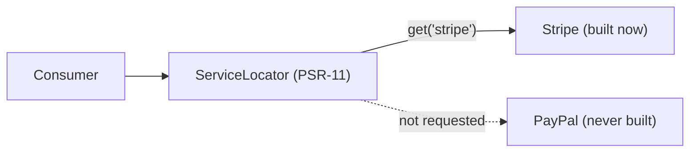

# Service Locators

!!! tip "In a nutshell"
    Un service locator est un petit container PSR-11 contenant un ensemble fixe et
    déclaré de services qu'il construit **en lazy** au `get()` — l'alternative
    approuvée à l'injection du container entier. Fait le plus rentable :
    construisez-en un avec `#[AutowireLocator]`, ou abonnez-vous via
    `ServiceSubscriberInterface` + `ServiceMethodsSubscriberTrait` (pas le
    `ServiceSubscriberTrait` déprécié).

!!! example "Real-world analogy"
    Un service locator est l'ardoise des plats du jour : une liste courte et fixe
    de plats que la cuisine *peut* préparer sur demande. Rien n'est cuisiné tant
    que vous n'en désignez pas un (`get('stripe')`) — commandez le plat Stripe et
    seule cette poêle s'allume ; celle de PayPal reste froide. Désignez un plat qui
    n'est pas sur l'ardoise et la cuisine vous répond qu'il n'existe pas (une
    erreur « not found »), car l'ardoise est figée avant le service.

!!! abstract "Learning objectives"
    À la fin de ce chapitre, vous saurez :

    - [ ] Expliquer ce qu'est un `ServiceLocator` et en quoi il diffère de
          l'injection de tous les services.
    - [ ] En construire un avec `#[AutowireLocator]`.
    - [ ] Implémenter un service subscriber avec `ServiceSubscriberInterface` /
          `#[SubscribedService]`.

    **Syllabus:** `Dependency Injection → Service Locators` ·
    **Level:** Expert ·
    **Est. time:** 35 min ·
    **Prerequisites:** [Tags](tags.md)

---

## Theory

Un **service locator** est un petit objet, semblable à un container, contenant un
ensemble *fixe et déclaré* de services qu'il instancie **en lazy** au `get()`.
C'est la réponse approuvée à « je pourrais avoir besoin d'un service parmi
plusieurs, mais pas de tous, et pas immédiatement ». Contrairement à l'injection
du container entier (un anti-pattern), un locator n'expose qu'une liste blanche
explicite — les dépendances restent honnêtes et analysables.

!!! question "Predict first"
    Vous appelez `$locator->get($key)` avec une clé qui n'a jamais été déclarée
    dans le locator. Obtenez-vous `null` ou une exception ?

??? note "Reveal"
    Une **exception** (`ServiceNotFoundException`) — l'ensemble d'un locator est
    figé à la compilation et n'a pas de mode « null si absent ». Vérifiez
    `has($key)` avant `get()` quand la clé est dynamique ou fournie par
    l'utilisateur.

## Deep Dive — how it works internally

### `ServiceLocator`

`Symfony\Component\DependencyInjection\ServiceLocator` implémente l'interface
PSR-11 `Psr\Container\ContainerInterface`. Son `get($id)` construit le service au
premier accès et le met en cache ; `has($id)` vérifie l'appartenance. Comme
l'ensemble est déclaré à la compilation, le container sait exactement quels
services le locator peut atteindre — ils ne sont *pas* supprimés comme
« inutilisés », et chacun n'est créé que s'il est réellement demandé.

```php
use Psr\Container\ContainerInterface;
use Symfony\Component\DependencyInjection\ServiceLocator;

/** @var ServiceLocator $locator — implements PSR-11 ContainerInterface */
$locator instanceof ContainerInterface; // true

$locator->has('stripe');                // has($id): membership, builds nothing
$gateway = $locator->get('stripe');     // get($id): built on FIRST access
$same = $locator->get('stripe');        // cached — same instance returned
```

### Locator vs injecting everything

Injecter tous les services candidats les instancie immédiatement, même ceux que
vous n'utilisez jamais dans une request donnée. Un locator diffère la construction
jusqu'au `get()`. Cela compte quand les candidats sont lourds (clients de base de
données, clients HTTP) et qu'un seul est choisi par request — par exemple une
gateway de paiement sélectionnée par son nom.



### Service subscribers

Un **service subscriber** déclare les services dont il *pourrait* avoir besoin via
`Symfony\Contracts\Service\ServiceSubscriberInterface::getSubscribedServices()`,
et le container injecte un locator dans une propriété `$container` (via
`ServiceMethodsSubscriberTrait` ou un argument de constructeur — l'ancien
`ServiceSubscriberTrait` a été **déprécié en 7.1**, utilisez
`ServiceMethodsSubscriberTrait`). En Symfony 8, vous annotez les méthodes avec
`#[SubscribedService]` et utilisez le trait — le type de retour de la méthode est
le type du service. C'est ainsi que l'`AbstractController` de base obtient `twig`,
`router`, etc. en lazy.

```php
use Symfony\Contracts\Service\Attribute\SubscribedService;
use Symfony\Contracts\Service\ServiceMethodsSubscriberTrait; // NOT ServiceSubscriberTrait (deprecated 7.1)
use Symfony\Contracts\Service\ServiceSubscriberInterface;

final class Dashboard implements ServiceSubscriberInterface
{
    // Provides getSubscribedServices() and the $container locator property.
    use ServiceMethodsSubscriberTrait;

    // Return type = service type; fetched lazily,
    // like AbstractController does for twig / router.
    #[SubscribedService]
    private function twig(): \Twig\Environment
    {
        return $this->container->get(__FUNCTION__);
    }
}
```

### `#[AutowireLocator]`

Le raccourci moderne : `#[AutowireLocator([...])]` sur un paramètre de
constructeur construit un locator à partir d'une liste d'ids/classes de services
ou d'un **tag** (voir [Tags](tags.md)), optionnellement indexé par une clé. Aucune
interface à implémenter.

!!! note "Source reference"
    `Symfony\Component\DependencyInjection\ServiceLocator` &
    `Symfony\Contracts\Service\ServiceSubscriberInterface` —
    [symfony/symfony `8.0`](https://github.com/symfony/symfony/blob/8.0/src/Symfony/Component/DependencyInjection/ServiceLocator.php).

### Null behavior

L'ensemble d'un locator est figé à la compilation ; demander un id qu'il ne
contient pas **lève**
`Symfony\Component\DependencyInjection\Exception\ServiceNotFoundException` — il ne
retourne jamais `null`. Protégez-vous d'abord : `has($id)` retourne un booléen, le
pattern sûr est donc
`$this->locator->has($id) ? $this->locator->get($id) : $fallback`. `get()` ne
construit et ne retourne qu'un service *déclaré* ; il n'y a pas de mode « null si
absent » comme sur le container principal. Le bug classique consiste à appeler
`get($userSuppliedKey)` sur une valeur non fiable et à obtenir une exception pour
les clés hors de la liste blanche — validez avec `has()` (ou la liste des clés
connues) avant de récupérer.

```php
$this->locator->get('unknown'); // throws ServiceNotFoundException — never null

// Safe pattern for dynamic / user-supplied keys: has() before get().
$gateway = $this->locator->has($id)
    ? $this->locator->get($id)  // declared: built (or reused) and returned
    : $fallback;
```

!!! note "Null in real life"
    Demander à l'ardoise des plats du jour un plat qui n'y a jamais été inscrit
    vous vaut un « ça n'existe pas » (exception), pas une assiette vide (null) —
    lisez donc l'ardoise (`has()`) avant de commander.

## Configuration & code

=== "AutowireLocator"

    ```php
    <?php
    declare(strict_types=1);

    namespace App\Payment;

    use Psr\Container\ContainerInterface;
    use Symfony\Component\DependencyInjection\Attribute\AutowireLocator;

    final class PaymentProcessor
    {
        public function __construct(
            #[AutowireLocator([
                'stripe' => StripeGateway::class,
                'paypal' => PayPalGateway::class,
            ])]
            private readonly ContainerInterface $gateways,
        ) {}

        public function charge(string $name, int $amount): void
        {
            // Only the chosen gateway is instantiated.
            $this->gateways->get($name)->charge($amount);
        }
    }
    ```

=== "Service subscriber"

    ```php
    <?php
    declare(strict_types=1);

    namespace App\Payment;

    use Psr\Log\LoggerInterface;
    use Symfony\Contracts\Service\Attribute\SubscribedService;
    use Symfony\Contracts\Service\ServiceSubscriberInterface;
    use Symfony\Contracts\Service\ServiceMethodsSubscriberTrait;

    final class Reporter implements ServiceSubscriberInterface
    {
        use ServiceMethodsSubscriberTrait;

        #[SubscribedService]
        private function logger(): LoggerInterface
        {
            return $this->container->get(__FUNCTION__);
        }

        public function report(): void
        {
            $this->logger()->info('Report generated'); // lazily fetched
        }
    }
    ```

=== "YAML"

    ```yaml
    # config/services.yaml
    services:
        App\Payment\PaymentProcessor:
            arguments:
                $gateways: !service_locator
                    stripe: '@App\Payment\StripeGateway'
                    paypal: '@App\Payment\PayPalGateway'
    ```

## Best practices & anti-patterns

| ✅ Do | ❌ Avoid |
|---|---|
| Un locator pour choisir-un-parmi-plusieurs | Injecter le container entier |
| Déclarer une liste d'ids/un tag explicite | Des dépendances cachées, non déclarées |
| L'utiliser pour des dépendances lourdes, rarement utilisées | Un locator quand vous utilisez toujours tout |
| `#[AutowireLocator]` pour la concision | Un subscriber verbeux quand inutile |

## When (not) to use it / alternatives

Utilisez un locator quand un *seul* service parmi plusieurs est nécessaire par
appel et que tout construire serait du gaspillage, ou pour casser un cycle de
dépendance à la construction. Si vous itérez toujours sur tous les services,
injectez un [`tagged_iterator`](tags.md). Si vous avez besoin d'exactement une
dépendance, injectez-la directement — un locator ajoute une indirection inutile.

!!! danger "Certification traps"
    - Un locator est **lazy** : les services sont construits au `get()`, pas
      d'avance.
    - Il implémente **PSR-11** (`Psr\Container\ContainerInterface`), pas
      l'interface du container Symfony.
    - Son ensemble de services est **figé à la compilation** — impossible de
      récupérer un id absent de la liste (une exception not-found est levée).
    - `getSubscribedServices()` déclare *ce qui pourrait être nécessaire* ; c'est
      le locator qui est injecté, pas le container entier.

!!! warning "Common mistakes"
    - Injecter `Symfony\..\ContainerInterface` pour attraper des services
      arbitraires (l'anti-pattern service locator).
    - S'attendre à ce qu'un locator expose des services jamais déclarés.
    - Utiliser un locator là où une simple injection par constructeur suffirait.

## Exercises

1. **(Expert)** Câblez un `PaymentProcessor` capable de construire une gateway
   Stripe ou PayPal à la demande, en n'instanciant que celle choisie.
2. **(Expert)** Convertissez en service subscriber une classe qui injecte
   `LoggerInterface` et `Twig` immédiatement mais n'utilise que rarement Twig.

??? success "Solutions"

    **1.** Utilisez `#[AutowireLocator(['stripe' => StripeGateway::class, 'paypal' =>
    PayPalGateway::class])] ContainerInterface $gateways`, puis
    `$this->gateways->get($name)->charge(...)`. Seule la gateway demandée est
    construite.

    **2.** Implémentez `ServiceSubscriberInterface` avec
    `ServiceMethodsSubscriberTrait`, ajoutez des méthodes `#[SubscribedService]`
    retournant `LoggerInterface` et `Environment`, et récupérez via
    `$this->container->get(...)` uniquement au besoin — Twig n'est jamais
    construit s'il n'est pas utilisé.

## Certification questions

??? question "Q1. How is a `ServiceLocator` different from injecting the container?"
    - [x] A. It exposes only a declared, whitelisted set of services ✅
    - [ ] B. It is eager, the container is lazy
    - [ ] C. It cannot instantiate services
    - [ ] D. There is no difference

    **Why:** L'ensemble d'un locator est explicite et analysable ; injecter le
    container entier cache les dépendances. **Ref:** [Service subscribers & locators](https://symfony.com/doc/8.0/service_container/service_subscribers_locators.html).

??? question "Q2. When are locator services instantiated?"
    - [ ] A. All at construction
    - [x] B. Lazily, on `get()` ✅
    - [ ] C. At compile time
    - [ ] D. On kernel boot

    **Why:** Un locator diffère la construction jusqu'à ce qu'un service soit
    réellement demandé.
    **Ref:** [Service locators](https://symfony.com/doc/8.0/service_container/service_subscribers_locators.html#service-locators).

??? question "Q3. What does `getSubscribedServices()` return?"
    - [x] A. A map/list of services the subscriber may lazily use ✅
    - [ ] B. Instantiated services
    - [ ] C. Compiler passes
    - [ ] D. The whole container

    **Why:** Elle déclare la liste blanche ; le container injecte un locator
    correspondant.
    **Ref:** [Service subscribers](https://symfony.com/doc/8.0/service_container/service_subscribers_locators.html).

??? question "Q4. `ServiceLocator` implements which interface?"
    - [x] A. `Psr\Container\ContainerInterface` (PSR-11) ✅
    - [ ] B. `Symfony\...\ContainerInterface`
    - [ ] C. `IteratorAggregate` only
    - [ ] D. `CompilerPassInterface`

    **Why:** C'est un container PSR-11 exposant `get()`/`has()`.
    **Ref:** [Service locators](https://symfony.com/doc/8.0/service_container/service_subscribers_locators.html#service-locators).

## Key takeaways

- Un locator construit en lazy un ensemble fixe et déclaré de services (PSR-11).
- Préférez-le à l'injection du container entier.
- `#[AutowireLocator]` est la voie rapide ; les subscribers déclarent via
  `getSubscribedServices()` / `#[SubscribedService]`.
- Utilisez-le pour choisir-un-parmi-plusieurs ou des dépendances lourdes rarement
  utilisées.

## Last-minute revision

!!! tip "Cheat sheet"
    - `#[AutowireLocator([...])]` → `ContainerInterface` PSR-11.
    - `!service_locator` en YAML.
    - Subscriber : `ServiceSubscriberInterface` + `ServiceMethodsSubscriberTrait` +
      `#[SubscribedService]`.
    - Lazy, liste blanche, pas le container entier.

## Connections

- **Dépend de :** [Tags](tags.md) — un `tagged_locator` construit un locator à
  partir d'un tag.
- **Réutilisé dans :** [Controllers — AbstractController](../controllers/abstract-controller.md),
  [Messenger](../messenger/index.md) — le controller de base et le câblage
  des handlers s'appuient sur les subscribers/locators.
- **À ne pas confondre avec :** [The Service Container](container.md) — un locator
  est une petite liste blanche PSR-11, pas le container entier.

## Official References
- [Official Symfony docs — Service Subscribers & Locators](https://symfony.com/doc/8.0/service_container/service_subscribers_locators.html)
- [Symfony source — ServiceLocator](https://github.com/symfony/symfony/blob/8.0/src/Symfony/Component/DependencyInjection/ServiceLocator.php)

## Video references

!!! tip "Watch & learn"
    Voici des chaînes vidéo officielles, mises à jour en continu — cherchez-y
    "dependency injection" pour consolider ce chapitre. Nous référençons des
    chaînes stables plutôt que des vidéos individuelles afin que les références ne
    périment jamais.

    - [SymfonyCasts screencasts](https://symfonycasts.com/tracks/symfony) — tutoriels scénarisés à suivre en codant.
    - [Symfony official YouTube](https://www.youtube.com/@SymfonyOfficial) — conférences et keynotes SymfonyCon.
    - [Official docs for this topic](https://symfony.com/doc/8.0/service_container/service_subscribers_locators.html) — certaines pages de la doc Symfony intègrent un screencast.

## Confidence check

Je suis prêt quand je peux :

- [ ] expliquer **pourquoi** un locator vaut mieux qu'injecter le container entier
- [ ] en construire un avec `#[AutowireLocator]` ou un service subscriber en Symfony 8
- [ ] déboguer un `get()` sur une clé non déclarée qui lève une exception au lieu de retourner null
- [ ] repérer qu'un locator est lazy, PSR-11, et figé à la compilation
- [ ] expliquer pourquoi `ServiceSubscriberTrait` est déprécié au profit du trait Methods

---

<small>Related: [Tags](tags.md) · [Autowiring](autowiring.md) ·
[The Service Container](container.md)</small>
